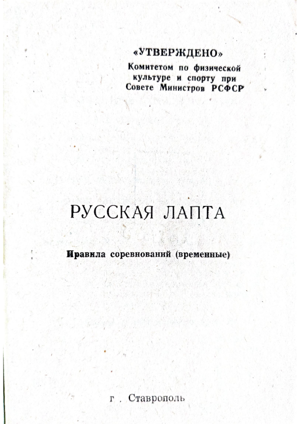

# РУССКАЯ ЛАПТА. Правила соревнований (временные). 1957

::: details Выходные данные
г. Ставрополь  
Сдано в набор 23/VII-1957 г.  

:::

> «УТВЕРЖДЕНО»  
> Комитетом по физической культуре и спорту при Совете Министров РСФСР  
> . г. Ставрополь  

## I. УЧАСТНИКИ СОРЕВНОВАНИЙ

### 1. Возраст игроков

Участники соревнований делятся на следующие возрастные группы:

- **Детская** - мальчики и девочки 13 - 14лет.
- **Средняя юношеская** - юноши и девушки 15 - 16 лет.
- **Старшая юношеская** - юноши и девушки 17 - 18 лет.
- **Взрослая** - мужчины и женщины 19 лет и старше.

***Примечание**: В отдельных случаях по разрешению врача, тренера и соответствующего Комитета по физической культуре и спорту юноши и девушки старшей юношеской группы допускаются к участию в играх за команды взрослых.*

### 2. Права и обязанности игроков

1. Во время игры игрок имеет право обращаться к судье на поле только через капитана своей команды.

2. Игрок обязан знать правила игры и точно соблюдать их.

3. Каждый игрок, заявленный в составе команды, должен иметь разрешение врача на участие в соревнованиях.

### 3. Костюм игрока

1. Костюм игроков состоит из майки или футболки, трусов и обуви.

2. Команда должна выступать в чистой, опрятной и одинаковой по цвету форме.

3. Каждый игрок должен иметь номер на спине и на груди. Нумерация должна быть от № 1 до № 15 включительно.

### 4. Состав команды и замена игроков

1. Количество игроков в команде может быть от 5 до 15 человек, точно количество устанавливается «Положением» о данном соревновании.

2. Начать игру команда обязана с полным составом игроков. Если во время игры в команде остается на два игрока меньше количества, предусмотренного положением, игра прекращается, и команде засчитывается поражение.

3. В процессе игры команде разрешается заменить не более двух игроков запасными.
Замена игрока производится в момент нахождения мяча вне игры или в момент остановки игры судьей по требованию представителя команды — через судью-секретаря, по требованию капитана - через судью.

4. Игрок, выходящий из игры или входящий в игру, должен получить на это разрешение судьи.
В исключительных случаях (повреждение и т. п.) игрок может покинуть поле без обращения за разрешением, но капитан команды обязан немедленно уведомить судью об уходе игрока.
Игрок, покинувший поле без разрешения судьи, удаленный с поля судьей или капитаном своей команды, не может быть снова допущен к игре или заменен запасным игроком.

5. До начала игры фамилии всех игроков каждой команды должны быть вписаны в протокол игры. Игрок, не вписанный в протокол, к соревнованию не допускается.
На замену игрока дается 1 минута.

## II. СУДЬЯ

Для проведения игры назначается один судья и секретарь.

### 5. Судья на поле

1. Судья следит за выполнением игроками правил игры и принимает решения во всех спорных случаях нарушения правил. Его решения являются окончательными.

2. Полномочия судьи начинаются с момента вызова им капитанов на поле и кончаются после подписания протокола игры.

3. Судья имеет право прекратить игру во всех случаях, когда сочтет это нужным (неблагоприятная погода, непригодность грунта и другие причины). В этих случаях судья обязан составить акт о причинах прекращения игры и выслать его организации проводящей соревнование.

4. Судья имеет право делать игроку замечания и предупреждения, удалить его с поля без предварительного предупреждения, если игрок вызывает на это своим поведением.

5. Судья перед началом игры обязан проверить состояние и разметку поля, состояние инвентаря (мяч, костюм, обувь игроков и т. д.).

6. После первой и второй половины игры судья должен проверить запись секретарем результатов игры.

7. По окончании игры судья должен заполнить подробно все графы протокола.

8. Судья предоставляет право выбора бить и водить капитану команды гостей.
При игре на нейтральном поле бросается жребий.

### 6. Секретарь

1. Секретарь ведет учет перебежек, очков и партий; следит за очередностью бьющих игроков: ведет учет ловли мяча и осаливания игроков.

2. По окончании игры секретарь заполняет протокол соревнования и подписывает его.

## III. ПРАВИЛА ИГРЫ

### 7. Партии и продолжительность игры

1. В игре одна команда является «бьющей», другая - «водящей».

2. Игра состоит из десяти партий; каждая команда попеременно должна быть пять партий «бьющей» и пять партий «водящей».
Между партиями делается перерыв в 5 минут.

3. Для детских и юношеских команд устанавливается следующее количество партий:

- мальчики и девочки 13 - 14 лет - 6 партий
- юноши и девушки 15 - 16 лет - 8 партий
В каждой игре, команда. половину партий бьет, половину водит.

4. Партия продолжается до тех пор, пока бьющая команда не получит 3 штрафных очка. Штрафное очко команде записывается:

- если мяч пойман с лету игроком водящей команды;
- если игрок бьющей команды будет осален игроком водящей команды. Можно осаливать несколько игроков подряд.

Партия заканчивается также, если в бьющей команде не остается игрока с правом на удар, или все игроки этой команды сделают полные перебежки.

### 8. Начало игры

1. Команды выходят на центр поля по свистку судьи и приветствуют друг друга (заключительное приветствие производится командами по окончании игры).
Первой выходит на поле команда гостей.

2. Каждую партию начинает ударом по мячу игрок № 1 бьющей команды.

### 9. Подбрасывание мяча

1. Подбрасывание мяча производит игрок водящей команды, выделенный на это капитаном.

2. Игрок, подбрасывающий мяч, до момента, пока он не подкинет мяч, должен быть обращен лицом к игроку, производящему удар, и стоять обеими ногами в своей площади (площади подающего), со стороны, указанной бьющим.
Мяч должен быть подброшен на высоту 2,5 — 3 метров перед бьющим и должен снижаться в расстоянии не ближе 1 и не дальше 2 метров перед бьющим.

3. Мяч, подброшенный не в соответствии с указанными условиями, считается подброшенным неправильно. За два неправильно подброшенных мяча одному и тому же игроку, всем игрокам бьющей команды, имеющим право на перебежку, включая и бьющего игрока, перебежка засчитывается выполненной.

### 10. Удар по мячу

1. Игрок, производящий удар, должен обеими ногами стоять в площади «подачи».

2. Удар по мячу должен быть произведен лаптой в момент нахождения мяча в воздухе, после подбрасывания.

3. Игрок, производящий удар, имеет право два раза не бить подброшенный ему мяч, даже если мяч был подброшен правильно, но недостаточно удобно для удара лаптой.
Если бьющий игрок не сделает удара по мячу за три правильных подбрасывания, считается, что он выполнил удар без права перебежки.

4. Если правильно подброшенный мяч был задет лаптой удар считается выполненным.

5. В начале каждой партии все игроки бьющей команды имеют право на один удар по мячу и бьют по очереди в порядке номеров.
В случае замены заменяющий игрок встает на место выбывшего.

6. После выполнения ударов по мячу всеми игроками бьющей команды право на последующий удар игрок приобретает после перебежки без соблюдения порядка номеров.

7. Все игроки, имеющие право на удар, должны находиться за линией «города».

8. После удара игрок обязан оставить лапту в площади подачи.

### 11. Перебежка

1. Право на перебежку игрок получает после удара по мячу. Игрок, делающий полную перебежку, должен пробежать по полю за линию «дома» и вернуться по полю обратно за линию «города»; правильно выполнивший одну полную перебежку и не осаленный игрок дает своей команде одно очко.

2. Игрок, пробежавший по полю за линию «дома», может там остаться — неполная перебежка и - возвращаться обратно после одного из последующих ударов по мячу игроками его команды.

3. Если во время перебежки кто-либо из игроков водящей команды. поймает мяч с лета (хотя бы и вне поля), водящая команда становится бьющей.

4. Мяч считается пойманным с лета, если игрок водящей команды поймает его одной или двумя руками в воздухе, не дав коснуться земли. Поймав мяч, игрок должен немедленно поднять его вверх вытянутой рукой.

5. Перебежка не разрешается, если мяч после удара упадет за боковой линией поля и перейдет линии «города».
Игрок может начать перебежку с линии города или дома только после того, как будет сделан удар по мячу.

6. Игрок, делающий перебежку непосредственно после выполненного им удара, должен бросить лапту около себя и может бежать прямо из площади «подачи».

7. Игрок имеет право не делать перебежку непосредственно после своего удара, а выполнить ее после одного из последующих ударов по мячу кем-либо из игроков его команды. Игрок, начавший перебежку, обязан ее продолжить в одном направлении за линию «дома» или за линию «города».

8. Бьющий игрок обязан делать перебежку непосредственно за проведенным ударом в том случае, если кроме него в городе никого нет.

### 12. Осаливание

1. Игроки водящей команды, за исключением игрока, подбрасывающего мяч, могут находиться в любом месте поля и передвигаться в любом направлении.

2. Игрок, делающий перебежку, считается «осаленным», если его в пределах поля коснется мяч. Игрок бьющей команды считается также осаленным, если он выбежал за боковую линию поля или наступил на нее.

3. Игрокам водящей команды разрешается передавать друг другу мяч в любом направлении «салить» нескольких игроков подряд.

### 13. Результат игры

1. За каждую правильную полную перебежку своего игрока бьющая команда получает одно очко.

2. Команда, набравшая после всех партий наибольшее количество очков, считается победительницей.

3. Если счет очков у обеих команд окажется одинаковым, игра считается сыгранной вничью.

## IV. МЕСТО ИГРЫ, ОБОРУДОВАНИЕ И ИНВЕНТАРЬ

### 14. Размеры и разметка поля

1. Поле для лапты представляет собой прямоугольник с ровной травяной или другой поверхностью длиной от 60 до 80 м и шириной от 30 до 35 м.
При проведении: соревнований в коллективах физкультуры разрешается применение поля и меньших размеров.

2. Поле должно быть размечено ясно видимыми (белыми) линиями шириной 10 см. Размечать поле канавками запрещается.
Длинные линии, ограничивающие поле, называются боковыми, короткие - одна линией города, другая линией дома (кон.). Ширина линий входит в размер поля и ограничиваемых ими площадей.

3. На линии города в обе стороны от ее середины откладываются отрезки по 1 м. Отступая на один метр вне поля на это же расстояние, проводится параллельная линия, концы которой соединяются с линией города под прямым углом. Образованный прямоугольник называется площадью подачи и является местом для игрока, производящего удар по мячу.

4. На линии города в 4 и 5 м в обе стороны от ее середины откладываются точки: из этих точек под прямым углом к линии города вне поля проводятся 50 см линии, концы которых соединяются линией, параллельной городу. Образованные прямоугольники называются площадями подающего.
В пределах этих площадей должен стоять подающий игрок в момент подачи мяча.

### 15. Мяч

Мяч для игры в лапту должен быть резиновый, круглый, диаметром от 6 до 7 см, весом от 50 до 60 г.

### 16. Лапта

Лапта должна быть деревянная, длиной не более 1,2 м и толщиной до 5 см в диаметре.

Для игроков возраста 13 - 14 лет лапта может быть плоской и иметь длину 80 см и ширину до 10 см.