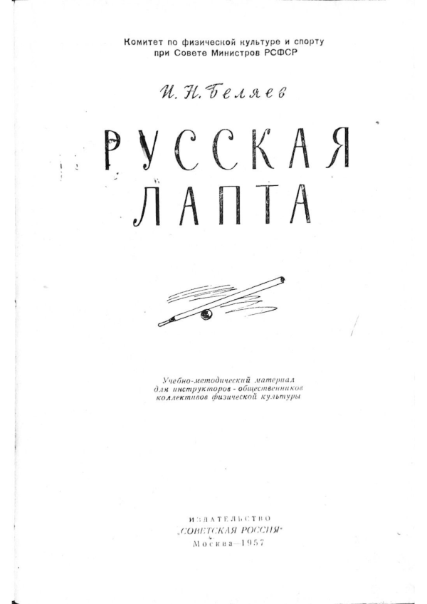
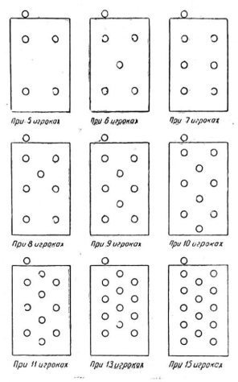
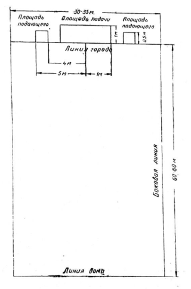

# Русская лапта. И.Н. Беляев. 1957

::: details Выходные данные
Игорь Николаевич Беляев  
Москва - 1957  
Сдано в набор 28.XI.57

  
:::

### Введение

Русская лапта — увлекательная, живая, незаслуженно забытая игра. Кто в детстве не играл в нее. Много юношей и девушек через лапту пришли к систематическим занятиям физической культурой и спортом, стали разрядниками и мастерами спорта. Основу игры в лапту составляют естественные движения: бег, броски мяча и т. п. Все это содействует всестороннему физическому развитию игроков, воспитывает в них выносливость, быстроту, ловкость, волю к победе, чувство коллективизма и другие ценные качества и навыки.

Игра в лапту по своему характеру проста и позволяет быстро осваивать элементы ее техники и тактики. Это делает се доступной как для мужчин, так и для женщин, юношей и девушек.

Для игры в лапту необходим несложный, недорогостоящий инвентарь и оборудование. Наличие любой площадки, свободной от посторонних предметов, и простого спортивного инвентаря (лапта, мяч) открывает широкие возможности для массового развития этого вида спортивных игр.

В лапту можно играть в пионерском лагере, на школьной площадке, в колхозе, на даче.

Несмотря на свою популярность лапта до последнего времени не была спортивной игрой.

Разработанные и утвержденные в 1957 году Комитетом по физической культуре и спорту при Совете Министров РСФСР временные правила соревнований по лапте создали широкие возможности для повсеместного культивирования этой исконно русской народной игры и проведения соревнований по ней.

Настоящий учебно-методический материал преследует цель оказать помощь инструкторам-общественникам в деле организации проведения учебно-тренировочной работы по русской
лапте.

Для лапты не нужны специальные площадки. Любая площадка, свободная от каких-либо растений, сооружений, на которой можно разместить прямоугольник длиной от 60 до 80 м и шириной от 30 до 35 м с более или менее ровной травяной или другой поверхностью годиться для игры в лапту. Для игры детей и соревнований в коллективах физкультуры эта площадка может быть еще меньше. Поле должно быть размечено ясно видимыми линиями, шириной в 10 см. Разметку линии можно делать мелом, песком. краской и т. п. Ширина линии входит в размеры поля и ограничиваемых или площадей.

## ТЕХНИКА И ТАКТИКА ИГРЫ

### Удар по мячу

Игрок, производящий удар, должен обеими ногами стоять в площади «подачи», боком к полю. Если удар выполняется правой рукой,- то игрок должен стоять левым боком, если левой — то правым боком. Ноги расставлены на ширине плеч. Нога, ближайшая к полю, несколько выставлена вперед. В момент замаха лапты ступня ноги, выставленной вперед, переходит на носок, а другая нога несколько сгибается в коленном суставе, центр тяжести тела игрока‚ находится на ноге, согнутой в колене, которая опирается о землю всей ступней. Прямая рука с лаптой заносится вверх над головой, в противоположную сторону от поля. Туловище несколько отклоняется в сторону замаха. Лицо обращено к игроку, подбрасывающему мяч. Глаза все время контролируют мяч, находящийся в руках подбрасывающего. После того как мяч будет подброшен, рука с лаптой с силой опускается вниз, сгибается в локтевом суставе и ударяет мяч в момент, когда последний будет находиться на уровне немного выше пояса игрока. При этом движение руки убыстряется перед самым ударом по мячу. В момент удара делается резкий рывок кистью руки. Туловище игрока, после того как рука начнет опускаться для удара, выпрямляется и несколько поворачивается плечом руки, производящей удар, в сторону поля. Ноги меняют свое положение. Нога, ближайшая к полю, переходит на всю ступню и несколько сгибается в коленном суставе, другая нога, наоборот, становится на носок и выпрямляется. Этот способ удара по мячу одной рукой является основным.

Применяется способ удара по мячу и двумя руками. Положение ног и туловища при этом способе такое же, как и при ударе по мячу одной рукой. `

Изменяется только положение рук. Ладони рук зажимают лапту и находятся одна над другой. Причем сверху должна быть рука, в сторону которой производится замах лапты. Обе руки, держа лапту заносятся вверх, назад, за голову, согнутые в локтевом суставе. Из этого положения производится удар по мячу так же, как одной рукой.

Может быть применен способ удара по мячу, при котором замах производится двумя руками, а сам удар по мячу одной рукой.

После удара игрок должен бросить лапту обязательно в пределах площади «подачи» или оставить ее в своих руках и самому остаться в пределах площади «подачи», так как в противном случае перебежка не будет разрешена, а удар будет считаться выполненным.

### Подбрасывание мяча

Игрок, подбрасывающий мяч, должен все время до момента, пока мяч будет в его руках, находиться обеими ногами в площади подающего, боком к полю и лицом к игроку, производящему удар по мячу. Ноги расставлены на ширине плеч и находятся на одной
линии, или одна из ног несколько выставлена вперед. Ноги согнуты (полуприсед), туловище наклонено вперед. Мяч находится в руке и лежит на раскрытой ладони, выставленной вперед, находящейся на уровне пояса.

Рука с мячом несколько согнута в локтевом суставе. Взгляд направлен на мяч и на игрока, производящего удар по мячу. Игрок, подбрасывающий мяч, определяет силу, с которой должен быть подброшен мяч, с тем, чтобы высшая точка его полета не была больше 3, а низшая — не больше 2,5 метра и чтобы мяч опускался не ближе 1 и не дальше 2 метров перед бьющим.

Из указанного положения рука с мячом плавно несколько опускается вниз, а затем снова резко поднимается вверх, сгибается еще более в локтевом суставе, и толчковым движением кисти руки мяч подбрасывается вверх на требуемую высоту и дальность.

Имитировать подбрасывание мяча, то есть обманывать игрока, производящего удар, запрещается. Каждое обманное подбрасывание засчитывается как неправильное подбрасывание.

### Перебежка

Перебежку можно производить с линии «города» или «дома» любым способом и бежать в любом направлении: по прямой, в сторону, зигзагом, возвращаться назад, потом снова бежать вперед и т. д., соблюдая лишь обязательное условие: начав перебежку с линии «города», закончить ее, добежав до линии «дома», или, начав ее с линии «дома», закончить за линией «города».

Игрок, собирающийся‚ делать перебежку, должен перед ударом по мячу встать за линией «города» в положение. высокого легкоатлетического старта и быть готовым к началу перебежки. Положение тела игрока при этом должно быть следующим: ноги расставлены и согнуты, одна из них выставлена вперед. Ступня ноги‚ стоящей впереди, находится полностью на земле, другая, нога стоит на носке. Туловище наклонено вперед. Руки, согнутые в локтевых суставах, прижаты к бокам. Из этого положения игрок может сделать рывок вперед, как только будет произведен удар по мячу. Делая перебежку, игрок должен бежать по прямой как можно быстрее и все время не выпускать из поля зрения летящий мяч. Как только мяч опустится и будет находиться в руках игрока водящей команды, игрок, делающий перебежку, должен, продолжая бег, все время видеть его, с тем чтобы, если он будет осаливать, иметь возможность изменить направление бега. Одновременно нужно стараться быть дальше от всех игроков водящей команды, на случай передачи мяча этим игрокам и возможного осаливания ими.

Если перебежка производилась с линии «города», то, добежав до линии «дома», игрок должен принять решение, остаться здесь до следующего удара по мячу одним из партнеров по команде или продолжать перебежку обратно до линии «города». Это решение должно быть принято в зависимости от того, где находится мяч.

Если мяч находится в руках у одного из игроков водящей команды, то перебежку продолжать не стоит, так как при таком положение почти определенно произойдет осаливание. Перебежку следует продолжать, если мяч в это время находится вне пределов поля или не находится еще в руках игроков водящей команды.

Если игрок водящей команды пытается осалить игрока «бьющей» команды, то, продолжая бег и не выпуская из поля зрения мяч, следует в момент броска мячом сделать резкий скачок в одну из сторон и при этом пригнуться, чтобы мяч пролетел мимо. Как только мяч пролетит мимо, следует быстро встать и продолжать перебежку. Необходимо очень внимательно следить за тем, чтобы игрок, старающийся осалить, не вынудил ложным движением броска мяча игрока, делающего перебежку, сделать преждевременный скачок в сторону и пригнуться, так как в этом случае произвести осаливание гораздо легче. При перебежке надо все время ориентироваться боковой линии, с тем чтобы не наступить или не перебежать ее.

### Осаливание

Как только мяч после удара будет пойман одним из игроков водящий команды, следует сразу передать мяч партнеру, находящемуся ближе к игроку, делающему перебежку, а не пытаться производить осаливание на далеком расстоянии самому. Если в момент ловли мяча партнером, игрок, делающий перебежку, успел уже отдалиться и к нему находится ближе другой партнер, следует сразу передать мяч последнему. Самому осаливание следует производить лишь в том случае, если есть уверенность, что оно сможет закончиться успешно, или когда нет партнера, находящегося в более близком и удобном. положении.

Бросать мяч в игрока, делающего перебежку, не следует очень сильно, так как, если осаливание не произойдет, мяч далеко укатится. Рекомендуется осаливание игрока производить на уровне пояса, с тем чтобы мяч попал в игрока, даже если он пригнется и подпрыгнет. Бросать мяч с целью осаливания, а также передавать мяч своему партнеру нужно одной рукой. Перед броском следует сделать небольшой замах руки, подняв и занеся ее, согнутую в локтевом суставе, над плечом, держа мяч около уха. Из этого положения резким движением руки вперед мяч бросается в нужном направлении.

Если произошло осаливание, игроку водящей команды, находящемуся ближе всех к мячу, следует взять его в руки и попытаться передать своему партнеру с целью осалить другого игрока бьющей команды или сделать это самому.

Если игрок решил произвести осаливание, он должен, прежде чем бросить мяч в игрока бьющей команды, бежать за этим игроком с целью сократить между ними расстояние. Если игрок убеждает, что он не сокращает или увеличивается расстояние, то следует немедленно попытаться осалить противника.

### Ловля мяча

Ловить мяч, падающий сверху, нужно, как правило, двумя руками. Кисти рук образуют при этом воронку размером немного более размера мяча и прижаты друг к другу у запястья.

Сложенные таким образом руки нужно выставить вперед-вверх по направлению полета мяча; как только мяч коснется пальцев, следует зажать его в руках. Можно ловить мяч с помощью рук и груди. При этом способе раскрытые ладони рук прижаты друг к другу. обращены вверх и прижаты запястьями к груди. Подбежав или подойдя к летящему мячу с таким расчетом, чтобы он падал в воронку, образованную ладонями рук и грудью. Как только мяч прикоснется к пальцам рук или груди, ладони прижимают его к груди. Ноги в этот момент сгибаются в коленном суставе.

Если мяч не падает, а летит по прямой выше груди, рекомендуется ловить такой мяч одной рукой. Рука с раскрытой ладонью выставляется навстречу полету мяча, как только мяч коснется пальцев, следует быстро зажать его пальцами, с тем чтобы он не успел отскочить от ладони и упасть.

Если мяч катится или прыгает по земле, нужно постараться забежать вперед мяча, присесть или лечь перед мячом и ловить его, прижимая мяч двумя открытыми ладонями к земле.

Если встать впереди летящего мяча невозможно, рекомендуется сделать рывок и упасть на мяч, с тем чтобы он оказался прижатым к земле туловищем или руками.

### Размещение на поле игроков водящей команды

Игрокам водящей команды размещаться на поле нужно так, чтобы контролировалось все поле и иметь возможность в любом его месте поймать мяч.

Размещение игроков на поле следует производить в зависимости от числа играющих (см. рис.).

### Основы обучения и тренировки

Обучение и тренировка взаимно связаны между собой. Между ними нельзя установить определенные границы, но на различных этапах спортивного совершенствования один из элементов этого единого процесса может преобладать. Вначале главным является обучение, а в дальнейшем - тренировка и выступление с состязаниях.

Успех работы с командой зависит от правильного соблюдения основных принципов обучения и тренировки, которые дополняют друг друга.

Основными принципами обучения и тренировки при занятиях являются: сознательность, активность, наглядность, доступность, прочность и систематичность получения навыков.

Для обеспечения сознательности при обучении и тренировке необходима четкая и понятная постановка цели и задач. При изучении каждого упражнения инструктор-общественник указывает на значение данного упражнения, разъясняют его сущность и влияние на организм.

Активность игрока предполагает не только его участие в тренировках и соревнованиях, но самое главное, сознательные и инициативные действия в процессе тренировки и игры.

Все содержание техники и тактики игры, физическая и морально волевая подготовка занимающихся должны быть правильно распределены по периодам и занятиям, которые должны проводиться систематически, не реже двух-трех раз в неделю.

Большое значение в быстром освоении техники и тактики игры имеет наглядность. Наглядность в обучении требует от инструктора-общественника образцового показа изучаемого упражнения и действия. Обучение любым приемам и действиям надо строить не на отвлеченных объяснениях, а на конкретном показе. Образцовый показ в сочетании с точным объяснением создает ясное и надолго запоминающееся представление об изучаемом приеме или действии.

Необходим также индивидуальный подход к занимающимся так как силы и возможности их часто бывают различными.

Обучение и тренировка осуществляются в такой последовательности.
Ознакомление с упражнением:
а) назвать и кратко объяснить;
б) показать выполнение его в целом;
в) указать назначение и влияние на организм;
г) при необходимости показать выполнение его по элементам, кратко объяснить технику его выполнения.

Разучивание упражнения:
а) выполнение в целом с попутным устранением ошибок;
б) разучивание по частям; ,
в) разучивание подготовительных упражнений.

Тренировка в выполнении упражнения начинается после того, как прием в основном изучен. При этом производится последовательное и постепенное увеличение физической нагрузки. Затем изучаемое упражнение вводится в подвижные игры, отрабатывается в товарищеских и календарных соревнованиях.

Учебно-тренировочная работа ведется круглогодично и делится на периоды: подготовительный, основной и переходный. Время, отводимое на каждый из периодов, и содержание занятий определяется задачами, стоящими перед командой в данном спортивном
сезоне, и климатическими условиями.

Основными задачами учебно-тренировочной работы с командой являются:
1. физическое совершенствование игроков команды;
2. освоение и совершенствование техники и тактики игры;
3. воспитание моральных и волевых качеств;
4. умение применять в игре приобретенные качества и навыки.

В средней полосе СССР, где соревнования могут проводиться с мая по октябрь, время по периодам может быть распределено следующим образом:
а) подготовительный период — с 1 января по 1 мая;
б) основной — с 1 мая по 1 ноября;
в) переходный — с 1 ноября по 1 января.

### Подготовительный период

Задачи в подготовительный период - подготовить игроков к участию в соревнованиях, обеспечить всестороннюю физическую подготовку, изучить и совершенствовать технику и тактику игры, воспитать у игроков моральные и волевые качества, изучить теоретические основы игры, спортивной тренировки, врачебного контроля. В этот период игроки сдают зимние нормы комплекса ГТО и участвуют в контрольных испытаниях. В конце подготовительного периода для проверки и закрепления результатов учебно-тренировочной работы рекомендуется провести несколько товарищеских соревнований, вначале с более слабым противником, а затем с сильным.

Тренировочная работа в подготовительный период ведется таким образом, чтобы занимающиеся к началу календарных соревнований достигли своей лучшей, спортивной формы.

### Основной период

Целью этого периода является успешное участие в календарных соревнованиях, а задачами - дальнейшее совершенствование всесторонней физической подготовки, техники и тактики игры, воспитание у игроков высоких моральных и волевых качеств, направленных на достижение наилучших результатов, повышение теоретических знаний. Основной период является самым продолжительным.

Основными средствами, при помощи которых решаются эти задачи, являются общеразвивающие и специальные физические упражнения: упражнения по технике и тактике игры, учебные игры и соревнования и специальные теоретические занятия.

Ведущей формой учебно-тренировочной работы этого периода является проведение практических занятий с мячом и учебных двухсторонних игр в период между календарными соревнованиями.

Наряду с групповыми занятиями проводится индивидуальная работа с отдельными игроками, имеющими недостатки в физической или технической подготовке.

В основной период вся работа направлена на достижение наивысших результатов в проводимых соревнованиях. Поэтому все внимание и все средства мобилизованы на поддержание хорошей спортивной формы и высоких волевых качеств игроков. Следует
избегать перетренировки игроков.

### Переходный период

Основной задачей этого периода является постепенное снижение тренировочной нагрузки и вместе с тем поддержание достигнутого уровня физической подготовленности.

После окончания последних соревнований не следует прекращать занятий. В течение ближайшего месяца необходимо перейти к средним нагрузкам, постепенно уменьшая количество упражнений и их дозировку.

Надо организованно закончить этот период подведением итогов годовой учебно-тренировочной работы и сделать выводы. Затем надо игрокам предоставить активный отдых, переключить их на занятия другими видами спорта, не требующими большой физической и нервной нагрузки (лыжная прогулка, катание на коньках и др.).

### Урок (занятие)

Основной формой спортивной тренировки является учебно-тренировочное занятие, проводимое в виде урока. Занятие состоит из трех частей: подготовительной, основной и заключительной.

Общая продолжительность занятий может быть от полутора до двух часов.

Подготовительная часть занятия проводится для того, чтобы подготовить организм игрока к большой физической нагрузке в основной части занятия.

Подготовительная часть начинается с объяснения цели и задачи занятия. Проводятся: различная ходьба, бег, метания, общеразвивающие гимнастические упражнения, упражнения для развития силы, выносливости и других качеств, специальное подготовительное упражнение.

Основная часть занятий проводится с целью изучения технических приемов, тактических действий и тренировки игроков. В основной части занятия большое внимание уделяется воспитанию морально-волевых качеств, необходимых для успешного ведения игры.

В основной части занятия отрабатывается техника и тактика игры, проводятся учебные игры, теоретические занятия и анализ проведенных игр.

Заключительная часть занятия проводится с целью приведения организма занимающихся в относительно спокойное состояние.

В конце производится разбор занятия и делается вывод.

### Планирование и учет

Непременным условием успешного проведения учебно-тренировочных занятий является планирование. Документами планирования и учета учебно-тренировочных занятий являются:
1 - учебный план, 2 - программа, 3 - рабочий, или поурочный план занятий, 4 - конспект занятий, 5 - журнал учета.

Учебный план определяет содержание и объем учебно-тренировочных занятий на год.

При составлении учебного плана обязательно должны учитываться условия, в которых будет проводиться работа (наличие спортбазы, климатические условия, календарь соревнований и др.), а также степень подготовленности игроков. В зависимости от этих условии изменяется и время, отводимое на занятия, продолжительность периодов и пр.

Занятия с командой должны проводиться минимум два-три раза в неделю. Продолжительность занятий - 2 часа. Важно, чтобы учебно-тренировочная работа велась систематически, без срывов. Намеченный и утвержденный план должен выполняться полностью.

На основе учебного плана составляется программа, определяющая объем знания, а также умение и навыки, которыми должны овладеть занимающиеся.

На основе учебного плана и программы составляется рабочий или поурочный, план, в котором кратко излагается содержание каждого занятия. Рабочий, или поурочный, план проведения занятий можно составлять отдельно на каждый период работы.

На основе рабочего плана инструктор-общественник составляет конспект каждого занятия. Конспект занятия составляется с учетом материала рабочего плана, качества усвоения программного материала занимающимися и конкретной обстановки (климатические условия, состояние занимающихся, наличие инвентаря и т. п.)

Для проведения учебно-тренировочных занятий составляется расписание по периодам. В расписании указываются дни занятий, время, учебные группы, темы и места проведения занятий и кто проводит занятия. С расписанием должны быть ознакомлены все занимающиеся.

Учет учебно-тренировочной и воспитательной работы ведет инструктор-общественник в журнале учета. В журнале отмечается посещаемость, фактическое прохождение программного материала, спортивные результаты и результаты сдачи норм ГТО, данные медицинского контроля.

## ПРАВИЛА СОРЕВНОВАНИЙ

### I. УЧАСТНИКИ СОРЕВНОВАНИИ

#### 1. Возраст игроков

Участники соревнований делятся на следующие возрастные группы:

- Детская — мальчики и девочки 13—14 лет.
- Средняя юношеская — юноши и девушки 15—16 лет.
- Старшая юношеская — юноши и девушки 17—18 лет.
- Взрослая — мужчины и женщины 19 лет и старше.

Примечание:
В отдельных случаях по разрешению врача, тренера и соответствующего комитета по физической культуре и спорту юноши и девушки старшей юношеской группы допускаются к участию в играх за команды взрослых.

#### 2. Права и обязанности игроков

1. Во время игры игрок имеет право обращаться к судье на поле только через капитана своей команды.
2. Игрок обязан знать правила игры и точно соблюдать их.
3. Каждый игрок, заявленный в составе команды, должен иметь разрешение врача на участие в соревнованиях.

#### 3. Костюм игрока

1. Костюм игрока состоит из майки или футболки, трусов и обуви.
2. Команда должна выступать в чистой, опрятной и одинаковой по цвету форме.
3. Каждый игрок должен иметь номер на спине и на груди. Нумерация должна быть от 1 до 15 включительно.

#### 4. Состав команды и замена игроков

1. Количество игроков в команде может быть от 5 до 15 человек: точное число игроков устанавливается «Положением» о данном соревновании.
2. Начать игру команда обязана с полным составом игроков. Если во время игры в команде остается на два игрока меньше количества, предусмотренного положением, игра прекращается и команде засчитывается поражение.
3. В процессе игры команде разрешается заменить не более двух игроков запасными.
Замена игрока производится в момент нахождения мяча вне игры или в момент остановки игры судьей по требованию представителя команды - через судью-секретаря, по требованию капитана - через судью.
4. Игрок, выходящий из игры или входящий в игру, должен получить на это разрешение судьи.
В исключительных случаях (повреждение и т. п.) игрок может покинуть поле без обращения за разрешением, но капитан команды обязан немедленно уведомить судью об уходе игрока.
Игрок, покинувший поле без разрешения судьи, удаленный с поля судьей или капитаном своей команды, не может быть снова допущен к игре или заменен запасным игроком.
5. До начала игры фамилии всех игроков каждой команды должны быть вписаны в протокол игры. Игрок, не вписанный в протокол, к соревнованию не допускается.
На замену игрока дается одна минута.

### II. СУДЬЯ

Для проведения игры назначается один судья и секретарь.

#### 5. Судья на поле

1. Судья следит за выполнением игроками правил игры и принимает решения во всех спорных случаях нарушения правил. Его решения являются окончательными.
2. Полномочия судьи начинаются с момента вызова им капитанов на поле и кончаются после подписания протокола игры.
3. Судья имеет право прекратить игру во всех случаях, когда сочтет это нужным (неблагоприятная погода, непригодность грунта и другие причины). В этих случаях судья обязан составить акт о причинах прекращения игры и выслать его организации, проводящей соревнования.
4. Судья имеет право делать игроку замечания и предупреждения, удалить его с поля без предварительного предупреждения, если игрок вызывает на это своим поведением.
5. Судья перед началом игры обязан проверить состояние и разметку поля, состояние инвентаря (мяч, костюм, обувь игроков и т. д.).
6. После первой и второй половины игры судья должен проверить запись секретарем результатов игры.
7. По окончании игры судья должен заполнить подробно все графы протокола.
8. Судья предоставляет право выбора бить или водить капитану команды гостей. При игре на нейтральном поле бросается жребий.

#### 6. Секретарь

1. Секретарь ведет учет перебежек, очков и партий; следит за очередностью бьющих игроков; ведет учет ловли мяча и осаливания игроков.
2. По окончании игры секретарь заполняет протокол соревнования и подписывает его.

### III. ПРАВИЛА ИГРЫ

#### 7. Партии и продолжительность игры

1. В игре одна команда является «бьющей», другая — «водящей».
2. Игра состоит из десяти партий; каждая команда попеременно должна быть пять партий «бьющей» и пять партий «водящей». Между партиями делается перерыв в 5 минут.
3. Для детских и юношеских команд устанавливается следующее количество партий:

- мальчики и девочки 13—14 лет - 6 партий;
- юноши и девушки 15—16 лет - 8 партий.
В каждой игре команда половину партий бьет, половину водит.

4. Партия продолжается до тех пор, пока бьющая команда не получит 3 штрафных очка. Штрафное очко команде записывается:

- если игрок бьющей команды будет осален игроком водящей команды. Можно осалить несколько игроков подряд.

Партия заканчивается также, если в бьющей команде не остается игрока с правом на удар или все игроки этой команды сделают полные перебежки.

#### 8. Начало игры

1. Команды выходят на центр поля по свистку судьи и приветствуют друг друга (заключительное приветствие производится командами по окончании игры).
Первой выходит на поле команда гостей.
2. Каждую партию начинает ударом по мячу игрок № 1 бьющей команды.

#### 9. Подбрасывание мяча

1. Подбрасывание мяча производит игрок водящей команды, выделенный на это капитаном.
2. Игрок, подбрасывающий мяч, до момента, пока он не подкинет мяч, должен быть обращен лицом к игроку, производящему удар, и стоять обеими ногами в своей площади (площади подающего) со стороны, указанной бьющим.
Мяч должен быть подброшен на высоту 2,5—3 метров перед бьющим и должен снижаться в расстоянии не ближе 1 и не дальше 2 метров перед бьющим.

3. Мяч, подброшенный не в соответствии с указанными условиями, считается подброшенным неправильно. За два мяча, неправильно подброшенных одному и тому же игроку, всем игрокам бьющей команды, имеющим право на перебежку, включая и бьющего игрока, перебежка засчитывается выполненной.

#### 10. Удар по мячу

1. Игрок, производящий удар, должен обеими ногами стоять в площади «подачи».
2. Удар по мячу должен быть произведен лаптой в момент нахождения мяча в воздухе после подбрасывания.
3. Игрок, производящий удар, имеет право два раза не бить подброшенный ему мяч, даже если мяч был подброшен правильно, но недостаточно удобно для удара лаптой.
Если бьющий игрок не сделает удара по мячу за три правильных подбрасывания, считается, что он выполнил удар без права перебежки.
4. Если правильно подброшенный мяч был задет лаптой, удар считается выполненным.
5. В начале каждой партии все игроки бьющей команды имеют право на один удар по мячу и бьют по очереди в порядке номеров.
В случае замены заменяющий игрок встает на место выбывшего.
6. После выполнения ударов по мячу всеми игроками бьющей команды право на последующий удар игрок приобретает после перебежки без соблюдения порядка номер.
7. Все игроки, имеющие право на удар, должны находиться за линией «города».
8. После удара игрок обязан оставить лапту в площади «подачи».

#### 11. Перебежка

1. Право на перебежку игрок получает после удара по мячу. Игрок, делающий полную перебежку, должен пробежать по полю за линию «дома» и вернуться по полю за линию «города»; правильно выполнивший одну полную перебежку и не осаленный игрок дает своей команде одно очко.
2. Игрок, пробежавший по полю за линию «дома», может там остаться — неполная перебежка - и возвращаться обратно после одного из последующих ударов по мячу игроками его команды.
3. Если во время перебежки кто-либо из игроков водящей команды поймает мяч с лета (хотя бы и вне поля), водящая команда становится бьющей.
4. Мяч считается пойманным с лета, если игрок водящей команды поймает его одной или двумя руками в воздухе, не дав коснуться земли. Поймав мяч, игрок должен немедленно поднять его вверх вытянутой рукой.
5. Перебежка не разрешается, если мяч после удара упадет за боковой линией поля или не перейдет линии «города».
Игрок может начать перебежку с линии «города» или «дома» только после того, как будет сделан удар по мячу.
6. Игрок, делающий перебежку непосредственно после выполненного им удара, должен бросить лапту около себя и может бежать прямо из площади «подачи».
7. Игрок имеет право не делать перебежку непосредственно после своего удара, а выполнить ее после одного из последующих ударов по мячу кем-либо из игроков его команды. Игрок, начавший перебежку, обязан ее продолжить в одном направлении за линию «дома» или за линию «города».
Бьющий игрок обязан делать перебежку непосредственно за проведенным ударом в том случае, если кроме него в «городе» никого нет.

#### 12. Осаливание

1. Игроки водящей команды, за исключением игрока, подбрасывающего мяч, могут находиться в любом месте поля и передвигаться в любом направлении.
2. Игрок, делающий перебежку, считается осаленным, если его в пределах поля коснется мяч. Игрок бьющей команды считается также осаленным, если он выбежал за боковую линию поля или наступил на нее.
3. Игрокам водящей команды разрешается передавать друг другу мяч в любом направлении и осаливать нескольких игроков подряд.

#### 13. Результат игры

1. За каждую правильную полную перебежку своего игрока бьющая команда получает одно очко.
2. Команда, набравшая после всех партий наибольшее количество очков, считается победительницей
3. Если счет очков у обеих команд окажется одинаковым, игра считается сыгранной вничью. а

### IV. МЕСТО ИГРЫ. ОБОРУДОВАНИЕ ПОЛЯ

#### 14. Размеры и разметка поля

1. Поле для лапты (рис.) представляет собой прямоугольник с ровной травяной или другой поверхностью длиной от 60 до 80 метров и шириной от 30 до 35 метров.
При проведении соревнований в коллективах физкультуры разрешается применение поля и меньших размеров.

2. Поле должно быть размечено ясно видимыми (белыми) линиями шириной 10 сантиметров. Размечать поле канавками запрещается.
Длинные линии, ограничивающие поле, называются боковыми, короткие: одна — линией «города», другая — линией «дома». Ширина линий входит в размер поля и ограничиваемых ими площадей.
3. На линии «города» в обе стороны от ее середины откладываются отрезки по 1 метру. Отступая на один метр вне поля на это же расстояние, проводится параллельная линия, концы которой соединяются с линией «города» под прямым углом. Образованный прямоугольник называется площадью подачи и является местом для игрока, производящего удар по мячу.
4. На линии «города» в 4 и 5 метрах в обе стороны от ее середины откладываются точки; из этих точек под прямым углом к линии «города» вне поля проводятся 50-сантиметровые линии, концы которых соединяются линией, параллельной «городу». Образованные прямоугольники называются площадями подающего.
В пределах этих площадей должен стоять подающий игрок в момент подачи мяча.

#### 15. Мяч

Мяч для игры в лапту должен быть резиновый, круглый, диаметром от 6 до 7 сантиметров, весом от 50 до 60 граммов.

#### 16. Лапта

Лапта должна быть деревянная, длиной не более 1,2 метра и толщиной до 5 сантиметров в диаметре.
Для игроков 13 -14 лет лапта может быть плоской и иметь длину 80 сантиметров и ширину до 10 сантиметров.