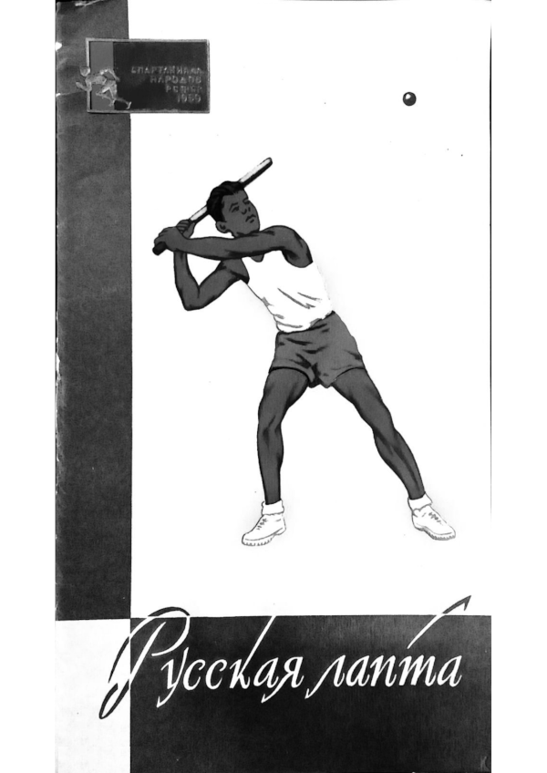
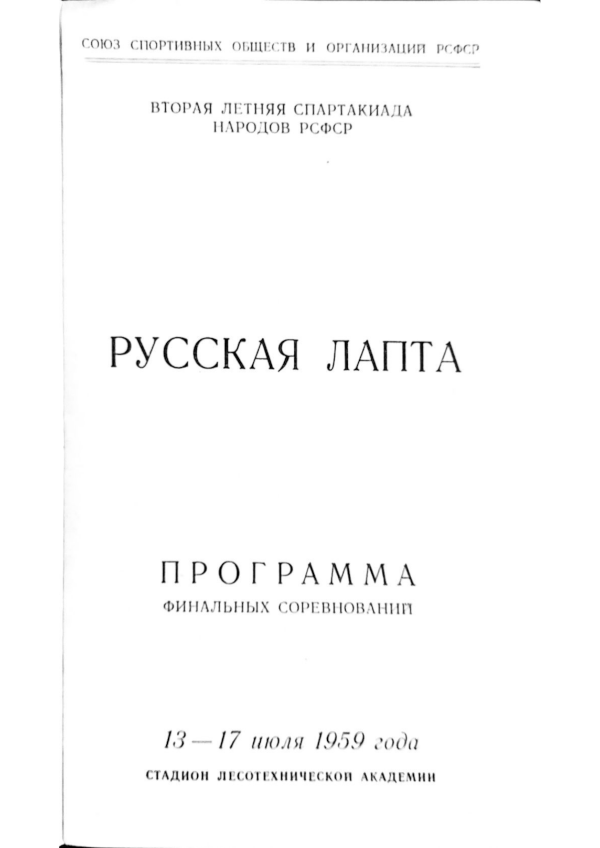

# II Летняя Спартакиада Народов РСФСР. Программа финальный соревнований по лапте. 1959

::: details Выходные данные



:::

Есть у русского народа игры, история которых исчисляется веками, Одна из таких игр - лапта.

«...Эта народная игра - одна из самых интересных и полезных игр, - говорил знаменитый русский писатель А. Куприн, - в лапе нужны находчивость, глубокое дыхание, верность своей партии, внимательность, изворотливость, быстрый бег, меткий глаз, твердость удара руки и вечная уверенность в том, что тебя не победят».

Основу игры составляют естественные движения: бег, прыжки, броски мяча и т. д. Все эти элементы игры способствуют всестороннему физическому развитию спортсменов, вырабатывают выносливость, быстроту, ловкость, воспитывают чувство коллективизма и другие ценные качества и навыки.

Правила игры в лапу очень просты, это позволяет спортсменам быстро освоить элементы ее техники и тактики.

Лапта - общедоступный вид спорта: для игры в нее не требуется ни дорогостоящего инвентаря, ни сложного оборудования.

Первые официальные соревнования по русской лапте были проведены в августе 1957 года, когда в станице Динской, Краснодарского края встретились шесть сильнейших сельских команд Российской Федерации.

В 1958 году впервые в истории русского и советского спорта было проведено первенство РСФСР по лапте.

Почетное звание чемпиона завоевала команда Воронежской области.

В настоящее время старинная народная игра получила все права гражданства в нашем спорте. Пожалуй, нет сейчас ни одной области или автономной республики, где бы не проходили соревнования по лапте.

Лапта включена как обязательный вид спорта в программу Второй летней спартакиады народов РСФСР. Финальным соревнованиям, которые состоятся в Ленинграде, предшествовали соревнования в 8 зонах.

**Звание победителя Спартакиады и чемпиона РСФСР оспаривают 8 команд - победительниц зональных состязаний.**

## Программа соревнований по дням

**I тур, - 13 июля**
```
Приморский край		    -	Иркутская область
Карельская АССР		    -	Свердловская область
Ивановская область		-	Воронежская область
Московская область		-	Ростовская область
```
**II тур, - 14 июля**
```
Иркутская область		-	Ростовская область
Воронежская область	    -	Московская область
Свердловская область	-	Ивановская область
Приморский край		    -	Карельская АССР
```
**III тур, - 14 июля**
```
Карельская АССР		    -	Иркутская область
Ивановская область		-	Приморский край
Московская область		-	Свердловская область
Ростовская область		-	Воронежская область
```
**IV тур, - 15 июля**
```
Иркутская область		-	Воронежская область
Свердловская область	-	Ростовская область
Приморский край		    -	Московская область
Карельская АССР		    -	Ивановская область
```
**V тур, - 16 июля**
```
Ивановская область		-	Иркутская область
Московская область		-	Карельская АССР
Ростовская область		-	Приморский край
Воронежская область	    -	Свердловская область
```
**VI тур, - 16 июля**
```
Иркутская область		-	Свердловская область
Приморский край		    -	Воронежская область
Карельская АССР		    -	Ростовская область
Ивановская область		-	Московская область
```
**VII тур, - 17 июля**
```
Московская область		-	Иркутская область
Ростовская область		-	Ивановская область
Воронежская область	    -	Карельская АССР
Свердловская область	-	Приморский край
```
## Из правил соревнований

Игры проводятся по круговому способу в один круг.

Первенство определяется по наибольшей сумме очков, полученных командой в соревнованиях.

За выигрыш команде начисляется 2 очка, за ничью - 1, за проигрыш - 0 очков.

В случае равенства очков у двух команд лучшее место определяется по результатам встречи между ними. Если этот результат окажется ничейным, то места определяются по лучшей разности перебежек.

В случае равенства очков у 3 или более команд, преимущество дается команде, имеющей наибольшее число очков в играх между этими командами.

При равенстве м этого показателя преимущество дается командам, имеющим лучшую сумму перебежек в играх между этими командами.

### Партия и продолжительность игры

1. В игре одна команда является «бьющей», другая «водящей».

2. Игра состоит из двух партий, по 30 минут каждая. Между партиями дается перерыв на 10 минут.
После перерыва между половинами игры право начать игру получает команда, которая в начале игры была «водящей».

3. Смена команд производится:
свободная:
- если у «бьющей» команды не остается игрока с правом на удар;
- если игрок водящей команды поймал «свечу»
игровая:
- если игроком «водящей» команды будет осален игрок «бьющей» команды;
- если происходит «самоосаливание» игрока «бьющей» команды.

4. В случае осаливания одного из игроков «бьющей» команды, все игроки «водящей» команды должны постараться занять места в «пригороде» или за линией кона.
Однако в момент, когда они разбегаются, может быть произведено «ответное осаливание», и тогда смена команд не производится и игра продолжает.
«Ответное осаливание» может производиться неограниченное число раз. После ответного осаливания начисление очков ни одной из команд не производится.
В случае нескольких осаливаний, когда игровая смена команд «бьющей» и «водящей» не была произведена, игроки «бьющей» команды, которые произвели до этого удар и имевшие право на перебежку после описанного случая, они утрачивают это право и вновь обязаны произвести удар.

### Начало игры

1. Команды выходят на центр поля по свистку судьи и приветствуют друг друга (по окончании игры производится заключительное приветствие)
Первой выходит на поле команда гостей.

2. Каждую партию начинает ударом по мячу, игрок «бьющей» команды. Игроки «бьющей» команды, ожидающие очереди произвести удар по мячу, размещаются в «площади очередности».
Игроки, выполнившие удар и ожидающие перебежки, располагаются в «пригороде».

*Примечание. Запасные игроки и тренеры обеих команд размешаются на скамейке за боковой линией около стола секретаря.*

### Подбрасывание мяча

1. Подбрасывание (подачу) мяча производит игрок «водящей» команды. В момент подбрасывания мяча бьющий и подающий игроки должны обеими ногами находиться в пределах «площадки подающего». Подающий игрок может находиться от бьющего на любом расстоянии, но в пределах «площадки подающего», выполняя просьбу бьющего и подавая мяч как ему (бьющему) удобно.

2. За неправильное подбрасывание мяча подающему игроку делается замечание, при повторном нарушении - предупреждение, а при последующих нарушениях, совершенных этим же игроком, команда «водящих» штрафуется очком.

3. Подающий игрок может пользоваться всеми правами полевых игроков при нахождении в поле.

### Удар по мячу

1. Удар считается правильным
- а) если мяч вышел за пределы «города», но не пересек боковых линий по воздуху;
- б) если мяч не вышел за пределы поля перед боковыми флагами:

*Примечание: мяч, пересекший линию кона по земле или по воздуху, считается «в игре».*

2. Удар по мячу должен быть произведен в момент нахождения мяча в воздухе после подбрасывания.

3. Игрок, производящий удар, имеет право требовать нового подбрасывания (подачи) до трех раз, при условии, если он не произвел попытку ударить по мячу.

4. Если бьющий игрок сделал промах, то он имеет право начать перебежку только после правильного удара по мячу следующим игроком его команды.

5. В начале каждой партии игроки «бьющей» команды бьют по очереди в порядке номеров.
После выполнения ударов по мячу всеми игроками «бьющей» команды, право на последующий удар игрок приобретает после полной перебежки.

6. После удара игрок обязан оставить лапту в пределах «площадки подающего». В случае, если лапта будет оставлена в поле или на линии, удар считается недействительным.

7. Удар, при котором может быть нанесено физическое повреждение игроку подающему мяч, считается опасным. После второго предупреждение за опасны удар, игрок удаляется с поля.

### Перебежка

1. Право из перебежку игрок получает после правильного удара по мячу. Игрок, делающий полную перебежку, должен пробежать по полю за линию «кона» и вернуться по полю обратно после одного из последующих ударов по мячу игроками его команды.

3. Перебежка не разрешается, если мяч:
а) после удара упадет за боковую линию поля, пролетев эту линию по воздуху;
6) не перейдет линии «города»;
в) выйдет за боковую линию перед боковыми флагами (если мяч ударился в флаг перебежка разрешается).

4. Игрок, делающий перебежку непосредственно после своего удара, может бежать из «площадки подающего».

5. Игрок имеет право не делать перебежку непосредственно после своего удара, а выполнять ее после одного из последующих ударов по мячу, кем-либо из игроков его команды. Перебежку разрешается начинать только из пригорода», кроме случая, указанного в пункте № 4 настоящего параграфа.

6. Игрокам запрещается вести силовую борьбу за мяч

7. Игроки «бьющей» команды, не имеющие право на перебежку, имеют право выходить в поле только после того, как из команду «осалили».

8. Игроки, начавшие перебежку за линию «кона» или «города» при правильном ударе, обязаны закончить ее. Перебежка считается начатой, если игрок заступил одной ногой за линию «кона» или «города».

9. При возвращении мяча из поля в «город» после пересечения мячом линий «города», начинать перебежку запрещается. Игроки, производящие в данный момент перебежку, обязаны закончить ее в одну сторону.

### Осаливание

1. Игроки «водящей» команды могут находиться в любом месте поля и вне его и передвигаются в любом направлении, не пересекая линии «города».

2. Игрок, делающий перебежку, считается «осаленным», если его в пределах поля коснется мяч.

3. Осаливание могут производить все игроки «водящей» команды, в том числе и «подающий» игрок, если он находится в поле.

4. Осаливать можно только выпуская мяч из рук (бросая).

5. Игрокам «водящей» команды разрешается передать друг другу мяч в любом направлении и передвигаться с ним.

### Самоосаливание

1. Игрок «бьющей» команды считается «самоосаленным», если он выбежал за боковую линию поля или наступил на нее.

2. При самоосаливании игрок «водящей» команды, владеющий мячом, должен отбросить мяч в любую сторону, но в пределах поля; в этот момент происходит игровая смена команд.

### Результат игры

1. За каждую правильную полную перебежку «бьющая» команда получает одно очко.

2. Команда, набравшая после двух партий наибольшее количество очков, является победительницей.

3. Если счет очков у обеих команд окажется одинаковым, игра считается сыгранной вничью.

*Главный судья соревнований — судья республиканской категории **Ю. Н. СМОЛИН**.*