# Лапта

::: details Выходные данные
Юрий Николаевич Смолин

Издательство "Советская Россия"

Москва 1961

*(Подписано к печати - 31/VII 1961 г.)*
:::

Физическая культура и спорт в нашей стране служат могучим средством укрепления здоровья трудящихся, воспитания советской молодежи сильной, здоровой, готовой к труду и обороне Родины. За последние годы физкультура и спорт достигли нового расцвета. В городах и селах, на предприятиях и в учреждениях, в учебных заведениях, в колхозах, совхозах и РТС — всюду. имеются коллективы физической культуры.

На основе массовости заметно выросло и мастерство советских спортсменов. Мы сейчас с гордостью можем говорить о том, что большинство мировых достижений по основным видам спорта принадлежит представителям великой страны социализма.

Коммунистическая партия и Советское правительство всегда уделяли огромное внимание развитию физического воспитания в нашей стране. Новым проявлением заботы партии и правительства о развитии физической культуры и спорта явилось решение Центрального Комитета КПСС и Совета Министров СССР о руководстве физической культурой и спортом в стране.

В соответствии с этим решением с 1 марта 1959 года упразднены комитеты по физической культуре и спорту и руководство физкультурным движением возложено на вновь созданный Союз спортивных обществ и организаций СССР, наиболее совершенную форму управления на современном историческом этапе, когда «..главным направлением в развитии социалистической государственности является всемерное развертывание демократии, вовлечение самых широких. слоев населения в управление всеми делами страны, привлечение всех граждан к участию в руководстве хозяйственным и культурным строительством». (из выступления Н. С. Хрущева на ХХI съезде КПСС).

Создание Союза спортивных обществ и организаций открывает новые большие горизонты перед физкультурным движением. Привлечение к руководству физической культурой и спортом широкого круга общественности поможет поднять физкультурное движение на новую, высшую ступень, сделать его еще более массовым, создать в ближайшие годы необходимые условия для дальнейшего роста спортивного мастерства советских физкультурников и завоевания ими мирового первенства не только по основным, но и по всем видам спорта.

Придавая большое значение народным видам спорта как одной из форм физического воспитания молодежи, в декабре 1956 года Бюро ЦК КПСС по РСФСР в своем постановлении «Об итогах Спартакиады народов Российской Федерации и мерах по дальнейшему развитию физической культуры и спорта в республике» подчеркнуло необходимость всячески содействовать развитию национальных и народных видов спорта, особенно в национальных автономных республиках, областях и округах.

Выполняя постановление партии, физкультурные организации России немало сделали в последнее время для возрождения и дальнейшего развития любимых народных игр. Национальная борьба и скачки, стрельба из лука, гонки оленьих упряжек и т. п. Становятся неотъемлемой частью программы сельских праздников и спартакиад в национальных республиках и автономных округах.

Большую популярность как вид спорта завоевала в последние годы и лапта.

Лапта — замечательная спортивная. игра. В ней отображено многое, что свойственно характеру нашего народа. Здесь и проявление смелости, и взаимная выручка товарищей, и размашистый удар, и быстрый бег.

«..Эта народная игра — одна из интересных и полезных игр, — говорил знаменитый русский писатель А. Куприн. — В лапте нужны находчивость, глубокое дыхание, верность своей партии, внимательность, изворотливость, быстрый бег, меткий глаз, твердость удара руки и вечная уверенность в том, что тебя не победят».

Основу игры составляют естественные движения: бег, прыжки, броски мяча и т. д. Игра в лапту способствует всестороннему физическому развитию спортсменов, воспитывает чувство коллективизма и другие ценные качества и навыки.

Игра в лапту зародилась в глубокой древности. Во многих исторических памятниках русской письменности есть упоминания об игре в лапту, причем называют эту игру в разных памятниках по-разному: «в беглые (Тюменский округ), «хлоптой» (Олонецкая губерния), «в шара», «лакта», «шибка», «битка» и другие.

Под большинством из этих названий лапта и поныне бытует в различных уголках нашей республики. В близкие к лапте играют и за рубежом: в Польше, Румынии, Финляндии и других странах. Широко распространенный бейсбол также, по существу, является видоизмененной лаптой.

Первая попытка создания единых правил по лапте была сделана в 1926 году Высшим Советом по физической культуре при ВЦИК, но распространения они не получили. Физкультурные организации не пользовались этими правилами, не пропагандировали их и очень мало проводили официальных соревнований по лапте. В 1957 году Комитет по физической культуре и спорту при Совете Министров РСФСР утвердил и выпустил новые официальные правила по лапте.

Лапта как спортивная игра быстро начинает завоевывать популярность. Уже в 1957 году около 20 физкультурных организаций областей РСФСР проводят первенства среди сельской молодежи. Количество команд быстро растет, в связи с чем появляется возможность проведения межобластных соревнований.

В сентябре 1957 года Центральный совет ДССО «Урожай» на колхозном стадионе в станице Динской Пластуновского района Краснодарского края провел первую матчевую встречу шести сильнейших сельских коллективов по лапте.

Три дня длились эти интереснейшие соревнования, в которых приняли участие сельские спортсмены Балашовской, Чкаловской, Воронежской, Московской областей и Краснодарского края.

Победителем матчевой встречи стала команда колхоза «40 лет Октября» Пластуновского района Краснодарского края.

В 1958 году лапта была включена в программу Всероссийской спартакиады сельских спортсменов.

В предварительных соревнованиях спартакиады приняло участие около 400 команд. Лучшие из них в Москве, Ульяновске и Краснодаре оспаривали право на участие в финале.

В финальных соревнованиях спартакиады, проходившей в сентябре в Ставрополе, приняли участие 6 команд — Ростовской, Горьковской, Оренбургской, Псковской, Рязанской областей и Краснодарского края.

В финале, как и в матчевой встрече 1957 года, первенство вновь завоевали спортсмены Краснодарского края, которые все встречи провели без единого поражения. Первыми чемпионами РСФСР по лапте среди сельских спортсменов стала команда колхоза имени Ленина Тихорецкого района, в состав которой входили Г. Зарубин, А. Каширцев, А. Лунев, В. Лейконов, Г. Мирошниченко, И. Бойко и Н. Байдин.

Летом этого же года в Воронеже. проводилось первенство РСФСР по лапте между сборными командами областей, краев и автономных республик. В нем приняли участие команды Воронежской, Оренбургской, Белгородской, Омской, Ивановской, Московской, Горьковской, Тамбовской областей и Мордовской АССР.

В упорной борьбе титул чемпиона РСФСР и переходящий приз Российского Комитета по физической культуре и спорту завоевала команда Воронежской области, состоящая из студентов Воронежской лесотехнического института: В. Щербакова, В. Бережнова, В. Коноплина, А. Кириллова, В. Потемкина и Ю. Дуванова.

Учитывая большую популярность лапты и необходимость ее дальнейшего развития, Российский Комитет по физической культуре и спорту включил лапту в программу II летней Спартакиады народов РСФСР.

В зональных соревнованиях приняли участие 69 сильнейших команд. областей, краев и автономных республик, а лучшие из них — по-одной команде от зоны — оспаривали первенство в финальной части спартакиады, проходившей в Ленинграде. Из восьми команд-финалистов наиболее подготовленными оказались команды Московской, Воронежской и Свердловской областей, между которыми и разгорелась борьба за почетный титул чемпиона. Команда Московской области, уверенно проведя все встречи, завоевала титул чемпиона II летней Спартакиады народов РСФСР. Прошлому чемпиону России, воронежцам, пришлось довольствоваться вторым местом. с

Зональные и финальные соревнования показали, что значительно вырос по сравнению с первым чемпионатом уровень спортивного мастерства игроков. Игра стала более подвижной, интересной. Появилось новое как в технике, так и в тактике игры.

В матчевых встречах, которые проводились Всероссийским советом летом 1960 года, наряду с мужскими командами приняли участие женские.

Многие коллективы физической культуры с успехом проводят тренировки и соревнования на снегу и на льду.

Несмотря на короткий срок, прошедший с момента первых официальных соревнований по лапте, в Российской Федерации уже насчитываются сотни команд и десятки тысяч физкультурников, с увлечением играющих в лапту, которая для них стала любимым видом спорта.

Однако физкультурным организациям республики следует еще много потрудиться, чтобы лапта получила более широкое распространение не только среди взрослых, но и среди детей, чтобы стало постоянным участие женских команд в первенствах республики, чтобы лапта заняла прочное место также и в арсенале оздоровительных мероприятий, таких, как туризм, катание на коньках, лыжах, велосипеде, лодке, необходимых и доступных для любой возрастной и профессиональной категории строителей нового коммунистического общества.

::: details Команды -победительницы финальных соревнований II летней Спартакиады народов РСФСР {close}
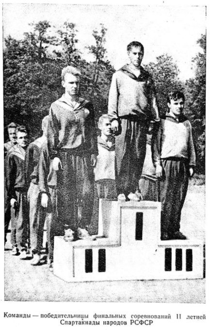
:::

## ОПИСАНИЕ ИГРЫ

Игра продолжается 60 минут, по 30 минут каждая половина, с 10-минутным перерывом между ними.

Площадка, на которой происходит игра, имеет форму прямоугольника, размером 60х35 м.

Длинные линии, ограничивающие площадку, называются боковыми, короткие — лицевыми. На одной стороне за лицевой линией расположен «город», за противоположной лицевой линией — «кон».

В игре принимают участие две команды. В начале игры одна из команд по жребию занимает город и становится бьющей, другая команда (водящая) располагается в поле.

Игроки, находящиеся в городе, по очереди бьют мяч в поле. Чтобы получить право на следующий удар, игрок обязан ‚совершить перебежку в пределах боковых линий площадки от линии города до линии кона и обратно. Начинать перебежку игрок бьющей команды имеет право после удара любого из своих партнеров. Перебежку разрешается делить пополам: после одного удара добежать до кона, после какого-нибудь из последующих вернуться в город.

Однако перебежки разрешается производить только в то время, когда мяч находится «в игре» (об этом термине подробнее будет рассказано в разделе «Правила»).

Игроки водящей команды, находящиеся в поле, стараются перехватить пробитый мяч и нанести им удар (осалить) по игрокам бьющей команды, совершающим перебежку. Для осаливания перебегающего игрока, а также для ловли мяча игроки водящей команды располагаются на площадке с таким расчетом, чтобы иметь возможность контролировать все поле.

Для того чтобы попасть мячом в перебегающего или заставить его переступить боковую линию (что равносильно осаливанию), игрокам водящей команды разрешается передвигаться по полю с пойманным мячом и передавать его в случае необходимости одному из своих партнеров.

Когда игроки водящей команды осалят перебегающего игрока, или поймают в воздухе пробитый мяч, или в городе не останется игрока, имеющего право на удар, то команды меняются положением: водящие игроки становятся бьющими, а бьющие идут в поле водить.

Результат игры определяется по количеству полных перебежек, совершенных игроками команды на протяжении всей игры, причем за каждую полную перебежку игроку засчитывается одно очко.

## ТЕХНИКА ИГРЫ

Для достижения высоких спортивных результатов прежде всего необходимо освоить технику игры. В лапте основными элементами техники являются удар по мячу, ловля и передача мяча, перебежки и осаливание.

Обучение техническим приемам должно производиться в следующей последовательности: общее ознакомление с приемом, разучивание приема в упрощенных условиях, разучивание приема в условиях, близких к игровым, закрепление приема в двусторонней игре.

Одной из главных задач тренера в процессе обучения является образцовый показ, четкое объяснение того или иного элемента и выявление ошибок при выполнении технического приема.

Причем и тренеру и игрокам нужно всегда помнить: чем раньше будут обнаружены ошибки, тем легче и быстрее их можно исправить.

**Удары по мячу**. Умение хорошо пробить мяч есть своего рода искусство. Опытный игрок в лапту всегда может в зависимости от игровой ситуации разнообразить свои удары. Прежде всего следует научиться бить мяч сильно, так, чтобы он летел примерно за пределы основной игровой площадки. Точно и сильно пробитый теннисный мяч свободно летит за 70—80 метров. Такой удар необходим в игре для того, чтобы дать возможность партнерам по команде произвести перебежку. Основное положение для удара следующее: игрок становится боком к площадке, левая нога впереди, правая — сзади, обе ноги слегка согнуты в коленях. Биту следует держать двумя руками, причем хват левой рукой производится почти вплотную к концу рукоятки. Можно держать лапту и одной рукой, но при хвате двумя удар будет значительно сильнее (рис. 1).

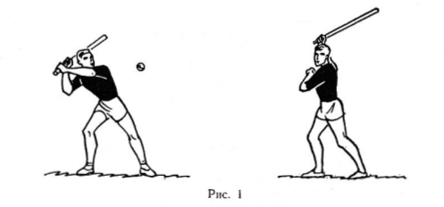

При замахе корпус слегка наклонен вперед — как бы закручивается вправо, а центр тяжести перемещается больше на полусогнутую правую ногу. В конечной фазе замаха руки слегка согнуты, кисти рук находятся примерно на уровне правого уха.

Удар производится резким движением обеих рук, для усиления удара игрок быстро разворачивает корпус и выпрямляет правую ногу. Цент тяжести полностью переносится на левую ногу. В момент касания мяча битой руки прямые. Удобнее всего производить удар по мячу, находящемуся на высоте не более одного метра, и так, чтобы удар по нему приходился концом лапты.

Важное значение имеет правильное движение биты по отношению к мячу. Так, если быть по мячу снизу, то он полетит вверх, «свечкой», если движение биты в момент удара было параллельным земле, то и мяч полетит также параллельно земле.

При любом ударе, даже очень сильном, мяч может быть пойман опытным противником, поэтому следует удары разнообразить — направлять мяч косо, низко на землей, дать «свечу» или «срезку».

Последний прием, хотя и сложен для выполнения, очень затрудняет ловлю мяча, так как благодаря вращению вокруг своей оси мяч летит по кривой. Для того чтобы произвести хороший удар, игрок должен внимательно следить за подкидываемым мячом, быстро и резко выносить биту при участии всего корпуса, бить только по удобно подброшенному мячу — это позволит соразмерить силу удара и придать нужное направление полету мяча. Все эти тонкости техники может освоить каждый игрок в процессе тренировок.

Игрок водящей команды, подбрасывающий мяч, должен все время, пока мяч в его руках, находиться в площади подающего и подавать мяч, как удобно бьющему.

**Ловля мяча**. Если умение искусно пробить мяч в значительной степени определяет успех в игре команды, владеющей городом, то умение ловить летящий мяч, в свою очередь, является одним из главных преимуществ водящей команды.

Команда, все игроки которой хорошо ловят мяч, всегда будет в лучшем положении. Да это и понятно: если полевой игрок поймает пробитый мяч в воздухе, его команда переходит в город. При правильной передаче мяча больше возможности осалит перебегающих игроков, это опять же приводит к смене игровых позиций команд. Многим начинающим игрокам может на первый взгляд показаться, что поймать мяч легко и просто. Однако небольшие размеры мяча и высокая скорость полета требуют от игроков ловкости и мгновенной реакции.

Наиболее верный и простой способ ловли мяча — ловля двумя руками. При ловле двумя руками кисти рук, соприкасаясь только в запястьях, образуют воронку. В момент ловли кисти и пальцы замыкаются вокруг мяча (рис. 2).

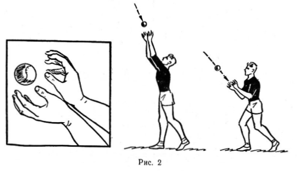

Для того чтобы сильно пробитый мяч не выскочил из рук, их следует слегка согнуть в локтевом суставе. При ловле высоко летящего мяча имеет значение правильный выбор места. Игрок должен стараться занять такое положение, чтобы мяч летел прямо на него. Сильно пробитый мяч лучше ловить на грудь, в этом случае, даже если игрок не сумеет его поймать, он не улетит далеко.

Ловить мяч одной рукой намного труднее. Чтобы поймать мяч одной рукой, нужно ладонь повернуть к мячу, тыльной частью кисти верх. Кисть подводится под мяч снизу или сбоку. Пальцы должны быть раздвинуты, большой палец и мизинец почти соединены так, чтобы обхватить мяч полностью. (рис. 3).

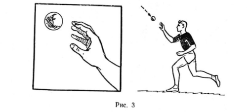

Низко летящий мяч можно принимать тем же способом, но приседая так, чтобы мяч падал с руку сверху, или же не приседая, повернув кисть ладонью вверх (рис. 4).

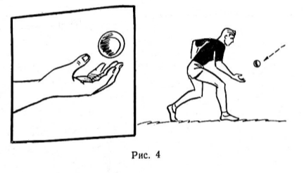

При любом способе ловли мяча кисть должна быть напряжена, так как сильно пробитый мяч может отклонить руку и мяч не будет пойман.

Мы говорили о ловле мяча в воздухе. Однако и игре приходится не только ловить пробитый или переданный партнером мяч, но и перехватывать отскакивающий от земли или катящийся мяч.

Для перехвата мяча важно прежде всего правильно и, главное, быстро выбрать место. Легче всего перехватить мяч тогда, когда он летит прямо на игрока.

Если спортсмен даже не поймает мяча, то он сможет остановить его ногами, рукой или корпусом и, быстро подобрав, передать партнеру или осалить перебегающего игрока (рис. 5).

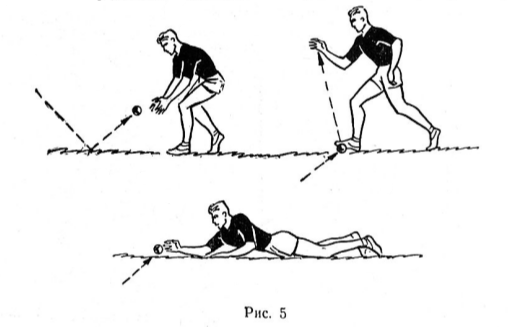

**Броски и передача мяча**, Немаловажное значение для игры в поле имеет умение точно и сильно послать мяч. Это нужно игроку водящей команды для того, чтобы с любого расстояния и из какого угодно положения попасть мячом в перебегающего противника или, если он сомневается, что сможет осалить его, быстро передать мяч партнеру. Казалось бы, что научиться правильно бросать мяч партнеру не сложно, но на самом деле для освоения техники броска требуется много времени и внимания.

Лучше всего бросать мяч согнутой рукой, держа его не в кулаке, а обхватывая пальцами. Замах производят или сбоку или сверху из-за плеча в зависимости от привычки и индивидуальных особенностей игрока (рис. 6).

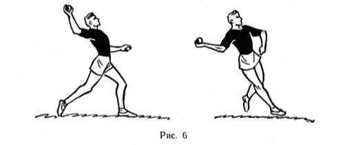

Предпочтение следует, на наш взгляд, отдать втором у способу, так как при нем точность попадания значительно выше.

Сильные броски применяют при осаливании перебегающих игроков или при длинной передаче мяча. Однако в игре нередко приходится передавать мяч близко находящемуся партнеру. В этом случае сильно пробитый мяч трудно поймать, тем более что давать его приходится чаще всего передвигающемуся игроку. Короткие передачи лучше производить за счет движения кости и разгибания предплечья, как это показано на рисунке 7.

Некоторые игроки при коротких передачах бросают мяч снизу прямой или согнутой рукой (рис. 8).

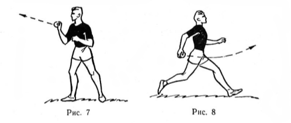

Перебежки. Перебежка в игре в лапту оценивается очком, и в конечном итоге результат игры зависит от количества успешно проведенных перебежек.

Для того чтобы при перебежке не быть осаленным, игрок должен: 
- уметь быстро бегать, так как это позволит закончить перебежку за то время, пока игроки водящей команды пытаются перехватить пробитый мяч;
- обладать скоростной выносливостью, потому что предельная скорость бега должна быть на протяжении всей игры, а за это время игроку предстоит пробежать не менее 2—3 км;
- уметь, не снижая скорости, резко менять направление бега и в случае необходимости мгновенно останавливаться и прыгать, пригибаться и падать (рис. 9, 10);
-  все время следить за мячом, игроками водящей команды и за тем, чтобы не переступить боковую линию и не быть самоосаленным.

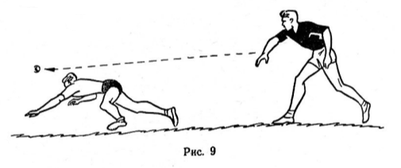
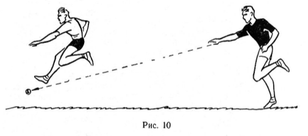

Иногда совершающим перебежку игрокам удается спастись от осаливания, убежав от противника или вовремя развернув корпус (рис. 11).

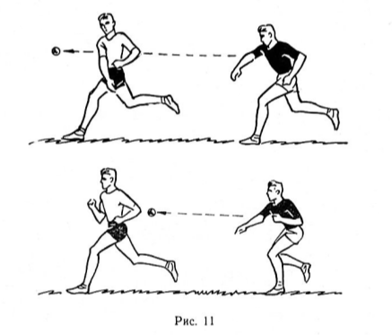

Никаких особенностей в технике бега игроков в лапту нет, поэтому на первом этапе подготовки игрока может быть использовано любое пособие для бегунов на короткие и средние дистанции. В дальнейшем в тренировочные занятия следует больше вводить таких элементов, как ускорения (спурты), спурты с резким изменением направления, спурты с преодолением препятствий (ямы, барьеры, пролезание в кольцо и т. п.), небольшие по расстоянию, но сложные кроссы.

**Осаливание**. Та команда, которая дольше занимает город, то есть бьющая, всегда имеет больше возможностей выиграть. Естественно, водящая команда стремится поменяться с ней ролями. Добиться этого она может только в том случае, если ее игроки хорошо освоили технику игры в поле и в первую очередь осаливание.

Однако игроки даже сильнейших команд республики, таких, как команда Московской, Воронежской, Свердловской областей, слабо владеют техникой осаливания.

Так, в финальных встречах II летней Спартакиады народов РСФСР игроки водящих команд редко бросали мяч с перебегающего противника с расстояния 15-20 метров. Осаливать перебегающего они решались только, находясь от него в 3 -4 метрах, подчас и вплотную.

Подобная тактика совершенно неправильна. Производя осаливание с «верной», самой короткой дистанции, осаливающий игрок невольно ставит себя под удар, то есть под обратное осаливание.

Если перебегают несколько человек, то, пытаясь догнать и осалить одного, он упускает других.

В процессе занятий инструктор и тренер должны больше внимания и времени уделять технике осаливания, чтобы научить занимающихся с разных расстояний и из любого положения попадать мячом как в неподвижные, так и в передвигающиеся мишени.

## ТАКТИКА ИГРЫ

Играть тактически правильно — значит играть продуманно. Необходимо заранее составлять план игры, чтобы рассчитать свои действия с учетом действий противника и правильно распределить силы.

Лапта отличается от других спортивных игр тем, что у играющих команд совершенно разные функции. В футболе, баскетболе, хоккее и других играх обе команды стремятся к одной и той же цели — забить гол в ворота или забросить мяч в кольцо противника. В лапте же борьба команд происходит за один и тот же город, причем команда, занимающая город, старается его удержать, а находящаяся в поле — выбить ее оттуда. Поэтому и тактика этих команд различна.

**Тактика игры бьющей команды**. Основные тактические задачи бьющей команды: как можно дольше сохранять преимущество команды, то есть владеть городом, и стараться набрать за время нахождения команды в городе максимальное количество очков.

В любой команде не все игроки одинаково владеют всеми элементами техники: одни хорошо бьют, другие — бегают. И это должны учитывать тренер и капитан команды, разрабатывая тактический план игры.

Очень важно заранее установить порядок, в котором игроки будут пробивать мяч. Нельзя оставлять на последний удар игрока, не владеющего стабильным ударом: в случае неудачи пропадут усилия всей команды. Так как очередность обязательна только в начале игры, то тренер может распределить удары между игроками так, чтобы в ответственный момент мяч пробивал игрок, умеющий искусно послать мяч в нужном направлении и на определенное расстояние.

Чередование длинных и коротких передач заставит противника часто менять позиции на поле, что, естественно, затруднит не только ловлю мяча, но и осаливание перебегающих игроков.

Рассмотрим несколько примеров использования разнообразных по силе ударов.

На рисунке 12 показана расстановка полевых игроков в начале игры. Если несколько раз подряд мяч будет направлен примерно в одно и то же место (в данном случае в дальний левый угол площадки), это заставит игроков под № 4 и 3 переместиться на помощь игроку № 5, в результате чего правая сторона площадки будет свободной для перебежек.

Возьмем другой вариант: первыми ударами мяч направляется за десятиметровую линию. Для перехвата его полевые игроки подтягиваются вперед и освобождают заднюю половину площадки. Сильно пробив затем мяч, чтобы он попал на заднюю половину площадки, игроки бьющей команды успеют совершить полную перебежку, пока противник будет ловить мяч (рис. 13).

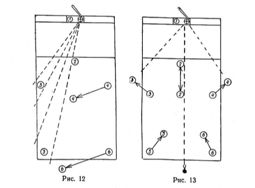

В игре может быть применен и обратный вариант — сильными ударами оттянуть полевых игроков за линию кона, после чего подать мяч на пустое место близ штрафной площадки.

Пойманный с воздуха мяч ставит  в невыгодное положение команду, владеющую гордом, поэтому игроки избегают пробивать свечу. Это неправильно. Свечу тоже можно использовать в тактических целях, как и далеко пробитый мяч. Высокая свеча дает достаточно времени, чтобы безопасно произвести перебежку в один конец. Удар свечой становится даже необходимым, если на линии кона находятся несколько игроков, несущих очки. Почти безопасно для бьющей команды подавать свечу, когда противнику приходится ловить мяч против солнца. В игре следует также применять «резаные» и низкие подачи, в результате которых мяч, отскакивая от земли, уходит далеко за пределы площадки.

Важно так пробить мяч, чтобы удар могли использовать игроки для перебежки. В тактике игры бьющей команды перебежки имеют большое значение. Как же производить перебежки, Прежде всего игрок должен усвоить:
1. При перебежке в одиночку нельзя рисковать зря. Риск может быть оправдан только в том случае, если это необходимо в интересах команды;
2. Начав перебежку, надо внимательно следить за тем, чтобы не попасть на боковые линии, ограничивающие площадку;
3. Нельзя останавливаться:
- а) при ловле свечи противником — не каждый мяч может быть пойман;
- б) если полевой игрок пытается осалить твоего партнера — противник может промахнуться. Однако надо помнить и о страховке;
- в) если пытаются осалить тебя — в бегущего попасть значительно труднее;
4. Начиная перебежку из кона, предварительно следует выбрать место, откуда бежать (правилами. разрешается бежать с любого места за линией кона), потому что чем дальше игрок находится от мяча, тем легче ему закончить перебежку;
5. Будучи осаленным или самоосаленным, надо стараться, _ поймать или перехватить мяч для контросаливания. Малейшее промедление в эту минуту — и город у противника.
Игра ведущих команд РСФСР показала, что начинать перебежку из города выгоднее после короткого или косо полета мяча, когда он уходит в сторону. Перебегать из кона лучше после того, когда мяч пробит далеко. При таких перебежках меньше опасность быть осаленным, так как полевым игрокам приходится бросать мяч в перебегающего, находясь позади него, а попасть, в игрока в этом случае намного труднее, чем когда он бежит навстречу.

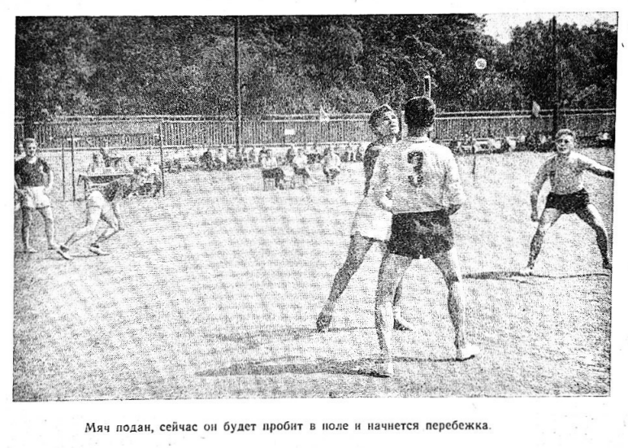

Совершив полную перебежку, то есть добежав до кона и вернувшись обратно в город, игрок получает очко. Очко начисляется и за перебежку в два приема, когда игрок после одного удара добежит до кона и после другого возвратиться в город.

В любой команде не все игроки хорошо бьют, в результате чего в городе или за линией кона собираются несколько игроков, готовых к перебежке. В определенный момент они часто начинают бег все сразу. Одновременная перебежка нескольких игроков получила название групповой перебежки.

Групповая перебежка стала в последнее время одним из основных комбинационных приемом игры бьющей команды. Если она производится при правильно выбранном и хорошо выполненном ударе, то может быть весьма эффективной. При групповой перебежке команда, владеющая городом, рискует потерять свое преимущество, но она идет на это, чтобы набрать максимальное количество очков. В финальных встречах II Спартакиады народов РСФСР спортсмены Воронежской и Московской областей широко использовали групповые перебежки, стоя в основном на них тактику игры.

Тактика групповых перебежек проста: вначале переводят несколько игроков за линию кона, в городе собираются еще несколько человек, имеющих право на перебежку. При удачно пробитом мяче игроки бегут сразу и из города и с линии кона во всех направлениях. Перебегающие стараются отвлечь внимание противника от партнеров, несущих очко, и дать возможность в первую очередь им закончить перебежку.

Приведем для примера один из вариантов групповой перебежки: после удара игрока №2 сразу начинает перебежку игрок №6. В это же время три игрока (под №3б 4б и 5) выходят из-за кона, чтобы закончить перебежку, и, разбегаясь веером, направляются в сторону города. Как только водящие передадут мяч для осаливания игрока №6, тот резко меняет направление; в ту же сторону устремляются и игроки №3 и 4. Естественно, полевые игроки будут передавать мяч в ту сторону, где больше игроков противника, тем самым они дадут возможность игроку №6 беспрепятственно закончить перебежку и принести очко своей команде (рис. 14).

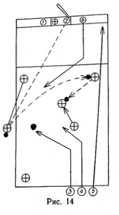

Этот вариант может быть усложнен выходом в поле игрока № 2, который своими действиями облегчит перебежку игрокам №3 и 4. Если даже кого-то из игроков осалят, то полученные командой 2—3 очка стоят потери преимущества. Можно перечислить много вариантов групповых перебежек, но важно знать основные принципы их организации:

1. Команда, занимающая город, старается отвлечь как можно больше полевых игроков для осаливания начинающих перебежку членов команды, чтобы беспрепятственно могли произвести перебежку игроки, несущие очко.

2. Удар обязаны принимал на себя в первую очередь игроки, совершающие перебежку из города в кон или возвращающиеся из кона в город и не несущие очко, а только с правом на удар.

3. Любой из перебегающих игроков, если он стал объектом осаливания, должен как можно дольше уклоняться от осаливающих, чтобы партнеры успели закончить перебежку.

4. Когда станет очевидным, что могут осалить одного из перебегающих, его обязан подстраховать кто-либо из партнеров, чтобы иметь возможность произвести обратное осаливание.

Групповые перебежки требуют от спортсменов коллективных действий, умения быстро ориентироваться и хорошо видеть все поле.

Чтобы групповые перебежки проходили слаженно и были неожиданными для противника, у каждой команды должно быть несколько вариантов их проведения.

Одна из задач бьющей команды — сохранить право на владение городом, которое она использует для того, чтобы набрать больше очков. Но иногда команда стремится удержать город, не заботясь об увеличении очков. Так, например, команда‚ встречаясь с сильным противником, сумела получить преимущество после нескольких удачных комбинаций. Чтобы сохранить его, она переходит на более спокойную игру. В этом случае игра строится в основном на хорошо пробитых мячах, не применяют почти групповых перебежек и индивидуальные производят только тогда, когда не сомневаются в успешном их завершении.

Несмотря на то что этот вариант тактики игры применяют на соревнованиях, при подготовке команд лучше отдавать предпочтение активным действиям, ориентируя спортсменов на выигрыш с максимальным счетом.

Разрабатывая ту или иную систему тактики игры бьющей команды, тренер должен в каждом отдельном случае поставить определенные задачи перед спортсменами, заранее оговорить, какой удар выгоднее применить при том или другом расположении игроков в городе и за линией кона, какие перебежки производить чаще — индивидуальные или групповые, как играть при выигрыше или преимуществе противника. Каждую тактическую систему следует отработать на тренировочных занятиях, проверить в контрольных играх и только после этого применять, смотря по обстановке, в официальных встречах.

**Тактика игры водящей команды**. Главная задача команды, находящейся в поле, - в кратчайший срок овладеть городом.

Водящая команда получает право на переход в город после того, как поймает свечу, осалить одного из игроков противника или заставит перебегающего игрока пойти на самоосаливание.

Овладение городом в первую очередь будет зависеть от правильной расстановки игроков на поле. Порядок размещения на может быть постоянным, он будет меняться в зависимости от тактики игры противника.

В начале встречи, когда еще не известна манера игры противника, какие удары он чаще всего использует, следует применять расстановку игроков, показанную на рисунке 15. Игрок №1, находящийся на подаче, будет контролировать часть штрафной площадки, игроки №2 и 3 — перехватывать мяч, направленный за боковые линии, №4 — страховать середину площадки, №5 и 6 — всю заднюю часть площадки, включая продолжение коридора за линией кона.

Если игроки бьющей команды производят длинные подачи, то расположение водящих игроков должно быть иным. Игроки №5 и 6, или один из них, отходят за линию кона. Соответственно отодвигаются назад. Игроки № 2, 3 и 4, причем игроки № 2 и 3 могут находиться не только на площадке, но и за боковыми линиями, откуда легче перехватывать косые подачи (рис. 16).

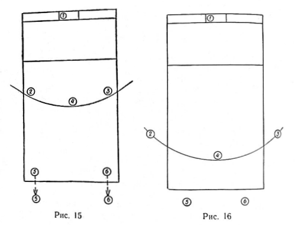

При такой расстановке увеличивается нагрузка на игрока № 4, так как сфера его действий значительно больше, чем в примере, рассмотренном выше. Если он плохо справляется со своей задачей, может быть применен вариант расстановки 2-2-1 (рис. 17).

При всех вариантах расположения игроков, рассчитанных на перехват далеко пробитых мячей, на задней линии должен находиться игрок, хорошо владеющий техникой ловли, потому что при свече чаще всего мяч летит в конец площадки или за линию кона.

Для перехвата мяча при серии коротких подач полевым игрокам целесообразнее располагаться веером (рис. 18).

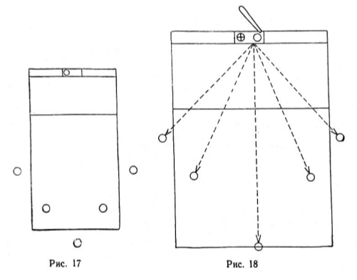

Учитывая, что вслед за короткой подачей может последовать длинная, один из игроков всегда должен оставаться сзади для контроля конца коридора.

Схемы расположения игроков приведены для примера. В игре могут применяться различные варианты. Но следует помнить, что нельзя укреплять одни участки площадки за счет ослабления других. При любом принятом варианте контролировать нужно все поле игры.

Находиться вне пределов площадки игроку необходимо только в момент произведения удара. Как только мяч пробит и началась перебежка, игроки должны сосредоточиться на площадке, так как в любой момент может понадобиться их помощь для осаливания перебегающего.

Чтобы правильно и быстро выбрать место для перехвата мяча, полевые игроки должны внимательно наблюдать за его подачей и игроками противника, быстро реагировать  на их действия.

Самый сложный момент в игре водящей команды — осаливание совершающих перебежку игроков противника. Чтобы осаливание было успешным, полевой игрок должен:

1. Перехватив или поймав мяч, мгновенно оценить обстановку: если он находится близко от перебегающего, салить самому, если к нему ближе его партнер, передать ему мяч.

2. Осаливание производить по возможности двигаясь навстречу противнику.

3. Стараться осалить игроков противника в самом начале перебежки (около линии кона или города), чтобы лишить возможности закончить перебежку других перебегающих.

4. При групповой перебежке, начав преследование одного из игроков, стараться осалить именно его. Изменение объекта осаливания рассеивает внимание полевых игроков, в результате чего может получиться, что они не сумеют осалить никого из перебегающих игроков. Меняют цель только в крайних случаях.

5. При перебежках в ту или другую сторону салить в первую очередь игроков, несущих очки.

6. Не владея мячом, подстраховывать салящего — занимать наиболее выгодное место по отношению к перебегающему на случай, если партнер передаст ему мяч. В игру всегда должен включаться подающий.

7. Преследуя перебегающего, теснить его к одной из боковых линий.

8. Меньше пользоваться длинными передачами, особенно в сторону кона, так как противник, перебегающий оттуда, может нести очко, а длинная передача только поможет закончить перебежку.

9. Если игрок противника перебегает один, а за линией кона или в городе есть еще игроки, готовые к перебежке, салить его только наверняка. Промах в этом случае принесет несколько очков противнику.

10. После осаливания одного из игроков противника, занимая места за линией кона или города, стремиться перебежать в город, чтобы иметь там несколько игроков с правом на удар.

Тактические знания и навыки спортсмен получает в основном в процессе тренировочных занятий. В тренировки включают специальные упражнения для освоения того или иного тактического приема, который затем совершенствуется в учебно-тренировочных играх. В учебно-тренировочных играх с определенным заданием отрабатываются тактические приёмы, системы и комбинации группы игроков и всей команды.

Составленный тактический план игры лучше всего вначале разбирать на доске или на макете и только после того, как он детально изучен членами секции или команды, переходить к отработке его на тренировочных занятиях.

Перед началом соревнований полезно провести несколько контрольных встреч с командами других коллективов, применяя системы и комбинации, разученные в тренировочных играх. Вначале целесообразно проводить встречи со слабыми противниками, закрепляя затем успех в играх с равноценным и более сильным противником.

 ## ОРГАНИЗАЦИЯ УЧЕБНО-ТРЕНИРОВОЧНЫХ ЗАНЯТИЙ

 Команду по лапте можно организовать на любом предприятии, в учреждении, учебном заведении, совхозе, колхозе или РТС. Чтобы привлечь интерес к этой старинной русской игре, инструктор-общественник должен широко ее пропагандировать на общих собраниях молодежи, в выступлениях по радио, в стенной газете и т. п. Если есть возможность, следует устроить показательную игру.

Когда наберется достаточное количество желающих играть в лапту, проводят организационное собрание, на котором распределяют участников по группам, выбирают старост и назначают дни и часы занятий.

Если желающих заниматься лаптой окажется много и будет укомплектовано несколько команд, то при совете коллектива физической культуры нужно организовать секцию лапты. Для руководства секцией на общем собрании открытым голосованием избирается бюро секции (3—5 человек), на которое возлагается ответственность за организационно-массовую работу. Председатель и секретарь секции выбираются из состава бюро.

Главная задача секции лапты любого коллектива физической культуры заключается в правильной организации повседневной, учебно-тренировочной и спортивной работы.

Для достижения высокого мастерства в игре в лапту необходимо настойчиво и систематически тренироваться, быть хорошо подготовленным физически, чаще принимать участие в соревнованиях. Игрок, прекративший тренировки в зимнее время, быстро забывает приобретенные летом навыки.

Проводить учебно-тренировочные занятия по лапте следует круглогодично.

Круглогодичная тренировка делится на три периода: подготовительный, основной и переходный. Для средней полосы России рекомендуются следующие сроки, задачи и содержание периодов:

### Подготовительный период (январь — май)

Задачи периода. Общая физическая подготовка игроков на основе норм комплекса ГТО. Изучение и совершенствование приемов техники и тактики игры, достижение согласованности в игре между игроками и отдельными группами.

В подготовительном периоде рекомендуется проводить двух-сторонние игры на снежном поле.

Средствами подготовки в этом периоде, помимо специальных упражнений для овладения техникой и тактикой игры в лапту, являются баскетбол, гимнастики, акробатика, хоккей, лыжный и конькобежный спорт, легкая атлетика.

### Основной период (май — ноябрь)

Дальнейшая всесторонняя физическая подготовка, совершенствование в технике и тактике, приобретение и сохранение занимающимися лучшей спортивной. формы, достижение высоких результатов на состязаниях.

В основном периоде главное внимание обращается на подготовку и участие в товарищеских и календарных играх, использование средств общей и специальной физической подготовки.

### Переходный период (ноябрь — январь)

Снижение тренировочных нагрузок, поддержание достигнутого уровня физической подготовленности спортсменов и переключение их на другие виды спорта. Однако нагрузка к концу переходного периода должна быть несколько увеличена.

* * * 

Тренировочные занятия по лапте в любой период должны быть хорошо продуманы и организованы. Планированию учебно-тренировочных занятий помогут приведенный в книге примерный учебный план и график распределения учебных часов.

Основной формой проведения учебных занятий является урок, который строится по заранее намеченному плану. Инструктор составляет тот или иной план занятий в зависимости от того, какие задачи он ставит перед занимающимися на данном занятии.

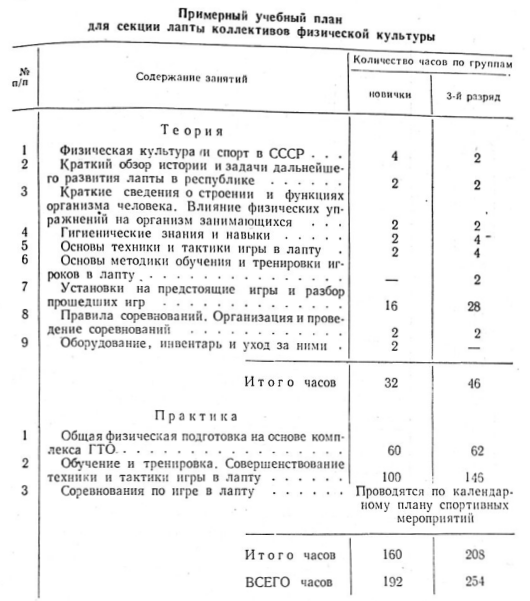

При составлении плана необходимо предусматривать несколько вариантов урока, потому что иногда в процессе тренировки приходится менять план занятий, например, из-за усталости спортсменов, тяжелого перенесения предыдущей нагрузки и т. д. Если это не будет учитывать тренер, то он никогда не добьется высоких результатов и может нанести вред здоровью воспитанников.

На занятиях секции нужно постоянно иметь в виду задачи воспитания моральных и волевых качеств у спортсменов. Обучая тому или иному техническому приему, требуя выполнения какого-либо упражнения, инструктор должен находить способы воспитывать у занимающихся решительность, смелость, чувство товарищества, коллективизм и в то же время пресекать поступки, противоречащие этике советского спорта.

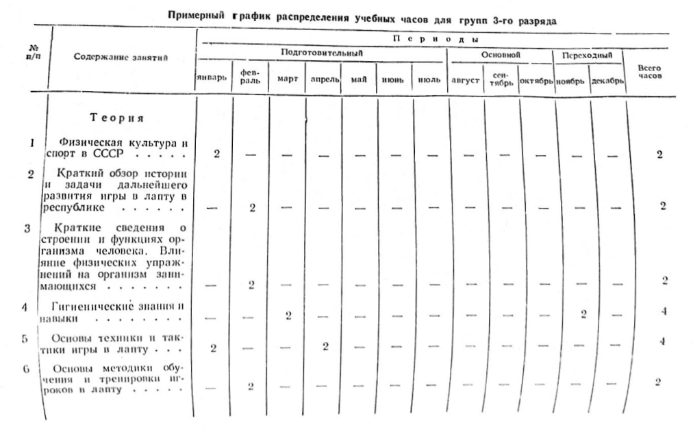

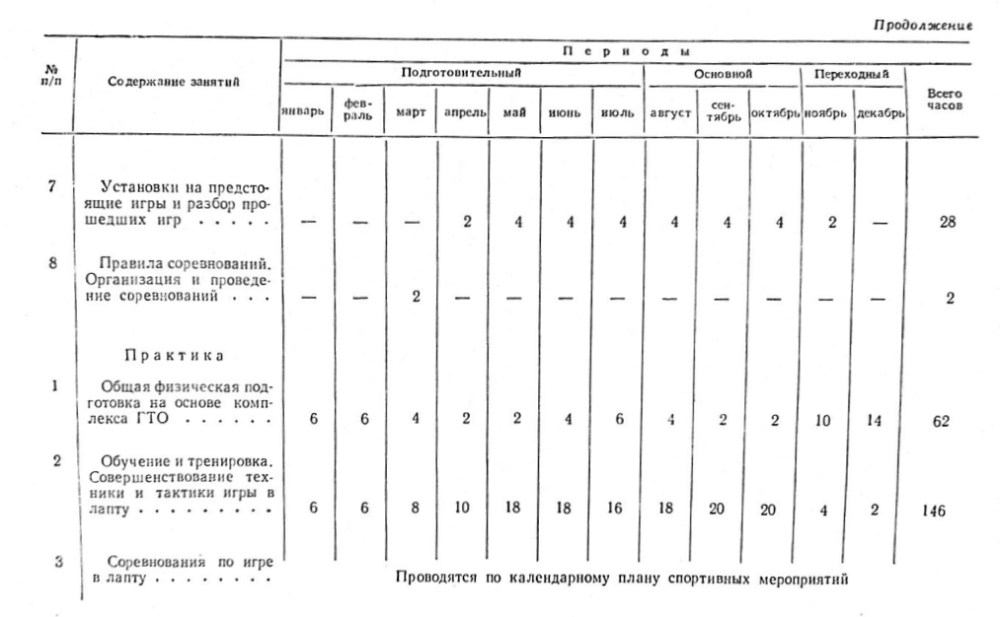

Как правило, урок состоит из четырех частей:
1. Вводная — 5 — 10 минут.
2. Подготовительная — 20 — 30 минут.
3. Основная — 60 — 70 минут.
4. Заключительная — 5 — 10 минут.

Вводная часть — подготовка занимающихся к предстоящей тренировке.

Средства: строевые упражнения, различные виды ходьбы с дополнительными движениями, медленных бег, упражнения на внимание.

Подготовительная часть — подготовка занимающихся к выполнению задания основной части урока.

Средства: общеразвивающие упражнения на снарядах и без снарядов, вольные упражнения, ходьба, бег, прыжки, метания, упражнения из комплекса ГТО, специальные подготовительные упражнения. Все эти упражнения должны быть подобраны так, чтобы при их выполнении нагрузка распределялась на все основные группы мышц.

Основная часть — обучение техническим и тактическим приемам, развитие физических и волевых качеств.

Средства: специальные упражнения, способствующие более совершенному овладению приемами техники и тактики, подготовительные учебные командные игры.

Заключительная часть — постепенное приведение организма занимающихся в относительно спокойное состояние, подведение итогов занятий.

Средства: медленный бег, спокойная ходьба, строевые упражнения на расслабление.

При проведении занятий инструктор должен:
1. Ясно знать цель занятий, материал урока и последовательность упражнений (на память), уметь провести занятия методически правильно и интересно.
2. Добиваться эффективности занятий, уметь связывать материал данного урока с пройденным.
3. Владеть четкой речью и техникой показа.
4. Правильно выбрать место по отношению к занимающимся.
5. Уметь поддерживать дисциплину.

Зная состав занимающихся, инструктор определяет, что и в каком объеме нужно изучать, сколько времени потребуется на овладение отдельными элементами техники, какие результаты можно ожидать от воспитанников.

Люди обладают различной работоспособностью, поэтому нагрузку надо строго дозировать, чтобы не переутомлять занимающихся. Причиной перетренированности чаще всего бывает несоблюдение основных принципов тренировки — многократное повторение и постепенное увеличение объема и интенсивности нагрузки — и отсутствие врачебного контроля.

Регулировать нагрузку можно путем изменения длительности и плотности занятий, правильного чередования упражнений, различных по своему характеру, подбора их по степени трудности, а также уменьшения или увеличения числа повторений и темпа движений.

Наибольший эффект от тренировочных занятий будет достигнут в том случае, если занимающийся сознательно подходит к выполнению заданий. Ученик должен знать назначение каждого упражнения, творчески овладевать предлагаемой техникой того или иного приема. Высокие спортивные результаты — следствие упорного труда, неустанного. стремления к вершинам спортивного мастерства.

На занятиях инструктор должен больше внимания уделять воспитанию воли у игроков. Развитию волевых качеств способствуют соревнования, так как они требуют напряжения сил в течение длительного времени. Поэтому их надо так же планировать, как планируют физические упражнения. В свою очередь успех на состязаниях зависит от уровня волевой подготовленности игроков, которые должны уметь преодолевать трудности, оставаясь выдержанными и корректными по отношению к противнику, независимо от характера и исхода спортивной борьбы.

## ПРАКТИЧЕСКИЙ МАТЕРИАЛ ДЛЯ ПРОВЕДЕНИЯ ЗАНЯТИЙ

Всесторонняя физическая подготовка игрока в лапту является основой для достижения им высоких спортивных результатов.

Всесторонне развитый спортсмен располагает значительно большим количеством двигательных навыков, что имеет решающее значение в овладении техникой и тактикой игры.

В каждое тренировочное занятие нужно включать общеразвивающие упражнения.

Эти упражнения выполняются на месте и в движении, без предметов и с предметами, на различных снарядах, индивидуально и с партнером. Их содержание, направленность, объем и дозировка зависят от уровня физического развития занимающихся, периода учебно-тренировочных занятий, предстоящих спортивных соревнований и т. д.

Ниже приводится ряд упражнений, способствующих развитию качеств, необходимых игроку. в лапту. Инструкторы могут использовать их как канву в своей работе, значительно расширив этот перечень как за счет подбора аналогичных упражнений, так и за счет использования различных гимнастических, легкоатлетических и других снарядов.

**Упражнения для развития силы**

1. Быстрое отжимание на руках от пола (ноги на уровне опоры, выше уровня, отжимание в стойке на кистях).
2. Из упора лежа резкое отталкивание от пола с хлопком руками перед собой.
3. Упражнение с партнером — ходьба и прыжки на руках (ноги поддерживает партнер).
4. Ноги на ширине плеч, наклоны туловища вперед, влево, вправо, назад.
5. Сидя на полу, ноги в стороны, наклоны туловища вперед влево, вправо, назад.
6. Лежа на животе, прогнуться.
7. Из положения лежа на спине подняться до положения сидя без помощи рук.
8. Скрестное движение ногами, сидя на полу.
9. Из положения лежа, руки в стороны, медленно поднимать прямые ноги и касаться ими поочередно правой и левой руки.
10. Из упора присев — в упор лежа. Прыжком вернуться в упор присев.
11. Толкание одной и двумя руками штанги весом 25—40 кг или гири, вырывание штанги одной и двумя руками.
12. Толкание мешка с песком (10 — 15 кг).
13. Ноги на ширине плеч, наклоны туловища, держа на плечах мешок в песком.
14. Метание мяча весом 1 — 1,5 кг.
15. Бег с высоким подниманием бедер.
16. Лазание по канату и шесту.
17. Упражнения на гимнастических снарядах — перекладине, кольцах и коне с ручками.

**Упражнения для развития гибкости**

1. Ноги на ширине плеч; не сгибая ног, коснуться руками земли.
2. Из положения приседа сделать «ласточку» на правой и левой ноге.
3. Сидя на полу, ноги в стороны, наклоны корпуса к правой и левой ноге, до касания их головой.
4. Сидя на полу, с помощью партнера достать руками носки ног.
5. Стоя на коленях, прогнуться назад до касания головой пола.
6. Гимнастический «мост» назад.
7. То же через стойку на кистях с помощью партнера. 
8. Доставание ногой высоко подвешенного предмета.
9. Гимнастический «шпагат».
10. Ноги врозь, руки сцеплены над головой, вращение туловища с глубокими наклонами и прогибом назад.
11. Стоя, руки вперед на ширине плеч, резкое поднимание выпрямленной ноги до касания носком ладоней.

**Упражнения для развития ловкости**

Подбирая упражнения для. развития ловкости, инструктору лучше всего использовать упражнения из акробатики — простые и сложные прыжки, кувырки, перевороты, кульбиты, фляки, сальто, стойки и т. п.

Игрокам, спасаясь от осаливания, часто приходится падать, поэтому в тренировки следует включить упражнения по самостраховке при падении. Здесь можно применять упражнения, включенные в тренировку борцов-вольников, вратарей и слаломистов.

**Упражнения для развития прыгучести**

1. Прыжки на одной и обеих ногах.
2. Прыжки с ноги на ногу.
3. Прыжки на месте с доставанием ногами вытянутых вперед рук.
4. Прыжки с попеременным скрещиванием ног.
5. Прыжки в высоту через естественные препятствия.
6. Прыжки в высоту с места и с разбегу толчком двумя ногами.
7. Прыжки в длину с места и с разбегу толчком одной и двумя ногами, согнувшись и прогнувшись.
8. Тройные прыжки.
9. Прыжки с поворотом на 180 и 360 градусов толчком одной и двумя ногами.
10. Опорные прыжки, чехарда.
11. Прыжки по лестнице на одной и двух ногах.
12. Прыжки со скакалкой.

Упражнения, которые мы здесь привели, и аналогичные им, как правило, используются в подготовительной части урока и подбираются в строгом соответствии с той задачей, которую ставит перед собой тренер в основной части урока. Более тщательно инструктор должен отбирать упражнения для освоения элементов техники и тактики игры.

Простейшие тактические системы игры приводились в разделе «Тактика», поэтому здесь мы ограничимся примерным перечнем упражнений, необходимых при разучивании элементов техники.

**Удары по мячу (в последовательности обучения)**

1. Имитация ударов по мячу. Удар вдаль плоской лаптой по хорошо подброшенному мячу.
2. Отработка удара плоской лаптой на заданное расстояние — 10, 20, 30, 40, 50 и т. д. метров. 3. Удар плоской лаптой свечой.
4. Отработка ударов плоской лаптой, пробивая мяч в намеченные квадраты игрового поля.
5. Резаный удар плоской лаптой (держа лапту в момент удара под углом ).
6. Удар вдаль обычной лаптой по мячу, подброшенному на среднюю высоту.
7. Удар по мячу на заданное расстояние.
8. Удар свечой (под углом 45°).
9. Удар по высоко подброшенному мячу.
10. Удар по низко подброшенному мячу.
11. Резаный удар по мячу.
12. Удары по мячу, пробиваемому в заданные квадраты игрового поля.
13. Различные удары лаптой по заданию инструктора.
*Примечание. Все удары разучиваются при обязательной подаче мяча партнером.*

**Броски, ловля мяча, осаливание**

1. Бросок мяча рукой сбоку.
2. Бросок мяча из-за спины.
3. То же на дальность и точность.
4. Броски мяча на силу и точность в намеченные квадраты поля.
5. Ловля двумя руками высоко летящего мяча.
6. То же прямо летящего мяча.
7. То же низко летящего мяча.
8. Ловля мяча, летящего на разных уровнях, правой рукой.
9. То же левой рукой.
10. Подбор катящегося мяча.
11. Ловля одной и двумя руками отскакивающего от стены мяча.
12. То же с броском мяча в намеченную на стене цель.
13. Броски и ловля мяча в группах по два-три человека.
14. То же в движении.
15. То же со сменой места, в различной скоростью движения.
16. То же с броском мяча в прыжке, в поворотом.
17. То же двумя мячами 
18. Эстафеты простые, встречные, с преодолением препятствий и передачей мяча.
19. Броски на точность по неподвижной мишени.
20. Броски в движении, с прыжка, с поворота по передвигающейся мишени.
21. Броски в движении по передвигающейся мишени — сбоку мишени, догоняя мишень, навстречу мишени.
22. Броски по мишени с передачи из разных положений — спереди, сзади, сбоку.
23. Передача мяча в движении по кругу с поражением по свистку находящейся в середине круга мишени.

## ОРГАНИЗАЦИЯ СОРЕВНОВАНИЙ

Организация и проведение соревнований должны занимать большое место в работе секций коллектива физической культуры.

Соревнования способствуют росту. спортивного мастерства физкультурников и являются одним из важнейших средств агитации и пропаганды любого вида спорта.

К соревнованиям следует тщательно готовиться: разработать четкое и ясное положение о данном соревновании, своевременно позаботиться о приведении в порядок и художественном оформлении мест соревнований, приобретении необходимого инвентаря, оборудования, медицинском обслуживании, подготовить судей.

Особое внимание следует уделить рекламированию соревнований среди населения.

Главным документом для организации соревнования, участвующих в нем команд и физкультурников является положение. Очень важно, чтобы положение было заранее подготовлено и доведено до сведения всех участников соревнований.

Своевременно ознакомившись с положением, участники будут знать, как им готовиться к предстоящим встречам, чтобы добиться хороших результатов в спортивной борьбе.

Положение о соревнованиях по лапте должно предусматривать:

1. Какой организацией проводится соревнование.
2. Какие организации допускаются к участию и какие установлены ограничения для участников.
3. Проводятся ли соревнования по одной группе команд или по нескольким группам и по каким признакам команды относятся к той или иной группе.
4. Допускается ли участие нескольких команд от одной и той же организации.
5. По какой системе будет разыграно соревнование.
6. Как будут начисляться очки за каждую командную встречу (выигранную, проигранную или несостоявшуюся) для определения команды победительницы всего соревнования, если оно проводится по круговой системе. Как будут определяться результат в случае равного количества очков у двух или нескольких команд.
7. Какие санкции предусматриваются в случае нарушений положения о соревновании (возраст, форма и т. д.)
8. Какой судейской коллегии поручено проведение соревнований.
9. Каким требованиям должна удовлетворять заявка, как она должна быть заверена, когда, куда и кому подана, допускаются ли дополнительные заявки и перезаявки.

Обычно любое положение пишется по следующей схеме:
I. Цели и задачи соревнования.
II. Место и сроки проведения.
III. Руководство проведением соревнования.
IV. Программа соревнования.
V. Условия определения командного первенства.
VI. Награждение победителей.
VII. Особые условия, предъявляемые к участникам соревнований (требования к инвентарю и одежде участников).
VIII. Условия приема коллективов и участников (для междугородних или межрайонных соревнований).
IX. Сроки представления предварительных и именных заявок на участие. Время и место проведения жеребьевки.

Чтобы интересно провести соревнование. по лапте и выявить действительно сильнейших спортсменов и команды, организаторы должны хорошо знать основные способы проведения первенств по командным видам спорта и умело применять их в условиях своего коллектива. 

В практике проведения командных соревнований применяются две системы розыгрыша: круговая и с выбыванием.

**Круговая система**. При круговой системе каждая команда играет по очереди со всеми остальными.

Победительницей считается команда, выигравшая наибольшее количество встреч. Одновременно по количеству выигранных встреч выявляются и последующие места, занятые командами — участницами соревнований. 

Планируя проведение соревнований по круговой системе, надо правильно рассчитать, сколько потребуется для этого дней, полей и судей. Для определения количества встреч существует простая, легко запоминающаяся формула

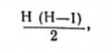

где «Н» количество команд, участвующих в данном первенстве.

Так, при 8 командах между ними нужно провести 28 встреч.

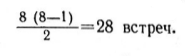

Если каждая команда в игровой день проведет одну встречу, а она может сыграть не более двух раз, то для окончания игр первенства нужно 7 игровых дней, в каждый из которых будет проходить один тур, то есть четыре встречи.

Очередность встреч определяется по специальным, приведенным ниже, таблицам. Команды в результате жеребьевки получают соответствующий номер, начиная с первого и кончая последним по числу участвующих в соревновании команд. По таблице определяется, какие номера встречаются друг с другом в каждый день соревнования. Команда, номер которой указан первым, играет на своем поле. Если количество участвующих команд нечетное, то команда, номер которой указан в паре с номером в скобках, в данный день свободна.

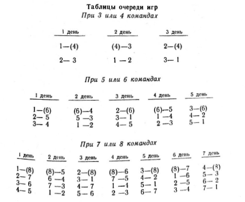

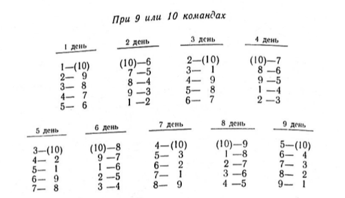

Для определения места команды пользуются таблицей результатов, применяемой при проведении всех командных игр.

Если за выигрыш дается одно очко, а за проигрыш ноль очков, она будет выглядеть следующим. образом (количество очков за каждую встречу определяется, как уже говорилось, положением).

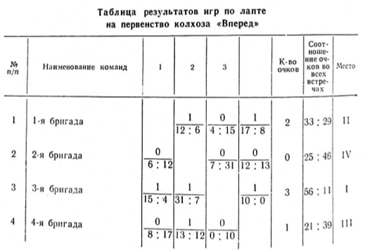

**Система с выбывание**. При системе с выбыванием каждая команда выбывает после первого проигрыша.

Расписание игр и таблицы соревнований составляют следующим образом: проводится жеребьевка, на основании которой все команды получают соответствующий номер и вписываются в таблицу сверху вниз одна под другой в порядке, определенной жребием. Если число команд четное, то в игру вступают все участвующие команды. Встречи этого списка называются первым кругом. Победители этих встреч попадают во второй круг и т. д. Круг, в котором встречаются 8 команд, называется четвертьфинальным, 4 команды — полуфинальным и, наконец, круг, где встречаются две команды — финальным.

Команда, выигравшая встречу в финальном круге, является победительницей данного соревнования (см. таблицу 1).

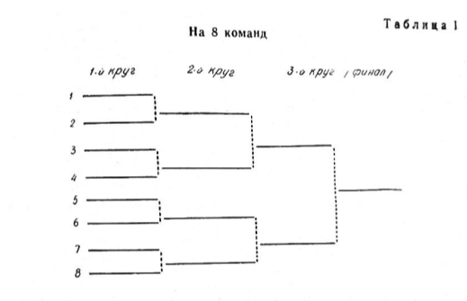

Если число команд нечетное, то часть команд, в зависимости от полученных ими при жеребьевке номеров, вступает в игру со второго круга.

Число команд, играющих в первом круге, определяется по формуле (П-2х) × 2, где П — число команд, участвующих в соревнованиях, х — степень, дающая число, максимально приближенное к П.

*__Пример__: в соревнованиях участвуют 11 команд. В первый день встречаются (11 - 23) × 2=6 команд (см. таблицу 2).*

Выделение команд, начинающих играть со второго круга, производится следующим образом: составляется таблица на общее число участвующих команд, а для команд, вступающих в игру со второго круга, отводятся крайние верхние и нижние номера.

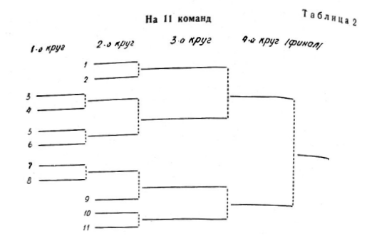

Если число участвующих команд четное, то все команды, вступающие в игру со второго круга, так же как и играющие в первом круге, распределяются поровну между верхней и нижней половинами таблицы. Если же число участвующих команд нечетное, то число команд, вступающих в игру со второго круга, на единицу больше в нижней половине таблицы, а пар, играющих в первом круге, наоборот, на единицу больше в верхней половине таблицы.

Соревнования по лапте лучше всего проводить на футбольном поле, в размеры которого хорошо вписывается площадка для игры.

Если нет футбольного поля, то можно использовать любую ровную площадку с размерами примерно 100 х 50 м, которую во избежание травм нужно очистить от посторонних предметов — камней, щебня и т. п. — и очертить ясно видимыми линиями.

Для проведения игры необходим следующий инвентарь:
1. 6 флагов 50х50 для ограждения площадки и флаг для судьи на линии,
2. Часы для секретаря (лучше шахматные) и часы или секундомер для судьи на поле,
3. Стол и стул для секретаря,
4. Скамейки для запасных игроков и тренеров,
5. Доска показателей с наименованием играющих команд (типа футбольной) и микрофон,
6. Несколько теннисных мячей,
7. 3—4 биты для неимеющих их или на случай поломки,
8. Протоколы игр,
9. Судейские свистки.

На всех официальных соревнованиях должен присутствовать кто-либо из медицинских работников: врач, медсестра или фельдшер, которые вводятся в состав судейских коллегий на правах заместителя главного судьи. 

Главный или старший судья не имеет права начинать соревнования, пока не убедится в том, что медицинский персонал на месте и имеет минимум необходимых медикаментов для оказания первой помощи.

Все участники, судьи и представители команд должны заранее знать места расположения медицинских пунктов.

Судьи и врачи имеют право для оказания помощи пострадавшим привлекать во время соревнований любого оказавшегося поблизости участника.

Врач имеет право снять спортсмена с соревнований, если участие в них может отразиться на его здоровье, несмотря на то, что он имеет предварительное разрешение.

Для оказания помощи пострадавшему спортсмену судья обязан по требованию врача приостановить игру. Если повреждение легкое и достаточно помощи, оказанной на месте, то участник с разрешения врача из игры может не выходить.

Если повреждение не позволяет продолжать игру, участника с соревнований снимают и заменяют запасным игроком.

## ИНВЕНТАРЬ ДЛЯ ИГР И ТРЕНИРОВОК

Для игры в лапту требуются биты и мячи.

Все официальные соревнования должны проводиться теннисным стандартным мячом. В товарищеских матчах и тренировочных занятиях можно пользоваться резиновыми полыми и даже литыми мячами, а в отдельных случаях самодельными войлочными, обшитыми кожей. 

Биты представляют собой цельнодеревянную палку произвольного веса, длиной до 120 см и диаметром 4 см.

Рукоятку биты (где разрешается утоньшение до 3 см) рекомендуется обмотать. Бита с обмоткой удобнее, даже мокрая она реже выскальзывает из рук при произведении удара. Бита имеет большое значение для игроков в лапту. Правильно сделанная, умело подобранная по весу, бита помогает спортсмену добиваться успеха в игре. Поэтому каждый хорошо играющий спортсмен должен иметь свою биту.

Игроку, стремящемуся совершенствовать свою технику и мастерство, следует научиться изготовлять биты своими руками.

Для проведения тренировочных занятии одно биты и мяча недостаточно. Чтобы занятия проходили более интересно, необходим дополнительный инвентарь, который легко может быть изготовлен силами самих спортсменов.

Если передачу и ловлю мяча можно отрабатывать на ровной площадке без специальных приспособлений или с помощью любой стены, то в бросках мяча в цель лучше тренироваться по различным неподвижным и подвижным мишеням.

В качестве таких мишеней могут быть использованы легкие передвижные фанерные щиты различной конструкции и размера.

Пользуясь такими щитами, можно отрабатывать броски с разных дистанций, с места, в движении, с поворотом и т. д.

Для тренировки бросков по подвижным мишеням можно приспособить фанерный щит на катках, передвигаемый с помощью партнера, футбольный, баскетбольный мяч или медицинбол, подвешенный на веревке на столб или перекладину футбольных ворот.

Игрокам как бьющей, так и водящей команды приходится совершать стремительные перебежки, зачастую с резким изменением направления, падениями и прыжками. Сочетая в том или ином порядке переносные стойки, такие, как применяются в тренировке обводки у футболистов и хоккеистов, с несколькими легкоатлетическими барьерами, тренер может отрабатывать с занимающимися отдельные технические и тактические комбинации и создавать ситуации, близкие к игровым.

При творческом подходе к занятиям тренер, и члены секции могут расширить ассортимент подсобного учебного инвентаря, ‚что, несомненно, позволит им улучшить подготовку к соревнованиям и найти новые тактические комбинации.

## ПРАВИЛА СОРЕВНОВАНИЙ

### I. УЧАСТНИКИ СОРЕВНОВАНИЙ

#### 1. Возраст участников

Участники соревнований: делятся на следующие возрастные группы:

- детская — мальчики и девочки 13—14 лет;
- средняя юношеская — юноши и девушки 15—16 лет;
- старшая юношеская — юноши и девушки 17—18 лет;
- взрослая — мужчины и женщины 19 лет и старше.

*Примечание. В отдельных случаях по разрешению врача, тренера и соответствующего совета союза юноши и девушки старшей юношеской группы допускаются к участию в играх и командах взрослых.*

#### 2. Права и обязанности участников

1. Участник обязан знать правила соревнований и точно соблюдать их.

2. Во время игры участник обращается к судье только через капитана своей команды.

3. Каждый игрок, выступающих на соревнованиях, должен иметь разрешение врача на участие в состязаниях.

#### 3. Костюмы и номера участников

1. Костюм частников состоит из майки или футболки, трусов и  спортивной обуви без шипов и каблуков.

2. Участники команды должны выступать в одинаковой по цвету форме с установленной эмблемой.

3. Каждый игрок должен иметь на спине и на груди номер отличающийся по цвету от его майки или футболки и ясно видимый. Нумерация должна быть от 1 в возрастающем порядке до номера, соответствующего количеству игроков.
Размеры: номера игрока на спине 25Х12 см, ширина линий цифр — 2 см. Размеры номера на груди 10Х5 см, ширина линий цифр — 1 см.

Капитан команды обязан иметь отличительный знак: повязку на рукаве футболки или нашивку на майке на левой стороне груди, размером 3Х1,5 см.

#### 4. Состав команды и замена участников

1. Команда состоит из 8 человек: 6 полевых и 2 запасных. В отдельных случаях количество запасных игроков может быть изменено положением о данном соревновании.

2. Команда обязана начать игру в полном составе. Если во время игры команда на поле остается в количестве четырех человек, игра прекращается и этой команде засчитывается поражение.

3. Во время игры команде разрешается производить замены в момент, когда мяч находится вне игры. Игроки бьющей команды могут производить замену только в городе, если при этом заменяемый игрок имеет право на удар.

4. Замена может производиться неограниченное. Игрок, выходящий из игры или входящий в игру, должен получить на это разрешение судьи.

5. Игрок, покинувший поле без разрешения судьи, а также удаленный с поля судьей или капитаном своей команды, не допускается снова к игре и не может быть заменен запасным игроком.

6. До начала состязаний фамилии всех игроков каждой команды должны быть внесены в протокол игры. Игрок, не включенный в протокол, к соревнованию не допускается.

#### 5. Состав судейской коллегии и обязанности судейских

Для проведения каждой игры назначаются: судья на поле, судья на линии и секретарь.

**Судья на поле**

1. Судья на поле следит за выполнением игроками правил игры и принимает решение во всех случаях нарушения. Его решение является окончательным.

2. Судья на поле имеет право прекратить игру во всех случаях, когда сочтет нужным (неблагоприятная погода, непригодность грунта и другие причины). После этого судья на поле обязан составить акт о причинах прекращения игры и послать его в организацию, проводящую соревнование.

3. Судья на поле имеет право делать игроку замечания, предупреждения и удалить его с поля без предварительного предупреждения за грубую игру или нетактичное поведение.

4. Судья на поле обязан перед началом игры проверить состояние и разметку поля, состояние инвентаря (мяч, костюм, обувь игроков и т. д.)

5. После каждой партии и окончания игры судья на поле должен проверить запись результатов игры, произведенную секретарем.

6. По окончании игры судья на поле и капитаны обеих команд должны подписать протокол соревнования.

7. Судья на поле предоставляет право выбора бить или водить капитану команды гостей. При игре на нейтральном поле бросается жребий.

**Судья на линии**

1. Судья на линии является помощником судьи на поле. Он располагается у линии кона и передвигается вдоль боковой линии, следя за правильностью выполнения условий игры. О всех нарушениях сигнализирует судье на поле флагом ясно и отчетливо.

**Секретарь**

1. Секретарь ведет учет времени, очков и следит за очередностью бьющих игроков.

2. Секретарь ведет протокол, объявляет счет очков, время и после игры подписывает протокол.

3. Секретарь имеет право останавливать часы только по разрешению судьи на поле. В начале первой и второй половины игры секретарь начинает отсчет времени по начальному свистку судьи на поле.

### II. ПРАВИЛА ИГРЫ

#### 6. Партии и продолжительность игры

1. В игре одна команда является бьющей, другая — водящей.

2. Игра продолжается 60 минут, по 30 минут каждая половина, между которыми дается перерыв в 10 минут.
После перерыва право начать игру получает команда, которая в первой половине была водящей . 

3. Смена команд производится:
- свободная:
    + если у бьющей команды не остается игрока с правом на удар;
    + если игрок водящей команды поймал «свечу» в поле или за линией кона:
- игровая:
    + если игрок водящей команды осалит игрока бьющей команды;
    + если происходит самоосаливание игрока бьющей команды.

4. В случае осаливания одного из игроков бьющей команды все игроки водящей команды должны постараться занять места в городе или за линией кона. Однако в момент, когда они разбегаются, может быть произведено ответное осаливание, и тогда смена команд не производится, и игра продолжается.
Ответное осаливание может выполняться неограниченное число раз. После ответного осаливания начисление очков ни одной из команд не производится.
Если после нескольких ответных осаливаний смены игроков не происходило, игроки бьющей команды, находящиеся в городе, получают право на перебежку только после вновь произведенного удара.

#### 7. Начало игры

1. По свистку судьи команды выходят в центр поля и приветствуют друг друга (по окончании игры производится заключительное приветствие). Первой выходит на поле команда гостей.

2. Каждую половину начинает ударом по мячу игрок бьющей команды. Игроки бьющей команды, ожидающие очереди произвести удар по мячу, размещаются в площадке очередности.
Игроки, выполнившие удар и ожидающие перебежки, располагаются в пригороде.
*Примечание. Запасные игроки и тренеры обеих команд размещаются на скамейке за боковой линией около стола секретаря.*

#### 8. Подбрасывание мяча

1. Подбрасывание (подачу) мяча производит игрок водящей команды. В момент подбрасывания мяча бьющий и подающий игроки должны обеими ногами находиться в пределах площадки подающего. Подающий игрок может находиться от бьющего на любом расстоянии, но в пределах площадки подающего; он должен выполнять просьбу бьющего и подавать мяч, как ему удобно.

2. Подбрасывание мяча производится открытой ладонью

3. За неправильное подбрасывание мяча первый раз подающему игроку делается замечание, второй — предупреждение, а при последующих нарушениях команда водящих штрафуется очком.

4. При нахождении в поле подающий игрок может пользоваться всеми правами полевых игроков.

#### 9. Удар по мячу

1. Удар считается правильным, если мяч вышел за пределы города, но не пересек боковых линий по воздуху.
Удар, после которого мяч коснулся земли в пределах штрафной площадки, считается недействительным.

*Примечание. Мяч, пересекший линию кона по земле или по воздуху, считается «во игре».*

2. Удар по мячу должен быть произведен лаптой в момент нахождения мяча в воздухе после подбрасывания.

3. Игрок, выполняющий удар, имеет право требовать нового подбрасывания (подачи) мяча до трех раз, при условии, если он не пытался ударить по мячу. Если подбрасывание было произведено неправильно, игрок имеет право потребовать дополнительную подачу.

4. Если бьющий игрок сделал промах, то он имеет право начать перебежку только после правильного удара по мячу одним из последующих игроков его команды.

5. В начале каждой партии игроки бьющей команды бьют по очереди в порядке номеров.
После выполнения ударов по мячу всеми игроками бьющей команды право на последующий удар приобретает игрок, сделавший полную перебежку.

6. После удара игрок обязан оставить лапту в пределах площадки подающего. Если лапта будет оставлена в поле или на линии, удар считается недействительным.
Данный пункт неприменим, если игрок водящей команды поймал «свечу».

7. Удар, при котором могло быть нанесено физическое повреждение игроку, подающему мяч, считается опасным. Такой удар является недействительным, игроку делают предупреждение, при повторном нарушении — удаляют с поля.

#### 10. Перебежка

1. Право на перебежку игрок получает после правильного удара по мячу. Игрок, делающий полную перебежку, должен пробежать по полю из линию кона и вернуться по полю обратно за линию города. Правильно выполнивший одну полную перебежку получает право на удар.

2. Игрок, пробежавший по полю за линию кона, может там остаться и возвратиться обратно после одного из последующих ударов по мячу игроками его команды, что также считается полной перебежкой.

3. Игрок, делающий перебежку непосредственно после своего удара, может бежать из площадки подающего.

4. Игрок имеет право не делать перебежку непосредственно после своего удара, а выполнять ее после одного из последующих ударов по мячу кем-либо из игроков его команды Перебежку разрешается начинать только из пригорода, кроме случая, указанного в пункте №3 настоящего параграфа.

5. Игрокам запрещается вести силовую борьбу за мяч.

6. Игроки бьющей команды, не имеющие права на перебежку, могут выходить в поле только после того, как их команду осалили.

7. Игроки, начинающие перебежку за линию кона или города при правильном ударе, обязаны закончить ее. Перебежка считается начатой, если игрок заступил одной ногой за линию кона или города.

8. При возвращении мяча из поля в город. после пересечения мячом линии города начинать перебежку запрещается. Игроки, производящие в данный момент перебежку, обязаны закончить ее в одну сторону.

*Примечание. В случае умышленной задержки мяча игроками водящей команды судья может остановить игру и отправить мяч в город.*

#### 11. Осаливание

1. Игроки водящей команды могут находиться в любом месте поля и вне его и передвигаться в любом направлении, не пересекая линии города.

2. Игрок, делающий перебежку, считается осаленным, если пределах поля его коснется мяч (в том числе и в штрафной площадке).

3. Осаливание могут производить все игроки водящей команды, в том числе и подающий игрок, если он находится в поле.

4. Осаливать можно только выпуская мяч из рук (бросая).

5. Игрокам водящей команды разрешается передавать друг другу мяч и передвигаться с ним в любом направлении.

#### 12. Самоосаливание

1. Игрок бьющей команды считается самоосаленным, если он:
- а) выбежал за боковую линию поля или наступил на нее. Настоящий пункт неприменим в момент ловли «свечи» игроками водящей команды;
- б) начал перебежку, возвратился за линию кона или города.

2. При самоосаливании игрок водящей команды, владеющий мячом, должен отбросить мяч в любую сторону, но в предела поля, в этот момент происходит игровая смена команд.

#### 13. Результат игры

1. За каждую правильную полную перебежку бьющая команда получает одно очко.

2. Команда, набравшая после двух партий наибольшее количество очков, является победительницей.

3. Если счет очков у обеих команд окажется одинаковым, игра считается сыгранной вничью.

### III. МЕСТО ИГРЫ, ОБОРУДОВАНИЕ И ИНВЕНТАРЬ

#### 14. Размеры и разметка поля

1. Поле для игры в лапту представляет собой прямоугольник с ровной травяной или другой поверхностью длиной 60 м шириной 35 м. Для детей в возрасте 13—14 лет размеры площадки 40 Х 25 м.
При проведении соревнований в коллективах физкультуры, а также среди детской и средней юношеской возрастных групп разрешается использовать поле меньших размеров.

2. Поле должно быть размечено ясно видимыми (белыми) линиями шириной 10 см. Ширина линий не входит в размеры поля. Размечать поле канавками запрещается.

3. На расстоянии 15 м (для детей 10 м) от линии города параллельно ей проводится линия, ограничивающая штрафную площадку, которая входит в размеры поля.
Длинные линии, ограничивающие поле, называются боковыми, короткие — линиями города, штрафной площадки и кона.

4. В местах пересечения боковых линий с линиями города, штрафной площадки и кона устанавливаются полутораметровые флаги.

5. При разметке поля для игры в лапту город делится на три неравные части: площадку очередности, площадку подающего и пригород.

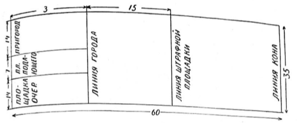

#### 15. Лапта

1. Лапта (бита) должна быть цельнодеревянная, длиной от 1 м до 1 м 20 см и толщиной 4 см в диаметре.
Толщина биты со стороны рукоятки не должна быть меньше 3 см. Допускается обмотка рукоятки биты.

2. Игрокам разрешается пользоваться своими битами.

3. Игроки в возрасте 13—14 лет могут пользоваться плоской лаптой размером до 80 см в длину, 8 см в ширину и 2 см в толщину.

#### 16. Мяч

1. Игра в лапту производится теннисным мячом.

## СУДЕЙСТВО

Четкое и объективное судейство соревнований приносит большое удовлетворение самим судьям, участникам и зрителям и, главное, вскрывает недостатки в подготовке команд.

Судейскую коллегию комплектует организация, проводящая соревнования, с помощью коллегии судей местного совета Союза спортивных обществ и организаций. Назначение ее на судейство должен санкционировать местный совет.

Судейская коллегия крупных соревнований состоит из главной судейской коллегии и судейских бригад на поле, число которых зависит от количества команд и полей, предоставленных для встреч.

В главную судейскую коллегию входят: главный судья, его заместитель, врач, главный секретарь и судья-информатор. Судейская бригада на поле состоит из судьи на поле, бокового судьи и секретаря. Кроме того, при судейской коллегии имеется технических обслуживающий персонал: комендант, медработники, машинистка.

Нет необходимости подробно останавливаться на правах и обязанностях членов главной судейской коллегии, так как сведения об этом можно получить в любых правилах по другим спортивным играм. В этом разделе мы разберем работу судьи на поле, бокового судьи и секретаря, то есть членов судейской коллегии, непосредственно отвечающих за проведение командной встречи.

### Судья на поле

Судья на поле является главным лицом, отвечающим за ход игры. Он должен отлично знать правила, следить за точным их выполнением, быть объективным.

После того как команды заняли свои места на поле, судья подает свисток к началу игры. С этого момента он обязан внимательно следить за игрой, всегда находиться там, где он всего нужнее, и вовремя вмешиваться в игру. Поэтому огромное значение для судьи на поле имеет правильный выбор места. В начале игры и при проведении ударов игроками бьющей команды судья располагается за пределами поля у линии города, чтобы наблюдать за правильностью подбрасывания мяча и началом перебежек.

При введении мяча в игру и начале перебежек (отсюда в возможность осаливаний) целесообразно для судьи передвигаться за мячом вдоль боковой линии, вне поля или в его пределах в зависимости от игровой ситуации. Чем. больше будет передвигаться судья, тем меньше ошибок он будет допускать при судействе.

Перемещаясь по полю вслед за мячом‚ судья всегда будет находиться близко от места нарушения правил, а следовательно, разу же отметит его.

Большое значение в игре имеет своевременная и четкая подача свистков. Подавать свистки судья должен:
1. В начале и в конце каждой половины игры,
2. При проведении удара каждым игроком бьющей команды,
3. При недействительном ударе,
4. При несвоевременном выходе игроков бьющей команды на перебежку,
5. При осаливании и обратном осаливании игроков,
6. При самоосаливании игроков,
7. Для возвращения мяча в город или при игровом переходе мячом линии города,
8. При ловле свечи,
9. Останавливая игру из-за грубости игроков, травмы или других причин.

Судья очень часто подает свистки, причем каждый раз игроки должны по-разному реагировать на них: в одних случаях свисток останавливает игру (недействительный удар, грубость), в других — она продолжается (осаливание, обратное осаливание и прочее). Для того, чтобы не было путаницы, звуки сигналов должны быть различны в зависимости от характера нарушения правил и различных положений в игре. Ниже мы приводим условные обозначения, применявшиеся при судействе во время финальных игр II летней Спартакиады народов РСФСР:

| Обозначение | Описание |
| ------ | ----------- |
| 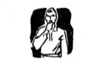 | **Начало игры** — продолжительный свисток. |
| 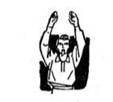 | **Окончание половины игры** — двойной продолжительный свисток с подниманием вверх обеих рук. |
| 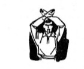 |**Ловля свечи** — продолжительный свисток с подниманием над головой скрещенных рук.|
| 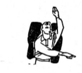 |**Осаливание и обратное осаливание** — резкий короткий свисток с подниманием одной руки вверх и указанием другой на осаленного игрока.|
| 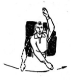 |**Самоосаливание** — резкий короткий свисток с подниманием одной руки вверх и указанием другой на переступание линии.|
| 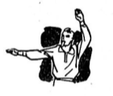 |**Возвращение мяча в город или пересечение им линии города** — продолжительный свисток с показом рукой за линию города.|
| 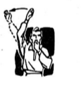 |**Недействительный удар** —  резкий короткий свисток с показом рукой.|
| 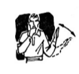 |**Возвращение игроков, неправильно начавших перебежку,** — резкий короткий свисток с показом рукой в сторону линии кона или города, откуда начата перебежка.|
| 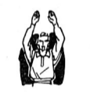 |**Остановка игры в случаях нарушения или травм** — двойной короткий свисток с подниманием вверх обеих рук.|

Не следует без надобности пользоваться резкими и сильными свистками, так как они нервируют игроков и зрителей.

Для сокращения количества свистков их можно не подавать в некоторых случаях, например при промахе бьющего по мячу (что по существу является недействительным ударом) и при возвращении мяча из поля в город, если игроки не начали перебежек.

### Судья на линии

Судья на линии является помощником судьи на поле. Он обязан следить за соблюдением игроками правил и фиксировать ошибки, допускаемые ими. Судья на линии располагается на противоположной от судьи на поле боковой линии (контролирует расстояние от линии города до линии кона).

Все свои замечания он фиксирует флагом, чаще всего судье на линии приходится пользоваться следующими сигналами:

| Обозначение | Описание |
| ------ | ----------- |
| 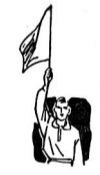 |**Осаливание и ответное осаливание** — поднимает флаг вверх.|
| 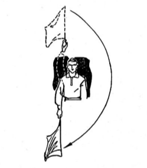 |**Самоосаливание** — поднимает флаг вверх, после чего кругообразным движением показывает концом флага на линию.|
| 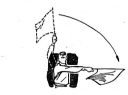 |**Поимка свечи** — поднимает флаг вверх и показывает им в сторону города.|
| 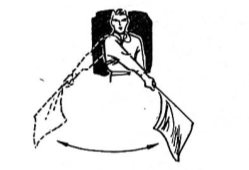 |**Недействительный удар (мяч ушел за боковую линию по воздуху)** — отмашка флагом снизу.|
| 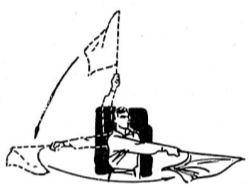 |**Возвращение игрока, неправильно начавшего перебежку,** — показывает концом флага на провинившегося, после чего в сторону линии кона или города (движение древка флага параллельно земле).|

Большое значение при судействе имеет четкое взаимодействие судьи на поле и судьи на линии. Перед началом каждой игры они должны оговорить все сигналы и взаиморасположение в возможных игровых комбинациях. Они также должны договориться об условных сигналах бокового судьи, которыми он как бы санкционирует судье на поле подачу свистка «мяч в город». Эти сигналы необходимы, так как иногда судья в поле может дать свисток «мяч в город» в то время, когда кто-либо из игроков уже перед самым свистком переступил линию города или кона и тем самым неоправданно получил право на свободное окончание перебежки.

Судья на линии, так же как судья на поле, обязан все время передвигаться по полю с таким расчетом, чтобы находиться там, где наиболее напряженная ситуация игры, сопровождая мяч до выхода его из игры.

В начале игры судье на линии удобнее находиться у флага, отмечающего штрафную площадку, так как отсюда хорошо видны и боковая линия и линия штрафной площадки. Как только игроки бьющей команды начнут перебежки, целесообразно передвинуться к угловому флагу на линии кона, где могут быть нарушения со стороны игроков, проводящих перебежки. 

В практике судейства случается, что судья на поле, несмотря на фиксирование ошибки судьи на линии, ее не засчитывает В. правилах сказано: решение судьи на поле является окончательным, поэтому и начинающие и имеющие опыт судьи должны помнить это и не вступать в пререкания со старшим судьей.

### Судья-секретарь

Судья-секретарь ведет протокол соревнований, следит за временем игры и за правильностью начисления очков.

Столик секретаря должен находиться против линии города, вне площадки, со стороны зоны судьи на поле.

Если место встречи радиофицировано, секретарь обязан так же объявлять счет игры и время по микрофону.

Частая смена игровых позиций команд требует от секретаря большого внимания.

### Протокол соревнования

Протокол заполняется под копировку в 3-х экземплярах карандашом. Первый экземпляр остается в организации, проводящей соревнования, два других передаются представителям игравших команд. Судья-секретарь несет ответственность за правильность заполнения протокола. Все недоразумения по заполнению протокола секретарь разрешает немедленно в присутствии судьи на поле и представителей команд.

Графа «Участие в игре» выделена для учета времени игры каждого игрока. Против фамилии участника в числителе записывается время выхода на поле, в знаменателе — время ухода его с поля.

В графе «Учет сделанных ударов и перебежек» условными значками отмечаются три элемента игры — удар действительный, недействительный и совершенная полная перебежка.

Действительный удар обозначается плюсом, недействительный — нулем и полная перебежка — диагональю.

Первое время секретарь ставит в каждом квадрате один значок, при приобретении сноровки он может отмечать в одном квадрате одновременно и перебежку и после какого удара она произведена — действительного или недействительного.

Для того чтобы не сбиться и не поставить игроку лишнюю перебежку, при смене команд удобнее заполнять графу не в строчку, а начинать сначала.

После игровой смены команд часть игроков бьющей команды может оставаться за линией кона. Возвращаясь обратно после одного из удачных ударов партнеров‚ они не несут очков, а только получают право на удар. Если в это же время перебегают игроки, производящие удар, то секретарю бывает трудно уследить за всеми и он по ошибке может записать очко (перебежку) и тем игрокам, о которых мы говорили выше, то есть не несущим очко.

Чтобы избежать подобных ошибок, секретарю рекомендуется для памяти делать условную пометку в протоколе, например поставить точку в квадрате того игрока, который возвращается в город только с правом на удар.

В графе «Штраф очком» секретарь записывает фамилию оштрафованного игрока с указанием, за что он оштрафован. При окончательном подсчете очков это очко добавляется противоположной команде. Например, счет игры команд А и Б 12 : 14 в пользу команды Б. В конце второй половины игры игрок команды Б за нарушение правил был оштрафован очком. Следовательно, счет стал 13 : 14 в пользу команды Б.

В конце каждой половины игры суммируется количество диагоналей и по ним определяется общий счет игры, который заносится в графы «Количество набранных очков» и «Результат игры».

По окончании игры протокол должен быть подписан всеми судьями, проводившими соревнование, а также представителями или капитанами команд. Судья на поле подписывает протокол последним после проверки правильности заполнения всех граф протокола.