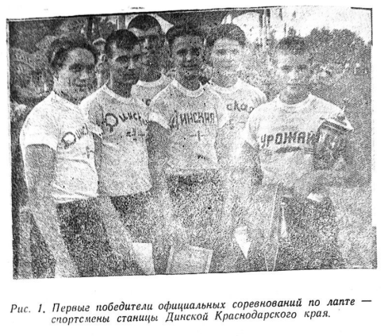
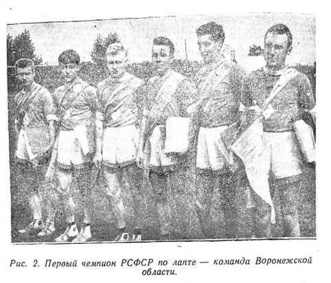
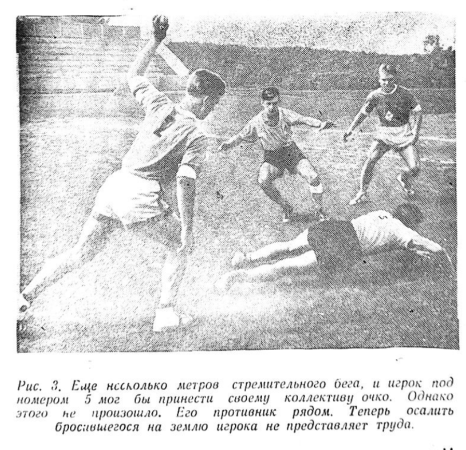
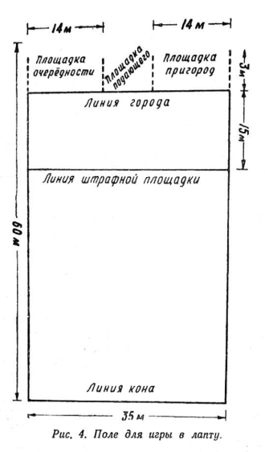
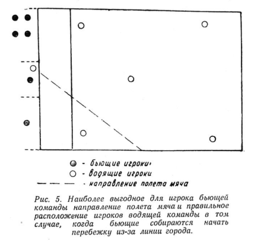
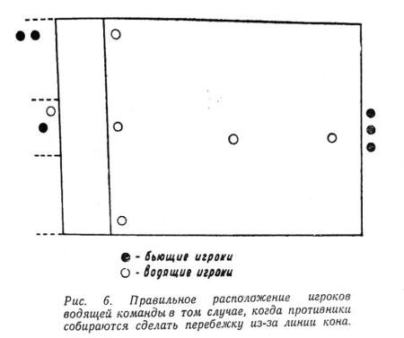

# Русская удалая

::: info Выходные данные
Олег Евгеньевич Бура, Виктор Васильевич Горбунов

Издательство "Физкультура и спорт"

Москва 1961

*(Подписано к печати - 28/V-1961 г.)*
:::

 ## СЮРПРИЗ ЛЕНИНГРАДЦАМ

Словно помолодел в те безоблачные июльские дни 1959 года Ленинград. Неузнаваемо преобразились, приняли праздничный вид его строгие проспекты и площади. Алые и голубые полотнища - цвета флага Российской Федерации, - спортивные флаги украсили Невский проспект и другие овеянные легендарной славой магистрали, протянувшиеся к Кировским островам - к раскинувшемуся на берегу Финского залива стадиону имени С. М. Кирова. Здесь в торжественную минуту открытия решающего этапа II Летней спартакиады народов РСФСР руками Аркадия Воробьева, Марии Исаковой, Николая Королева, Валентина Муратова, Бориса Кулаева и других прославленных правофланговых, разнесших по всему свету славу российского спорта, был поднят в небесную лазурь огненно-красный стяг.

В те памятные дни на опаленных щедрым солнцем набережных можно было встретить блещущую здоровьем и свежестью молодежь - участников спартакиады.

Гостеприимные хозяева города-героя сделали все, чтобы хорошо встретить дорогих гостей - четыре тысячи самых сильных, самых ловких и смелых дочерей и сыновей республики: хлеборобов Алтая и Кубани, машиностроителей Урала, лесорубов Карелии, рыбаков Приморья и Каспия, шахтеров Кузбасса, нефтяников Башкирии, металлургов Челябинска, животноводов Тувы, покорителей Ангары и строителей новых городов на Востоке. Немало выдумки проявила ленинградская молодежь. С сердечной признательностью покидали позднее финалисты спартакиады город, названный колыбелью пролетарской революции. Не только опытом, приобретенным на рингах, водной глади, борцовских коврах, беговых дорожках, треке, обогатились они, но и пополнили свои познания, осмотрев достопримечательности Ленинграда.

Не остались в долгу и спортсмены. Приятные сюрпризы, воплощенные в рекордные достижения и отточенное искусство человеческих движений, подготовили они радушным хозяевам города. Их выступления вылились в волнующий смотр силы и красоты нашего народа, его несокрушимой мощи, всеобъемлющей неувядаемой молодости!

В каждом виде спорта, включенном в программу спартакиады, - а всего их было 27, - шла на редкость острая, увлекательная борьба за почетные награды спартакиады. Любители спорта оказались даже в затруднительном положении, не зная, куда пойти, что посмотреть, где наиболее интересно. На стадионе имени С. М. Кирова состязались легкоатлеты; в спортивном клубе Ленинградского военного округа демонстрировали свою мощь штангисты; на стадионе металлического завода соревновались городошники; в городском шахматном клубе имени М. И. Чигорина шли сражения шахматистов.

Ленинградцы - тонкие ценители спорта. Трудно их чем-либо удивить. И все же им был приготовлен своеобразный сюрприз. Они увидели нечто очень близкое, знакомое и в то же время новое. На стадионе Лесотехнической академии собралось множество болельщиков.
То и дело слышались восклицания с трибун:

- Вперед, Во-ро-неж! Вперед, ребята!..

На поле - в разгаре схватка двух команд. Встречаются чемпион республики - команда Воронежской области - и свердловчане.

Сейчас бьющие - воронежцы. Их майки голубеют за широкой белой линией города. А в это время уральцы рассыпались по полю. Их внимание сосредоточилось на городе, откуда должен последовать удар по небольшому теннисному мячу. Успеть поймать или быстро подхватить его, пока «неприятель» делает перебежку, - вот цель водящей команды.

Удар собирается произвести высокий, угловатый на вид юноша, то и дело отбрасывающий со лба непокорную прядь волос. Он заметно волнуется. Ведь от его удара зависит многое! Юноша отрывисто говорит подающему, как и на какую высоту следует подбросить мяч, и принимает наиболее привычное для себя стартовое положение.

Свисток судьи. Взмах битой. Но разве это удар? Слегка задетый битой, мяч отскакивает в сторону и, ударившись о землю, оказывается в руках одного из свердловчан. Нет, после такого удара не побежишь - сразу же окажешься удобной мишенью.

К белой линии подходит второй номер воронежской команды. Может быть, у него удар получится лучше?! Снова повторяется все сначала: свисток судьи, взмах битой... Но на этот раз удар получился молодецкий: мяч стрелой взмыл в небесную лазурь, на мгновение превратившись в маленькую, еле заметную белесую точку.

- Мо-ло-дец! Мо-ло-дец! - скандируют трибуны.

Мешкать нельзя. Пригнувшись, по полю, точно спринтеры, стремительно проносятся два игрока в голубых майках. Тщетно уральцы пытались поймать свечу. Неприятель уже добежал до белеющей в противоположном конце поля линии кона. Теперь можно немного передохнуть, ожидая такого же удачного удара, чтобы так же успешно возвратиться обратно в город.

Игра продолжается. Бита - в руках третьего номера воронежцев.

- Подбрось-ка, друг, получше,- обращается он к подающему.

Эх!.. Удар получился не по замаху. Бита даже не задела мяча. Промах. И только следующий номер бьет удачно. Точно выпущенный из пращи, мяч со свистом рассекает воздух.

Славный удар! Отбросив биту, бьющий решил воспользоваться выгодным положением. Он стремглав летит по полю. Вот уже середина, а там и кон.

Не зевают и свердловчане. Поймав мяч, они четко передают его друг другу.

- Не спеши, не бей, - слышится предостерегающий голос их капитана Николая Дуракова. Видно, он опасается, что его партнер, у которого очутился мяч, поспешит и промахнется. А тогда те двое, которые стоят сейчас за линией кона, воспользуются оплошностью водящих и благополучно вернутся в город, принеся своей команде драгоценные очки. Пусть уж лучше воронежцы снова попытают счастья.

Очередь пятого номера. Он не спеша подходит к черте, нагибается, натирает ладони песком. Это для того, чтобы увереннее держать биту в руках. Прицелился, размахнулся, и уже по шуму на трибунах можно было определить, что спортсмен сделал хороший удар:

- Давай, Во-ро-неж! - несется по стадиону.

Четыре фигуры в голубых майках проносятся по полю мимо пытающихся поймать мяч уральских игроков. Очень умно пробил игрок! Мяч приземлился в углу поля и отскочил почти к самым трибунам. Пока свердловчане сумели его поймать, голубые уже достигли заветной черты. Лишь один из них замешкался. И уральцам представилась возможность изменить ситуацию в свою пользу. Однако в тот момент, когда, казалось, мяч вот-вот осалит воронежца, спортсмен в голубой майке на полной скорости бросился на землю, и мяч пролетел мимо...

Игра окончена. Довольные поднимаются со своих мест ленинградцы. Не зря потратили они сегодня время. чтобы собственными глазами посмотреть чудесную русскую игру - лапту. Сюрприз оказался на славу!

## ВТОРОЕ РОЖДЕНИЕ

Есть у русского народа игры, история которых исчисляется веками. Одна из них - лапта. Еще в давние времена на живописных лужайках и полянах состязались наши прадеды и деды в ловкости, меткости и быстроте. В спортивной летописи не сохранились сведения, кто и когда выстрогал первую биту, начертил границы города и кона. Однако известно, что еще во времена Петра 1 лапта пользовалась большой популярностью. Постепенно она утратила свое назначение, так и не найдя своего места в ряду признанных ныне многочисленных видов спорта. Нет, совсем лапта не исчезла. Она по-прежнему оставалась массовой подвижной игрой, прекрасно развивающей мышцы, укрепляющей сердце и легкие. Но играли в нее, как правило, только дети. Что же касается взрослых, то для них лапта обратилась в чудесные воспоминания о детстве, о тех днях, когда они, будучи мальчишками и девчонками, умело орудовали битами, азартно носились взад и вперед по очерченной на глазок дворовой площадке, увертываясь от преследовавшего их мяча.

Шли годы. Появлялись в нашей стране все новые виды спорта, и все меньше вспоминали о лапте. И если кто-либо, пусть даже полушутя, говорил: «А не плохо бы сыграть в лапту!» - его тотчас же поднимали на смех: товарищ, мол, в детство ударился, захотелось, видимо, ему позабавиться...

А между тем лапта - полезная и увлекательная игра, не требующая ни особых дорогостоящих принадлежностей, ни специально оборудованных фундаментальных площадок. Вот как, например, о ней отзывался знаменитый русский писатель А. И. Куприн:

«Эта народная игра - одна из самых интересных и полезных игр... В лапте нужны: находчивость, глубокое дыхание, верность своей партии, внимательность, изворотливость, быстрый бег, меткий глаз, твердость удара руки и вечная уверенность в том, что тебя не победят. Трусам и лентяям в этой игре нет места. Я усердно рекомендую эту родную русскую игру не только как механическое упражнение, но и как безобидную забаву, в которой вырабатывается товарищеская спайка: «своего выручай».

Вполне естественно, что благодаря усилиям отдельных энтузиастов великолепная русская игра, в конце концов, снова получила большое распространение. В сентябре 1957 года на улицах станицы Динской Краснодарского края появились красочные афиши. Они предлагали кубанцам посетить первые в истории нашего спорта большие официальные соревнования по русской лапте. Шесть сильнейших сельских команд общества «Урожай» встретились в матч-турнире. Наибольшего успеха тогда добились хозяева поля - молодые колхозники станицы Динской (рис. 1). Они оправдали надежды своих земляков, завоевав специально учрежденный переходящий приз.

Но главный итог первых соревнований по лапте заключался не в технических результатах, а в том, что даже скептики поняли, что этот вид спорта полезен и увлекателен. Ведь раньше многие из них утверждали, что лапта не только не представляет спортивного интереса, но и соответствующие правила игры к ней почти невозможно подобрать. И вот прошедшие соревнования в станице Динской со всей очевидностью показали, насколько далеки от жизни все эти теоретические рассуждения. Сотни зрителей, побывавших на стадионе колхоза имени Сорокалетия Октября, с огромным вниманием и волнением наблюдали за встречами шести лучших команд Российской Федерации. Переходящий приз бывшего Комитета по физической культуре и спорту при Совете Министров РСФСР оспаривали представители Краснодарского края, Воронежской, Чкаловской (ныне Оренбургской), Московской, Балашовской и Курской областей - колхозные команды, победительницы районных и областных соревнований.

Турнир проходил по круговой системе. За выигрыш команда получала два очка, за ничью - одно и за поражение - ноль очков. Серебряный кубок достался спортсменам колхоза имени Сорокалетия Октября, защищавшего честь Краснодарского края.

Вопреки скептическим предсказаниям, первый «блин» оказался... именно «блином». Соревнования колхозных команд подтвердили, что лапта достойна иметь все права гражданства в нашем спорте. Эта игра - далеко не развлечение. Всевозможные рывки, сильные и точные удары, падения с тактической целью - разве все это не требует большой физической и нервной нагрузки?! Разве можно одержать в лапте победу, не будучи сильным, ловким, выносливым и сообразительным?!

Вместе с тем, первые официальные встречи игроков в лапту заставили над многим призадуматься, и прежде всего над правилами игры. Они оказались далеко не совершенными. Мало того. Некоторые команды, в частности из Воронежской и Оренбургской областей, у себя проводили состязания несколько иначе: они определяли победителя не по числу штрафных очков, а по времени... Были и другие расхождения. Стало ясно: лапта, которая распространена во всех уголках страны, нуждается в единых правилах с учетом бытующих в народе особенностей игры.

И такие унифицированные правила были созданы. Они упростили игру и вместе с тем придали ей более спортивный характер, сделали по-настоящему динамичной, атлетической, интересной для зрителей. По новым правилам летом 1958 года в Воронеже проводился I чемпионат Российской Федерации. В нем приняли участие команды Московской, Ивановской, Воронежской, Оренбургской, Горьковской, Омской, Белгородской, Тамбовской областей и Мордовской АССР. По жребию все команды были распределены на две группы, в которых игры проходили по круговой системе. По условиям соревнований чемпион республики определялся в решающей встрече между победителями групп.

Предварительные игры наиболее уверенно провели воронежцы и оренбуржцы. Они-то и встретились 22 августа в решающем матче на стадионе «Динамо».

Поначалу успех сопутствовал спортсменам Оренбургской области. Используя отличные удары своих бьющих, они три раза прорывали оборону противника. Но в середине первой половины игры инициативу захватили воронежцы. Удачные проходы по полю четырех игроков вывели их команду вперед. Первая половина игры окончилась со счетом 8:5 в пользу команды Воронежской области. Во втором тайме оренбуржцы играли значительно слабее. Они допустили ряд досадных промахов при осаливании и вскоре упустили инициативу. Финальный свисток судьи прозвучал в ту секунду, когда счет игры возрос до 23:9 в пользу команды Воронежской области. Ей и было присвоено звание чемпиона Российской Федерации по лапте (рис. 2). Оренбуржцам досталось второе место. В борьбе за третье место белгородцы победили спортсменов Омской области со счетом 31:14. Пятое и шестое места поделили москвичи и ивановцы. Седьмое место заняли горьковчане, разгромившие в последнем матче команду Тамбовской области (62:11).

Воронежцы по праву завоевали звание сильнейших. Тренер команды В. Янушевский за короткий срок сумел создать из студентов Лесотехнического института дружный сплоченный коллектив. Именно чувство коллективизма, дружбы и отличная физическая подготовка по-
могли воронежцам одержать победу.

В игре первого чемпионата России были и недостатки. Эти ошибки типичны и для других команд. Прежде всего - в ударе по мячу. На первый взгляд кажется, что удар битой - дело несложное, не требующее особой сноровки. Но это далеко не так. Ударить круглой палкой по маленькому мячу с такой силой, чтобы он опустился за 50 - 60 метров от бьющего, - это уже искусство, которое дается спортсмену лишь после длительной тренировки.

У воронежцев таких снайперов было всего двое. Лишь они могли послать мяч «по заказу» на любое расстояние. Другие же спортсмены этой и остальных команд, как правило, либо промахивались, либо старались лишь слегка задеть мяч битой. Они даже не пытались сильно замахиваться битой для удара. Именно это обстоятельство послужило причиной неудачного выступления довольно сильной команды Московской области, которая вполне могла претендовать на призовое место.

Довольно примитивной была и тактика команд. Игроки действовали слишком прямолинейно, однотипно, старались выиграть право на удар только за счет сильных спуртов, бросков на землю и прыжков, что зачастую приводило к травмам. Их незамысловатые, десятки раз повторяющиеся маневры нетрудно было разгадать и вовремя принять меры противодействия (рис. 3).

Чемпионат республики по лапте послужил существенным толчком для развития народного вида спорта в городах, областях, краях и автономных республиках Российской Федерации. С каждым днем все больше становилось приверженцев удалой русской игры. Только в одной Горьковской области в соревнованиях по лапте участвовало двадцать команд. И играли в нее не только школьники, но и рабочие, служащие, студенты, колхозники. Теперь и руководители физкультурных организаций стали посматривать на лапту по-иному. Они сами убедились, насколько полезна она для физического совершенствования молодежи.

Словом, старинной русской игре надо было открывать «зеленую улицу» - широкую спортивную дорогу!

## ЛАПТА НА СПАРТАКИАДЕ

В 1957 году после окончания матчевой встречи шести команд ДССО «Урожай» по лапте между судьями, проводившими соревнования, разгорелся спор: «пойдет» лапта или «не пойдет»?

- Спортсмена лаптой не заинтересуешь, - говорили скептики. - Игра эта развлекательная, а не спортивная.

- Лапта - настоящая спортивная игра, - возражали сторонники мяча и биты. - Она воспитывает чувство коллективизма, делает игроков ловкими, сильными, быстрыми. Только правила игры надо изменить.

Группа энтузиастов, пусть даже маленькая, порой может сделать большое дело. Именно такими почитателями и горячими пропагандистами старинной народной игры оказались работник Всероссийского совета Союза спортивных обществ и организаций Ю. Смолин, старший инструктор учебно-спортивного отдела ДССО «Урожай» В. Радиков, воронежский тренер-общественник В. Янушевский и др. Они разработали новые правила, составили положения о проведении соревнований, уточнили форму судейского протокола, позаботились о выпуске специальных плакатов. И старинной народной игрой заинтересовались не только сельские физкультурники, но и спортсмены «Буревестника» и «Труда».

В 1958 году лапта завоевала всеобщее признание. В Российской Федерации были созданы тысячи команд. Они оспаривали первенство в городских, районных, областных и республиканских соревнованиях. В 1959 году 72 сильнейших коллектива России выступали в зональных соревнованиях II Летней спартакиады народов РСФСР, в программу которой лапта была включена как обязательный вид спорта.

В Ленинграде борьбу за звание чемпиона вели победители зональных состязаний - команды Воронежской, Московской, Свердловской, Ростовской, Ивановской и Иркутской областей, Приморского края и Карельской АССР. Встречи сильнейших команд РСФСР показали широкой общественности, что лапта заняла свое место в обязательной программе спартакиады не как случайный вид спорта, а как интересная, нужная и полезная спортивная игра.

Большой интерес к лапте проявили зрители. Стадион, на котором проходили игры чемпионата, был переполнен. Среди тех, кто переживал перипетии матчей, были и школьники, и студенты, и служащие, и рабочие.

В последний день соревнований к судьям подошел уже немолодой мужчина.

- Баринов Василий Яковлевич, - представился он. - Помогите мне достать правила игры в лапту. Сам я живу во Львове. У нас тоже играют, но кто как умеет. Хочу привезти им правила. Уж больно хороша эта игра - простая и захватывающая.

А вот что говорят о лапте сами спортсмены:

- Лапта - один из самых трудоемких видов спорта, - сказал капитан команды Свердловской области, игрок сборной команды СССР по хоккею с мячом, заслуженный мастер спорта Николай Дураков. - 60 минут непрерывных перебежек, прыжков, ударов требуют от спортсменов большой физической силы, выносливости.

- В лапте, как и в любом другом виде спорта, - вступил в нашу беседу капитан команды Московской области В. Кукушкин, - успех приносит не только физическая подготовка, но и высокая техника, гибкая тактика. Все это приобретается только в процессе тренировок.

Круглогодичная тренировка, высокое мастерство и хорошая физическая подготовка помогли подмосковным спортсменам добиться успеха. Весь турнир они провели без поражений и стали чемпионами РСФСР.

Если команда Подмосковья еще за день до конца состязаний обеспечила себе первое место, пройдя весь турнир без поражений, то за другие призовые места проходила исключительно жаркая борьба. Команда Воронежской области - наиболее вероятный претендент на первое место, чемпион Российской Федерации 1958 года - поначалу лидировала. Так, ростовчан воронежцы разгромили со счетом 26:0, иркутянам нанесли поражение опять-таки с сухим счетом - 30:0. Однако во встрече с свердловчанами им пришлось «споткнуться». Матч закончился вничью - 6:6. А потом воронежцы встретились с командой Московской области и проиграли - 10:14, потеряв всякую надежду на титул чемпиона спартакиады. И хотя в заключительном туре команда Воронежской области вновь блеснула незаурядным мастерством, обыграв со счетом 34:1 карельских спортсменов, им тем не менее пришлось довольствоваться только вторым местом. Третий приз из Ленинграда направился на Урал, в Свердловск.

II Спартакиада народов РСФСР доказала, что лапта заняла почетное место в большом спорте. Таким образом, сама жизнь положительно ответила на вопрос «быть или не быть лапте».

## ОТ ГОРОДА ДО КОНА

Как играют в лапту? Нужен ли для нее специальный стадион, спортивный инвентарь? Каковы сущность и правила этой русской удалой игры?

Чтобы ответить на все эти вопросы, давайте отправимся на стадион, где намечена встреча по лапте. Прежде всего подымемся на трибуну и посмотрим сверху на площадку для игры. Она свободно уместилась на футбольном поле. Размеры прямоугольника обозначены мелом (но их можно разметить также известью, белым песком, а еще лучше - туго натянутой по границам белой тесьмой, прикрепленной к земле металлическими шпильками). Запомните названия составных частей площадки. Одна лицевая (короткая) линия названа «линией города», противоположная ей линия - «линией кона». В 15 м от линии города, параллельно ей, проведена «линия штрафной площадки».

С трибуны хорошо видно, что линия города делится яркими полосами на неравные отрезки, являющиеся с одной стороны границами площадок, расположенных за линией города. Крайняя к боковой черте площадка называется «площадкой очередности», средняя - «площадкой подающего», рядом с ней находится «площадка-пригород».

Основные размеры и общий вид площадки для проведения игры в лапту показаны на рис. 4.

Теперь ознакомимся с инвентарем спортсменов. Основное в нем - бита, или лапта. Это обыкновенная палка круглой формы, сделанная из крепкой породы дерева - ясеня, клена, березы и т. п. Длина ее от 1 до 1,2 м, диаметр - 4 см. Ручка немного тоньше. Так биту удобнее держать в руке. Для игры в лапту вполне пригодны обыкновенные теннисные мячи.

Таким образом, для лапты не требуется ни специальных площадок, ни особых принадлежностей. Футбольное поле, просторная лужайка или лесная поляна вполне пригодны для игры. Бита и небольшой резиновый мяч - вот и весь нехитрый инвентарь.

Несложны и правила лапты. Задача игры заключается в том, чтобы за 60 минут (2 половины по 30 минут) набрать наибольшее количество очков, то есть совершить как можно больше полных перебежек. Каждая такая успешная перебежка игрока бьющей команды приносит ей 1 очко.

За победу борются две команды по 6 человек. По жребию определяется, какая команда бьет, а какая водит. Игроки бьющей команды занимают места за линией города, а водящей - разбегаются по полю.

По сигналу судьи игроки бьющей команды по очереди, друг за другом, стараются послать мяч ударом биты как можно дальше в поле. Если игрок промахивается, удар предоставляется следующему номеру. После удачного удара по мячу лаптой игроки пытаются перебежать через поле к кону, а при благоприятных обстоятельствах и вернуться обратно.

Водящие же, в свою очередь, произвольно расположившись по полю, прилагают максимум усилий, чтобы поймать мяч с лету, либо, подобрав его после удара, осалить им перебегающего противника. Если это удается, происходит смена мест: бьющие становятся водящими, а водящие - бьющими.

На первый взгляд играть в лапту чрезвычайно просто. В действительности же лапта требует от спортсменов не только большого физического напряжения, но и умения тактически правильно ориентироваться в возникающих по ходу игры разнообразных ситуациях. Чтобы
убедиться в этом, давайте посмотрим одну из встреч любителей лапты.

Еще до начала игры команды - синяя и красная - вышли на так называемую разминку. Все спортсмены - в майках, коротких трусах и резиновых тапочках. В бутсах или обуви с каблуками играть не разрешается. У каждого игрока на майке спереди и сзади пришит порядковый номер: на спине размером 25х12 см, на груди поменьше - 10х15 см.

Но вот команды заканчивают разминку и уходят. Мальчики - юные помощники судей - спешат поставить флаги по углам площадки и на месте пересечения линии штрафной площадки с боковыми линиями. На центре поля появляется судья с двумя помощниками.
Он дает сигнал, и под звуки марша из раздевалки выбегают команды. Каждую из них возглавляет капитан. От остальных игроков его отличает особая нашивка на левой стороне майки.

Команды на центре. Они выстраиваются так же, как футболисты, и таким же дружным «физкульт-привет!» приветствуют друг друга. Капитаны подходят к судье, знакомятся с ним и помощниками, пожимают друг другу руки. Им предстоит выбрать, кому бить, а кому водить. Судья предлагает вытянуть жребий капитану гостей. Игрок в синей майке вытаскивает бумажку с надписью: «Бьющие». Соперникам досталась бумажка с надписью: «Водящие».

Итак, встреча по лапте началась.

Игроки в синих майках - бьющие - уходят за линию города, водящие разбегаются по полю.

Впрочем, один игрок в красной майке остается на линии города - в площадке подающего. Это - подавальщик. Он выделен капитаном команды водящих для того, чтобы подбрасывать соперникам под удар мяч.

По правилам в момент подбрасывания мяча бьющий и подающий игроки должны обеими ногами находиться в пределах площадки подающего. Подающий игрок может находиться от бьющего на любом расстоянии, но в пределах отведенной ему площадки. Он обязан подавать мяч под удар так, чтобы это было удобно бьющему. Но не подумайте, что, нарочно плохо подавая, он сумеет чем-то помочь своей команде. Лапта - игра высокой спортивной честности. Подавать мяч соперникам игрок, выделенный для этой миссии, обязан как следует. В противном случае бьющий попросту может не принять мяча. За неправильное подбрасывание мяча подающему игроку делается замечание, при повторном нарушении - предупреждение, а при последующих - водящая команда оштрафовывается одним очком.

Игра состоит из двух партий. Каждая из них обычно начинается ударом по мячу одним из игроков бьющей команды. И вот мы видим: мяч - уже в руках у подавальщика. Сейчас он подбросит его под удар первого бьющего, или, как его еще называют, «забойщика», который уже вошел в площадку подающего, в то время как его товарищи по команде расположились в площади очередности. `

Свисток судьи. Резкий взмах битой... Мимо. Первый номер бросает биту и переходит в пригород - на площадку, в которой размещаются игроки, выполнившие удар и ожидающие перебежки. Теперь первому номеру нужно ждать, пока кто-нибудь из его партнеров не произведет правильного удара по мячу. Иначе он не сможет начать перебежку. Это запрещено правилами.

Его место занимает игрок под номером два. В лапте игроки бьющей команды бьют по очереди, в порядке номеров, прикрепленных у них на майках. Второй номер перешел из площади очередности в площадку подающего, показал подающему, на какую высоту надо подбросить мяч, и принял удобное для удара положение. Однако и он не сумел точно попасть по мячу. Бита едва задела мяч, и он отскочил недалеко. Игрок, произведший удар, бросился было вперед. Но судья остановил его и попросил возвратиться обратно. В чем дело? Оказывается, по правилам удар считается недействительным, если мяч не пересек линии штрафной площадки, проведенной в 15 м от линии города.

Делать нечего. Второму номеру пришлось также отправиться в пригород и там вместе с первым номером ожидать более сноровистых ударов своих товарищей.

Кстати, как мы уже отметили, в лапте далеко не все удары считаются действительными. По этому поводу в правилах игры указано, например, что удар признается правильным, если мяч, выйдя за пределы города, не пересек боковых линий по воздуху. А удар, после которого мяч коснулся штрафной площадки, считается недействительным. Кроме того, удар, при котором подавальщику может быть нанесено физическое повреждение, определяется как опасный. При повторении его забойщик, нарушивший правила, удаляется с поля.

Не везет поначалу и третьему номеру синих. Ему долго не удается пробить. Подающий никак не может подбросить мяч на «заказанную» ему высоту. Тогда судья останавливает игру и делает подающему замечание. Теперь провинившемуся надо быть более внимательным. Иначе его команда может поплатиться драгоценным очком.

Наконец удар состоялся. И какой удар! Мяч птицей взмыл в воздух и опустился метрах в сорока от линии города. Не мешкая, трое синих бросились в поле. Они уже пробежали добрую половину, как вдруг раздался резкий свисток. Назад! Оказывается, произведя удар, третий номер синих бросил лапту в поле. А этого делать нельзя. Он обязан был оставить лапту в пределах площадки подающего. Этого он не сделал, и судья справедливо засчитал хороший удар недействительным.

Теперь слово за четвертым номером. Тройка неудачников с надеждой посматривает на него: поможет ли он выправить положение? И четвертый номер помог. Мастерски пущенный мяч приземлился далеко в поле и укатился по земле за боковую линию. Пока за ним бросились водящие, из пригорода к кону рванулись синие, Вот один из них, самый быстроногий, уже пересек линию кона и помчался назад - в город. Не опасно ли? Ведь мяч - уже в руках у водящих. Они четко передают его друг другу, выбирая момент, чтобы удобнее, с наиболее выгодного расстояния, поразить противника. Однако в последний момент произошла небольшая заминка, и первый номер синих успел пересечь спасительную черту линии города. Тем самым, произведя полную перебежку, первый номер принес команде синих очко, и кроме того, получил право на повторный удар.

Что касается его партнеров по перебежке, то они, увидев, что мяч находится у водящих, решили не рисковать и остались на противоположной стороне - за линией кона, рассчитывая на более выгодный случай. Подобное тактическое поведение вполне оправданно. Тем более, что правилами оно вовсе не возбраняется.

Итак, счет 1:0. Ведут синие. Если сейчас удачно пробьет пятый номер и двое стоящих за линией кона благополучно вернутся в город, то синие получат сразу еще пару очков.

На трибунах - волнение. Взгляды зрителей устремлены к пятому номеру. Но он явно переусердствовал и в результате промахнулся. Ну что же, всякое бывает. Отчаиваться нет причин. Ведь еще имеют право на удары шестой номер и первый, совершивший полную перебежку.

Под номером шесть обычно выступает самый меткий игрок. Вот и у синих роль последнего доверена своеобразному снайперу. Он не торопясь, спокойно прицелился и так ударил по мячу, что тот стремительно полетел вперед, точно пущенный катапультой. Удобный момент.
Забойщик бросился вперед в поле, а ему навстречу из-за линии кона помчались товарищи. Один из них, видимо опасаясь, что его осалят, решил «прижаться» как можно ближе к боковой линии. Это в некотором роде рискованно. Если перебегающий выбежит за линию или даже только наступит на нее, то будет засчитано самоосаливание, то есть игрок, владевший мячом, получит право отбросить его в поле и вместе с товарищами ринуться за линию кона или пригорода. В лапте такая ситуация называется «игровой сменой»: водящие становятся бьющими, а бьющие, если они не успеют, подобрав мяч, осалить противника и убежать от него, - водящими.

В данной партии этого не произошло. Бегущий у самой бровки благополучно достиг города, и почти тогда же пересек эту линию брошенный в него мяч. Игру прервал свисток судьи. Бросок неудачен. Мяч ушел из игры, а следовательно, синие не спеша могут закончить перебежку. Водящие возьмут мяч только тогда, когда все игроки бьющей команды окажутся за линией города.

Впрочем, одного из синих судья все же вернул за линию кона. Почему? Да потому, что этот игрок переступил ее после свистка. А не замешкайся он, и ему бы сейчас можно было так же легко совершить перебежку, как и двум товарищам, принесшим команде еще 2 очка.

Счет возрос до 3:0 в пользу синих.

Снова бьет первый номер. Слабый у него получился удар. Ожидая, вероятно, далекого полета мяча, он в азарте переступил черту города. Этого делать не стоило. Судья жестом показывает: вперед! Коли сделал шаг за черту, - беги. Положение безвыходное. Разве теперь упасешься от осаливания! Растерявшись в первую секунду, красные поняли, в-чем дело, и нацелились на бегущего.

- Кидай в него, - кричит капитан красных.

«Живая мишень» мечется. Кажется, не спастись. И тут неожиданно приходит помощь от самих же красных. Двое из них блокируют синего, а третий подбегает и ударяет противника зажатым в кулаке мячом по спине. Красные разбегаются. Но судья не признает такого осаливания. И справедливо. Правилами, во-первых, запрещено вести силовую борьбу, а во-вторых, осаливать мячом можно, только выпуская его из рук. Таким образом, красные поплатились еще одним очком.

Не использовали они и другую благоприятную возможность. После очередного удара синих один из игроков водящей команды сумел поймать свечу. В старину это означало - город взят, нынче называется свободной сменой: те, кто находился в городе, уходят в поле, а их место занимает команда водящих.

Между прочим, свободная смена производится не только тогда, когда игрок водящей команды ловит мяч на лету, но и тогда, когда у бьющей команды не остается ни одного игрока с правом на удар.

Команды поменялись ролями. Но не успели красные произвести и двух ударов, как произошла так называемая игровая смена. Перебегающего по полю второго номера красных настиг точно брошенный вслед мяч.
Синие сразу же бросились за линии города и кона. Все проскочили удачно, и лишь один замешкался, не успел скрыться за спасительной чертой. Красные не растерялись и поразили его мячом - «обратное самоосаливание»! Теперь уже красные побежали врассыпную:
двое - к городу, а четверо - к кону. Теперь их надо выручать.

Красным предоставляется право на удар. Он был выполнен метко. Еще двое красных оказались за чертой города. Однако очков команде они не принесли, а лишь получили право на удар. Вот, произведя его, один из «спасенных» бросился вперед. Навстречу ему несется товарищ: Но что это? Почему мяч подобрал подавальщик и прицелился в подбегающего противника? Все правильно. Игрок, подающий мяч, наделен всеми правами полевых игроков, и вполне естественно, что он может помогать им. Своевременно заметив опасность, красный повернулся и побежал назад к черте кона - туда, откуда он только что выбежал. Судья внимательно следит, не перейдет ли он линию кона. Правилами это запрещено. Игроку нельзя возвращаться за черту, откуда он выбежал. Иначе будет считаться самоосаливание. Перебегавший оказался опытным игроком. Он не нарушил «букву закона». Но и не спасся от расплаты за свою опрометчивость. Его настиг меткий бросок. И в тот же миг раздался свисток судьи.

Первая половина встречи окончилась. Счет 4:0 в пользу синих.

Теперь, когда мы ознакомились с сущностью игры, узнали некоторые ее правила давайте понаблюдаем за действиями на поле арбитров.

Каждую встречу по лапте обслуживает судейская бригада. Она состоит из трех человек: судьи на поле, судьи на линии и секретаря. Главный среди них - судья на поле. Его работа начинается задолго до начала матча. Еще пусты трибуны, в дороге игроки, а судья уже на стадионе. Он проверяет состояние и разметку поля, инвентарь и т. д. Полномочия судьи начинаются с момента, когда он свистком вызывает команды на поле. Вот и сейчас окончился перерыв, и вы видите, как судья вызвал команды для продолжения игры.

Обратите внимание на расположение судей: главный находится невдалеке от линии города, его помощник - на противоположной стороне, почти у самой линии кона. Такое расположение не случайно. Главному судье все время надо наблюдать за бьющими: правильно ли они производят удары, не начинают ли бег раньше времени, соблюдают ли другие правила. Поэтому главный судья и находится невдалеке от линии города.
Его помощник контролирует действия водящих в момент удара и, кроме того, следит за правильностью перебежек бьющих.

Но лучше проследить за деятельностью судей в процессе игры.

Только что по мячу пробил первый номер. И тотчас же раздался свисток: судья, находящийся вблизи площадки подающего, заметил, что бьющий опасно размахнулся битой. Так можно нанести травму противнику. Судья подозвал к себе провинившегося и сделал ему замечание: «Играйте осторожнее!»

После удара второго номера вперед бросился его товарищ, имеющий право на перебежку. За ним сразу же побежал судья. Не подумайте, что он собирается догонять спортсмена. Нет, судья сейчас следит за тем, чтобы бегущий не наступил на боковую черту. Не менее важно также определить момент осаливания мячом. Ведь когда все это происходит на глазах, ошибиться нельзя.

Ну, а как поступить судье, если перебежку делает не один, а сразу несколько игроков. Главный судья, проследив за началом перебежки, основное внимание обращает затем на водящего, подобравшего мяч. Ведь именно этот игрок будет пытаться осалить противника. Значит, надо быть поближе к нему. За остальными же игроками наблюдает помощник.

Между тем водящие, передав несколько раз друг другу мяч, точно бросили его в спину противника. Судья сейчас же дал свисток и поднял одну руку вверх - осаливание! Водящие бросились за линии города и кона. Кажется, все верно. Но почему боковой судья вдруг поднимает и опускает свой флаг, указывая на боковую черту. Все ясно: один из убегающих перешел боковую линию. Заметив сигнал помощника, судья дал свисток и крикнул: «Самоосаливание!» Теперь уже за спасительные линии города кона побежали синие. У них это путешествие окончилось благополучно. Теперь синие снова бьют. Но первый же их удар оказался неудачным: свечу поймал один из водящих. В тот момент, когда поймавший мяч поднял его над головой, судья дал продолжительный свисток - свободная смена.

..Уже пробили трое красных, но никто из них не решился сделать перебежку. Но вот после удара четвертого номера они бросились вперед. У синих прямо-таки разбежались глаза: кого салить? Пока они размышляли, красные забежали за линию кона и уже возвращаются обратно. Вот двое из них достигли города. Судья, пробегая около маленького столика, за которым сидит секретарь, быстро говорит ему: «Второй и третий по очку». Секретарь сразу же отмечает это в протоколе.

Секретарь - это летописец матча по лапте. Из протокола, который он ведет, вы можете узнать, какой игрок лучше всех бьет, кто, наоборот, чаще всего промахивается, кто из спортсменов совершил наибольшее количество перебежек и кого из них чаще всего осаливали противники. Одновременно секретарь ведет учет времени, следит за очередностью бьющих игроков и ведет подсчет очков. Как видите, работать ему приходится много.

А игра между тем подходит к концу. Все чаще и чаще поглядывает судья на часы. Вот он поднес ко рту свисток и резко просигналил. Время игры истекло. Матч так и окончился со счетом 4:2 в пользу синих.

## ТЕХНИКА, ТАКТИКА, ТРЕНИРОВКА

Как мы видим, вся игра в лапту строится на четырех основных элементах: ударе битой по мячу, перебежке, ловле мяча и осаливании. На технике выполнения этих приемов мы и остановимся более подробно.

Удар. Спортсмен, производящий удар, должен обеими ногами стоять в площадке подающего. Если игрок бьет правой рукой, то он стоит левым боком к полю, если левой, - то правым боком. Ноги расставлены на ширину плеч. Нога, ближайшая к полю, несколько выставлена вперед. В момент замаха лаптой ступня ноги, выставленной вперед, опирается на носок, другая нога несколько сгибается в коленном суставе. Центр тяжести тела находится над ногой, согнутой в колене. Прямая рука с лаптой заносится вверх над головой в противоположную сторону от поля. Туловище несколько отклоняется в сторону замаха. Лицо обращено к подавальщику. Глаза все время следят за мячом, находящимся у него в руках. В тот момент, когда мяч подброшен, рука с лаптой с силой опускается вниз, сгибается в локтевом суставе и ударяет мяч в то мгновение, когда он находится на уровне пояса. Перед самым ударом по мячу движение руки ускоряется. В момент удара делается резкий рывок кистью руки. Туловище игрока, после того как рука начнет опускаться для удара, выпрямляется и несколько разворачивается в сторону поля. Ноги меняют свое положение. Нога, ближайшая к полю, ставится на всю ступню и несколько сгибается в коленном суставе, другая нога становится на носок и выпрямляется. Этот способ удара по мячу одной рукой является основным.

Применяется способ удара по мячу и двумя руками. Положение ног и туловища при этом способе такое же, как и при ударе по мячу одной рукой. Изменяется лишь положение рук. Ладони зажимают лапту и находятся одна над другой. Сверху должна быть рука, в сторону которой производится замах лаптой. Обе руки, держа лапту, заносятся вверх-назад, за голову. Они согнуты в локтевом суставе. Из этого положения производится удар по мячу так же, как одной рукой.

Чтобы мяч при ударе отлетел как можно дальше, можно сделать разбег. В этом случае удар производят в момент резкой остановки. Левая (опорная) нога выставляется вперед и сгибается в коленном суставе. Правая нога оставлена назад и также согнута. Рука с лаптой встречает мяч несколько ниже линии пояса.

Сильный удар получается также тогда, когда игрок производит удар с поворотом всего тела на 360°. Правда, в этом случае удар обычно бывает менее точным.

Как мы уже говорили, удар в лапте - один из важнейших элементов игры. Промахи или слабые удары по мячу не только обедняют игру, делают ее неинтересной для зрителя, но зачастую становятся главной причиной поражения. Бить далеко, точно и без промаха должен каждый спортсмен. Но практика показала, что не все игроки обладают равноценным ударом: одни бьют лучше, другие - хуже. От индивидуальных качеств спортсменов и зависит их расстановка по номерам. Обычно под первым номером выступает самый слабый бьющий. Если он и промахнется при ударе, беда не велика: его могут выручить товарищи. То же самое можно сказать и о втором номере. Но игроки под номерами с третьего по шестой должны отлично владеть владеть битой. Это требование особенно важно для пятого и шестого номеров. Мяч, посланный пятым номером далеко в поле, даст возможность перебежать трем-четырем игрокам. А если они, добежав до конца, не решаться сразу же вернуться обратно, их может выручить шестой номер, имеющий право на удар.

Удар битой по мячу - начало игры. Силу удара и направление полета мяча опытный игрок разнообразит в зависимости от тактической обстановки на поле. Чтобы убедиться в этом, рассмотрим один игровой момент.

В команде бьющих четыре игрока произвели удар, но не воспользовались правом перебежки. Бьют пятый номер. Ему невыгодно посылать мяч прямо в поле. Скорость полета мяча намного больше скорости перебегающих игроков. Следовательно, мяч окажется в руках у водящих прежде, чем бьющие сумеют пересечь линию кона. Опасность осаливания велика. Поэтому пятый номер старается послать мяч не в поле, а в сторону так, чтобы он ударился у боковой линии и отлетел как можно дальше от нее (рис. 5). Удар в сторону выгоднее делать и тогда, когда бьющие совершают встречную перебежку, т. е. одновременно бегут из-за линий кона и города.

Подбрасывание мяча. Игрок, подбрасывающий мяч, должен все время (пока мяч будет в его руках) находиться обеими ногами в площади подающего, боком к полю и лицом к игроку, производящему удар по мячу. Ноги слегка согнуты и расставлены на ширину плеч. Мяч лежит на раскрытой ладони руки, выставленной вперед на уровне пояса. Рука с мячом несколько согнута в локтевом суставе. Игрок подбрасывает мяч так, чтобы высшая точка его полета не была больше 3 м.

За неправильное (не «по заказу») подбрасывание мяча подающему игроку делается замечание, при повторном нарушении - предупреждение, а при последующих нарушениях этим игроком команда водящих штрафуется одним очком.

Перебежка. Перебежку можно производить с линии города или кона любым способом и бежать в любом направлении - по прямой, в сторону, зигзагом, возвращаться назад, потом снова бежать вперед и т. д., соблюдая лишь обязательное условие: начав перебежку с линии города, закончить ее за линией кона или, наоборот, начав ее с линии кона, закончить за линией города.

Перебежку можно начинать только из площади пригорода. Спортсмен ожидает начала перебежки в положении высокого легкоатлетического старта: одна нога впереди другой, туловище наклонено вперед, руки согнуты в локтях. Из этого положения удобно сделать рывок. Во время перебежки игрок должен бежать по прямой как можно быстрее. Когда мяч попадет к игрокам водящей команды, перебегающий должен следить за ним, чтобы, если возникнет опасность, изменить направление бега. Одновременно не вредно держаться подальше от всех игроков водящей команды на случай передачи им мяча.

Если перебежка производилась с линии города, то, добежав до линии кона, игрок должен принять решение: остаться здесь до следующего удара по мячу или бежать обратно до линии города.

Если бегущего пытаются осалить, то ему следует в момент броска мячом сделать резкий прыжок в сторону и упасть на землю. Если мяч пролетит мимо, то надо быстро вскочить и продолжать перебежку. При этом нужно внимательно следить за ложными движениями игрока, старающегося осалить. Иначе, поддавшись обману, можно сделать преждевременный бросок на землю.

Перебежку лучше всего совершать по краю поля, не забывая при этом, что переходить боковую черту или наступать на нее нельзя - произойдет самоосаливание.

Практика показала, что порой игрок, не совсем удачно ударивший по мячу, не решается начать перебежку. Он поступает неправильно. Перебежку нужно начинать после каждого более или менее сильного удара. В противном случае может получиться так, что в ожидании сильного удара не один, а несколько игроков будут находиться за чертой города. И если последний бьющий вдруг сделает еще менее удачный удар, всем его товарищам придется делать перебежку, чтобы получить право на удар.

Сделать хороший удар - не значит выиграть очко. Его приносит только тот бьющий, который сумеет перебежать по полю, избежав неприятной встречи с мячом. Для этого спортсмен должен быть быстрым, ловким, увертливым. Таких игроков обычно ставят под номерами с первого по третий.

Ловля мяча. Задача игроков водящей команды - поймать свечу (падающий свысока мяч), а если не удастся, то быстро подобрать мяч и осалить противника, т. е. ударить им перебегающего по полю игрока.

Свечу лучше всего ловить двумя руками. Кисти рук образуют при этом воронку размером немного более диаметра мяча. Запястья прижаты друг к другу. Руки выставляются вверх по направлению полета мяча. Как только мяч коснется ладоней, пальцы сжимаются.

Можно ловить мяч с помощью рук и груди. Для этого обе ладони обращены вверх и одна рядом с другой прижаты запястьями к груди. К летящему мячу подбегают так, чтобы он падал в воронку, образованную ладонями и грудью. Как только мяч прикоснется к пальцам или груди, ладони прижимают его. Ноги в этот момент слегка сгибаются в коленях.

Если мяч не падает, а летит по прямой выше груди, рекомендуется ловить такой мяч одной рукой. Рука с раскрытой ладонью выставляется навстречу мячу. Как только мяч коснется пальцев, следует быстро зажать его.

Если мяч катится или прыгает по земле, нужно постараться забежать вперед мяча, присесть или лечь перед ним и ловить его, прижимая двумя ладонями к земле.

Если встать впереди летящего мяча невозможно, рекомендуется сделать рывок и упасть на мяч, чтобы он оказался прижатым к земле туловищем или руками.

Осаливание. В игре редко бывают моменты, когда осаливание производит спортсмен, первым поднявший мяч с земли. Обычно водящие перебрасывают мяч друг другу с таким расчетом, чтобы решающий бросок совершил тот, кто находится ближе к противнику.

Осаливание следует производить лишь в том случае, если есть уверенность, что оно сможет закончиться успешно, или когда нет партнера, находящегося в более близком и удобном положении. Перед броском мяч лучше всего держать лишь пальцами. Бросать мяч надо не сильно, так как иначе он может в случае промаха уйти далеко в сторону. Кроме того, при сильном ударе в корпус мяч может отскочить в бьющего игрока - произойдет самоосаливание. Лучше всего бросать мяч так, чтобы он ударился в ногу противника.

Бросать мяч с целью осаливания, а также передавать его своему партнеру нужно одной рукой. Перед броском следует сделать небольшой замах согнутой в локтевом суставе рукой, держа мяч около уха. 

Обычно поле перебегают сразу два-три человека. Водящие должны быстро решить, какого игрока они будут осаливать. Если один из противников бежит из-за линии кона, надо постараться осалить именно его. Ведь в противном случае, перебежав за линию города, он принесет команде очко. В подобной ситуации прибегают к уловке и перебегающие: те из них, кто впервые совершает перебежку, стараются пробежать ближе к водящему, в руках у которого находится мяч. Пусть он побежит за ними и даже, в конце концов, осалит. Зато их товарищ раньше сумеет пересечь линию города и принести команде очко. Вот почему вводящие должны быть особенно внимательны. Они обязаны осалить самого опасного противника, не обращая внимания па остальных бегущих. И только если тот находится уже невдалеке от черты города, лучше не бросать в него мяч. Ведь если мяч не попадет в игрока и улетит за линию города, судья даст свисток, и все бегущие смогут спокойно перейти границы поля.

Игрокам водящей команды необходимо размещаться на поле в зависимости от игровой обстановки. Если бьющие только собираются сделать перебежку, то двое водящих оттягиваются к линии кона. В центре поля остается один игрок, а два остальных располагаются у боковых линий возле линии штрафной площадки (см. рис. 5).

Если перебежку намерены совершить игроки, находящиеся как за линией кона, так и за линией города, то большинство водящих подтягивается ближе к линии города (рис. 6).

Тактика игры в лапту, как и в любом другом виде спорта, строится с учетом индивидуальных особенностей игроков. Лапта как спортивная игра - еще молодой вид спорта. Поэтому в первые годы ее возрождения в командах по лапте играли баскетболисты, легкоатлеты, хоккеисты и т. п.

В первом первенстве РСФСР, например, команда Воронежской области целиком состояла из игроков в ручной мяч. Обладая хорошей реакцией, сильными руками, отлично ориентируясь на поле, воронежцы показали неплохое техническое мастерство.

По другому пути комплектования команды пошли москвичи. Учитывая, что в лапте техника и владение мячом - элементы, быстро приобретаемые, они составили команду из легкоатлетов. На спартакиаде московская команда из счет удачных быстрых перебежек сумела опередить воронежцев.

В связи с этим возникает вопрос, какая: команда выглядит лучше - составленная из легкоатлетов, игровиков или смешанная?

Ответить на это можно так. В лапте больших и стабильных успехов может добиться лишь тот коллектив, все игроки которого специализируются в этом виде спорта. Лапта - игра коллективная. От действия каждого игрока зависит успех или неудача всей команды. Именно поэтому каждый игрок в лапту должен уметь и хорошо бегать, и бить по мячу, и точно передавать его товарищу или бросать в противника. Все эти качества приобретаются длительными регулярными тренировками. О том, как тренироваться спортсмену, играющему в лапту, мы сейчас и расскажем.

Перебежка, удар, осаливание - вот, если так можно выразиться, основные «три кита», на которых держится лапта. Исходя из этого, и следует строить свою тренировку, вырабатывая быстроту, выносливость, ловкость, а также точность удара по мячу.

Прежде всего необходимо почерпнуть кое-что из арсенала легкой атлетики.

Недолог полет мяча. Всего несколько секунд находится он в воздухе. И вот за этот короткий промежуток времени надо суметь преодолеть расстояние от города до кона, а если посчастливится, то и вернуться обратно. Нужна поистине спринтерская скорость. Вот почему бег на короткие дистанции должен занять главенствующее положение в тренировке. Характерно, например, что почти все игроки сборной команды Московской области, выступавшие в Ленинграде, легко выполняли в беге на 100 м норматив второго спортивного разряда.

Совершенствование низкого и высокого старта, преодоление различных отрезков с места и с ходу, специальные беговые упражнения - все это поможет выработать необходимые спринтерские качества. При этом следует учитывать, что для быстрых движений необходимы сильные мышцы. Они успешнее справляются с той работой, которой требует от них стремительный бег. Вот почему полезно к спринтерскому бегу подключить легкоатлетические прыжки, а также упражнения с отягощением - гантелями, гирями, штангой.

Если учесть, что во время матча игрокам приходится по доброму десятку (и не по одному!) совершать «рейды» через поле, а то сразу еще и обратно, то, естественно, возникает вопрос: достаточна ли для успешной игры только скорость?

Конечно, нет. Так же, как футболистам, баскетболистам или теннисистам, поклонникам лапты надо обладать определенной выносливостью. Лучше всего выработать ее помогут кроссовые пробежки, лыжные прогулки, игра в баскетбол.

Лапта интересна острыми неожиданными моментами. Бывает, например, так: в играющей команде почти все, кроме капитана, уже пробили по мячу, а возвратиться в город не успели. От удара капитана зависит судьба команды. Ведь если и он промахнется, хозяева города вынуждены будут уступить свое место водящим, Значит, при последнем ударе, пусть даже слабом, кто-нибудь из команды обязан возвратиться с линии кона в город, чтобы получить право на удар. В такой ситуации одной скорости мало. Требуется еще смекалка, ловкость. Только стремительность в сочетании с ловкостью поможет избежать осаливания и позволит выиграть желанное очко. Нередко, возвращаясь в город, приходится выбирать не прямой путь, а бежать, спасаясь от преследования противника и соприкосновения с мячом, зигзагами, делая обманные движения, увертываясь, подпрыгивая, подчас нарочно падая на полной скорости.

Ловкость лучше всего помогут приобрести различные легкоатлетические прыжки, простейшие акробатические упражнения.

Мы уже не раз подчеркивали, как важно уметь правильно производить удар битой по мячу и метко поражать перебегающего противника. Необходимы мгновенная реакция, точность, глазомер. Эти же качества нужны и при ловле свечи. Хорошим подспорьем для развития, меткости послужат городки и настольный теннис.

Таким образом, вся подготовка мастера лапты должна предусматривать общую всестороннюю и физическую подготовку - такую, чтобы он, помимо техники игры и тактики спортивной борьбы овладел скоростью спринтера, выносливостью стайера, ловкостью акробата, меткостью снайпера.

Лапте присуще разнообразие. Поэтому и сама учебно-тренировочная работа должна по возможности впитывать в себя как можно больше вспомогательных средств, которые обеспечат занимающимся всестороннее физическое развитие и выработают все необходимые для игры качества.

ПРИЛОЖЕНИЕ

## ПРАВИЛА СОРЕВНОВАНИЙ ПО ЛАПТЕ

### I. УЧАСТНИКИ СОРЕВНОВАНИЙ И СУДЬИ

#### 1. Возраст участников

Участники соревнований делятся на следующие возрастные группы:
 - детская - мальчики и девочки 12-14 лет,
- средняя юношеская - юноши и девушки 15-16 лет,
- старшая юношеская - юноши и девушки 17-18 лет,
- взрослая - мужчины и женщины 19 лет и старше.

Примечание. В отдельных случаях по разрешению врача, тренера и соответствующего совета Союза спортивных обществ и организаций юноши и девушки старшей юношеской группы допускаются к участию в играх за команды взрослых.

#### 2. Обязанности и права участников

1. Участник обязан знать правила соревнований и точно соблюдать их.

2. Участник имеет. право обращаться к судье только через капитана своей команды.

3. Каждый игрок, заявленный в составе команды, должен иметь разрешение врача на участие в соревнованиях.

#### 3. Костюм участников.

1. Костюм участников состоит из майки или футболки, трусов и спортивной обуви без шипов и каблуков.

2. Команда должна выступать в одинаковой по цвету форме с установленной эмблемой.

3. Каждый игрок должен иметь на спине и на груди ясно видимый номер, отличающийся по цвету от майки или футболки.
Нумерация должна быть от № 1 в возрастающем порядке, в соответствии с количеством игроков. Номер игрока на спине должен иметь размер 25х12 см, ширина линий цифр - 2 см. Номер на груди имеет размер 10х5 см, ширина линий цифр - 1 см.
Капитан команды обязан иметь отличительный знак: повязку на рукаве футболки или нашивку на майке, на левой стороне груди, размером 3х1,5 см.

#### 4. Состав команды и замена участников.

1. Команда состоит из 8 человек: 6 полевых и 2 запасных игроков. В отдельных случаях количество запасных игроков может быть изменено в соответствии с положением о данном соревновании.

2. Начать игру команда обязана с полным составом игроков. Если во время игры в команде останется четыре человека, то игра прекращается, и этой команде засчитывается поражение.

3. В процессе игры команде разрешается заменять запасными не более двух основных игроков. Это можно делать в тот момент, когда мяч находится вне игры. Замененные игроки могут снова вступать в игру. Обратные замены разрешается производить неограниченное число раз. Игроки бьющей команды могут производить замену только в городе, если при этом заменяемый игрок имеет право на удар. |

4. Игрок, выходящий из игры или входящий в игру, должен получить на это разрешение судьи.

5. Игрок, покинувший поле без разрешения судьи, удаленный с поля судьей или капитаном своей команды, не может быть снова допущен к игре или заменен запасным игроком.

6. До начала игры фамилии всех игроков каждой команды (основных и запасных) должны быть вписаны в протокол игры. Игрок, не включенный в протокол, к соревнованию не допускается.

#### 5. Состав судейской коллегии и обязанности судей

Для проведения каждой игры назначаются: судья на поле, судья на линии и секретарь.

Судья на поле

1. Судья на поле следит за выполнением игроками правил игры и принимает решения во всех случаях нарушения правил.
Его решения являются окончательными.

2. Полномочия судьи на поле начинаются с момента вызова им команд на поле и кончаются после подписания протокола.

3. Судья на поле имеет право прекратить игру во всех случаях, когда сочтет нужным (неблагоприятная погода, непригодность грунта и другие причины). Тогда он обязан составить акт о причинах прекращения игры и выслать его организации, проводящей соревнование.

4. Судья на поле имеет право сделать игроку замечание и предупреждение, удалить его с поля без предварительного предупреждения за грубую игру или неэтичное поведение.

5. Судья на поле перед началом игры обязан проверить состояние и разметку поля, инвентарь (мяч, биты), костюм, обувь игроков и т. п.

6. После каждой партии и окончания игры судья на поле должен проверить запись результатов игры, сделанную секретарем.

7. По окончании игры судья на поле и капитаны обеих команд должны подписать протокол соревнования. Судья на поле предоставляет право выбора бить или водить капитану команды
гостей. При игре на нейтральном поле бросается жребий.

Судья на линии

Судья на линии является помощником судьи на поле, он располагается у линии кона и передвигается вдоль боковой линии, следя за правильностью выполнения условий игры. О всех нарушениях ясно и отчетливо сигнализирует судье на поле флагом.

Секретарь

1. Секретарь ведет учет времени, очков и следит за очередностью бьющих игроков.

2. Секретарь ведет запись протокола, объявляет счет очков и время, после игры подписывает протокол.

3. Секретарь имеет право останавливать часы только по разрешению судьи на поле. В начале первой и второй половины игры секретарь начинает отсчет времени игры по начальному свистку судьи на поле.

### II. ПРАВИЛА ИГРЫ

#### 6. Партии и продолжительность игры

1. В игре одна команда является бьющей, другая - водящей.

2. Игра состоит из 2 партий по 30 мин. каждая. Между партиями дается 10-минутный. перерыв. После перерыва между половинами игры право начать игру получает команда, которая в начале игры была водящей.

3. Смена команд (бьющей и водящей) производится в следующих случаях.

Свободная смена команд:
	а) если у бьющей команды не остается игрока с правом на удар,
	б) если игрок водящей команды поймал свечу в поле или за линией кона.

Игровая смена команд:
	а) если игрок водящей команды осалит игрока бьющей команды,
	б) если произойдет самоосаливание игрока бьющей команды.

4. При осаливании одного из игроков бьющей команды все игроки водящей команды должны постараться занять места в городе или за линией кона. Однако в момент, когда они разбегаются, может быть совершено ответное осаливание, и тогда смена команд не производится, и игра продолжается. Ответное осаливание может происходить неограниченное число раз. После ответного осаливания начисление очков командам не производится. В случае нескольких ответных осаливаний, когда игровая смена команд (бьющей и водящей) не состоялась, игроки бьющей команды получают право на перебежку только после вновь совершенного удара.

#### 7. Начало игры

1. Команды выходят на центр поля по свистку судьи и приветствуют друг друга (по окончании игры производится заключительное приветствие). Первой выходит на поле команда гостей.

2. Каждую партию начинает ударом по мячу игрок бьющей команды. Игроки бьющей команды, ожидающие очереди произвести удар по мячу, размещаются в площади очередности. Игроки, выполнившие удар и ожидающие перебежки, располагаются в пригороде.
Примечание. Запасные игроки и тренеры обеих команд размешаются на скамейке за боковой линией, около стола секретаря.

#### 8. Подбрасывание мяча

1. Подбрасывание (подачу) мяча совершает игрок водящей команды. В момент подбрасывания мяча бьющий и подающий игроки должны обеими ногами находиться в пределах площадки подающего. Подающий игрок может находиться на любом расстоянии от бьющего, но в пределах площадки подающего, выполняя просьбу бьющего и подавая мяч так, как тому удобно.

2. Подбрасывание мяча производится с открытой ладони.

3.За неправильное подбрасывание мяча подающему игроку делается замечание, при повторении нарушения - предупреждение, а при последующих нарушениях команда водящих каждый раз штрафуется очком.

4 Подающий игрок может пользоваться всеми правами полевых игроков при нахождении в поле.

#### 9. Удар по мячу

1. Удар считается правильным, если мяч вышел за пределы города, но не пересек боковых линий по воздуху.

2. Удар, после которого мяч коснулся земли в пределах штрафной площади, считается недействительным.
Примечание. Мяч, пересекший линию кона по земле или по воздуху, считается в игре.

3. Удар по мячу должен быть произведен лаптой в момент нахождения мяча в воздухе после подбрасывания.

4. Игрок, производящий удар, имеет право требовать нового подбрасывания (подачи) мяча до трех раз при условии, если он не произвел попытки ударить по мячу. Если подбрасывание было сделано неправильно, игрок имеет право потребовать дополнительного подбрасывания.

5. Если бьющий игрок сделал промах, то он имеет право начать пробежку только после правильного удара по мячу следующим игроком его команды.

6. В начале каждой партии игроки бьющей команды бьют по мячу по очереди, в порядке номеров. После выполнения ударов по мячу всеми игроками бьющей команды право на последующий удар игрок приобретает после полной перебежки.

7. После удара игрок обязан оставить лапту в пределах площадки подающего. В случае если лапта будет оставлена в поле или на линии, удар считается недействительным. Данный пункт правил не применим, если игрок водящей команды поймает свечу.

8. Удар, при котором может быть нанесено физическое повреждение игроку, подающему мяч, считается опасным. Такой удар является недействительным, а игроку делается предупреждение; при повторном предупреждении он удаляется с поля.

#### 10. Перебежка

1. Право на перебежку игрок получает после правильного удара по мячу. Игрок, делающий полную перебежку, должен пробежать по полю за линию кона и вернуться по полю обратно за линию города; правильно выполнивший одну полную перебежку получает право на один удар.

2. Игрок, пробежавший по полю за линию кона, может там оставаться и возвратиться обратно после одного из следующих ударов по мячу, выполненных игроками его команды. Это также является полной перебежкой.

3. Игрок, делающий перебежку непосредственно после своего удара, может бежать из площадки подающего.

4. Игрок имеет право не делать перебежку непосредственно после своего удара, а совершить ее после одного из следующих ударов по мячу, выполненных игроками его команды. Перебежку разрешается начинать только из пригорода, кроме случая, указанного в пункте 3 настоящего параграфа.

5. Игрокам запрещается вести силовую борьбу за мяч.

6. Игроки бьющей команды, не имеющие права па перебежку, могут выходить в поле только после того, как их команду осалят.

7. Игроки, начавшие перебежку за линию кона или города при правильном ударе, обязаны закончить ее. Перебежка считается начатой, если игрок заступил одной ногой за линию кона или города.

8. При возвращении мяча из поля в город, после пересечения мячом линии города, начинать перебежку запрещается. Игроки, производящие в данный момент перебежку, обязаны закончить ее в одну сторону.
Примечание. В случае умышленной задержки мяча игроками водящей команды судья может остановить игру и отправить мяч в город.

#### 11. Осаливание

1. Игроки водящей команды могут находиться в любом месте поля и вне его и передвигаться в любом направлении, не пересекая линии города.

2. Игрок, делающий перебежку, считается осаленным, если его в пределах поля, в том числе и в штрафной площадке, коснется мяч.

3. Осаливание могут совершать все игроки водящей команды, в том числе и подающий игрок, если он находится в поле.

4. Осаливать можно только выпущенным из рук мячом (бросая его).

5. Игрокам водящей команды разрешается передавать друг другу мяч в любом направлении и передвигаться с ним.

#### 12. Самоосаливание

1. Игрок бьющей команды считается самоосаленным, если он:
	а) выбежит за боковую линию поля или наступит на нее,
	б) начав перебежку, возвратится за линию кона или города.

2. При самоосаливании игрок водящей команды, владеющий мячом, должен отбросить мяч в любую сторону, но в пределах поля; в этот момент происходит игровая смена команд.

#### 13. Результат игры

1. За каждую правильную полную перебежку бьющая команда получает 1 очко.

2. Команда, набравшая после двух партий наибольшее количество очков, является победительницей.

3. Если счет очков у обеих команд окажется одинаковым, игра считается оконченной вничью.

### III. МЕСТО ИГРЫ, ОБОРУДОВАНИЕ И ИНВЕНТАРЬ

#### 14. Размеры и разметка поля

1. Поле для игры в лапту представляет собой прямоугольник с ровной травяной или другой поверхностью длиной 60 м, шириной 35 м. Для детей в возрасте 13-14 лет размеры площадки - 40х25 м.

При проведении соревнований в коллективах физической культуры, а также среди детской и средней юношеской возрастных групп разрешается использовать поле меньших размеров.

2. Поле должно быть размечено ясно видимыми (белыми) линиями шириной 10 см. Размечать поле канавками запрещается. Ширина линий не входит в размеры поля.

3. Длинные линии, ограничивающие поле, называются боковыми, короткие - линией города и линией кона. На расстоянии 15 м (для детей - 10 м) от линии города, параллельно ей, проводится линия, ограничивающая штрафную площадку (эта линия входит в размеры поля).

4. При разметке поля для игры в лапту линия города делится на три неравные части, площадки за которыми называются: площадкой очередности, площадкой подающего и пригородом.

5. В местах пересечения боковых линий с линиями города, штрафной площадки и кона устанавливаются полутораметровые флаги.

#### 15. Лапта

1. Лапта (бита) должна быть цельнодеревянная, длиной 1-1,2 м и толщиной 4 см в диаметре (ручку лапты разрешается делать тоньше - до 3 см). Допускается обмотка ручки биты.

2. Игрокам разрешается пользоваться своими битами.

3. Игрокам в возрасте 13-14 лет разрешается пользоваться плоской лаптой размером до 80 см в длину, до 8 см в ширину и до 2 см в толщину.

#### 16. Мяч

Игра в лапту проводится теннисным мячом.