# ЛАПТА

Методическое пособие сельскому инструктору-общественнику

*«...Эта народная игра — одна из самых интересных и полезных игр... В лапте нужны: находчивость, глубокое дыхание, верность своей партии, внимательность, изворотливость, быстрый бег, меткий глаз, твердость удара руки и вечная уверенность в том, что тебя не победят. Трусам и лентяям в этой игре нет места. Я усердно рекомендую эту родную русскую игру не только как механическое упражнение, но и как безобидную забаву, в которой вырабатывается товарищеская спайка: «своего выручай».*

*А. И. КУПРИН*

## ЛАПТА – ЛЮБИМАЯ НАРОДНАЯ ИГРА

Лапта... Кто в детстве не играл в нее! Трудно найти более азартную, увлекательную и популярную игру, чем лапта.

Первые упоминания об игре в лапту относятся к временам далекой старины. Говорят, что игра эта появилась во времена Петра Первого, что она составляла достойную конкуренцию кулачным боям на Руси, являлась одним из важных средств самобытной системы физического воспитания народа.

Гораздо позднее в Новом свете, зародился младший заокеанский сородич лапты — бейсбол. Много общего с лаптой имеют городки, теннис и некоторые другие народные игры и развлечения. 

Но лапта, любимейшая в народе игра, в которую играли наши деды и прадеды, как вид спорта, развития в последующие столетия не нашла и оставалась лишь массовой подвижной игрой. И с каждым годом все моложе становились лаптовики. Только деревенские мальчишки и девочки остаются «верными рыцарями» этой игры. На первых же весенних проталинах  они разбиваются на команды и по обусловленным заранее правилам играют с утра и до вечера в лапту («гилки», «в беглые», «палку», «хлопту», «в шара», «лакту», «битки», «шибку», «в мячик», «бить-бежать» и пр.).

Для взрослых же эта игра обратилась в воспоминания о детстве. Повзрослев, юноши и девушки, увлекшиеся в детстве лаптой и обладавшие особой «удалью» и «сноровкой» в ней, начинают «стесняться» лапты считая ее детской забавой, предпочитая футбол, волейбол, легкую атлетику, гимнастику и другие виды спорта.

Лапта — игра очень полезная. Сама по себе веселая и азартная, она в то же время способствует разностороннему физическому развитию человеческого организма. Играющему в лапту приходится со спринтерской скоростью бегать по полю, стремительно падать на землю и вставать, увертываться от ударов мячом, прыгать, бить по мячу и ловить его, метать в цель, — одним словом, проделывать множество самых разнообразных физических упражнений. В лапте нужны находчивость, внимательность, изворотливость, меткий глаз, твердость удара руки, а самое главное—быстрота. Здесь лапта вне конкуренции. Не случайно, что участники сборных команд Московской, Воронежской и других областей преодолевают 100 метров быстрее чем за 12 секунд. Ведь во время только одного матча игроку предстоит 15-20 раз пробежать на предельной скорости расстояние в 120 метров. Если учесть, что при этом ему придется сделать резкие зигзаги, виражи, то едва ли стоит комментировать игровую нагрузку спортсмена.

Игра в лапту, по своему характеру проста и позволяет быстро осваивать элементы техники и тактики ее. И это делает лапту доступной для лиц всех возрастов.

Для игры в лапту нужен самый простой инвентарь: деревянная палка (бита ), резиновый (теннисный) мяч да любая свободная от посторонних предметов площадка.

Но несмотря на свою популярность лапта до последнего времени не была спортивной игрой.

Лишь разработанные и утвержденные в 1957 году Комитетом по физической культуре и спорту при Совете Министров РСФСР временные правила соревнований по лапте создали широкие возможности для культивирования этой народной. игры и проведения по ней соревнований. Это были первые Единые официальные правила, которые позволили уже летом 1957 года провести первые официальные соревнования по лапте, когда в станице Динской Краснодарского края встретились шесть сильнейших сельских команд Российской Федерации.

В 1958 году впервые в истории русского и советского спорта было проведено первенство РСФСР по лапте, в котором приняли участие команды Белгородской, Горьковской, Московской, Тамбовской, Оренбургской, Омской, Ивановской, Воронежской областей и Мордовской АССР.

Почетное звание победителей и переходящий приз завоевала команда Воронежской области, а первых лент «чемпиона РСФСР» на 1958 год были удостоены студенты Коноплин В., Щербаков В., Бережной В., Кириллов А., Дуванов Ю. и Потемкин В. На второе места вышли сельские спортсмены из Оренбургской области, третьими были белгородцы. Команда Омской области заняла четвертое место. Ее честь защищали: тракторист Называевской РТС Владимир Нециевский, заведующий складом г. Называевска Юрий Осипенко, школьник Анатолий Четвериков, рабочий Павел Петров и студенты — Виктор Косов (институт физкультуры) и Илья Калачев (медицинский институт).

Особенно ощутимым толчком в развитии лапты явилась Вторая летняя спартакиада народов РСФСР в 1959 году, в программу которой лапта была включена как обязательный вид спорта. Поэтому не случайно по лапте соревновалось 68 команд областей, краев и АССР Российской Федерации.

Победителем спартакиады стал дружный коллектив Московской области. Первые чемпионы РСФСР — воронежцы довольствовались вторым местом. Команда омичей на финальные соревнования не попала, заняв второе место в своей Сибирской зоне. В составе команды выступили студенты института физической культуры — лыжники мастера спорта СССР Матвеенко Л., Мерзляков И., перворазрядники Воронов В., Звягин Д., Чапайкин А. и крановщик о судоремонтного завода Карзухин В.

В 1960 году первенство республики не разыгрывалось, а проводилась матчевая встреча для 12 сильнейших команд РСФСР, в число которых была включена команда Омской области. На этих соревнованиях омичи выступили слабо, заняв десятое место.

В 1961 году проведены зональные соревнования первенства РСФСР. Соревнования Сибирской зоны проводились в г. Тюмени, где победителями стали омичи, не проигравшие ни одной встречи. Финальные соревнования были отменены.

Не разыгрывалось первенство РСФСР и в 1962 году. Состоялась лишь матчевая встреча в г. Новосибирске.

В Омской области лапта начала развиваться с 1958 года. В 1959 году впервые было разыграно первенство области. Приняли участие команды Кормиловского, Называевского и Тарского районов, две команды института физической культуры. Победительницей стала первая команда студентов.

Дважды (в 1959 и 1960 годах) лапта включалась как обязательный вид спорта, в программу областной летней спартакиады школьников, в 1962 году — Первых областных летних игр пионеров, посвященных сорокалетию Всесоюзной пионерской организации им. В.И. Ленина. 

Систематически лапта включается в программу областных летних спартакиад воспитанников детских домов. И это дало огромный толчок в деле ее развития среди детей. Сейчас трудно найти школу, особенно в сельской местности, где бы ребята не играли в лапту.

Много соревнований по лапте проводится и в коллективах физической культуры среди взрослых. Особенно их много проводилось в 1962 году — лапта была включена в программу областной летней спартакиады. Победителями среди команд первой группы (областные советы ДСО и ведомств) стали лаптовики «Буревестника», второй группы (города и рабочие поселки области) — Москаленский район, третьей (сельские районы) — кормиловцы, которые в июне выезжали в г. Йошкар-Олу на первенство ЦС ДСО «Урожай».

Было разыграно первенство области с участием команд Москаленского и Полтавского районов, сельскохозяйственного и ветеринарного институтов, судоремонтного завода и строительного техникума Министерства путей сообщения. Первые три места соответственно заняли студенты сельскохозяйственного и ветеринарного институтов и стройтехникума, получив право на присвоение первого спортивного разряда.

Областные советы обществ «Урожай», «Буревестники» и «Трудовые резервы» разыгрывают свои первенства.

Непонятно отношение руководителей других областных советов спортивных обществ, особенно «Труда» в «Спартака», в которых на лапту по-прежнему смотрят как на забаву, и не пытаются ее культивировать.

Надо надеяться, что лапта— это интересная живая и увлекательная игра, которая в настоящее время все еще в большинстве физкультурных организаций находится на положении пасынка, найдет свое достойное признание и станет равноправным видом спорта!

## МЕСТО ДЛЯ ИГРЫ, ОБОРУДОВАНИЕ И ИНВЕНТАРЬ, ОСНОВНАЯ СУЩНОСТЬ ИГРЫ

Местом (полем) для игры в лапту обычно служит участок прямоугольной формы с ровной травяной или другой поверхностью длиной 60 м и шириной 35 м. Для детей в 13—14 лет размеры площадки — 40×25 м.

При проведении соревнований в коллективах физической культуры, а также среди детской и средней юношеской возрастных групп, лиц среднего и старшего пожилого возраста, девушек и женщин разрешается использовать поле меньших размеров.

Поле должно быть размечено ясно видимыми линиями шириной 10 см. Размечать поле канавками запрещается. Ширина линий не входит в размеры поля.

Длинные линии, ограничивающие поле, называются боковыми, короткие: одна — линией «*города*», другая — линией «*кона*» и средняя, проводимая на расстоянии 15 м (для детей, пожилых 10 м) от линии «*города*» параллельно ей и ограничивающая штрафную площадку, — линией «*штрафной площадки*».

В местах пересечения боковых линий с линиями «*города*», «*штрафной площадки*» и «*кона*» устанавливаются полутораметровые флажки.

При разметке поля для игры в лапту линия «*города*» делится на три неравные части, которые именуются: «*площадка очередности*», «*площадка подающего или бьющего*» и «*пригород*» (рис. 1).

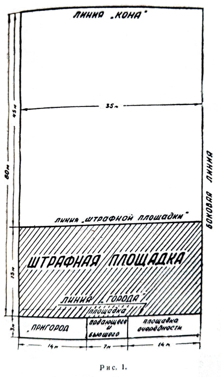

Причем, если ширина игрового поля равна 35 м, то линия «города» делится на части 14—7—14 и при 25-метровой ширине — 10—5—10.

Лапта (бита) представляет собой палку произвольного веса длиной от 1 м до 1 м 20 см и толщиной 4 см диаметре. Материалом для изготовления бит может служить дерево, фибра, прессованная бумага, текстолит, фанера.

Толщина биты со стороны рукоятки не должна быть меньше 3 см. Игрокам разрешается пользоваться своими битами и допускается обмотка рукоятки.

Биты бывают цилиндрические и конусные (рис. 2).

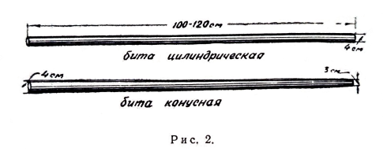

Игрокам в возрасте 12—14 лет разрешается пользоваться плоской лаптой размером до 80 см длиной, 8 см шириной и 2 см толщиной (рис. 3).

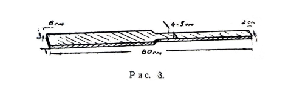

Играют в лапту теннисным мячом.

Каждый вид спорта имеет свои существенные особенности. Легкоатлет-бегун стремится как можно быстрее преодолеть ту или иную дистанцию, прыгун — выше и дальше прыгнуть, метатель — метнуть (толкнуть), гандболист — больше забросить мячей в ворота руками, футболист — ногами, хоккеист — клюшкой, волейболист — не допустить падений мяча на своей площадке, городошник — меньшим количеством бит выбить большее количество фигур, гимнаст — красивее выполнить сложную комбинацию, тяжелоатлет — поднять большую сумму веса и т. д.

Какова же основная сущность игры в лапту?

Каждая команда, состоящая из 6 основных и 9 запасных игроков, стремится в течение игры продолжительностью 60 минут (два периода по 30 минут с 10 минутным перерывом между ними) набрать наибольшее количество очков. Очки начисляются так: после действительного удара каждый игрок, сбегавший из-за линии «*города*» за линию «*кона*» и обратно не осаленным, дает команде одно очко. А так как команда очки может набирать, когда она владеет «*городом*», то есть бьет, то основной ее задачей будет, как можно дольше продержаться бьющей. Команда водящих же стремится быстрее произвести смену, которая бывает игрового порядка, то есть разрешается контросаливать (при осаливании и самоосаливании) и свободного (при ловле «свечи» и отсутствии у бьющей команды игрока с правом на удар).

Подробно описание игры изложено в правилах соревнований.

## СОЗДАНИЕ И ОРГАНИЗАЦИЯ РАБОТЫ СЕКЦИИ ЛАПТЫ В КОЛЛЕКТИВЕ ФИЗИЧЕСКОЙ КУЛЬТУРЫ

Массовое развитие игры в лапту, как и других видов спорта, является основной частью всей физкультурно-спортивной деятельности коллектива физической культуры.

В любом коллективе найдутся любители игры в лапту или желающие научиться хорошо играть, совершенствовать свое спортивно-техническое мастерство в данном виде спорта.

Задача совета коллектива физкультуры заключается в том, чтобы всех любителей этого вида спорта объединить в спортивной секции.

К созданию спортивной секции лапты можно подойти разными путями. Можно просто объявить запись всех желающих заниматься лаптой, назначить и провести общее собрание их, избрать на этом собрании оргбюро секции, которому и поручить решение всех дальнейших вопросов, связанных с организацией и налаживанием учебно-тренировочной работы и пр.

Лучшим будет другой путь.

Созданию спортивной секции по лапте должна предшествовать разъяснительная и организаторская работа. Необходимо пробудить заинтересованность у людей к этому виду спорта.

В этих целях провести беседы, в которых рассказать историю возникновения лапты как вида спорта, когда и где проводились какие соревнования, что с 1958 года разыгрывается официальное первенство Российской Федерации, введена спортивная классификация, что лапта входила, как обязательный вид спорта, в программу Второй летней спартакиады народов РСФСР. Ознакомить слушателей с календарным планом спортивных соревнований по лапте вышестоящих организаций, показать значение лапты в физическом совершенствовании человеческого организма, рассказать о ее доступности, эмоциональности и т. п., организовать показательные выступления команд других коллективов физкультуры.

После краткого ознакомления с основными положениями из правил соревнований по лапте провести открытые соревнования на лучшую команду группы, цеха, класса, факультета, бригады, отделения и т. д.

Затем необходимо позаботиться о создании технических условий для занятий будущей секции, подобрать руководителей, приобрести или изготовить спортивный инвентарь и т. д.

Всей организационной, учебно-спортивной и воспитательной работой секции руководит бюро (в составе председателя и двух — четырех членов бюро), избираемое открытым голосованием на общем собрании членов секции сроком на один год из числа более активных и квалифицированных спортсменов. Бюро распределяет обязанности между членами бюро, дает соответствующие поручения активистам секции.

Бюро секции обязано своевременно составлять планы работы и сметы расходов; разрабатывать (с помощью совета коллектива физкультуры и привлечения специалистов) учебные планы и программы занятий; организовывать команды и группы как для учебно-тренировочных занятий, так и для соревнований; производить выборы капитанов команд и старост групп, контролировать их работу; осуществлять контроль за выполнением, плана учебно-тренировочных занятий и освоением программного материала; организовывать врачебный контроль над занимающимися, учет посещаемости занятий, вовлекать новых членов в секцию и т. д.

Бюро секции разрабатывает положение о соревнованиях по лапте на первенство своего коллектива физкультуры, оказывает помощь совету коллектива в составлении календарного плана спортивных соревнований, в организации и проведении соревнований.

Бюро секции должно заботиться о том, чтобы все члены секции могли участвовать в течение года не менее, чем в 6—8 соревнованиях. Готовя лучших игроков к выступлениям на вышестоящих соревнованиях, не следует забывать о менее подготовленных спортсменах, о новичках. Для них необходимо периодически устраивать соревнования внутри коллектива физкультуры и товарищеские встречи с командами других организации.

Учебно-тренировочная работа в секции должна протекать круглогодично. Перед каждым членом секции должна быть поставлена конкретная задача по повышению спортивного мастерства, выполнению нормативных требований.

В секции должно быть несколько инструкторов-общественников и своя судейская коллегия. Бюро секции наряду с тренировочной работой должно организовывать подготовку общественных тренеров из числа квалифицированных спортсменов, а также и спортивных судей как из числа спортсменов, так и из числа любящих данный вид спорта.

Всем им необходимо изучать имеющуюся литературу по спорту и всемерно обогащать свои знания в области техники, тренировки и правил проведения соревнований по лапте, передавая эти знания во время совместных занятий своим товарищам.

На бюро секции лапты возлагается ответственность и за то, чтобы все члены секции своевременно сдавали нормы ГТО, регулярно проходили медицинское освидетельствование.

Бюро секции должно работать в тесном контакте с тренерами и инструкторами. Указания и распоряжения инструктора и тренера во время занятий должны безоговорочно выполняться спортсменами.

Решения общего собрания или бюро секции в свою очередь являются обязательными для инструктора.

Если инструктор (тренер) и члены бюро секции разойдутся во мнениях (например, о составе команд на вышестоящие соревнования, программе соревнований и т. д.), то вопрос должен быть рассмотрен советом коллектива физкультуры, и его решения являются обязательными для всех.

После года работы бюро отчитывается перед общим собранием членов секции.

## ОСНОВЫ МЕТОДИКИ ОБУЧЕНИЯ И ТРЕНИРОВКИ

Обучение спортивным играм и тренировка — две стороны единого процесса, направленного на подготовку здоровых, всесторонне развитых советских граждан и помогающего им достигнуть наиболее высоких показателей в избранном виде спорта.

В учебно-тренировочный процесс входят следующие разделы: 
1. Физическая подготовка.
2. Техническая и тактическая подготовка.
3. Воспитание волевых качеств.
4. Организационно-методическая и судейская подготовка.

Все эти элементы спортивной подготовки тесно переплетаются между собой и разрешаются в неразрывном единстве.

### ФИЗИЧЕСКАЯ ПОДГОТОВКА

Физическая подготовка — основа для достижения высоких спортивных результатов. В лапте, как и в любом другом виде спорта, необходима всесторонняя физическая подготовка, то есть наличие комплекса определенных физических качеств: силы, выносливости, быстроты, ловкости, гибкости и др.

Всесторонняя физическая подготовка обеспечивает раскрытие всех возможностей организма спортсмена, которая необходима для специализации в избранном виде спорта, в кратчайшие сроки обеспечивает всестороннее развитие физических качеств, создавая условия для прогресса в области техники и тактики, создает прочный фундамент для морально-волевой подготовленности его. Для достижения высоких спортивных результатов в лапте, в первую очередь, необходимо воспитать такие физические качества, как сила, выносливость, быстрота и ловкость.

Физические качества человека не существуют изолированно, они тесно связаны друг с другом. Поэтому применение того или иного физического. упражнения должно рассматриваться с точки зрения только преимущественного воздействия на развитие того или иного физического качества. Например, упражнения с гантелями, развивающие силу рук, в меньшей степени развивают выносливость, и еще в меньшей степени — быстроту.

На развитие определенных физических качеств влияет также и характер выполнения упражнений. Одно и то же упражнение, например. бег при длительном выполнении в среднем темпе — преимущественно будет развивать выносливость, а выполняемый в максимальном темпе — скорость.

**Сила**. Силовые качества человека могут проявляться в поднимании тяжестей, толкании, метании и бросании груза, в прыжках с места в высоту, длину и т. п.

У лаптовиков это качество проявляется (в большей степени) при нанесении ударов битой по мячу, передачах мяча партнерам, при перебежках (с большой скоростью, с резким торможением, изменением направления бега, подпрыгиванием вверх, в стороны, умышленным падением и т. п.). Все эти и другие движения и действия лаптовика требуют наличия силы.

Физиологами установлено, что сила мышцы зависит от величины поперечного сечения мышцы. К работающей мышце приток крови, улучшается ее питание, что приводит ее к развитию и увеличению в поперечном сечении. Для развития мышечной силы необходима работа мышцы, значительно превосходящая нагрузку при обычной деятельности человека. Поэтому интенсивность мышечной нагрузки может увеличиваться либо за счет увеличения внешней нагрузки, либо за счет повышения скорости выполнения движений, либо за счет увеличения количества повторений.

Для лаптовиков наиболее рациональным является увеличение нагрузки за счет повышения скорости и увеличения повторений упражнений, так как такой метод повышения интенсивности физической нагрузки, одновременно с развитием силы, будет способствовать развитию выносливости и скорости. Подбирая упражнения для развития силы, нужно отдавать предпочтение таким, которые развивают мышечную силу.

Для развития силы наиболее характерным упражнением являются: упражнения с тяжестями, упражнения на гимнастических снарядах и упражнения с партнером (парные).

*Упражнения с тяжестями*. Для упражнений применяется штанга небольшого веса, гантели, гири, мешок с песком и т. п. На занятиях применяются следующие упражнения:
1. Выпрямление туловища с грузом в руках.
2. Сгибание и разгибание рук с грузом.
3. Вырывание груза на грудь, выжимание и опускание (в быстром темпе).
4. Вырывание груза прямыми руками вверх и опускание.
5. Наклоны с грузом за головой.
6. Приседание с грузом на груди, на плече или за головой.

Указанные упражнения нужно выполнять с небольшим весом, многократно до утомления работающих мышц, чередуя эти упражнения с упражнениями на расслабление.

Особое место в подготовке лаптовика должны занимать упражнения с набивными мячами, ибо эти упражнения наряду с развитием мышечной силы совершенствуют навыки метания и умения мгновенно переключаться от напряжения к расслаблению.

Помимо упражнений, описанных выше, с набивными мячами применяются упражнения в толчках, бросках из различных исходных положений, в ловле мяча.

*Упражнения на гимнастических снарядах*. Для развития силовых качеств применяются простые упражнения, не требующие предварительного изучения: подтягивание, отжимание в упоре, рукохождение в упоре на руках, лазание по канату, шесту, наклонной лестнице и 
другие.

*Упражнения с партнером*. Выполняются партнерами попеременно. В то время, как один из партнеров выполняет движение, другой оказывает сопротивление и наоборот.

1. Двое стоят лицом друг к другу. Один сгибает левую руку в локте, другой, взяв правой рукой левую руку партнера, — сопротивляется и далее — наоборот.

2. Двое стоят в затылок друг другу. Один ставит ноги в стороны на широкий шаг и разводит руки в стороны, другой, положив руки на предплечья первого, давит медленно вниз, другой партнер, сопротивляясь, поднимает руки вверх.

3. Из того же исходного положения первый опускает руки вниз, второй препятствует этому, подперев руки снизу.

4. Двое стоят лицом друг к другу, вытянув руки вперед. Первый отводит руки в стороны, второй сопротивляется.

5. Первый стоит на коленях, подняв руки вверх, второй, стоя сзади, отводит руки первого в стороны, первый сопротивляется, затем первый поднимает руки вверх, а второй сопротивляется.

6. Двое стоят лицом друг к другу в стойке ноги врозь, взявшись обеими руками (левые руки согнуты), менять положение, оказывая сопротивление партнеру.

7. Первый, наклонившись вперед, выпрямляется, второй, положив руки на плечи первого, оказывает сопротивление.

8. Встав спиной друг к другу, ноги врозь, взяться под руки: первый выполняет наклоны в стороны, второй сопротивляется.

9. Стоя спиной друг к другу, взяться под руки, наклоняясь вперед, навалить партнера на спину.

10. Первый из исходного положения приседа встает, второй, стоя сзади и упираясь руками в плечи первого, оказывает ему сопротивление.

**Выносливость**. Выносливость — это способность организма противостоять утомлению и длительное время выполнять большую физическую работу.

Под влиянием правильной организованной, систематической тренировки выносливость может увеличиваться в десятки раз.

Выносливость вырабатывается с помощью упражнений, отличающихся большой мощностью и длительностью нагрузки.

К таким упражнениям относятся бег на средние и длинные дистанции, гребля на народных и спортивных судах, бег на лыжах, игры в баскетбол, футбол, ручной мяч, а также многократное повторение других упражнений, связанных с прыжками или бегом. (эстафеты, подвижные игры, упражнения со скакалкой и др.).

Наиболее рациональными. видами развития выносливости лаптовика будут: бег по пересеченной местности, игра в ручной мяч, ходьба на лыжах.

Бег по пересеченной местности вначале нужно проводить, чередуя с ходьбой, в равномерном темпе. Затем, по мере развития выносливости, бег строить с интервальными ускорениями.

Гребля является прекрасным средством развития не только выносливости, но и силы. Она ценна и тем, что тренирует те мышцы туловища и плечевого пояса, которые принимают наиболее активное участие при ударах по мячу и бросках мяча.

Особенно ценным средством развития выносливости лаптовика является игра в ручной мяч, которая, помимо развития общей выносливости, развивает выносливость тех мышц, которые выполняют основную работу при бросках и ловле мяча, ударах по нему битой. В зимне время хорошим средством развития выносливости будет бег на лыжах, бег по глубокому снегу.

Наряду с общей физической выносливостью лаптовику очень важно выработать так называемую скоростную выносливость, дающую возможность ему поддерживать высокий темп бега на протяжении всей игры. Скоростная выносливость развивается путем многократного пробегания в высоком темпе дистанции 200—400 м с небольшими перерывами для отдыха, а также выполнением скоростных. упражнений в состоянии утомления.

**Скорость**. Скорость движения человека зависит от темпа мышечных сокращений, определяющих быстроту перемещения в пространстве и скорости реакции. Для развития скорости применяются бег на короткие дистанции 30—50—100 м, бег с ускорением, подвижные и спортивные игры (баскетбол, ручной мяч, футбол).

Скорость реакции, необходимая лаптовикам для оценки тактических ситуаций, возникающих в процессе игры, развивается при выполнении упражнений по внезапно подаваемым командам и сигналам, а также в процессе занятия другими видами спортивных игр.

**Ловкость**. Ловкость движений характеризуется способностью человека без большого напряжения выполнять целесообразные и сложные по координации действия, способность быстро переключатся от одних действий к другим, а также умение создавать новые движения в связи с изменившейся обстановкой.

Ловкость воспитывается целым рядом физических упражнений, из которых особенно большое значение имеют сложные по координации гимнастические упражнения и прыжки, акробатические упражнения, прыжки со скакалкой, спуски на лыжах с гор и различные игры.

Упражнения на ловкость не рекомендуется проводить при сильном утомлении и плохом самочувствии спортсмена. Лучше их выполнять в начале основной части занятия.

Необходимо также строго соблюдать постепенность перехода от простого к сложному.

В игре в лапту ловкость играет исключительно важную роль. Особенно ловок игрок должен быть при осаливании, ловле и передачах мяча, ударах по нему. Немаловажны моменты ловкости и при перебежках. (умение при осаливании пригнуться, подпрыгнуть, уклониться в сторону и пр.).

**Гибкость**. Гибкость создает основу для свободных движений, соответствующих нормальной анатомической подвижности суставов. 

Для освоения техники игры в лапту и, особенно, для достижения высоких спортивных результатов первостепенное значение имеет подвижность плечевых. лучезапястных, голеностопных и тазобедренных суставов, а также позвоночного столба.

Хорошая подвижность суставов создает условия для более рационального приложения мускульной силы при перебежках по полю, выполнении приемов при ударах по мячу и ловле его.

Все упражнения для развития гибкости необходимо выполнять, соблюдая последовательных переход от движений медленных к движениям более быстрым, выполняемым рывком. Наиболее типичными являются: наклоны головы вперед и в стороны, с силой до отказа, повороты головы рывком вправо и влево, поднимание выпрямленных рук, рывком вперед и назад, в стороны до отказа, кружение рук в лучезапястных, локтевых и плечевых суставах; повороты корпуса вправо и влево до отказа, с рывком вытянутых в стороны рук, в положении — ноги врозь; наклоны туловища вправо, влево, вперед, назад до отказа, в положении — ноги. врозь или вместе (колени выпрямлены); махи прямой ногой вперед, назад и в стороны.

В некоторых случаях применения вольных упражнений бывает недостаточно. Тогда прибегают к следующим приемам: применяют повторные пружинящие движения, прибегают к активной помощи партнера или использованию дополнительной внешней опоры (скамейки, стенки и др.).

Перед проведением упражнений на растягивание нужно проделать ряд разогревающих упражнений, чтобы избежать разрыва мышечных волокон, чрезмерных растяжений сухожилий и связок.

**Упражнения на расслабление**. Упражнения: на расслабление вырабатывают умение мгновенно выключать напряжение остальных мышц или группы мышц, не участвующих в данном. Движении.

Чередование напряжения с расслаблением создают условия для отдыха мышц и способствуют формированию свободных экономных движений, дающих возможность проводить игру в высоком темпе.

Умение расслаблять мышцы рук необходимо при выполнении ряда технических приемов с мячом: ударах по мячу битой, ловле его и при выполнении бросков мяча (при осаливании и передачах партнеру).

Упражнения на расслабление используются также в качестве отвлекающих или для кратковременного отдыха после упражнений силового характера или упражнений на скорость.

Большинство упражнений на расслабление сравнительно трудны для исполнения и требуют длительной серьезной работы для их усвоения. Поэтому в первых занятиях не следует давать одновременно много новых упражнений этого типа.

Наиболее простыми упражнениями на расслабление являются те, в которых используется пассивное падение вниз отдельных расслабленных частей тела (кистей, предплечий, рук, ног). под влиянием собственной тяжести.

Из упражнений на расслабление можно рекомендовать: расслабленное опускание рук вниз из положения руки вперед и в стороны; пассивное размахивание руками за счет быстрых поворотов корпуса; встряхивание плеч за счет подскоков на двух или на одной ноге; последовательное расслабление кисти, предплечья, плеча; расслабленное опускание туловища со сгибанием ног; свободное встряхивание одной ногой, стоя на другой; свободное раскачивание расслабленной ноги вперед, назад и др.

При подборе упражнений общефизического развития необходимо учитывать особенности возраста, пола, степень подготовленности занимающихся.

Упражнения должны быть доступны, но в то же время не следует излишне упрощать их, так как слишком легкие упражнения или трудные могут уменьшить интерес к занятиям у занимающихся.

Помимо общеразвивающих упражнений используются специальные упражнения, вырабатывающие качества, необходимые лаптовику, например упражнение на развитие скорости, силы, ловкости, прыгучести, глазомера, игра в ручной мяч, волейбол, баскетбол, теннис (большой и малый), городки и др.

### ТЕХНИЧЕСКАЯ И ТАКТИЧЕСКАЯ ПОДГОТОВКА

Одним из важных условий достижения высоких спортивных результатов является освоение техники игры в лапту, то есть специальных приемов — действий игрока, необходимых для ведения игры. ,

В лапте существуют следующие технические приемы: подбрасывание мяча, удар по мячу, ловля и передача мяча, перебежка, осаливание.

В игре необходимо хорошо владеть всеми этими приемами, в первую очередь ударами по мячу и ловлей его, уметь быстро и точно осаливать.

**Подбрасывание мяча**. Подбрасывание (подачу) мяча производит назначенный капитаном игрок «водящей» команды. Игрок, подбрасывающий мяч, должен обеими ногами находиться в «площадке подающего», боком к полю и лицом к бьющему игроку. Ноги расставлены на ширине плеч. Одна нога несколько выставлена вперед. Ноги согнуты (полуприсед) в суставах, туловище слегка наклонено вперед. Мяч находится на раскрытой ладони, выставленной вперед и находящейся на уровне пояса (рис. 4).

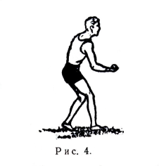

Рука с мячом может быть прямая, но чаще всего несколько согнута в локтевом суставе. Взгляд направлен на мяч и на бьющего игрока. Из указанного положения рука с мячом, несколько опускаясь вниз, резко поднимается вверх, сгибается еще больше в локтевом суставе и толчковым движением кисти руки мяч подбрасывается вверх на требуемую высоту.

Подающий игрок может находиться от бьющего на любом расстоянии, но в пределах «площадки подающего», выполняя просьбу последнего.

Имитировать подбрасывание мяча (обманывать игрока, производящего удар) запрещается. Такое подбрасывание засчитывается как неправильное.

От подающего во многом зависит игровой ход и результат игры. Если мячи подаются хорошо, игра носит более оживленный характер и бывает наруку противнику. Тактически грамотный игрок никогда хорошо не подаст мяча, если бьющий, прежде чем ударить не покажет битой, как ему подать, или подбросит, как требуют, но при подбрасывании незаметным движением руки (кисти) придаст мячу вращательное движение. А после удара по такому мячу он может пойти не так, как это хотелось бы бьющему — изменит траекторию и направлением, будет засчитан как недействительный.

**Удар по мячу**. Игрок, производящий удар, должен обеими ногами стоять в площадке подающего, боком или лицом к полю. Ноги расставлены на ширине плеч или немного больше. Нога, которая ближе к полю, обычно выставляется несколько вперед (на расстояние 1—1,5 ступни).

В момент замаха лапты тяжесть тела переносится на правую ногу, которая несколько сгибается в коленном суставе, опираясь всей ступней о землю. Левая нога (если стоять к полю левым боком), становится на носок, и она полностью разгибается в коленном суставе. Глаза все время контролируют мяч, находящийся в руках подбрасывающего игрока. Руки, зажимающие лапту и находящиеся одна над другой (причем сверху должна быть рука, в сторону которой производится замах лапты), заносятся вверх, назад, за голову, согнутые в локтевых суставах. Плечи при этом разворачиваются в сторону замаха. После того, как мяч подброшен, лапта с силой опускается на мяч, при этом тяжесть тела переносится на впередистоящую ногу. Движение рук с лаптой перед самым ударом по мячу значительно убыстряется. И в момент удара делается резкий рывок кистями рук. Туловище игрока, после начала опускания рук для удара, выпрямляется и начинает поворачиваться плечами в сторону поля. Ноги при этом меняют свое положение. Нога, ближайшая к полю, переходит на всю ступню, сгибаясь в коленном суставе, а другая, наоборот, становится на носок и выпрямляется (рис. 5).

Удар по мячу лучше всего производить в тот момент, когда он будет находиться на уровне пояса или немного выше его. Этот способ удара по мячу двумя руками является основным. Применяется способ удара по мячу и одной рукой (рис. 6). Техника выполнения этого удара аналогична вышеописанной.

Может быть применен способ удара по мячу, при котором замах производится двумя руками, а сам удар по мячу — одной рукой.

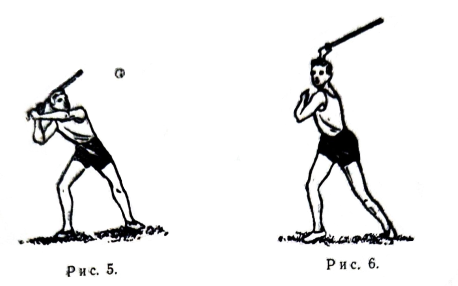

За последнее время во многих командах ряд игроков применяет способ удара по мячу, когда бьющий стоит не боком, а лицом к полю и ударяет мяч в момент нахождения последнего на уровне выше головы (рис. 7). Иногда это делается в прыжке. При этом ударе бита (лапта) движется в вертикальной плоскости или близкой к ней. Применение этого способа вызвано тем, что-бы избежать «свечевых» ударов. Лучше всего он приемлем для игроков высокого роста.

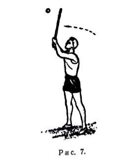

Существует и ряд других способов удара по мячу, но существенных изменений в технику исполнения они не вносят.

После удара игрок должен бросить лапту в пределах площадки подающего или оставить ее в своих руках и самому остаться в пределах этой площадки. В противном случае, если лапта будет оставлена в поле или на линии, удар засчитывается недействительным, и перебежка не разрешается. За исключением умышленного выбрасывания биты на линию или в поле, когда ловится «свечевой» мяч.

В целях лучшего изучения техники ударов по мячу и рационального применения того или иного способа, исходя из индивидуальных особенностей игроков, можно удары по мячу условно классифицировать, взяв, допустим, за основу классификации траекторию полета мяча, движение мяча относительно сторон игрового поля или плоскость движения биты. По траектории полета мяча удары можно назвать *продольные*, *свечевые* и *пикирующие* (рис. 8).

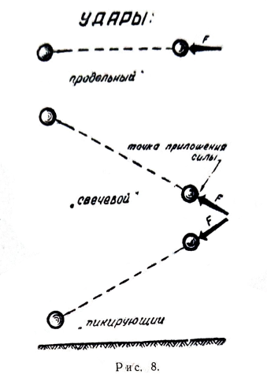

При *продольном* ударе мяч движется параллельно плоскости игрового поля, и сила биты прилагается на мяч в точку, находящуюся в момент удара на оси движения мяча, параллельно плоскости игрового поля.

При *свечевом* ударе мяч движется по линии, восходящей вверх. Удар производится снизу. И, наоборот, при *пикирующем* ударе мяч движется по нисходящей линии. Удар производится сверху.

По движению мяча относительно сторон игрового поля удары можно назвать: *параллельные*, *боковые* и *диагональные* (рис. 9).

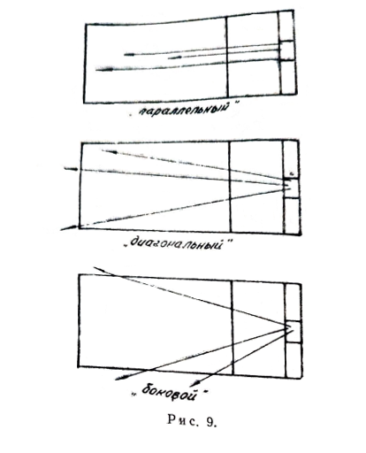

*Параллельные удары* — это такие удары, при которых мяч движется по линии, параллельной боковым линиям поля.

*Боковые удары* — удары, при которых мяч движется в сторону боковых линий и пересекает их.

При *диагональных ударах* мяч отклоняется от параллельной линии движения, не пересекая боковых линий. При всех этих ударах мяч может двигаться как по воздуху, так и по земле.

Относительно плоскости движения биты удары можно назвать: *горизонтальные* и *вертикальные* (рис. 10).

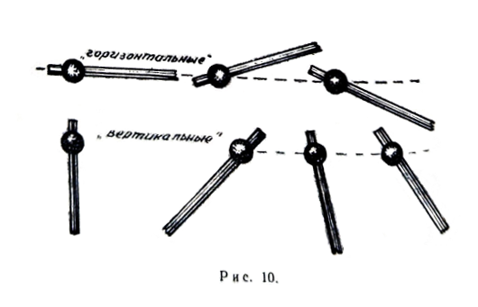

*Горизонтальные* удары — это такие удары, при которых бита в момент удара движется в плоскости, параллельной плоскости игрового поля или немного наклонной к ней.

При *вертикальных* ударах бита движется в вертикальной плоскости или близкой к ней.

Исходя из этой условной классификации удары можно, например, называть так: *вертикально-свечевой-диагональный* (*горизонтально-свечевой-диагональный*), *горизонтально-пикирующий-боковой* (*вертикально-пикирующий-боковой*) и т. п.

В начале обучения не следует обращать внимания на силу удара. Нужно учесть следующее, что на первых порах попасть по мячу очень трудно. Лучше всего занимающихся разбить на пары и поставить у стенки или лучше у сетки. Одни подбрасывают — другие выполняют удар. При этом нужно сразу же заострить внимание на том, чтобы битой удар наносился сверху. Тогда мяч пойдет на высоте пояса (груди) или низом по земле. А такие мячи ловить и останавливать трудно. На поле всегда имеются неровности — катящийся мяч неожиданно может изменить направление.

После овладения этими упражнениями расстояние от стенки (сетки) увеличивается до 15—20 м. А затем можно разрешить бьющему игроку произвести удары на дальность.

После этих упражнений вся работа переключается на отработку точности ударов по мячу.

В настоящее время лучшие команды работают над ударами, при которых мяч движется в диагональном или боковом направлениях по низкой траектории или катясь по земле (*продольно-диагональные*, *продольно-боковые*, *диагонально-пикирующие*).

Для выполнения такого удара замах делается тот же самый, что описан выше, но в момент удара бита идет резко, почти вертикально, вниз, и удар наносится нижнебоковой частью биты в тот момент, когда мяч будет находиться в 15—20 см от земли (рис. 11).

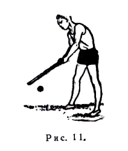

Удар с лапте — один из важнейших элементов игры. Промахи и слабые удары обедняют игру, делают ее неинтересной для зрителя и для самих игроков.

Бить точно и далеко должен каждый лаптовик. Но, как показала практика, в любой команде не все игроки хорошо владеют ударами по мячу. И это должен учитывать тренер при разработке тактического плана игры — правильно расставить игроков по номерам. Обычно под первым и вторым номерами выступают самые слабые бьющие, но самые быстрые в беге.

Хорошо владеющие ударом играют под номерами пятым и шестым. Остальные игроки, владеющие ударом, выступают под третьим и четвертыми номерами.

Силу удара и направление полета мяча всегда нужно разнообразить в зависимости от игровой обстановки. Допустим, пробить на дальность и тем самым оттянуть игроков водящей команды ближе к линии «кона» и за нее, а затем послать в сторону, в поле ближе к «штрафной линии». Водящие при этом теряют лишние секунды при ловле мяча, а бьющие пробегают лишние метры по полю.

Дальние удары хороши при перебежке в «город» из-за линии «кона», ибо за время лета мяча игрок успевает преодолеть определенное расстояние, к тому же мяч летит в противоположную сторону. И пока мяч передадут к линии «города» для осаливания, бегущий, как правило, успевает закончить перебежку или заканчивает ее, водящий не осмелится применить осаливание на случай его недействительности или промаха.

Боковые удары приемлемы при перебежках в любую сторону. Лучшим ударом считается *боковой пикирующий* с первоначальным касанием мяча после удара ближе к боковому флажку на «штрафной линии».

После ловли мяча с воздуха («свеча») происходит смена бьющих, поэтому очень часто игроки стараются избежать свечевых ударов. Но это не всегда правильно. И свечевыми ударами нужно пользоваться, особенно, когда игроки водящей команды плохо владеют ловлей мяча или расположены на поле против солнца и т. п.

Работать над ударами нужно на каждом тренировочном занятии. Многие команды проигрывают только из-за того, что нет стабильно бьющих игроков или удары получаются слабые, легко перехватываемые противником. А в настоящее время, после изменения правил соревновании, перебежку разрешается выполнять после того, как мяч после удара первоначально коснется за «штрафной линией», пролетев пятнадцатиметровый коридор.

Если раньше многие команды, не владея хорошими ударами, строили свою тактику на выводе мяча за линию «города» простым касанием биты и начинали бег, то сейчас этим приемом пользоваться нельзя. Поэтому нужно кропотливо работать над совершенствованием ударов по мячу.

Обладая хорошими разнообразными ударами, команда может смело соперничать с командами, превосходящими ее в скорости.

**Ловля и передача мяча**. На занятиях очень много времени нужно уделять отработке ловли мяча, так как многие игры показывают, что если игроки команды плохо владеют ловлей мяча, то она может проиграть слабой команде.

Ловить мяч, падающий сверху, нужно двумя руками. Кисти при этом образуют своего рода воронку. Пальцы расслаблены. Как только мяч коснется пальцев, следует его сразу же зажать в руках (рис. 12).

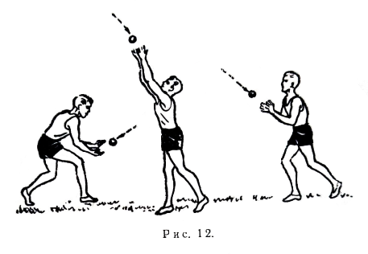

Если мяч не падает сверху, а летит по прямой выше головы, рекомендуется ловить такой мяч одной рукой (рис. 13). При этом рука с раскрытой ладонью выставляется навстречу летящему мячу. Можно ловить такой мяч и двумя руками, лучше в прыжке.

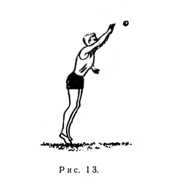

Если мяч катится по земле или прыгает, нужно в момент ловли присесть или лечь перед мячом (рис. 14).

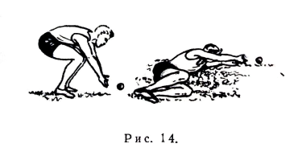

При этом другой игрок водящей команды должен обязательно подстраховывать игрока, пытающегося поймать или остановить мяч, на случай неудачной ловли.

Существует очень много упражнений для отработки ловли мяча. Лучше всего работать в парах на расстоянии 8—10 м друг от друга, бросая мяч одной рукой, а ловя двумя.

Постепенно расстояние увеличивается, мяч посылается резче. Такая же ловля мяча с отражением от пола. То же, но ловить и передавать мяч одной рукой. Затем все эти упражнения проделываются в движении, например, трое игроков с одним мячом передвигаются в свободном направлении, передавая мяч друг другу и т. п.

С каждым занятием упражнения на ловлю мяча усложняются, например, один игрок стоит в кругу и быстро ловит 2—3 мяча от других и передает им и т. п.

Немаловажно уметь точно и сильно передавать мяч партнеру (бросать) с любого расстояния.

Обычно на дальних передачах применяются броски, когда замах производят сбоку или из-за плеча. Техника исполнения аналогична технике метания гранаты и копья (рис. 15).

На коротких передачах можно бросать мяч без замаха (снизу или от плеча), чтобы не терять лишних секунд на замах, за счет движения кисти и разгибания предплечья (рис. 16) или бросать прямой или согнутой рукой снизу (рис. 17).

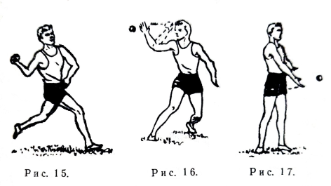

**Перебежка**. Стержневую роль в процессе игры выполняет перебежка. Можно хорошо владеть ударами по мячу, но, тактически неграмотно проведя перебежки, —свести к нулю все усилия команды к победе.

Перебежку разрешается начинать из-за линии «города» или «кона» и бежать в любом направлении (по прямой, зигзагом, в сторону, с возвращением назад, и продолжением бега вперед и т. д.), соблюдая лишь обязательное условие: начав перебежку из-за линии «города», нужно закончить ее, добежав за линию «кона», и наоборот.

При перебежке игрок должен бежать по прямой как можно быстрее и все время не выпускать из поля зрения летящий мяч или игрока, владеющего им.

Игрок, собирающийся делать перебежку, после удара становится за линией «города» (в «пригороде» положение высокого легкоатлетического старта, готовым начать перебежку. Начинать перебежку нужно сразу же после удара по мячу, не дожидаясь, пока мяч упадет на землю, действительным или недействительным будет удар, потому что за время полета мяча игрок успеет пробежать определенный отрезок дистанции и его труднее потом осалить. И, наоборот, не нужно преждевременно выскакивать за линию «города» («кона») до удара, чтобы хороший удар не был засчитан как недействительный.

Для этого лучше всего стартовое положение принимать в полутора-двух шагах от линии «города» или «кона».

Как только мяч опустится и будет находиться в руках игрока водящей команды, игрок, делающий перебежку, должен, продолжая бег, все время видеть этого игрока с тем, чтобы при попытке, когда его будут осаливать, иметь возможность изменить направление бега или вернуться назад и тем самым дать возможность пробежать неосаленными другим игрокам из своей команды, особенно несущим очки.

При перебежке нужно находиться как можно ближе к боковым линиям и быть дальше от игроков водящей команды на случай передачи мяча этим игрокам и возможного осаливания.

Если перебежка проводилась из-за линии «города», то игрок, добежав до линии «кона», самостоятельно, в зависимости от того, где находится мяч, принимает решение остаться здесь до следующего удара партнера или продолжать перебежку обратно. При этом нужно помнить одно условие — не нужно рисковать собой напрасно, то есть не начинать бег, когда ты находишься в невыгодных условиях для себя, и рисковать интересами команды. Особенно это правило нужно соблюдать, когда за линией «конах» находятся 3—4 игрока.

В этом случае игрокам, находящимся за линией «кона», перебежку можно начинать самим, не дожидаясь последующего удара, но бег начинать одновременно всем, очень быстро разделившись поровну на две группы и придерживаясь ближе к боковым линиям. Лучше в тот момент, когда водящая команда будет передавать мяч для подачи и он будет находится ближе к «городу». Например, после действительного удара по мячу игроком бьющей команды № 4 (бьющие обозначены на рис. 18 белыми круглешками с цифрами внутри) игроки под номерами 1, 2, 3, 5 сделали перебежку за линию «кона» и на какое-то время задержались там, показав противнику, что они не собираются бежать обратно.

Игроком водящих под № 4 мяч быстро посылается второму номеру для следующей подачи. И когда последний с мячом приблизится ближе к линии «города», игроки бьющей команды, разделившись поровну на две группы (первая № 1 и 3, вторая № 2 и 5) быстро начали перебежку за линию «города» одновременно.

Игрок под № 2, владеющий мячом, устремляется навстречу (можно передать мяч и партнеру под № 5).

Но бегущими уже пройдена половина дистанции. Водящий с мячом стремится осалить одного из игроков первой группы, но те быстро поворачиваются и бегут в обратном направлении к линии «кона», затягивая момент осаливания. Вторая группа в это время на большой скорости стремится как можно быстрее. закончить перебежку и дать команде два очка. И, как показала практика, в большинстве случаев игроки одной из групп бьющей команды успевают закончить перебежку и дать очки. При этом произойдет пересмена, но это неважно — важны полученные очки.

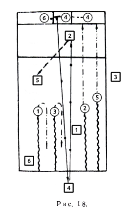

Необходимо очень внимательно следить, чтобы при осаливании игрок, владеющий мячом, не вынудил ложным замахом пригнуться или сделать «падение», так как в этом случае ему легче будет произвести осаливание и труднее сделать контросаливание.

При осаливании партнера всегда нужно его подстраховывать на случай быстро произвести ответное осаливание. Перебегая по полю, не нужно останавливаться: при попытке тебя осалить — в бегущего попасть значительно труднее, при ловле «свечи» — не всегда она может быть поймана.

Лучше всего перебежку начинать группой, ибо имеется преимущество набрать большее количество очков при одинаковой возможности потерять право владения «городом» и быстрее можно произвести ответное осаливание. Но групповые перебежки требуют от игроков слаженных коллективных действий, умения быстро ориентироваться в сложившейся игровой обстановке. Для этого нужно иметь несколько тактических вариантов перебежек.

**Осаливание**. Осаливание (касание мячом любой части тела игрока) есть важный элемент в игре водящей команды. В момент игры осаливание самому, владеющему мячом, следует производить лишь в том случае, если есть полная уверенность в возможности попадания или когда нет партнера, находящегося в более близком и удобном положении.

Если в момент ловли мяча игрок, делающий перебежку, успел уже удалиться и к нему находится ближе другой партнер, следует сразу же передать мяч последнему.
Не следует очень сильно бросать мяч в игрока, делающего перебежку, так как, если осаливание не произойдет, мяч может далеко укатиться.

Лучше всего осаливание производить на уровне пояса, с тем, чтобы мяч попал в игрока в случае, если но пригнется или подпрыгнет, Рекомендуется перед осаливанием сделать ложный замах, но для того игрока, который на бегу контролирует мяч.

Очень опасно производить осаливание у лицевых линий. В случае промаха мяч может выйти за линию «города» («вне игры» — мяч в игру вводить не разрешается, а игроки, делающие перебежку, обязаны ее закончить в одном направлении) или за линию «кона», когда игроки смогут вернуться обратно и принести очки.

Во время двухсторонних игр нужно особенно работать над тем, чтобы при осаливании, когда одновременно делают перебежку 3—4, а иногда и 5—6 игроков, владеющий мячом не передавал мяч партнеру, а сам быстрее производил осаливание, так как в момент передачи бегущие смогут удалиться на значительное расстояние, и если партнер не поймает мяч, то смогут все добежать до линии.

Рекомендуется выбрать одного из игроков и преследовать его до конца, стараясь как можно. быстрее к нему приблизиться и не давая другим закончить перебежку.

Если произошло осаливание, игрок, находящийся ближе всех к мячу, должен как можно быстрее взять мяч и произвести ответное осаливание или передать мяч партнеру, который в данный момент ближе других находится к игрокам противника.

Не нужно стараться сделать осаливание на расстоянии от игрока (за исключением моментов, когда другие игроки противника не имеют права на перебежку или заканчивают бег за линию «города», при ответных осаливаниях), а идти на сближение с противником, чтобы осалить наверняка.

Встречно бегущего к тебе противника лучше всего осаливать самому, убегающего — быстрее передать мяч партнеру, навстречу которому он бежит.

При групповой перебежке противника нужно в первую очередь выбирать для осаливания игрока, несущего очко, стараясь быстрее его осалить, не дав возможности другим закончить бег.

Никогда не нужно рисковать осалить противника, бегущего одного (даже с очком), особенно в сторону «кона», на дальнем расстоянии и если за линией «кона» и в «городе» есть игроки, готовые к перебежке. В такие моменты салить только наверняка. 

Очень важно для водящей команды правильно расположить игроков на поле, чтобы контролировать его и иметь возможность в любом месте ловить мяч и быстро осаливать.

При этом нужно учитывать, какими ударами владеет команда противника, ее скоростные качества при перебежках.

Обычно расположение игроков на поле и зоны их действия (обозначенные квадратами) — это 2—1—2 (рис. 19).

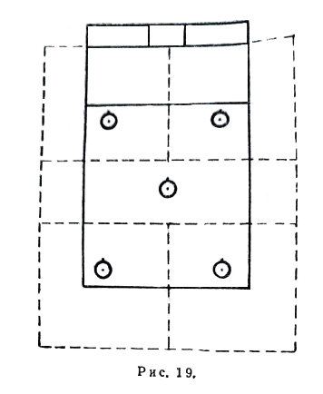

Но если команда противника хорошо владеет боковыми ударами, нужно укреплять боковые стороны в районе флажков на «штрафной линии». Расстановка игроков на поле — 2—2—1 или 1—2—2 (рис. 20). Ставить игроков в эти места нужно наиболее подвижных, хорошо владеющих ловлей.

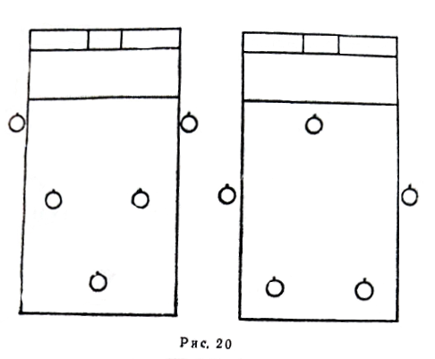

Если противник владеет диагональными и параллельными дальними ударами, расстановка аналогична предыдущей. Все игроки оттягиваются ближе к линии «кона» и за нее (рис. 21).

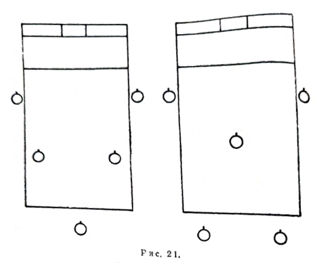

При любой расстановке игроки не должны стоять на месте, а всегда, в зависимости от обстановки, перемещаться в сторону летящего мяча, перебегающего противника, подстраховывать товарища при ловле мяча и осаливании, не мешая ему, и т. п.

Описанные выше варианты расстановок игроков на поле не являются постоянными, приемлемыми для всех команд. Они могут всячески видоизменяться.

За пределы поля игроку необходимо выходить только на моменты ударов по мячу. А как только удар пробит и началась перебежка, все водящие должны войти на игровое поле для организации осаливания, страховки партнеров и т. д., а при осуществлении его — быстрее убежать в «город» или за линию «кона».

Обучение техническим приемам проводится в следующей последовательности:
- 1) общее ознакомление с приемом;
- 2) разучивание приема в упрощенных условиях;
- 3) разучивание приема в условиях, близких к игровым;
- 4) закрепление приема в двухсторонней учебной игре, товарищеских встречах.

Общее ознакомление с техническим приемом, объясненным и показанным тренером, дает занимающимся полное представление о разучиваемом приеме. Показ должен быть образцовым, объяснение — кратким, образным, доходчивым, дополненным наглядными пособиями: рисунками, кинограммами, схемами и т. п.

Затем занимающиеся делают пробные попытки выполнить этот прием в упрощенных условиях.

При обучении техническим приемам применяются два метода — целостный и расчлененный. В первом случае прием разучивается целиком, во втором— расчленяется на составные части, каждая из которых отрабатывается самостоятельно. После этого прием отрабатывается в целом.

После усвоения занимающимися выполнения прием в упрощенных условиях им необходимо дать упражнения, которые приближали бы выполнение технического приема к условиям игры. Окончательное закрепление технического приема происходит уже в процессе игры. 

Во время учебной игры при отработке того или иного приема следует обращать внимание не только на правильную технику выполнения, но и на тактическую целесообразность приема в данной игровой обстановке.

Одной из главных задач тренера в процессе обучения является выявление ошибок при выполнении технических приемов. Чем раньше ошибки будут обнаружены, тем легче и быстрее можно их исправить.

Для этого нужно прежде всего определить причины возникновения ошибок, а потом приступить к устранению сначала основных ошибок а затем мелких неточностей. Для исправления ошибок применяются повторный показ и объяснение, облегчение условий выполнения приемов, специальные подготовительные упражнения и др.

Обучение технике и тактике производится одновременно.

Под тактикой в спортивных играх понимается организация индивидуальных и коллективных действий игроков и команды, направленных на достижение победы над противником. В процессе тактической подготовки развивается способность игроков быстро и точно оценивать складывающуюся игровую обстановку и принимать правильное тактическое решение.

Задача тренера — привить игрокам умение творчески вести игру, организуя свои действия с учетом особенности конкретной игровой обстановки, возможности как своей команды, так и команды противника.

Необходимым условием совершенствования тактики является владение в совершенстве теми или иными техническими приемами. Отсюда и будет зависеть тактика игры.

### ВОСПИТАНИЕ ВОЛЕВЫХ КАЧЕСТВ

Волевая подготовка осуществляется на протяжении всего учебно-тренировочного процесса.

Процесс волевой подготовки всегда должен быть целенаправленным. Целенаправленность его определяется перспективными и ближайшими, но всегда конкретными целями и задачами.

Перспективность цели обычно определяется на год-два или более длительный срок (допустим, в крупных соревнованиях занять определенное место и др.) в полном согласовании с ними ближайших целей и задач, относящихся к тренировке, выступлениям в соревнованиях, к соблюдению режима жизни и т. д.

Волевая подготовка направлена на развитие у занимающихся необходимых морально-волевых качеств: патриотизма, сознательной дисциплины, коллективизма, настойчивости, смелости и решительности, самостоятельности, выдержки, самообладания и т. п.

Решая указанные задачи, необходимо иметь в виду, что эти основные качества воспитываются в процессе повседневной спортивной деятельности и преодоления трудностей, возникающих на пути овладения техникой и ее совершенствования, роста тактического мастерства спортсмена, уровня его общей и специальной физической подготовки.

Огромную роль при этом играют влияние коллектива, роль тренера и судьи.

Тренер должен на каждом занятии добиваться от занимающихся того, чтобы они творчески решали поставленные перед ними задачи, осмысленно подходили к своим действиям в процессе обучения, тренировки и соревнований.

Приучая игроков к самостоятельности и инициативности, нужно стремиться привить им навыки:

- действовать не по шаблону, стандартно, а с использованием имеющихся знаний и умений в зависимости от изменения действий противника;

- уметь быстро оценивать изменившиеся условия игры и видеть необходимость изменения собственных действий и действий своих партнеров;

- уметь творчески, новаторски изменять способы действий при изменении игровой ситуации;

- уметь без посторонней помощи оценить целесообразность или нецелесообразность действий своих партнеров и противника;

- критически относиться к советам «со стороны» (подсказкам болельщиков);

- не быть самоуверенным в безошибочности своих замыслов и действий;

- быть во всем самокритичным;

- уметь отрешиться от заранее составленного мнения о противнике, своих собственных возможностях

В лапте, как ни в одном виде спортивных игр, очень важным фактором проявления воли является решительность и смелость, то есть способность своевременно принимать обдуманные решения и своевременно их реализовать, не боясь принять на себя ответственность за риск.

В играх бывает очень часто, когда неожиданная, смело начатая перебежка игроком бьющей команды в момент, не выгодный для себя, но неожиданный для противника, вносит растерянность в его ряды, при которой он может промахнуться при осаливании или же дать возможность некоторым игрокам закончить перебежку.

Особенно риск начать перебежку оправдывается необходимостью, когда с правом на удар остается один или двое партнеров, плохо владеющих ударами по мячу.

При этом игрок должен уметь:

- своевременно принять решение и без промедления действовать;

- найти целесообразное действие для реализации принятого решения;

- не бояться взять на себя ответственность за свои действия;

- преодолеть чувство неуверенности, сомнения, страха.

Большую роль в достижении высоких спортивных результатов играет воспитание у занимающихся таких волевых качеств, как настойчивость, выдержка и самообладание.

**Настойчивость** — это способность длительно и упорно, не снижая энергии и активности, вести спортивную борьбу, преодолевая многие, в том числе и неожиданно возникшие трудности.

Для этого необходимо в процессе тренировки и соревнований приучать занимающихся к тому, чтобы они:

- не отступали перед трудностями, не стремились их обойти;

- умели преодолеть личные недостатки во имя интересов команды;

- не снижали энергии и активности в связи с неудачами или допускаемыми ошибками, трудным внутренним состоянием организма (утомление, травма и пр.) и другими причинами.

**Выдержка и самообладание** — способность сохранять ясность ума, управлять своими чувствами и действовать в условиях эмоционального возбуждения или подавленности, интенсивных напряжений, утомления, возникновения неожиданных трудностей, неудач и т. д.

Обычно причинами недостаточности развития этих качеств являются:

- состояние «стартовой лихорадки» или «стартовой апатии»

- растерянность в связи с неожиданностями или неудачами в ходе игры;

- угнетение в связи с проигрышем первой половины игры

- в угнетение и растерянность в связи с высокой технической и тактической подготовкой команды противника (особенно, если это является неожиданным);

- возбуждение в связи с неполадками в организации соревнований и в судействе;

- возбуждение или угнетение в связи с нарушением согласованности и взаимопонимания с партнерами, собственными неполадками в игре;

- неспособность преодолеть внутреннее состояние утомления, усталости и пр.

Для развития любого волевого качества нужно ставить спортсмена в такие условия, которые требовали бы проявления определенного качества. И очень важно, чтобы эти условия были повторяющимися.

Воля в значительной степени воспитывается в соревнованиях, где спортивная борьба вызывает эмоциональный подъем, способствует проявлению всех сил и способностей спортсмена.

Воля к победе должна подкрепляться хладнокровием и расчетом своих сил. Желание достичь победы не может влиять на обычные для советского спортсмена нормы поведения на соревнованиях и в повседневной жизни.

Спортивная борьба должна вестись честно, игрок должен корректно относиться к своим соперникам.

Волевые качества воспитываются и развиваются так же путем строгого соблюдения повседневного режима.

Каждый занимающийся должен быть требователен к себе, неустанно совершенствовать свое мастерство, повышать свой идейный, политический уровень, общеобразовательную подготовку, быть дисциплинированным и организованным.

### ПЛАНИРОВАНИЕ И УЧЕТ

ля достижения высокого мастерства в игре в лапту, как и в других видах спорта, необходимо настойчиво и систематически тренироваться, чаше принимать участие в соревнованиях. Во время тренировки совершенствуется физическая, техническая и тактическая подготовка игроков, повышаются их волевые качества.

Тренировка дает положительные результаты тогда, когда она проводится регулярно, по определенному плану, а не сезонно (перед соревнованиями), что тормозит повышению качества учебно-тренировочных занятий, росту технического и тактического мастерства. Тренировочный процесс должен быть непрерывным, круглогодичным.

В организации и содержании круглогодичной работы тренеры должны придерживаться положения о делении годичного цикла тренировки на три периода: *подготовительный*, *соревновательный* (основной) и *переходный*.

В средней полосе СССР, где соревнования могут проводиться с мая по октябрь, время по периодам можно распределить таким образом:

- подготовительный период с 1 января по 1 мая;
- основной с 1 мая по 1 ноября;
- переходный с 1 ноября по 1 января.

Такая периодизация, как показал опыт, при правильном подборе средств и методов тренировки дает хорошие возможности для развития важнейших физических качеств, высокого уровня работоспособности и тренированности спортсмена, выработки волевых качеств.

При этом особое внимание должно быть уделено правильной организации учебно-тренировочного процесса в подготовительном периоде. В этом периоде тренировки должно обеспечиваться достижение спортсменами высокого уровня развития основных двигательных качеств: быстроты, силы, выносливости и ловкости в их взаимном сочетании и с учетом специфики игры в лапту.

При планировании содержания средств, уровня нагрузок подготовительного периода тренировки целесообразно делить на два этапа. *В первом этапе* большее внимание уделять совершенствованию общей физической подготовки игроков, постепенному увеличению  объема тренировочных нагрузок и повышению общей работоспособности организма игрока. 

Существенное значение в этом периоде имеют такие упражнения как ходьба, бег, прыжки, метания, кроссы, упражнения из комплекса ГТО и занятия другими видами спорта.

*Во втором этапе*, при сохранении в основном тех же задач, несколько снижается объем тренировочных нагрузок с постепенным повышением их интенсивности. На этом этапе увеличивается объем средств и упражнений специальной подготовки, работа над освоением техники и тактики игры.

*В основном периоде* тренировки основной целью является участие в календарных соревнованиях, основной задачей — дальнейшее совершенствование всесторонней физической подготовки, техники и тактики игры, воспитание у игроков высоких морально-волевых качеств. Основными средствами решения поставленных задач являются общеразвивающие и специальные упражнения по технике и тактике игры, участие в контрольных и календарных играх. Вся работа направлена на достижение наивысших результатов в проводимых соревнованиях.

В перерывах между соревнованиями дорабатывать появляющиеся погрешности в технике и тактике игры. Кроме групповых занятий проводится индивидуальная о работа с отдельными игроками, имеющими недостатки в физической и технической подготовке.

Основной задачей *переходного периода* является постепенное снижение тренировочной нагрузки с поддержанием достигнутого уровня физической подготовки. После соревнований нужно постепенно снижать объем тренировочных нагрузок, уменьшая количество упражнений и их дозировку. В этот период подводятся итоги проделанной работы за год и делаются определенные выводы. Игрокам ‘предоставляется активный отдых, они переключаются на занятия другими видами спорта, не требующими большой физической и нервной нагрузки (лыжные прогулки, катание на коньках, охота и рыболовство и др.).

Основной формой занятий по лапте является урок, который проводится по определенному плану. Общая продолжительность занятий 1,5—2 часа.

Каждый урок по своему содержанию строится в зависимости от задач, поставленных перед данным занятием.

Урок состоит из трех частей, иногда он может состоять и из четырех частей.

*Первая часть — подготовительная*

Предусматривается организационная сторона урока и физическая подготовка игрока.

Задача — подготовить занимающихся к выполнению заданий основной части урока. Средства — общеразвивающие упражнения без снарядов и со снарядами, вольные упражнения, ходьба, бег, прыжки, метания, специальные подготовительные упражнения и др. Одним словом, проделывать такие упражнения, чтобы разогрелись основные группы мышц. Продолжительность этой части урока 20—30 минут.

*Вторая часть — основная*

Ее задачи — изучить специальные технические и тактические приемы игры, совершенствовать навыки в различных игровых упражнениях: одиночных, парных, групповых, командных, товарищеских встречах и т. д. Продолжительность этой части занятий 45—90 минут в зависимости от периода обучения и задач, стоящих перед командой и отдельными игроками, Средства: специальные упражнения, способствующие более совершенному овладению техническими и тактическими приемами, подготовительные и учебные двусторонние игры.

Если команда готовится выступать в соревнованиях, то эта часть занятия по времени увеличивается.

*Третья часть — заключительная*

Предусматривает приведение организма в относительно спокойное состояние. Средства: медленный бег, ходьба, упражнения на расслабление, организованное окончание занятии с подведением итогов. Продолжительность этой части занятий 5—10 минут.

Общественный инструктор или тренер, проводящий учебно-тренировочные занятия в секции, должен уметь правильно рекомендовать отдельным игрокам специальные упражнения для овладения техникой и тактикой игры в лапту и необходимыми качествами, упражнения для повышения уровня физической подготовки.

Игрок в лапту — своего рода многоборец. Ему приходится во время игр пробегать на предельной скорости расстояние от «города» до «кона» с резкими изменениями направлений бега, подпрыгиванием, пригибанием и отклонением туловища, умышленным падением при попытках осаливания, уметь расчетливо и быстро передавать партнеру мяч и ловить его, осаливать противника, сильно и точно с заданной траекторией и направлением ударять по мячу битой.

Поэтому игрок в лапту должен сочетать в себе качества и легкоатлета-бегуна (спринтера или, лучше, средневика), прыгуна, и легкоатлета-метателя (копьеметателя, гранатометчика), и баскетболиста, гандболиста, умеющего не только точно ловить и передавать мяч партнеру, но и хорошо ориентироваться в игровой обстановке, и теннисиста, умеющего точно производить удары по мячу.

Поэтому занятия этими видами спорта и специальные упражнения, которыми пользуются спортсмены, занимающиеся этими и другими видами спорта при отработке технических и тактических приемов, во многом будут способствовать развитию необходимых качеств лаптовика.

При планировании годичного и недельных циклов тренировки нужно использовать средства, которыми пользуются спортсмены этих видов спорта, но в правильном и умелом сочетании и учетом индивидуальных особенностей игроков, их отдельными недочетами и пробелами в овладении теми или иными навыками лаптовика.

Чтобы во вновь организованной секции лапты занятия проходили организованно, регулярно и целеустремленно, необходимо составить продуманный общий план работы, который включает в себя:

- а) организационные вопросы;
- б) работу с активом;
- в) хозяйственные вопросы;
- г) медицинский осмотр;
- д) учебно-тренировочный процесс;
- е) спортивно-массовые мероприятия и соревнования.

В разделе «Организационная работа» необходимо предусмотреть все мероприятия, направленные на формирование и комплектование секции лапты в коллективе физкультуры (проведение общих собраний членов секции, организация групп, выборы бюро секции и старост групп, оформление значкистов комплекса ГТО и разрядников и др. с указанием фамилии лиц, ответственных за проведение мероприятий и сроки исполнения).

Все мероприятия, связанные с подготовкой из числа способных игроков и актива общественных тренеров и судей, повышение их квалификации предусматривается в разделе общего плана — «Работа с активом».

В разделе «Хозяйственная работа» предусматривается приобретение необходимого спортивного инвентаря как путем затраты денежных средств, так и изготовления своими силами.

В разделе «Медицинский осмотр» намечается график прохождения медицинского осмотра всеми занимающимися, что позволит тренеру правильно реагировать на все изменения в состоянии здоровья и физического развития занимающихся, осуществлять индивидуальный подход в дозировании нагрузок.

Основными документами планирования учебно-тренировочного процесса являются: учебный план, программа, график выполнения учебного плана, рабочий план, план-конспект занятий и календарный план спортивно-массовых мероприятий.

### УЧЕБНЫЙ ПЛАН

Во вновь организованной секции занятия проводятся круглогодично по 3-4 раза в неделю по 1,2-2 часа. Учебный план рассчитан примерно на 240-260 часов.

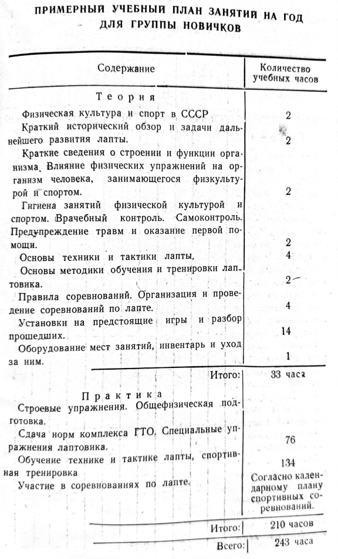

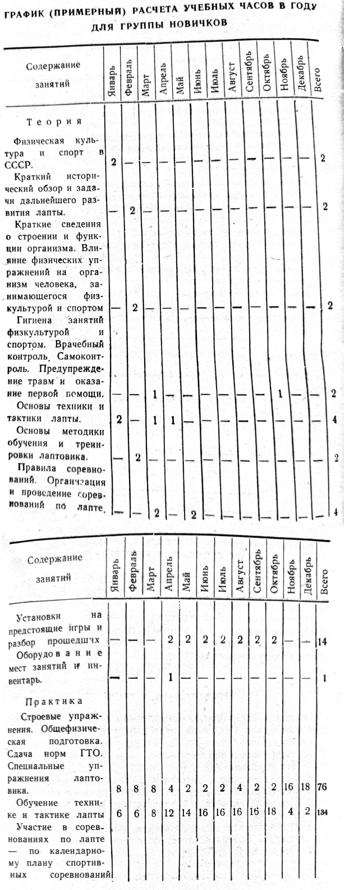

### ПРОГРАММА ЗАНЯТИЙ

**Теоретические занятия**

Задачи и организация физкультурного движения в СССР.

Всесоюзный физкультурный комплекс «Готов к труду и обороне СССР» — основа советской системы физического воспитания.

Спорт в СССР.

Единая Всесоюзная спортивная классификация и Всероссийская спортивная классификация по лапте. Развитие лапты и современное ее состояние в РСФСР.

Краткие сведения о строении и функциях организма человека. Влияние физических упражнений на организм занимающихся.

Гигиена спортсмена. Врачебный контроль и самоконтроль. Предупреждение травм и оказание первой медицинской помощи.

Основы техники и тактики лапты.

Основы методики обучения и тренировки лаптовика.

Правила, организация и проведение соревнований по лапте. Оборудование мест занятий, инвентарь и уход за ним.

**Практические занятия**

Общая и специальная физическая подготовка на основе комплекса ГТО и занятия другими видами спорта.

Специальные упражнения лаптовика:

- А. Для овладения техникой бега, развития нужных для бегуна качеств:

  - 1. Бег на месте с высоким подниманием бедер, то же с продвижением вперед, с опорой руками о стенку.

  - 2. Поднимания бедер (попеременно) вверх с отягощением.

  - 3. Наклоны туловища вперед, назад, в стороны (стоя, сидя). Вращательные движения туловищем.

  - 4. Приседания на-двух ногах и одной (попеременно); то же с отягощением.

  - 5. Скрестные движения ногами, сидя и лежа на полу.

  - 6. Прыжки на месте на обеих ногах и на одной; то же с продвижением вперед.

  - 7. Упражнения с набивными мячами и мешками с песком для развития силы.

  - 8. Упражнения на растягивание, развитие подвижности тазобедренных суставов.

  - 9. Прыжки на одной ноге (попеременно) с быстрым продвижением вперед.

  - 10. Прыжки в длину с места, с разбегу.

  - 11. Различные тройные, пятерные и т. п. прыжки с ноги на ногу и на обеих ногах.

  - 12. Прыжкообразный бег.

  - 13. Прыжки в высоту с места, с разбегу толчком одной и двух ног.

  - 14. Опорные прыжки. Прыжки через искусственные и естественные препятствия.

  - 15. Прыжки со скакалкой.

  - 16. Прыжки в длину и высоту с поворотом.

  - 17. Ускорения.

  - 18. Бег под уклон и в гору на ускорение.

  - 19. Мелкий, частый («семенящий») бег на носках.

  - 20. Бег на прямой и на повороте с ускорением.

  - 21. Бег с переменой направлений; то же с ускорением.

  - 22. Всевозможные упражнения со штангой в 30-40 кг (приседания, толкания и вырывания одной и двумя руками, прыжки, повороты, наклоны и т. п.) и другие.

Так как игроку в лапту часто приходится во время игр «умышленно» падать .(иногда в движении), спасаясь от осаливания — нужно уделить внимание и отработке способов самостраховки. Лучшими будут упражнения, которыми пользуются волейболисты, слаломисты, вратари и другие.

- Б. Для овладения техникой ударов по мячу, кроме указанных выше, применяются упражнения:

  - 1. Быстрое отжимание на руках от пола; то же с резким отталкиванием от пола и хлопком руками перед собой.

  - 2. Ходьба и прыжки на руках с поддержанием ног партнером.

  - 3. Подтягивание на руках.

  - 4. Лазание по канату и шесту с помощью ног и на одних руках.

  - 5. Метание палок, мячей, камней разного веса (гири, набивные мячи и т. п.).

  - 6. Толкание ядер разного веса.

  - 7. Метание облегченного ядра.

  - 8. Метание мяча с петлей с места и в движении.

  - 9. Метание диска разного веса.

  - 10. Метание копья, гранаты.

  - 11. Кружение молота.

  - 12. Бросание и толкание камней разного веса.

  - 13. Упражнения на гимнастических снарядах.

  - 14. Упражнения с грузом и резиновым амортизатором.

  - 15. Упражнение «рубка дров».

  - 16. Упражнения на развитие кистевых суставов.

  - 17. Имитационные удары по мячу.

  - 18. Касания рукой, теннисной ракеткой, битой (плоской и круглой) по мячу, отскакивающему от пола, стенки, стоя на месте и в движении; то же, не опуская мяч на землю.

  - 19. Удары по мячу рукой, теннисной ракеткой и битой (плоской и круглой, двумя и одной рукой) с отражением о стенку; то же на дальность, на заданное расстояние (с разной траекторией и направлением). Удары по мячу, подброшенному хорошо, низко, высоко, с отклонениями в разные стороны, встречно летящему (с лета); то же в движении; то же с непривычной руки и стороны.

  - 20. Игры в теннис, городки, ручной мяч и другие.

- В. Для овладения навыками бросков и ловли мяча, осаливания, кроме вышеописанных, применяются:

  - 1. Передача и ловля мяча (волейбольного, баскетбольного, гандбольного и др.) в парах, стоя в кругу на разном расстоянии с различным ускорением; то же в движении.

  - 2. Переброска друг другу и ловля теннисного мяча двумя и одной рукой, стоя на месте и в движении (с различной траекторией); то же с отскоками мяча от пола (стенки).

  - 3. Броски мяча в прыжке и с поворотом.

  - 4. Броски мяча рукой сбоку, из-за спины на дальность и точность; то же с поворотом.

  - 5. Ловля брошенного или пробитого мяча с подбеганием вперед, назад, в стороны (с различной траекторией).

  - 6. Броски мяча с места на точность попадания в неподвижно стоящего партнера на разном расстоянии; то же в движении; то же в прыжке и с поворотом; то же на точность попадания в бегущего партнера.
	
  - 7. Игры в волейбол, баскетбол и др.

Применяются и многие другие упражнения.

**РАБОЧИЙ ПЛАН ЗАНЯТИЙ**

Рабочий план занятий составляется согласно учебному плану, программе, годовому учебному графику расчета часов и личному опыту тренера.

Рабочий план обычно составляется на месяц. Если всего запланированного, допустим, на январь 18 часов, то из них на теорию можно запланировать 4 часа, на общефизическую подготовку — 8 часов, на изучение и совершенствование техники и тактики — 6 часов.

На основании рабочего плана составляется на каждое занятие план-конспект, в котором подробно излагаются задачи, содержание, дозировка нагрузки и средства (пути) по овладению теоретическим и практическим разделом рабочего плана занятий.

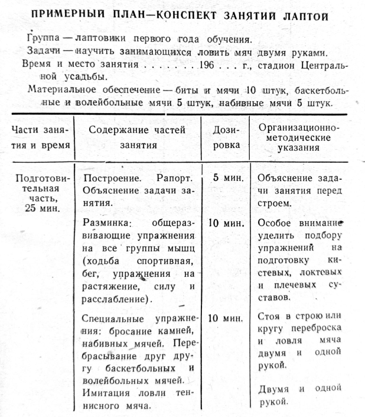

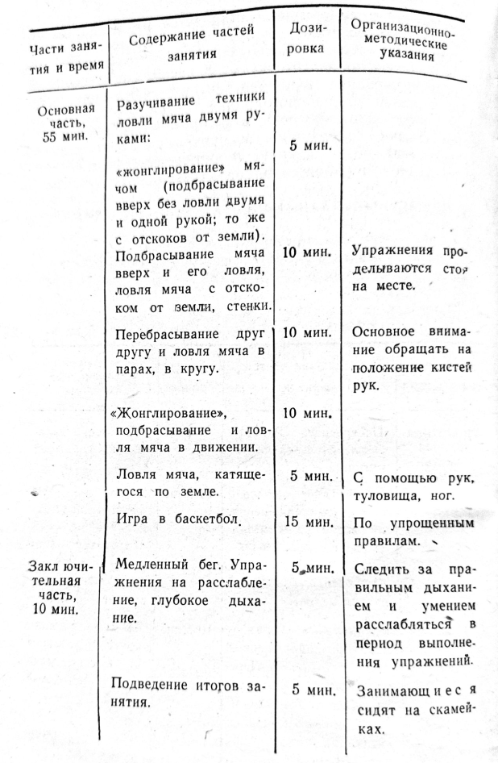

**КАЛЕНДАРНЫЙ ПЛАН СПОРТИВНО-МАССОВЫХ МЕРОПРИЯТИЙ**

Спортивные соревнования являются составной частью всего учебно-тренировочного процесса. Они способствуют не только росту. спортивного мастерства и служат проверкой организации всей учебно-воспитательной работы в коллективе, но являются и одним из важнейших средств агитации и пропаганды спорта.

Поэтому календарный план спортивно-массовых мероприятий является важным документом, характеризующим жизнь коллектива физкультуры.

Составление его требует тщательного изучения имеющихся возможностей в коллективе физкультуры и должно привлечь весь актив секции. Календарный план составляется на один год с учетом мероприятий и соревнований, проводимых вышестоящими организациями.

После того, как календарный план составлен, он должен быть тщательно обсужден на бюро секции, с тренерами, общественным активом и сдан в совет коллектива физкультуры для включения в общий. календарный план спортивно-массовых мероприятий коллектива.

Можно планировать проведение в коллективе физкультуры следующих спортивных соревнований: блиц-турниры открытия и закрытия летнего спортивного сезона, товарищеские встречи с другими командами, классификационные соревнования, первенство коллектива в 2—3 тура, участие в соревнованиях на первенство района, города и т. д.

В зимнее время можно организовать соревнования по лапте на снегу, на льду, на коньках и другие.

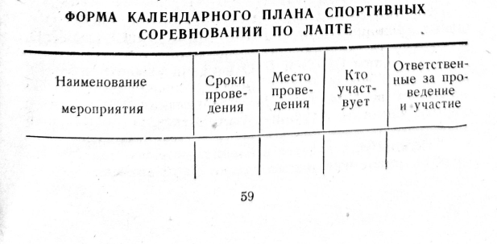

**УЧЕТ**

Правильно организованный учет помогает тренеру в выполнении поставленных задач. Учет должен охватить все стороны деятельности секции. Строгий учет посещаемости и проведенных занятий, учет успеваемости и сдачи норм комплекса ГТО, учет результатов врачебного контроля и спортивных достижений — все это будет помогать тренеру в своевременном исправлении недостатков в работе. Большую помощь в этом окажут дневники самоконтроля, которые ведут сами занимающиеся.

В практике работы определились следующие виды учета: предварительный, текущий и итоговый.

Предварительный учет включает данные, характеризующие состав занимающихся.

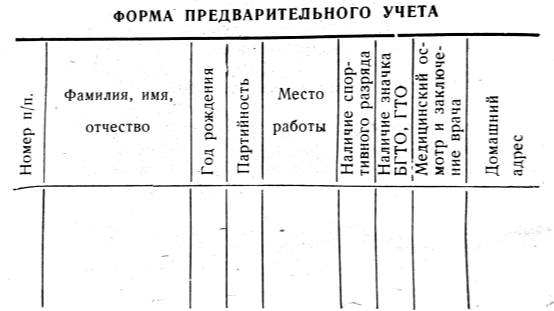

Текущий учет предусматривает регистрацию посещения тренировок, количества проведенных занятий, успеваемости занимающихся по пройденному материалу, сдачи норм БГТО и ГТО и сдачи учебных нормативов и т. д. Текущий учет имеет большое значение. Он позволяет вовремя вносить исправления, уточнения в работу, помогает улучшить учебно-тренировочный процесс.

Текущий учет ведется в специальном журнале.

В журнале имеется несколько форм записи.

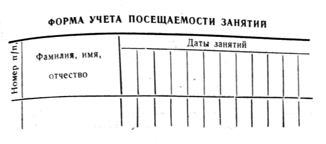

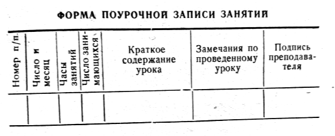

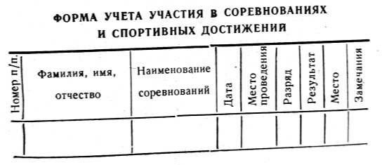

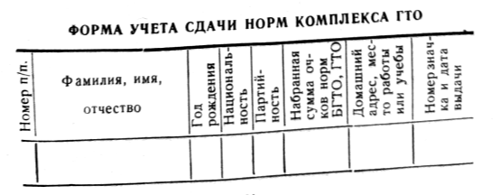

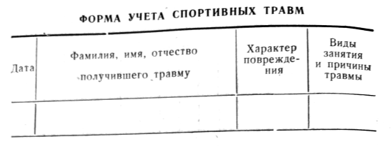

Итоговый учет проводится в конце спортивного сезона, по окончании определенного периода работы секции (например, периода тренировки), с целью подведения итогов проведенной работы, на основании которых могут быть установлены положительные и отрицательные стороны работы и намечены пути ее улучшения.

#### ОРГАНИЗАЦИЯ И ПРОВЕДЕНИЕ СОРЕВНОВАНИЙ ПО ЛАПТЕ

Спортивные соревнования являются важнейшей частью всего учебно-тренировочного процесса и должны занимать большое место в работе каждого коллектива физической культуры. Спортивные соревнования помогают не только выявлять лучшие команды и отдельных игроков для комплектования сборных команд, но и вскрывать недостатки в работе, недочеты команд и отдельных спортсменов в технике и тактике, способствуют росту спортивного мастерства игроков и являются одним из важных средств агитации и пропаганды спорта.

Велико и воспитательное значение соревнований, которые приучают физкультурников к организованности, дисциплинированности, товарищеской солидарности, настойчивости в преодолении трудностей в достижении победы.

Но успешное проведение соревновании во многом зависит от хорошей организационной подготовки к ним, которая должна начинаться советом коллектива физической культуры задолго до начала соревновании.

Во-первых, нужно на основании календарного плана спортивных мероприятий разработать четкое и ясное положение о данном соревновании, его характере, целях, времени и месте проведения, программе, составе участников, условиях зачета, награждения и приема участвующих команд, сроках представления предварительных и именных заявок на участие, времени и месте проведения жеребьевки.

Данное положение заранее довести до сведения всех участвующих команд, чтобы они своевременно начали подготовку к предстоящим соревнованиям.

Соревнования, организуемые в коллективе физической культуры, в зависимости от формы проведения и поставленных задач, подразделяются на первенства, соревнования на приз, кубок, матчевые встречи, показательные, сокращенные, квалификационные, уравнительные, контрольные, отборочные, открытые соревнования.

Соревнования на первенство коллектива (секции) проводятся, как правило, один раз в год с целью подведения итогов учебно-тренировочной работы за год и определения команды-чемпиона. Эти соревнования являются основными. Первенство можно проводить в несколько кругов.

Соревнования на приз, кубок посвящаются обычно знаменательным событиям, выдающимся государственным деятелям, выдающимся спортсменам.

Матчевые встречи устраиваются между двумя и более коллективами физической культуры с целью обмена опытом работы, товарищеской дружбы и могут стать традиционными.

Показательные соревнования организуются главным образом с целью пропаганды и агитации вида спорта в дни праздников, событий и т. п.

Сокращенные соревнования (блицтурниры) проводятся, как правило, в один день с участием большого количества команд с сокращенным временем. Обычно такие соревнования проводятся в дни открытия и закрытия сезонов, в праздничные дни.

Квалификационные соревнования специально организуют для определения уровня спортивной подготовленности и присвоения спортивных разрядов.

Уравнительные соревнования ставят целью — дать возможность более слабым командам встретиться с сильным противником, над которым может быть одержана победа благодаря тому, что слабой команде еще до игры главной судейской коллегией и организаторами соревнований устанавливается обусловленное количество очков («фора»). Это уравнивает возможность одержать победу каждому и создает условия для напряженной спортивной борьбы. Команды до начала игр могут и не знать о «форе». После игры объявляется окончательный результат: сильная команда получает то количество очков, которое ею завоевано, а слабой команде к завоеванным очкам плюсуются «форовые».

Отборочные соревнования организуются с целью комплектования сборной команды коллектива для участия в вышестоящих соревнования.

Контрольные соревнования проводятся для определения подготовленности команды к тем или иным соревнованиям. Лучше всего встречу организовать с более сильным противником.

К открытым соревнованиям обычно допускают всех желающих независимо от их местожительства и подготовленности.

Главным документом для организации соревнования является положение о данном соревновании. Поэтому при его разработке нужно тщательным образом продумать все разделы, чтобы участвующая команда могла увидеть в нем:

- кто допускается и какие установлены ограничения для участников (возраст, пол, разряд и т. п.),
- по скольким группам проводятся соревнования и к какой группе относится этот коллектив,
- допускается ли участие нескольких команд от одной организации,
- по какой системе будет проводиться соревнование (круговой, с выбыванием, смешанной),
- как будут начисляться очки за каждую встречу,
- какие меры будут приниматься в случаях нарушения положения,
- какая судейская коллегия будет обслуживать соревнование,
- по какой форме составляется именная заявка,
- кем заверяется,
- куда и кому подается,
- разрешаются ли дополнительные заявки и перезаявки и т. п.

Чтобы интересно провести спортивные соревнования по лапте в зависимости от количества команд в коллективе, степени их подготовленности, наличия времени и игровых площадок, организаторы соревновании должны хорошо знать основные способы проведения первенств и умело их применять.

В практике проведения соревновании по спортивным играм, в том числе и по лапте, обычно применяются два способа: круговой и с выбыванием.

При круговом способе каждая команда встречается в определенной последовательности с каждой из остальных команд. Результат соревновании определяется условными очками (например, за выигрыши — 2 очка, за ничью — 1 очко и за проигрыш — 0 очков).

Соревнования по круговому способу можно проводить в один, два и более кругов. Преимущество этого способа в его максимальной объективности, в возможности всех команд помериться силами между собой. Но по этому способу трудно провести соревнование, если к участию заявлено много команд, есть ограниченность во времени.

Намечая проведение. соревновании по круговому способу, следует после выяснения числа команд составить таблицу розыгрыша, используя при этом стандартные таблицы.

Эти таблицы служат для определения очередности игр между командами. Предварительно все участвующие команды путем жеребьевки получают номера с первого по последний (по числу команд), а затем подыскивается соответствующая таблица, указывающая, какие номера встречаются друг с другом. в каждом туре. Команда, номер которой в таблице стоит первым, является хозяином поля.

При планировании соревнований нужно рассчитать, сколько будет встреч в каждом туре и всего, что очень важно для подбора площадок, судей, расчета времени.

Общее количество встреч определяется по легко запоминающейся формуле:

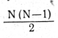

где N — количество команд, принимающих участие в соревнованиях.

Так при 6 командах нужно будет провести 

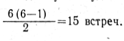

Так как каждая команда в один день может проводить, как правило, одну встречу, то для проведения соревнований при шести командах потребуется 5 игровых дней, в каждый из которых будет проходить по три встречи.

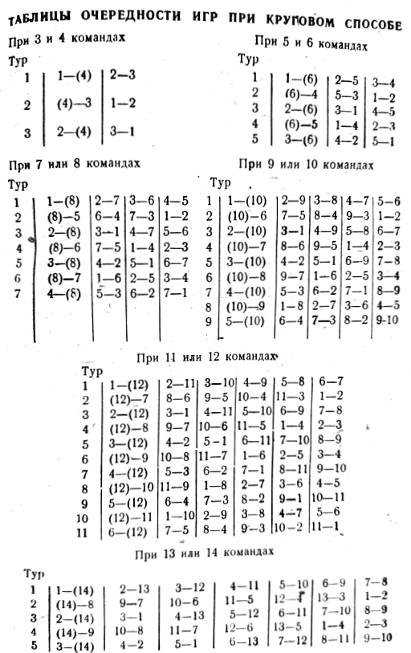

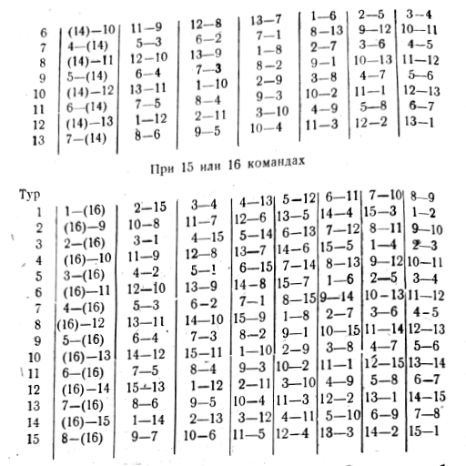

При способе с выбыванием команды соревнуются между собой попарно: проигравшая команда выбывает из соревнований после поражения. Этот способ применяется при участии в соревнованиях большого количества команд. Но он — менее объективный, так как случайный проигрыш может лишить команду возможности продолжать дальнейшую спортивную борьбу.

После жеребьевки команды в порядке полученных номеров вписываются в таблицу сверху вниз одна под другой. Если число команд равно степени двух (8, 16, 32, 64 и т. д.), то все команды в игру вступают с первого круга. Команда под первым номером встречается со вторым, третий — с четвертым, пятый — с шестым и т. д. Во втором круге победитель верхней первой пары встречается с победителем второй пары, третьей — с четвертой парой и т. д. То же и в третьем, четвертом и т. д. кругах.

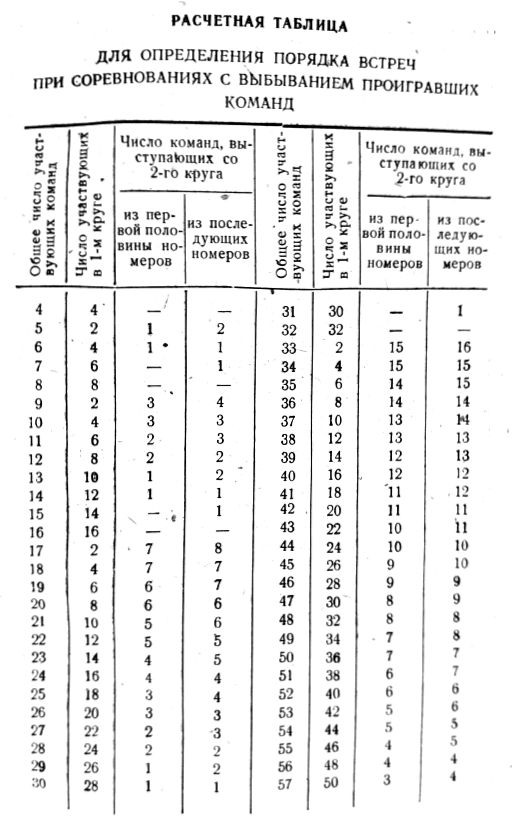

При восьми командах таких кругов будет три. Первый круг называется четвертьфинальным, второй — полуфинальным, третий — финальным, при котором встречаются две команды. Команда, выигравшая финальную встречу, является победительницей.

Когда число команд нечетное (не равно степени двух), то часть из них в борьбу вступает со второго круга. Обычно в игру со второго круга вступают крайние номера в верхней и нижней половинах таблицы. При этом, если число команд четное, то все вступающие в игру команды со второго круга, как и играющие в первом круге, распределяются в верхней и нижней половинах таблицы поровну (смотрите таблицу).

Как видно из таблицы, общее количество встреч в соревнованиях по системе с выбыванием будет равняться числу участвующих команд минус 1.

Так, например, если имеется 12 команд, то общее количество встреч будет равно 11, на проведение всего соревнования потребуется 4 календарных дня, и таблица будет выглядеть так.

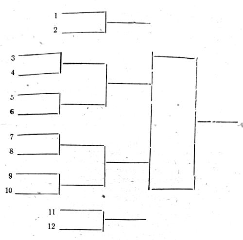

При большом числе участвующих команд применяется смешанный и многоступенчатый способы проведения соревнований.

В первом случае все команды делятся на подгруппы для предварительных соревнований, а между победителями затем разыгрываются первые несколько мест. Распределение команд производится жеребьевкой всех или «рассеиванием» сильнейших команд по подгруппам.

Многоступенчатый способ также, применяется при участии в соревнованиях большого количества команд. Сильнейшие команды выявляются путем проведения соревнований в несколько этапов (ступеней). Сначала проводятся соревнования в бригадах, отделениях и т. п., затем соревнования — на первенство коллектива.

В первенствах крупных коллективов физической культуры от каждой бригады, отделения, цеха, факультета в т. п. может принимать участие не одна, а несколько команд (первая и вторая мужская, женская и юношеские команды). При проведении такого первенства с коллективным зачетом рекомендуется устанавливать дифференцированное начисление очков: старшие команды получают большее количество очков по сравнению с младшими командами и с юношами.

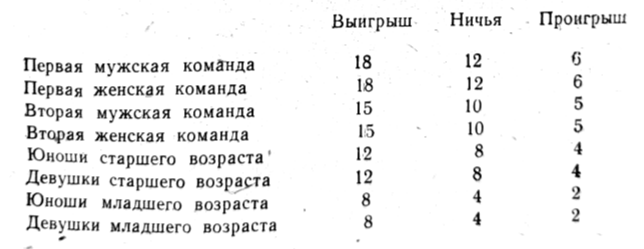

Коллектив-победитель общего первенства определяется по наибольшему количеству очков, набранных всеми зачетными командами коллектива.

Качество проведения любых соревновании во многом зависит от подготовки команд и четкой работы судейской коллегии.

Правильно выбранный способ проведения соревнований, хорошо подготовленное место, квалифицированная судейская коллегия, медицинское обслуживание и т. д. значительно способствуют достижению командами высоких спортивных результатов.

Непосредственное проведение соревнования возлагается на судейскую коллегию, персональный состав которой согласуется с местными советами Союза спортивных обществ и организаций. В первую очередь назначается главный судья соревнований, не позднее, чем за один месяц до соревнований. Главный судья, первым долгом, должен изучить положение о предстоящих соревнованиях. Затем, по рекомендации коллегии судей, подобрать состав судей в соответствии с количеством заявленных команд и системой розыгрыша, составить план расстановки судей и расписание игр по дням и часам.

Главный судья следит за готовностью мест соревнований и необходимого инвентаря. Для проведения соревнований по лапте нужен следующий инвентарь: стол и стул для секретаря; часы для секретаря (шахматные) и секундомер для судьи на поле; скамейки для запасных игроков и тренеров-представителей, микрофон или мегафон для судьи-информатора (или секретаря), можно рупор; демонстрационный щит с наименованием играющих команд и показом хода игры; протоколы игры, отчет о соревновании, заготовленные дипломы для награждения команд и игроков и т. п.; судейские свистки, два флажка для судей, несколько теннисных мячей и бит, шесть флажков размером 50 х 50 на флагштоке высотой полтора метра для ограждения игровой площадки; известь или опилки для обозначения линий, 50-метровая рулетка и шнур.

Если для проведения соревнований судей недостаточно, то главный судья организует семинар по подготовке судей и двух- трехдневный семинар с имеющимися судьями.

На семинаре главный судья сообщает об изменениях в правилах, останавливается на особо важных моментах методики судейства, проверяет подготовку и качество судейства отдельных судей, дает разъяснения по отдельным вопросам судейства, делится с молодыми судьями своим опытом организации и методики проведения соревнований.

В составе судейской коллегии должен быть врач, который наделяется правами заместителя главного судьи.

Главный или старший судья не имеет права начинать соревнования, пока не убедится в том, что врач на месте и имеет необходимые медикаменты для оказания первой помощи. 

Судьи и врач имеют право привлекать во время соревнований любого оказавшегося поблизости участника для оказания помощи пострадавшим и снять спортсмена с соревнований, если он получил серьезную травму, заболел.

Заблаговременно. подбирается и главный секретарь. Эту обязанность должны выполнять наиболее опытные судьи.

Параллельно с подготовкой судейской коллегии главный судья и совет коллектива физкультуры должны продумать и обеспечить меры по охране порядка и безопасности во время соревнований.

Для этих целей привлекаются комсомольцы, физкультурный актив, народные дружинники.

Каждую командную встречу обслуживает судейская коллегия в составе: судьи на поле, судьи на линии и секретаря. От их квалификации и взаимопонимания зависит успешный исход судейства. Для взаимопонимания судей между собой и с игроками в практике судейства соревнований по лапте уже выработались единые условия обозначения, систематизированные Юрием Николаевичем Смолиным.

### СИГНАЛЫ И ЖЕСТИКУЛЯЦИЯ, КОТОРЫМИ ПОЛЬЗУЕТСЯ СУДЬЯ НА ПОЛЕ

| Обозначение | Описание |
| ------ | ----------- |
|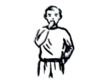|*Начало игры* — продолжительный свисток.|
|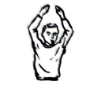|*Окончание половины игры* — двойной продолжительный свисток с подниманием вверх обеих рук.|
|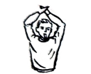|*Ловля свечи* — продолжительный свисток с подниманием над головой скрещенных рук.|
|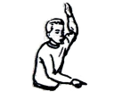|*Осаливание и обратное осаливание* — резкий короткий свисток с подниманием одной руки вверх и указанием другой на осаленного игрока.|
|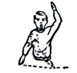|*Самоосаливание* — резкий короткий свисток с подниманием одной руки вверх и указанием другой на переступание линии.|
|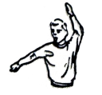|*Возвращение мяча в «город» или пересечение им линии «города»* — продолжительный свисток с показом рукой за линию «города».|
|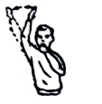|*Недействительный удар* — резкий короткий свисток с показом рукой.|
|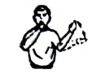|*Возвращение игроков, неправильно начавших перебежку*, — резкий короткий свисток с показом рукой в сторону линии «кона» или «города», откуда начата перебежка.|
|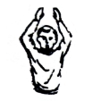|*Остановка игры в случаях нарушения или травм* — двойной короткий свисток с подниманием вверх обеих рук.|

### СИГНАЛЫ, КОТОРЫМИ ПОЛЬЗУЕТСЯ СУДЬЯ НА ЛИНИИ

| Обозначение | Описание |
| ------ | ----------- |
|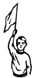|*Осаливание и ответное осаливание* — поднимание флага вверх.|
|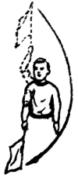|С*амоосаливание* — поднимание флага вверх, после чего кругообразным движением показывание концом флага на линию.|
|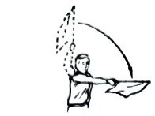|*Ловля «свечи»* — поднимание флага вверх и показывание им в сторону «города».|
|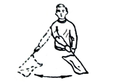|*Недействительный удар* (мяч ушел за боковую линию по воздуху) — отмашка флагом
снизу.|
|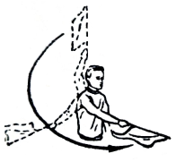|*Возвращение игрока, неправильно начавшего перебежку* — показывание концом флага на провинившегося, после чего в сторону линии «кона» или «города» (движение древка флага параллельно земле).|

Без надобности не следует пользоваться резкими и сильными свистками, так как они нервируют игроков и зрителей, избегать лишних свистков.

Обычно судья на поле свистки подает в следующих случаях:
— в начале и конце каждой половины игры;
— перед каждой подачей мяча на удар;
— при недействительных ударах (когда за линией «кона» есть игроки бьющей команды, когда кто-то делает попытку начать перебежку);
— при несвоевременном выходе игроков бьющей команды на перебежку;
— при осаливании (самоосаливании) и ответном осаливании игроков;
— при возвращении мяча в «город»;
— при выходе мяча «вне игры» (пересечение мячом линии «города» после действительного удара);
— при ловле «свечи»;
— для оказания медицинской помощи при травмах;
— для пресечения возникших грубостей и других причин.

Большое значение при судействе имеет четкое взаимодействие судьи на поле с судьей на линии. Они перед каждой игрой должны оговорить все сигналы, которыми будут пользоваться во время судейства встречи, особенно в моменты выхода мяча «вне игры», часто используемые игроками бьющей команды для свободной перебежки.

Судья на поле является старшим судьей встречи. Он контролирует соблюдение правил в «городе», на боковой линии и примыкающих к ним отрезках игрового поля.

Судья на линии контролирует «кон», противоположную боковую линию и примыкающие к ним отрезки игрового поля. Для избежания ошибок судьи все время должны находиться там, где сложилась наиболее напряженная ситуация игры, чтобы принять правильное решение.

В начале каждой половины игры (когда все игроки бьющей команды находятся в «городе») судье на поле лучше всего находиться вне игрового поля возле боковой линии ближе к линии «города», чтобы лучше фиксировать действительность ударов и наблюдать за действиями игроков в «городе».

Судье на линии в этот момент лучше всего находиться ближе к «штрафной линии», а при перебежке игроков бьющей команды за линию «кона» — передвинуться к флагу на линии «кона», чтобы контролировать своевременность обратных перебежек, возможность самоосаливания и осаливания этих игроков.

Большую роль в судействе играет секретарь, который ведет протокол соревнований, следит за временем игры и правильностью начисления очков. Перед каждой игрой он должен на основании именных заявок и расписания игр вписать в протокол соревнования игроков обеих команд, заставить их расписаться. Причем последним расписывается капитан, удостоверяя правильность заполнения протокола.

Заполнение протокола ведется условными знаками: за действительный удар ставится крестик (плюс), за недействительный — ноль, за совершенную полную перебежку — диагональ (лучше перекрест диагоналей).

Чтобы избежать ошибочной приписки очка игроку, вернувшемуся в «город» из-за линии «кона» с правом на удар, и учесть игрока, оставшегося за линией «кона» с правом на очко, секретарю для памяти рекомендуется делать в протоколе условные пометки. Допустим, игрок перебежал за линию «кона» и остался там до следующего удара, в графе с пометкой действительности или недействительности удара против его фамилии ставится одна диагональ. После возвращения этого игрока в «город» ставится вторая (перекрестная) диагональ, обозначающая очко.

В графе против игрока, оставшегося за линией «кона» после пересмены с правом на удар, можно, например, помечать точкой.

При штрафовании игрока команды очком против его фамилии в протоколе указывается причина «штрафа» и при окончательном подсчете очков это очко добавляется команде противника.

По окончании игры протокол подписывается всеми судьями и представителями команды (капитанами). Приводим примерное заполнение протокола соревнований по лапте:

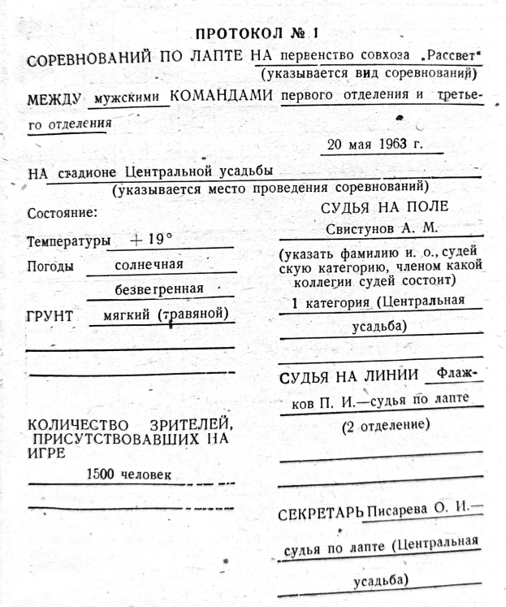

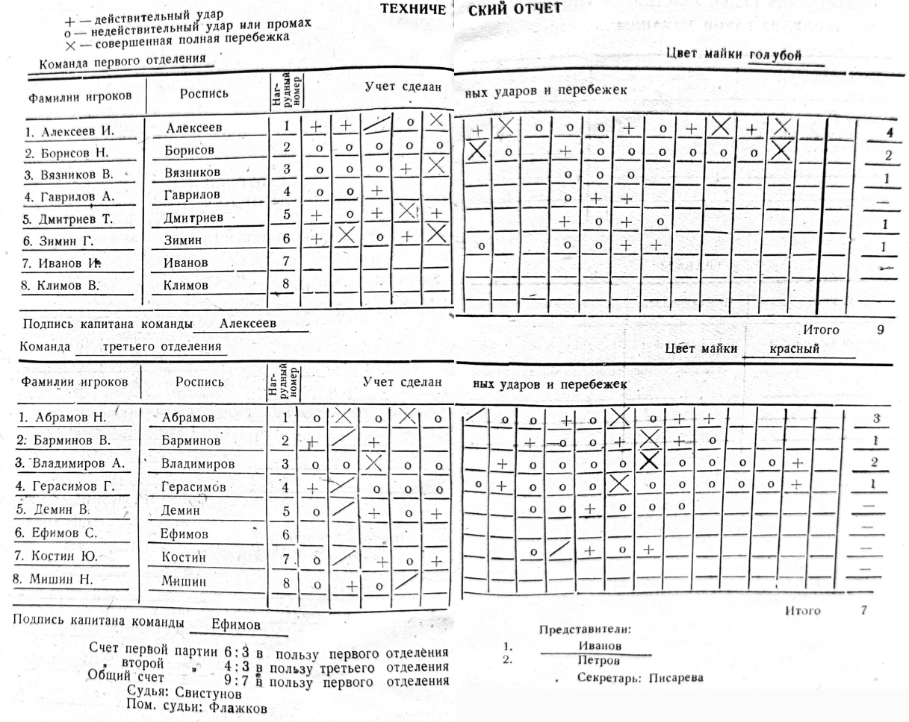

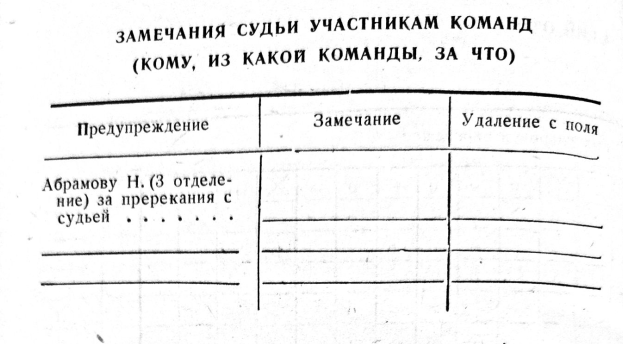

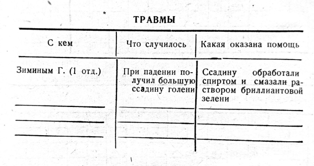

## ПРИЛОЖЕНИЯ

### ПРАВИЛА СОРЕВНОВАНИЙ

#### I. УЧАСТНИКИ СОРЕВНОВАНИЙ

##### 1. Возраст участников

Участники соревнований делятся на следующие возрастные группы:
- детская — мальчики и девочки 13—14 лет;
- средняя юношеская — юноши и девушки 15—16 лет;
- старшая юношеская — юноши и девушки 17—18 лет;
- взрослая — мужчины и женщины 19 лет и старше.

*Примечание*. В отдельных случаях, по разрешению врача, тренера и соответствующего совета Союза, юноши и девушки старшей юношеской группы допускаются к участию в играх в командах взрослых.

##### 2. Права и обязанности участников

1. Участник обязан знать правила соревнований и точно соблюдать их.

2. Во время игры участник обращается к судье только через капитана своей команды.

3. Каждый игрок, выступающий на соревнованиях, должен иметь разрешение врача на участие в соревнованиях.

##### 3. Костюмы и номера участников

1. Костюм участников состоит из майки или футболки, трусов и спортивной обуви без шипов и каблуков.

2. Участники команды должны выступать в одинаковой по цвету форме с установленной эмблемой.

3. Каждый игрок должен иметь номер, отличающийся по цвету от его майки или футболки и ясно видимый на спине и на груди. Нумерация должна быть от 1 в возрастающем порядке до номера, соответствующего количеству игроков.
Размер номера игроков на спине: 25 × 12 см, ширина линий цифр — 2 см. Размеры номера на груди 10 × 5 см, ширина линий цифр — 1 см.
Капитан команды обязан иметь отличительный знак — повязку на рукаве футболки или нашивку на майке на левой стороне груди, размером 3 × 1,5 см.

##### 4. Состав команды и замена участников

1. Команда состоит из 8 человек: 6 полевых и 2 запасных игрока. В отдельных случаях количество запасных игроков может быть изменено положением о данном соревновании .

2. Начать игру команда обязана в полном составе. Если во время игры команда на поле остается в количестве 4 человек, игра прекращается и этой команде засчитывается поражение.

3. Во время игры команде разрешается заменять не более 2 игроков в момент, когда мяч находится вне игры. Игроки «бьющей» команды могут производить замену только в «городе», если при этом заменяемый игрок имеет право на удар.

4. Замена может производиться неограниченное число раз. Игрок, выходящий из игры или входящий в игру, должен получить на это разрешение. Судьи.

5. Игрок, покинувший поле без разрешения судьи, удаленный с поля судьей или капитаном своей команды, не может быть снова допущен к игре или заменен запасным игроком.

6. До начала игры фамилии всех игроков каждой команды должны быть внесены в протокол игры. Игрок, не включенный в протокол, к соревнованию не допускается.

##### 5. Состав судейской коллегии и обязанности судей

Для проведения каждой игры назначаются судья на поле, судья на линии и секретарь.

**Судья на поле.**

1. Судья на поле следит за выполнением игроками правил игры и принимает решение во всех случаях нарушений. Его решения являются окончательными.

2. Судья на поле имеет право прекратить игру во всех случаях, когда сочтет нужным (неблагоприятная погода, непригодность грунта и другие причины). После этого судья на поле обязан составить акт о причинах прекращения игры и послать его в организацию, проводящую соревнование.

3. Судья на поле имеет право делать игроку замечания, предупреждения и удалить его с поля без предварительного предупреждения за грубую игру или нетактичное поведение.

4. Судья на поле обязан перед началом игры проверить состояние и разметку поля, состояние инвентаря (мяч, костюм, обувь игроков и т. д.).

5. После каждой партии и окончания игры судья на поле должен проверить запись результатов игры секретарем.

6. По окончании игры судья на поле и капитаны обеих команд должны подписать протокол соревнования. Судья на поле предоставляет право выбора — бить или водить — капитану команды гостей. При игре на нейтральном поле бросается жребий.

**Судья на линии**. Судья на линии является помощником судьи на поле. Он располагается у линии «кона» и передвигается вдоль боковой линии, следя за правильностью выполнения условий игры. О всех нарушениях сигнализирует судье на поле флагом ясно и отчетливо. 

**Секретарь**. 

1. Секретарь ведет учет времени, очков, следит за очередностью бьющих игроков.

2. Секретарь ведет протокол, объявляет счет очков, время и после игры подписывает протокол.

3. Секретарь имеет право останавливать часы только по разрешению судьи на поле. В начале первой и второй половины игры секретарь определяет время по начальному свистку судьи на поле.

#### II. ПРАВИЛА ИГРЫ

##### 6. Партии и продолжительность игры

1. В игре одна команда является «бьющей», а другая - «водящей».

2. Игра состоит из двух партий по 30 минут каждая. Между партиями дается перерыв в 10 минут.
После перерыва между партиями право начать игру получает команда, которая в первой половине была «водящей».

3. Смена команд производится:
	**свободная**:
— если у «бьющей» команды не остается игрока с правом на удар;
- если игрок «водящей» команды поймал «свечу» в поле или за линией кона;
	**игровая**:
- если игрок «водящей» команды осалил игрока «бьющей» команды;
- если происходит самоосаливание игрока «бьющей» команды.

4. В случае осаливания одного из игроков «бьющей» команды все игроки «водящей» команды должны постараться занять места в «городе» или за линией кона.

Однако в момент, когда они разбегаются, может быть произведено ответное осаливание и тогда смена команд не производится, и игра продолжается.

Ответное осаливание может выполняться неограниченное число раз. После ответного осаливания начисление очков ни одной из команд не производится.

Если после нескольких ответных осаливаний игровой смены не происходило, игроки «бьющей» команды, находящиеся в городе, получают право на перебежку только после вновь произведенного удара.

##### 7. Начало игры

1. Команды выходят в центр поля по свистку судьи и приветствуют друг друга (по окончании игры производится заключительное приветствие).
Первой выходит в поле команда гостей.

2. Каждую партию начинает ударом по мячу игрок «бьющей» команды. Игроки «бьющей» команды, ожидающие очереди произвести удар по мячу,  размещаются в «площади очередности».

Игроки, выполнившие удар и ожидающие перебежки располагаются в «пригороде».
*Примечание*: Запасные игроки и тренеры обеих команд размещаются на скамейке за боковой линией около стола секретаря.

##### 8. Подбрасывание мяча

1. Подбрасывание (подачу) мяча производит игрок «водящей» команды. В момент подбрасывания мяча «бьющий» и подающий игроки должны обеими ногами находиться в пределах «площадки подающего». Подающий игрок может находиться от бьющего на любом расстоянии, но в пределах «площадки подающего», выполняя просьбу бьющего и подавая мяч, как ему (бьющему) удобно.

2. Подбрасывание мяча производится с открытой ладони.

3. За неправильное подбрасывание мяча подающему игроку делается замечание, при повторном нарушении — предупреждение, а при последующих нарушениях этого игрока команда «водящих» штрафуется очком.

4. При нахождении в поле подающий игрок может пользоваться всеми правами полевых игроков.

##### 9. Удар по мячу

1. Удар считается правильным, если мяч вышел за пределы города, но не пересек боковых линий по воздуху.
Удар, после которого мяч коснулся земли в пределах штрафной площадки, считается недействительным.
*Примечание*. Мяч, пересекший линию «кона» по земле или по воздуху, считается в игре.

2. Удар по мячу должен быть произведен лаптой в момент нахождения мяча в воздухе после подбрасывания.

3. Игрок, выполняющий удар, имеет право требовать нового подбрасывания (подачи) мяча до трех раз, при условии, если он, не пытался ударить по мячу. Если подбрасывание было произведено неправильно, игрок имеет право потребовать дополнительную подачу.

4. Если бьющий игрок сделал промах, то он имеет право начать перебежку только после правильного удара по мячу одним из последующих игроков его команды.

5. В начале каждой партии игроки «бьющей» команды бьют по очереди в порядке номеров.
После выполнения ударов по мячу всеми игроками «бьющей» команды право на последующий удар приобретает игрок только после полной перебежки.

6. После удара игрок обязан оставить лапту в пределах «площадки подающего». В случае, если лапта будет оставлена в поле или на линии, удар считается недействительным.
Данный пункт неприменим, если игрок водящей команды поймал «свечу».

7. Удар, при котором может быть нанесено физическое повреждение игроку, подающему мяч, считается опасным. Такой удар является недействительным, игроку дают предупреждение, при повторном нарушении — удаляют с поля.

##### 10. Перебежка

1. Право на перебежку игрок  получает после правильного удара по мячу. Игрок, делающий полную перебежку, должен пробежать по полю за линию «кона» и вернуться по полю обратно за линию «города». Правильно выполнивший одну полную перебежку получает право на удар.

2. Игрок, пробежавший по полю за линию «кона», может там остаться и возвратиться обратно после одного из последующих ударов по мячу игроками его команды, что также является полной перебежкой.

3. Игрок, делающий перебежку непосредственно после своего удара, может бежать из «площадки подающего».

4. Игрок имеет право не делать перебежку непосредственно после своего удара, а выполнять ее после одного из последующих ударов по мячу кем-либо из игроков его команды. Перебежку разрешается начинать только из «пригорода», кроме случая, указанного в пункте 4 настоящего параграфа.

5. Игрокам запрещается вести силовую борьбу за мяч.

6. Игроки «бьющей» команды, не имеющие права на перебежку, могут выходить в поле только после того, как их команду «осалили».

7. Игроки, начинающие перебежку за линию «кона» или «города», при правильном ударе обязаны закончить ее. Перебежка считается начатой, если игрок заступил одной ногой за линию «кона» или «города».

8 При возвращении мяча из поля в «город» после пересечения мячом линии «города» начинать перебежку запрещается. Игроки, производящие в данный момент перебежку, обязаны закончить ее в одну сторону.
*Примечание*. В случае умышленной задержки мяча игроками водящей команды, судья может остановить игру и отправить мяч в «город».

##### 11. Осаливание

1. Игроки «водящей» команды могут находиться в любом месте поля и вне его и передвигаться в любом направлении не пересекая линии «города».

2. Игрок, делающий перебежку, считается «осаленным» если его в пределах поля коснется мяч (в том числе и в штрафной площадке).

3. Осаливание могут производить все игроки «водящей» команды, в том числе и «подающий» игрок, если он находится в поле.

4. Осаливать можно только выпуская мяч из рук (бросая).

5. Игрокам «водящей» команды разрешается передавать друг другу мяч в любом направлении и передвигаться с ним.

##### 12. Самоосаливание

1. Игрок «бьющей» команды считается самоосаленным, если он:
- а) выбежал за боковую линию поля или наступил на нее. Настоящий пункт, неприменим в момент ловли «свечи» игроками водящей команды;
- б) начав перебежку, возвратился за линию кона или города.

2. При самоосаливании игрок «водящей» команды, владеющий мячом, должен отбросить в любую сторону мяч, но в пределах поля; в этот момент происходит игровая смена команд.

##### 13. Результат игры

1. За каждую правильную полную перебежку «бьющая» команда получает одно очко.

2. Команда, набравшая после двух партий наибольшее количество очков, является победительницей.

3. Если счет очков у обеих команд окажется одинаковым, игра считается сыгранной вничью.

### СПОРТИВНАЯ КЛАССИФИКАЦИЯ ПО ЛАПТЕ

Выписка из протокола (№ 65 от 16 мая 1962 года, пункт 14) заседания президиума Всероссийского совета Союза. спортивных обществ и организаций.

Принять предложение Всероссийской федерации лапты об изменении разрядных требований классификации по лапте с 1 мая 1962 года на территории РСФСР:

**I разряд** — участвовать в составе команды, занявшей 1—3-е место в соревнованиях на первенство области, края, АССР, гг. Москвы и Ленинграда или 1-е место в соревнованиях на первенство областного, краевого, АССР, совета ДСО.

**II разряд** — участвовать в составе команды, занявшей 1—3-е место в соревнованиях на первенство района, города или 1-е место в первенстве районного, городского совета ДСО.

**III разряд** — участвовать в составе команды, занявшей 1-е место в соревнованиях на первенство коллектива физической культуры.

**I юношеский** — участвовать в составе команды, занявшей 1—3-е место в первенстве области, края, АССР, гг. Москвы и Ленинграда или областного, краевого, АССР совета ДСО или областного, краевого, АССР отдела народного образования.

**II юношеский** — участвовать в составе команды, занявшей 1 место в соревнованиях на первенство коллектива физкультуры школы или другого учебного заведения.

*Примечания*:
1. Для присвоения разряда засчитываются результаты соревнований, в которых участвовало не менее 6 команд.

2. Спортивные разряды присваиваются игрокам при условии участия их в 50 процентах игр данного соревнования.