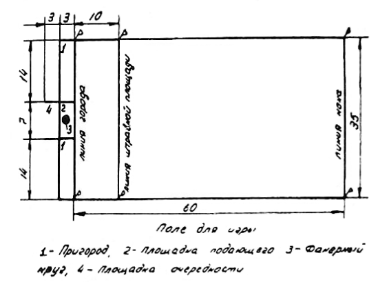

# ПРАВИЛА СОРЕВНОВАНИЙ ПО ЛАПТЕ

Указания судьям, игрокам и тренерам по правилам игры.

Разработаны судьей Всесоюзной категории **В. В. Янушевским**.

Утверждены президиумом Федерации лапты РСФСР 25 февраля 1964 г.

## I. УЧАСТНИКИ СОРЕВНОВАНИЙ

### 1. Возраст участников

Участники соревнований делятся на следующие возрастные группы:
- детская — мальчики и девочки 13—14 лет,
- средняя юношеская — юноши и девушки 15—16 лет,
- старшая юношеская — юноши и девушки 17-—18 лет,
- взрослая — мужчины и женщины 19 лет и старше,

**Примечание**. В отдельных случаях, по разрешению врача, тренера и соответствующего совета Союза, юноши и девушки старшей юношеской группы допускаются к участию в играх в командах взрослых.

### 2. Права и обязанности участников

1. Участник обязан знать правила соревнований и точно соблюдать их.

2. Во время игры участник обращается к судье только через капитана своей команды.

3. Каждый игрок, выступающий на соревнованиях, должен иметь разрешение врача на участие в соревнованиях.

### 3. Костюмы и номера участников

1. Костюм участников состоит из майки или футболки, трусов и спортивной обуви.

Разрешается играть в обуви с кожаными или резиновыми шипами.

2. Участники команды должны выступать в одинаковой по цвету форме с установленной эмблемой.

3. Каждый игрок должен иметь номер, отличающийся по цвету от его майки или футболки и ясно видимый на спине и на груди. Нумерация должна быть от 1 в возрастающем порядке до номера, соответствующего количеству игроков.

Размеры номера игрока на спине: 25×12 см, ширина линий цифр 2 см. Размеры номера на груди 10×5 см, ширина линий цифр — 1 см.
Капитан команды обязан иметь отличительный знак — повязку на рукаве футболки или нашивку на майке на левой стороне груди, размером 3×1,5 см.

### 4. Состав команды и замена игроков

1. Команда состоит из 8 человек: 6 полевых и 2 запасных. В отдельных случаях количество запасных игроков может быть изменено положением о данном соревновании.

2. Начать игру команда обязана в полном составе. Если во время игры команда на поле остается в количестве 4 человек, игра прекращается и этой команде засчитывается поражение.

3. Во время игры команде разрешается заменять не более 2 игроков в момент, когда мяч находится вне игры. Игроки «бьющей» команды могут производить замену только в «городе», если при этом заменяемый игрок имеет право на удар.

4. Замена может производиться неограниченное число раз.

Замена производится по требованию тренера, капитана или представителя команды.

Игрок, выходящий из игры или входящий в игру, должен получить на это разрешение судьи.

5. Игрок, покинувший поле без разрешения судьи, удаленный с поля судьей или капитаном своей команды, не может быть снова допущен к игре или заменен запасным игроком.

6. До начала фамилии всех игроков каждой команды должны быть внесены в протокол игры. Игрок, не включенный в протокол, к соревнованию не допускается.

## II. ОБЯЗАННОСТИ И ПРАВА СУДЕЙ

### 5. Состав судейской коллегии и обязанности судей

Для проведения каждой игры назначаются: судья на поле, судья на линии и секретарь.

**Судья на поле**

1. Судья на поле следит за выполнением игроками правил игры и принимает решение во всех случаях нарушения. Его решения являются окончательными.

2. Судья на поле имеет право прекратить игру во всех случаях, когда сочтет нужным (неблагоприятная погода, непригодность грунта и другие причины). После этого судья на поле обязан составить акт о причинах прекращения игры и послать его в организацию, проводящую соревнование.

3. Судья на поле имеет право делать игроку замечания, предупреждения и удалить его с поля без предварительного предупреждения за грубую игру или нетактичное поведение.

4. Судья на поле обязан перед началом игры проверять состояние и разметку поля, состояние инвентаря (мяч, костюм, обувь игроков и т. д.).

5. После каждой партии и окончания игры судья на поле должен проверить запись результатов игры секретарем.

6. По окончании игры судья на поле и капитаны обеих команд должны подписать протокол соревнования. Судья на поле предоставляет право выбора бить или водить капитану команды гостей. При игре на нейтральном поле бросается жребий.

7. Костюм судьи на поле и судьи на линии состоит из черных трусов, сшитых по форме брючек, черной рубашки с судейской эмблемой, черных гетр и кед или бутс.

**Судья на линии**

Судья на линии является помощником судьи на поле. Он располагается у линии кона и передвигается вдоль боковой линии, следя за правильностью выполнения условий игры. О всех нарушениях сигнализирует судье на поле флагом ясно и отчетливо.

**Секретарь**

1. Секретарь ведет учет времени, очков и следит за очередностью бьющих игроков.

2. Секретарь ведет протокол, объявляет счет очков, время и после игры подписывает протокол.

3. Секретарь имеет право останавливать часы только по разрешению судьи на поле. В начале первой и второй половины игры секретарь берет время по начальному свистку судьи на поле.

## III. ПРАВИЛА ИГРЫ

### 6. Партии и продолжительность игры

1. В игре одна команда является «бьющей», другая — «водящей».

2. Игра состоит из двух партий по 30 минут каждая, Между партиями дается перерыв в 10 минут.
После перерыва между партиями право начать игру получает команда, которая в первой половине была «водящей».

3. Смена команд производится:

свободная 
— если у «бьющей» команды не остается игрока с правом на удар;
— если при ловле мяча с лета игроки «бьющей» команды не вышли в поле;

игровая
— если игрок «водящей» команды осалит игрока «бьющей» команды;
— если происходит самоосаливание игрока «бьющей» команды.

4. При игровой смене команд все игроки «водящей» команды должны постараться занять места в «городе» или за линией кона.

Однако в момент, когда они разбегаются, может быть произведено ответное осаливание и тогда смена команд не производится, и игра продолжается.

Ответное осаливание может выполняться неограниченное число раз. После ответного осаливания начисление очков ни одной из команд не производится.

Если после нескольких ответных осаливаний игровой смены не происходило, игроки «бьющей» команды, находящиеся в городе, получают право на перебежку только после вновь произведенного удара.

### 7. Начало игры

1. Команды выходят в центр поля по свистку судьи и приветствуют друг друга (по окончании игры производится заключительное приветствие).
Первой выходит на поле команда гостей.

2. Каждую партию начинают ударом по мячу игрок «бьющей» команды. Игроки «бьющей» команды, ожидающие очереди произвести удар по мячу, размешаются в «площади очередности».

Игроки, выполнившие удар и ожидающие перебежки, располагаются в «пригороде».

**Примечание**. Запасные игроки и тренеры обеих команд размещаются на скамейке за боковой линией около стола секретаря.

### 8. Подбрасывание мяча

1. Подбрасывание (подачу) мяча производит игрок «водящей» команды. Над фанерным кругом (белого цвета) диаметром 50 см, расположенным в площадке подающего.

В момент подбрасывания мяча «бьющий» и подающий игроки должны обеими ногами находиться в пределах площадки подающего.

2. Подбрасывание мяча производится с открытой ладони, на высоту, указанную «бьющим» игроком.

3. Игрок, выполняющий удар, имеет право требовать нового подбрасывания (подачи) мяча до трех раз, при условии, если он не пытался ударить по мячу.

**Примечание**: если мяч после попытки удара по нему или подбрасывания не упадет в круг подачи, такое подбрасывание за попытку не считается и подача повторяется.

4. За неправильное подбрасывание мяча подающему игроку делается замечание, при повторном нарушении — предупреждение, а при последующих нарушениях этого игрока команда «водящих» штрафуется очком.

5. При нахождении в поле подающий игрок может пользоваться всеми правами полевых игроков.

### 9. Удар по мячу

1. Удар считается правильным, если мяч вышел за пределы города, но не пересек боковых линий по воздуху.

Удар, после которого мяч коснулся земли в пределах штрафной площадки, считается недействительным.

**Примечание**. Мяч, пересекший линию кона по земле или по воздуху, считается в игре.

2. Удар по мячу должен быть произведен лаптой в момент нахождения мяча в воздухе после подбрасывания.

3. Если бьющий игрок сделал промах, то он имеет право начать перебежку только после правильного удара по мячу одним из последующих игроков его команды.

4. В начале каждой партии игроки «бьющей» команды бьют по очереди в порядке номеров.

После выполнения ударов по мячу всеми игроками «бьющей» команды право на последующий удар приобретает игрок только после полной перебежки.

5. После удара игрок обязан оставить лапту в пределах «площадки подающего». В случае, если лапта будет оставлена в поле или на линии, удар считается недействительным.

Данный пункт неприменим, если игрок водящей команды поймал «свечу».

6. Удар, при котором может быть нанесено физическое повреждение игроку, подающему мяч, считается опасным. Такой удар является недействительным, игроку дают предупреждение, при повторном нарушении — удаляют с поля.

### 10. Перебежка

1. Право на перебежку игрок получает после правильного удара по мячу.

После любого действительного удара выход хотя бы одного игрока на перебежку обязателен. При нарушении этого правила команда лишается права на один из последующих ударов.

Игрок, делающий полную перебежку, должен пробежать по полю за линию «кона» и вернуться по полю обратно за линию «города». Правильно выполнивший одну полную перебежку получает право на удар.

2. Игрок, пробежавший по полю за линию «кона», может там остаться и возвратиться обратно после одного из последующих ударов по мячу игроками его команды, что также является полной перебежкой.

3. Игрок, делающий перебежку непосредственно после своего удара, может бежать из «площадки подающего».

4 Игрок имеет право не делать перебежку непосредственно после своего удара, а выполнять ее после одного из последующих ударов по мячу кем-либо из игроков его команды. Перебежку разрешается начинать только из «пригорода», кроме случая, указанного в пункте 3 настоящего параграфа.

5. Игрокам запрещается вести силовую борьбу за мяч.

6. Игроки «бьющей» команды, не имеющие права на перебежку, могут выходить в поле только после того, как их команду «осалили».

7. Игроки, начинающие перебежку за линию «кона» или «города», при правильном ударе обязаны закончить ее. Перебежка считается начатой, если игрок заступил одной ногой за линию кона или города.

8. При возвращении мяча из поля в «город» после пересечения мячом линии «города», начинать перебежку запрещается. Игроки, производящие в данный момент перебежку, обязаны закончить ее в одну сторону.

**Примечание**. В случае умышленной задержки мяча игроками водящей команды, судья может остановить игру и отправить мяч в «город».

### 11. Осаливание

1. Игроки «водящей» команды могут находиться в любом месте поля и вне его и передвигаться в любом направлении, не пересекая линии «города».

2. Игрок, делающий перебежку, считается «осаленным», если его в пределах поля коснется мяч (в том числе и в штрафной площадке).

3. Осаливание могут производить все игроки «водящей» команды, в том числе и «подающий» игрок, если он находится в поле.

4. Осаливать можно только выпуская мяч из рук (бросая).

5. Игрока, которого остановили для осаливания, нельзя умышленно осаливать в голову. При нарушения этого правила осаливание не считается, осаливающий игрок предупреждается.

6. Игрокам «водящей» команды разрешается передавать друг другу мяч в любом направлении и передвигаться с ним.

### 12. Самоосаливание

1. Игрок «бьющей» команды считается самоосаленным, если он:
- а) выбежал за боковую линию поля или наступил на нее.
Настоящий пункт не применим в момент ловли «свечи» игроками водящей команды;
- б) начав перебежку, возвратился за линию кона или города;
- в) допустит умышленное касание с осаливающим игроком.

2. При самоосаливании игрок «водящей» команды, владеющий мячом, должен отбросить в любую сторону мяч, но в пределах поля; в этот момент происходит игровая смена команд.

### 13. Ловля мяча с лета

1. Мяч считается пойманным с лета, если игрок поймает его одной или двумя руками в поле или за линией кона, не дав коснуться земли.

2. Если игрок водящей команды поймал мяч с лёта игра продолжается.

3. Если при ловле мяча с лета игроки «бьющей» команды (хотя бы один) не вышли на перебежку, происходит свободная смена команд.

### 14. Результат игры

1. За каждую правильную полную перебежку «бьющая» команда получает одно очко.

2. За поимку мяча с лета водящая команда получает одно очко.

3. Команда, набравшая после двух партий наибольшее количество очков, является победительницей.

4. Если счет очков у обеих команд окажется одинаковым, игра считается сыгранной вничью.

## IV. МЕСТО ИГРЫ, ОБОРУДОВАНИЕ И ИНВЕНТАРЬ

### 15. Размеры и разметка поля

1. Поле для игры в русскую лапту представляет собой прямоугольник с ровной травяной или другой поверхностью длиной 60 м и шириной 35 м. Для детей в возрасте 13—14 лет размеры площадки 40×25 м, для юношей и девушек средней возрастной группы — 50×30 м.

При проведении соревнований в коллективах физкультуры, а также среди детской и средней юношеской возрастных групп разрешается использовать поле меньших размеров.

2. Поле должно быть размечено ясно видимыми (белыми) линиями шириной 10 см. Размечать поле канавками запрещается. Ширина линий не входит в размеры поля.

3. На расстоянии 10 м от линии города (для юношей и девушек средней возрастной группы — 8 м, для детей 6,5 м) параллельно ей проводится линия, ограничивающая штрафную площадку, которая входит в размеры поля.

Длинные линии, ограничивающие поле, называются «боковыми», короткие — линией «города» штрафной площадки» и «кона».

4. В местах пересечения боковых линий с линиями «города», «штрафной площадки» и «кона» устанавливаются флаги с полутораметровыми древками.

5. При разметке поля для игры в лапту линия «города» делится на три неравные части: площадку подающего и два пригорода.

### 16. Лапта.

1. Лапта (бита) должна быть цельнодеревянная, длиной от 60 до 120 см и диаметром до 5 см.
Толщина биты со стороны рукоятки не должна быть меньше 3 см. Допускается. обмотка рукоятки биты.

2. Игрокам разрешается пользоваться своими битами.

3. Игрокам в возрасте 13—14 лет разрешается пользоваться плоской лаптой размером до 80 см в длину, 8 см в ширину и 2см в толщину.

### 17. Мяч

Игра в лапту проводится теннисным мячом.

## УКАЗАНИЯ СУДЬЯМ, ИГРОКАМ И ТРЕНЕРАМ ПО ПРАВИЛАМ ИГРЫ В ЛАПТУ.

Разработал член президиума Всероссийской Федерации лапты **В. В. Янушевский**

1964 г.

### I. УЧАСТНИКИ СОРЕВНОВАНИЙ

#### 1. Возраст участников

Участники соревнований делятся на возрастные группы по годам рождения:

Младшая группа — мальчики и девочки:
- в 1964 году — 1950—1951 гг. рождения
- в 1965 году — 1951—1952 гг. рождения
- в 1966 году — 1952—1953 гг. рождения

Средняя группа — юноши и девушки:
- в 1964 году — 1948—1949 гг. рождения
- в 1965 голу — 1949—1950 гг. рождения
- в 1966 году — 1950—1951 гг. рождения

Старшая группа — юноши и девушки:
- в 1964 году — 1946—1947 гг. рождения
- в 1965 году — 1947—1948 гг. рождения
- в 1966 году — 1948—1949 гг. рождения

Лица, родившиеся в 1945 году, выступают в 1964 голу по группе взрослых, родившиеся в 1946 году, выступают по группе взрослых в 1965 г. и т. д.

Критерием участия юноши и девушки за команду взрослых является их спортивное мастерство и состояние здоровья.

#### 2. Обязанности и права участников

Игроки не имеют права оспаривать решение судьи на поле или вступать с ним в пререкания. Если игроку непонятно решение судьи на поле, капитан этой команды может обратиться к судье за разъяснением.

Каждый игрок, заявленный к игре в составе команды, обязан иметь при себе на каждой игре классификационный билет с фотографией и с отметкой медицинского свидетельствования, а также билет участника соревнований. Если капитан команды покидает игровое поле, то он обязан сообщить судье на поле номер игрока, который будет выполнять обязанности капитана.

#### 3. Костюмы и номера участников

Судья на поле перед началом игры должен осмотреть состояние одежды, обуви и ногтей игроков.

Если игроки одной и той же команды будут иметь форму различного цвета, судья не должен допускать эту команду (или игрока, у которого форма отличается от формы других игроков) к игре. Все игроки обязаны иметь номера установленных правилами размеров, а капитан команды — нашивку или повязку.

Судья не должен допускать к игре команду или игроков без номера на спине и на груди, а также если номера игроков не одинакового цвета, формы и размера. Игрокам разрешается играть в очках и сетке для волос. Игрокам не запрещается надевать наколенники и гетры.

Цвет формы выступающих команд должен быть известен заранее организации, проводящей соревнования, и командам принимающим участие в данном соревновании Во всех случаях, когда судья считает, что цвета форм команд сливаются и не дают возможности нормально провести игру, он может потребовать, чтобы одна из команд надела форму другого цвета. 

Обычно это делает команда — хозяин поля. Поэтому команда — хозяин поля должна всегда иметь в наличии запасную форму другого цвета.

За нарушение правил №3 игрок немедленно удаляется с поля и может вернуться в игру только с разрешения судьи на поле после того, как приведет свою одежду и обувь в порядок.

#### 4. Состав команды и замена игроков

Замену полевых игроков запасными можно произвести по любой причине, в любое время, неограниченное число раз. т. е. скользящая замена. Игрок, который был заменен другим игроком, может снова войти в игру заменив другого игрока и т. д. с разрешения судьи на поле. Замены игроков предварительно отмечаются в протоколе у секретаря. В товарищеских играх количество заменяемых игроков устанавливается по взаимной договоренности представителей играющих команд. После окончания игры секретарь проведенной встречи обязан в протоколе игры «проставить время, сыгранное игроками данной встречи.

#### 5. Состав судейской коллегии и обязанности судей

Соревнования районного масштаба и ниже разрешается проводить одному судье на поле. 

**Судья на поле**

Судья на поле должен быть хорошо физически подготовлен и тренирован, быть подвижным и всё время находиться на близком расстоянии игровых ситуаций.

Судья на поле обязан хорошо знать правила игры и уметь применять их, никогда не забывая об одном из основных принципов судейства — не судить в пользу провинившегося. Все решения судьи на поле, касающиеся игры, обязательны для всех игроков и окончательны. Игроки не имеют права оспаривать решение судьи на поле или вступать с ним в пререкания. Любой недисциплинированный поступок игрока вне поля или во время выхода мяча из игры рассматривается так же, как если бы он был совершен на поле во время игры. 

Предупреждая или удаляя игрока с поля, судья на поле должен назвать его номер, под которым он играет, и сказать игроку, за что на него налагается взыскание. При вмешательстве зрителей в игру ни судье на поле, ни его помощникам не рекомендуется вступать с ними в разговор, а также принимать участие в наведении порядка.

Ответственность за возможность проведения игры (соревнования) целиком лежит на администрации стадиона или спортивной площадки. В случае если во время игры порядок не будет обеспечен, судья на поле должен отменить или прекратить соревнование.

Все случаи недисциплинированного поведения игроков, не предусмотренные правилами задержки игры, судья на поле обязан внести в протокол соревнования.

Перед началом игры в центре поля, судья на поле в присутствии своего помощника вызывает капитанов играющих команд. Судья на поле и его помощник знакомятся с капитанами команд, представляют их друг другу, после чего судья на поле производит между ними жеребьевку. Для жеребьевки готовятся два бумажных жребия, которые скручиваются в трубочку, в одном из них делают надпись «Права выбора», а другой остается без надписи. Капитан команды, вытянувший жребий с надписью «Права выбора», выбирает начальный удар или расстановку игроков в поле. О своем выборе капитан команды сообщает судье на поле и капитану другой команды.

Форма судьи установлена Всероссийской коллегией судей и едина для всех судей РСФСР: черная рубашка с белым воротником, черные трусы, сшитые в форме брюк с карманами и белый пояс, черные гетры и бутсы или кеды.

На левой стороне груди нашивается нагрудная судейская эмблема, соответствующая категории судьи. Одежда судьи должна быть в чистом и опрятном состоянии. Для проведения игры судья на поле должен иметь сирену или свисток с горошиной, а для контроля времени — секундомер или часы. Если нет специального секундомера, судьям рекомендуется в начале игры ставить минутную стрелку часов на цифру «12», что делает возможным удобно контролировать время игры.

Судья на поле не имеет права начинать игру без врача или медицинского работника, его заменяющего. Присутствие медицинского работника во время игры обязательно. Судья на поле не имеет права допустить игрока к игре, если медицинский работник вынес решение о том, что игрок продолжать игру не может.

**Судья на линии**

Судья на линии помогает проводить соревнования судье на поле в соответствии с правилами игры и указаниями, полученными от судьи на поле в начале игры. Судья на линии сигнализирует флагом судье на поле о нарушениях правил игры, но его сигнализация флагом не должна носить навязчивого характера. Например, судья на линии просигнализировал о нарушении, думая, что судья на поле это нарушение не заметил. Если судья на поле, видя отмашку, не согласится с указанием судьи на линии, то последний не должен настаивать на своем мнении.

Судья на линии должен быть одет в соответствующую судейскую форму. Флаг для судьи должен быть ясно видимым и соответствующих размеров. Ручка деревянная длиной 60-65 см. Полотнище размером 50×40 см. Полотнище может быть одноцветным — красным или белым, или в шахматную клетку. Цвет клеток флага — белый и красный или белый и черный. Размер клеток 10×10 см, 12×12 см.

**Секретарь**

Секретарь является к месту соревнования не позже чем за 30 минут до его начала. Он проверяет наличие бланков про-

#### ?пропуск?

#### 12. Самоосаливание

Игроки бьющей команды, которые имеют право на перебежку, должны выполнять ее в пределах площадки поля. Имитация перебежки параллельно боковым линиям поля считается самоосаливанием.

Если игрок бьющей команды не бил, но выбежал в поле для перебежки или для оказания в игровой ситуации помощи своему партнеру, которого пытаются осалить, то такой игрок считается самоосаленным.

#### 13. Ловля мяча с лета

Свеча считается правильно пойманной игроком тогда, когда мяч, пробитый противником, прошел штрафную 10-метровую линию по воздуху на любой высоте, не пересекая боковых линий, и был пойман в пределах игровой площадки. Не считается ошибкой, если при ловле свечи мяч выкатывается из рук и игрок повторно ловит его, прежде чем он коснется игровой площадки. Если игрок ногами стоял за боковой линией вне игровой площадки, а мяч поймал в игровой площадке, то свеча считается пойманной правильно. Если игрок стоял в игровой площадке, а мяч поймал за боковой линией, вне пределов игровой площади, свеча считается пойманной неправильно.

Во всех случаях судья на поле должен руководствоваться положением и нахождением мяча в игровой ситуации.

#### 14. Результаты игры

Судье на поле рекомендуется громогласно сообщать секретарю встречи номер игрока, который закончил полную перебежку и принес своей команде очко.

### IV. МЕСТО ИГРЫ, ОБОРУДОВАНИЕ И ИНВЕНТАРЬ

#### 15. Разметка поля

В целях удобства проведения игры на любом свободном месте рекомендуется переносная тесемочная разметка, которая монтируется в виде прямоугольника (размер которого соответствует метражу согласно правилам игры) и держится на древках флажков. В летнее время тесемочная лента должна быть белая, а на заснеженном поле — темная. Если размечать линии на снегу, то быстро и ярко получается разметка разведенными чернилами. (На ведро воды — два чернильных или две таблетки). Размечать игровую площадку канавками запрещается, так как при перебежках могут быть случаи травматизма.

#### 16. Лапта (бита)

Для выполнения точных ударов по мячу желательно каждому игроку иметь собственную биту, которая подбирается с учетом физических данных и технической подготовки.

#### 17. Мяч

Для проведения каждой игры необходимо иметь 4—5 мячей. В летнее время светлой окраски, в зимних условиях на снегу хорошо смотрятся мячи красного цвета. Мячи рекомендуется менять, как только они начинают утрачивать свою яркость.