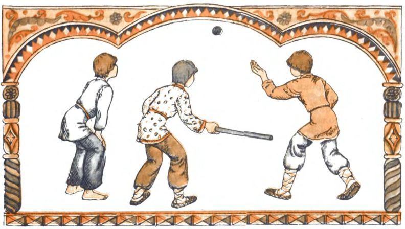
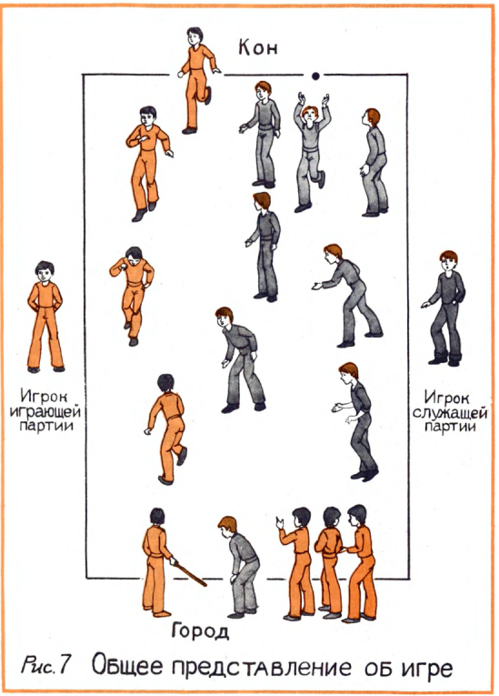
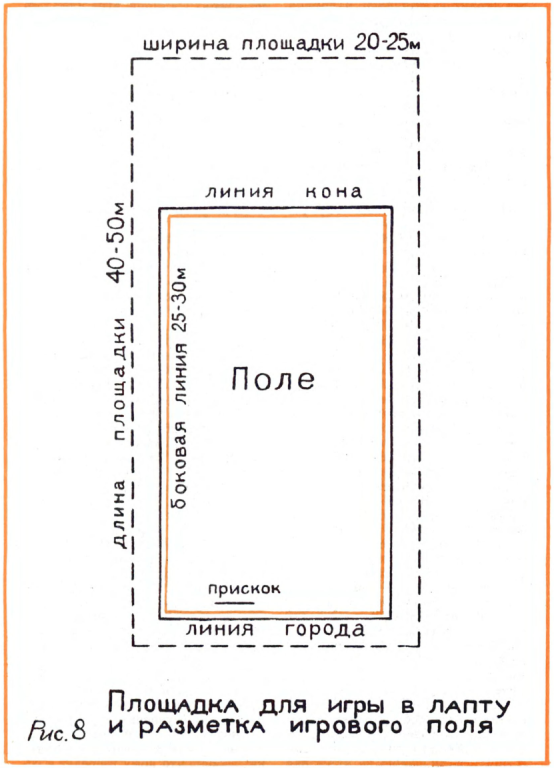
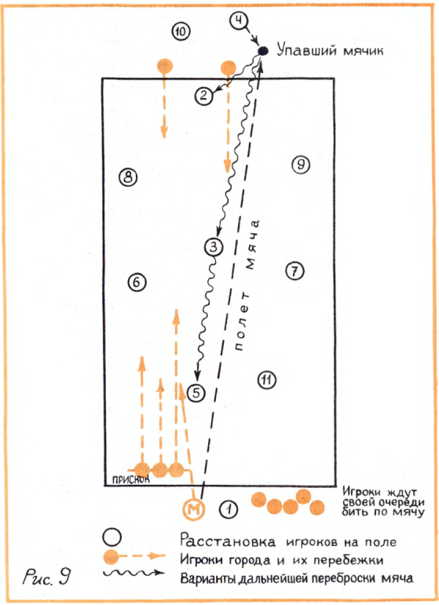
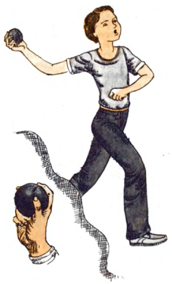
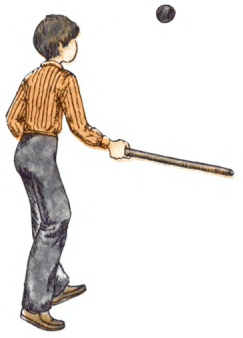
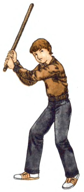

# Вспомним забытые игры. Лапта

::: details Выходные данные
Станислав Контантинович Якуб  
Издательство "Детская литература"  
1988  
Рисунки Л.И. Ионова  
:::

::: details Комментарии
Книга Станислава Контантиновича Якуба стоит особняком в списке литературы о лапте. Ни в одной книге лапта не описана так подробно и с такой огромной любовью к игре как здесь.
Книга "Вспомним забытые игры" посвящена различным русским народным играм и лапта - это только одна глава из этой книги, хотя и самая большая. Советую найти эту книгу полностью (сейчас это сделать не сложно) и ознакомиться с остальными играми. Кстати, в свое время из этой книги я открыл для себя игру "Чиж".  
В книге описывается "деревенский" (назовем его так) вариант игры, где победитель определяется не по количеству перебежек, а по количеству времени, которая команда провела в городе. И судя по всему, именно этот вариант лег в основу правил спортивной лапты.  
В книге также используются старые термины, не используемые сейчас, например,
 - "партия" - команда
 - "рука" - право на удар
 - "играющая" партия - команда нападения
 - "водящая" партия - команда защиты
 - "матка" - капитан
 - "ожегивание" - самоосаливание

 Чтобы удобнее было перемещаться по тексту, описание игры разбито на разделы, но в оригинале это одна целая глава.
 Интересно, что книга была выпущена в 1988 году уже после того, как в 1986 году вышло постановление Госкомспорта СССР о развитии бейсбола, софтбола и русской лапты. Возможно, книга была выпущена именно в рамках развития этой программы.

 Не все рисунки из книги были включены в описание, только те, которые необходимы для понимания игры.
:::

Книжка моя подходит к концу. Почти все, что хотел рассказать о старинных русских народных играх, я уже рассказал.

И вот осталась одна, но зато самая знаменитая, самая любимая игра русского народа — лапта.

Эта игра была верным другом не только ребят моего поколения, но и многих, уходящих в глубь веков, поколений наших предков. Ведь в лапту на Руси играли еще во времена Ивана Грозного, а может быть, и раньше.

Долгие века лапта жила на нашей земле, принося радостный, увлекательнейший отдых и детям и взрослым. И не только отдых.

Лапта, как никакая другая игра, воспитывала отчаянную смелость, презрение к опасности, способность к самопожертвованию во имя победы, порою какую-то дьявольскую хитрость и всегда — бесшабашную удаль! Я думаю, что именно лапта в высшей степени соответствовала характеру россиян, самой русской душе.

Но нынешнее время, с его стремительным темпом, телевизорами, кино, многообразными развлечениями, сумело потеснить лапту, как и многие другие игры, из нашей жизни.

А зря. И мне бы очень хотелось доказать вам это.

Но, как говорится, ближе к делу.

### Что это за игра — лапта?

Что же это за игра такая — лапта? Мало кто из ребят сейчас знает что-то о самой игре, хотя название ее наверняка слышали. Поэтому, думается, для начала следует рассказать вам совсем кратко о сути игры, чтобы потом было понятнее, когда я начну описывать все подробности.

Для игры в лапту нужно совсем немного: мячик и «лапта», то есть палка, которой бьют по мячу. Игра происходит на ровной площадке, по краям которой обозначены линии «города» и «кона». Ребята делятся на две равные партии.

«Играющая» партия забирает лапту и отправляется в город, чтобы бить по мячу и бегать из города на кон и обратно. А игроки «служащей» партии становятся в поле, чтобы подбирать пробитые мячи и пятнать мячом перебегающих игроков города, причем один из них — «подавальщик» — остается в городе для того, чтобы подкидывать под удары мяч. Игроки города по очереди берут лапту и бьют по мячу, стараясь отбить его как можно дальше в поле. После удара каждый игрок обязательно должен сбегать на кон и вернуться обратно, ибо только после этого он приобретает право снова бить по мячу.

А игроки поля стараются поймать мяч на лету или, если это не удалось, побыстрее поднять мячик с земли и попасть им в кого-нибудь из перебегающих игроков города.

Когда сумеют сделать то или другое, партии меняются местами.

Цель игры — борьба за город. Партия города старается как можно дольше продержаться в городе, а служащая партия — как можно скорее его самой захватить.

Побеждает та партия, которая большее время играла в городе.

А кончается игра тогда, когда все устанут.

Если вы сразу не все себе уяснили, перечитайте это краткое описание игры еще раз, потому что дальше уже начну вам постепенно объяснять многочисленные правила и всякие тонкости игры в лапту.

::: details Рисунок - Общее представление об игре {close}

:::

### Откуда пошло название игры лапта?

Теперь немного истории. Откуда пошло такое название игры — лапта?

Оно происходит от палки, которой бьют по мячу. Дело в том, что в старину она делалась с одного края немного расширенной и плоской, отдаленно похожей на лопатку. Поэтому и называлась лаптой.

Так, по крайней мере, хотя и предположительно, толкуется это название в старинных книжках.

Почитайте, как объясняется это слово в «Толковом словаре живого великорусского языка», который составил один из друзей Пушкина, писатель Владимир Даль: «Лапта — лопасть, плосковатая вещь, к одному концу пошире; палка, весёлко, которым бьют мяч, и сама игра эта».

А мячик, как предполагают, зародился на Руси от снежка. Но ведь летом снегу не бывает, а покидаться охота. Вот и додумались ребята делать шерстяные да тряпочные мячи. Потом появились и более крепкие мячики, специально для игры в лапту. Они сшивались из кожи и набивались шерстью или конским волосом, потому что резины тогда еще не знали. Такие мячи даже продавались на базарах и стоили не слишком дешево. Поэтому в деревнях ребята чаще всего играли в лапту мячиками попроще, самодельными, например тряпичными. Несколько лучшими были мячики, скатанные из шерсти, которую припасали еще с весны, когда линяла всякая домашняя скотина. Но никакой кожей их, конечно, не обшивали. Поэтому такие мячи были недолговечными, через несколько игр от непрестанных ударов лаптой мячик размочаливался. Но мячи по весне катали многие ребята, и всегда находилось чем играть. Кстати говоря, подобными мячами играли кое-где в лапту даже в первые годы после Отечественной войны.

Как кожаные, так и другие самодельные мячи не могли иметь очень уж правильной формы, и,
чтобы метко послать его в поле, лучше было ударять плоской лаптой. Кроме того, плоской широкой лаптой вообще было легче попасть по мячу, и тут не имело значения, каким местом лапты попадешь.

Первые каучуковые, надутые воздухом мячики стали делать еще в первой половине прошлого века. Правда, они были слишком легкими, поэтому для лапты не годились.
И только к концу века, когда появились настоящие резиновые, фабричного изготовления разнообразные мячи, кожаными перестали играть. В прошлом же веке постепенно стала исчезать и плоская лапта, уступив место круглой, хотя название ее, как мы видим, сохранилось до сих пор. К этому нужно добавить, что круглой лаптой мячик можно послать дальше, чем плоской, так как меньше ее сопротивление воздуху при ударе и сам удар получается сильнее. Но для этого удар должен быть уже более точным, ведь надо попасть круглой лаптой по центру мячика.

### Как самим сделать лапту?

Как самим сделать лапту?

Подберите или вырежьте палку длиной 70 см и толщиной от 3 до 3,5 см. Ребята 13—14 лет и старше могут играть лаптой потяжелее — длиной до 90 см и чуть потолще.

Затем срежьте сучки и снимите кору. Учтите, что палка для лапты должна быть совершенно прямой и круглой, поэтому чаще всего мы делали лапту из молодого сосняка. Следите за тем, чтобы лапта не имела выступающих сучков, во избежание неточных ударов, в которых вы будете не виноваты. Более тонкий конец палки — рукоятку — можно обстругать еще немного, чтобы ее было удобно держать в руке. И наконец, закруглите слегка концы и отшлифуйте ваше изделие шкуркой.

Лапта готова.

Еще проще вы можете сделать лапту из рукоятки для лопаты или вил, которые продаются в некоторых хозяйственных магазинах. Такая выточенная заготовка хороша еще и тем, что подходит по толщине (около 4 см) и имеет идеально круглую форму. Только, может, придется ее укоротить и рукоятку обстругать по руке.

А в начале века можно было купить готовую, очень хорошую лапту, выточенную из березы и с ручкой, обмотанной просмоленной веревкой. Вы спросите, зачем еще ручку обматывать? Все дело в том, что в старину, когда в лапту играли не только дети, но и взрослые, рукоятку смазывали столярным клеем и плотно обматывали бечевкой, чтобы при сильных, размашистых ударах тяжелая лапта не смогла вырваться из рук. Между прочим, я помню, что такая неприятность, хоть и редко, но случалась, если вес лапты не соответствовал возрасту и силам игрока. Может быть, потому, что мы ручку никогда ничем не обматывали.

Лучше всего, если у вас будет своя лапта, к которой вы привыкли. У некоторых ребят постарше, самых заядлых игроков, так обычно и бывало. Но можно играть и одной лаптой на всех, от этого игра ничуть не теряет интереса.

Придется еще поговорить о мячике для игры в лапту. Дело в том, что раньше, до войны, в любом магазине игрушек продавались простые резиновые мячики. Маленькие, сантиметров пять в диаметре, — черные и чуть побольше, но с более тонкими стенками — светлые. Черные, мы почему-то называли их «арапскими», были очень тугие, как раз для лапты. И стоили все эти мячики копейки. Но теперь их нет — ни черных, ни светлых. Может быть, это и стало одной из причин того, что в такую замечательную русскую игру уже никто не играет. Нечем.

Правда, как-то в детстве мне пришлось видеть у деревенских ребят самодельный мячик, сшитый из тряпок, и даже играть им, но сейчас это был бы просто музейный экспонат. Хотя — как сказать! В 1982 году было издано солидное пособие для институтов физической культуры, где я прочитал: «Для игры требуется лапта... и маленький резиновый или тряпичный мяч». Вот так-то!

Но выход из этого положения все-таки есть. Постарайтесь купить несколько теннисных мячей отечественного производства — они намного дешевле. Только не покупайте один мячик, так как в игре часто бывает — кто-нибудь так далеко запустит его, что найти мячик уже не удастся, особенно если упадет он в кусты, овраг или в траву. И чтобы игра не прекратилась на самом интересном месте, всегда имейте мячик про запас.

Это я говорю вам по собственному опыту, и не только по памяти детских лет. Дело в том, что совсем недавно, когда мы с младшим братом решили навестить нашу деревню, где после войны мы не бывали, я взял с собой теннисный мяч, чтобы посмотреть, не разучился ли я бить. Из сломанной ручки для косы я наскоро сделал лапту, и пошли мы в лес по грибы и ягоды.

На опушке решили поиграть лаптой и мячиком, вспомнить детство. Брат стал подкидывать, а я бил. И к моему великому удивлению и радости, я ни разу не промазал! Я замахивался, а затем рука сама, каким-то внутренним чутьем, выбирала точный момент для удара. Два раза я ударил не очень сильно (боялся все-таки потерять мячик), а на третий решил «вдарить» как следует. И ‹вдарил»! Мячик взвился, как птичка, в небо и полетел. Потом он стал падать, но где-то очень уж далеко и к тому же за большими кустами.

Долго мы его искали, но увы...

Так и кончилась наша игра. Кстати, и во всей деревне, где когда-то ребята чуть не каждый день играли в лапту, никто уже не играет...

Чтобы закончить разговор о мячике, скажу, что он должен быть крепким и выдерживать сильные удары лаптой. Мягкие мячики с тонкими стенками не годятся. Диаметром не больше теннисного мяча, то есть 6,5 см. Ну а мы чаще всего играли очень тугими черными мячиками, даже меньше теннисных. Когда таким «влепят» по спине, только охнешь! Правда, можно играть мячом и побольше, но его не так ловко держать в руке, да и лететь после удара лаптой он будет медленнее и падать ближе. Это я написал на всякий случай — вдруг вам попадется какой-нибудь другой, не теннисный мячик.

### Место для игры

Итак, лапту мы сделали, мячики купили. Теперь нужно найти подходящее место для игры.

В большом городе это труднее, чем в деревне, но в районах новостроек между домами часто бывают большие ровные площадки, которые можно использовать для игры. В Ленинграде наш старый дом выходил одной стороной в тихий, безлюдный переулок, по которому даже машины не ходили. Там мы и играли. А двор был для лапты маловат, да и окна были близко.

В деревне мы уходили играть на просторный луг, за огороды, когда, конечно, трава там была не очень высокая. А чаще всего гоняли в лапту прямо на широкой улице, между рядами изб. Машины в те годы у нас в деревне не ездили, поэтому единственное неудобство состояло в том, что приходилось освобождать дорогу, когда вдали за околицей послышится громкое хлопанье пастушьего кнута, — значит, стадо возвращается домой. Коровы, протяжно мыча и помахивая ушами и хвостами, разбредутся по своим дворам, а мы опять принимаемся за игру. Бегаем допоздна, пока можно углядеть полет мяча в небе… Зато спишь потом, как говорится, без задних ног.

Для игры в лапту нужно больше места, чем для всех других игр. Общий размер площадки должен быть метров пятьдесят в длину и метров двадцать пять в ширину — примерно в таких пределах могут падать хорошо пробитые мячи. Вполне возможно, что и среди вас обнаружится игрок, который сможет удачным и сильным ударом послать мяч вперед метров на пятьдесят и даже дальше. Или «засветить» в небо свечу метров на двадцать! А ведь двадцать метров — это высота шести-семиэтажного дома! Ребята поменьше и девочки с обожанием смотрят на таких игроков. Да и вообще один такой удар может спасти всю твою команду. Но об этом я подробно расскажу дальше.

Поэтому и нужно, чтобы на вашей площадке не было никаких препятствий вроде деревьев, столбов, окон, протянутых проводов, а также кустов и высокой травы, где бы мог потеряться мячик. Когда выбираете постоянное место для игры, понаблюдайте, чтобы там после дождя не застаивалась надолго вода, но и пыли чтоб не было в жаркие дни. Но обычно выбирать
не приходится, все равно чаще всего играют во дворе, около своего дома. Если это место вытоптано и все-таки пылит, то перед игрой минут за десять не поленитесь притащить несколько ведер воды и веником разбрызгать по земле.

А если у вас поблизости есть самодельное или настоящее футбольное поле, то лучшего места для игры в лапту трудно даже придумать!

Конечно, мы никогда не меряли место для игры с помощью рулетки или складного метра, да и вам этого делать не придется. Измерьте и запомните длину пары обычных своих шагов, это будет что-нибудь около 110—120 см, вот шагами и меряйте площадку. Тем более, что особая точность здесь и не нужна — пять метров больше, три метра меньше — не повлияют на игру.

А когда вы сами поиграете в лапту, освоитесь с полем, ударами и перебежками, то вообще научитесь выбирать место для игры на глазок, как мы и делали. Ведь никаких книжек про лапту мы не читали, а учились друг у друга, младшие у старших.

На площадке надо каким-либо образом обозначить линии, которые совершенно необходимы для игры в лапту. Этих линий четыре, и между ними образуется прямоугольник, называемый полем. Он будет несколько меньше выбранного вами места для игры.

Сначала у одного, более короткого края площадки обозначим линию «города». С нее вы и будете бить лаптой мяч в поле. Город надо как-то отметить, например, глубоко прочертить линию на земле. Или даже выкопать неглубокую канавку. А если играете на траве, то лучше всего по всей линии вырезать узкие полоски дерна, перевернуть их землей вверх и уложить на то же место. В крайнем случае, положите на черту палки или закрепите длинную веревку. Мы, например, притаскивали и клали на середину линии города здоровенную жердь. Затем по краям надо воткнуть палки или положить камни, кирпичи или другие заметные предметы. Длина этой линии метров двадцать. Потом отшагайте от нее вперед метров на тридцать пять и таким же образом обозначьте линию «кона», до которой вам придется бегать. Хорошо, если на коновой черте будет какой либо ясно видимый ориентир, ну хотя бы воткнутая палка с накинутой на нее рубахой. Это очень помогает рассчитывать силы и время при перебежках и вообще ориентироваться в игре.

Образовавшееся пространство между линией города и линией кона и будет полем.

Теперь осталось наметить еще одну коротенькую, но очень важную линию, называемую «прискоком». Она располагается метрах в трех левее середины линии города и на два-три шага впереди от нее, то есть уже в поле. Длина «прискока» — метра два или чуть больше, когда в игре участвуют много игроков.

Края поля между концами линий города и кона называются боковыми линиями. Все это хорошо видно на рисунке.

::: details Площадка для игры в лапту и разметка игрового поля {close}

:::

Это я рассказал, как разметить игровую площадку для ребят старше 13 лет. А для ребят от 10 до 12 лет сгодится площадка и поменьше — общая ее величина может быть метров сорок в длину и двадцать в ширину. Линии города и кона сделайте метров по пятнадцать, а расстояние между ними — метров двадцать пять.

Повторяю, что главное, на что надо обращать внимание, — это, чтобы в направлении полета мяча как можно дальше не было кустов и зарослей травы, где бы мог потеряться мячик. Кроме того, при неточных ударах мяч может улететь и за боковую линию, так что и там кусты и прочие ловушки для мяча нежелательны, особенно вблизи линии кона.

На самом поле, где будет происходить вся игра, не должно быть кочек, камней, валяющихся палок и других препятствий, о которые можно споткнуться. Поэтому перед игрой наведите порядок на поле, уберите мусор и все лишнее.

Желательно бы учесть при выборе площадки, чтобы солнышко не слепило глаза игрокам. Особенно это важно для игроков поля, которым нужно видеть полет мяча. Поэтому лучше, если по длине площадка будет расположена примерно с востока на запад, тогда солнце днем будет проходить сбоку, с южной стороны. Но если по условиям места это невозможно, то линию кона устраивайте со стороны солнца, чтобы оно светило в спину полевым игрокам. Это я подробно объяснил, как сделать настоящее поле для лапты. Но по секрету вам скажу, что можно поиграть в лапту почти в любом длинном месте. Отметьте как-нибудь, откуда бить, докуда бегать, и играйте. Только чтобы мячом стекла не побить. А потом уж подыщите и оборудуйте поле по всем правилам.

### Состав и разделение на партии

В лапту могут играть преимущественно мальчики. Правда, когда мне было лет десять, я помню, что мы принимали в игру и девчонок, и они играли порою не хуже нас, но у ребят постарше игра идет уже всерьез, и девчонок в нее мы не брали. На Руси издавна даже поговорка такая была: «Не берись, девка, за лапту».

Для игры в лапту нужно разделиться на две партии. Определенного числа игроков, как, например, в футбольной или хоккейной команде, здесь не требуется, поэтому в каждой партии может быть от пяти до десяти человек. То есть общее число играющих будет от десяти до двадцати человек.

Как разбиться на партии, вы уже знаете из описания игры в чижика. Сперва выбираются два сильнейших и самых опытных игрока, которые будут матками. Но иногда это бывает не так уж просто сделать. Хорошо, если ребята сразу и единодушно назовут двоих таких игроков. А если троих или четверых? Тут поднимается такой шум и гам, что понять что-либо вообще бывает невозможно. В таком случае самым простым и справедливым решением будет выбор по количеству голосов. Кто-нибудь выкликает по очереди имена всех названных ребят и считает поднятые за каждого руки. Те двое, за кого было поднято больше всего рук, и становятся матками. Остальные идут сговариваться, а когда сговорятся, подходят к маткам, которые и угадывают себе игроков из каждой пары. Только разбиваться на пары здесь надо не по возрасту или росту, а главное — по умению и опыту игры в лапту. Поэтому некоторые матки предпочитают сами и совместно подбирать равноценные пары. Но это только в том случае, если все ребята долго играли вместе и хорошо друг друга знают.

Когда мы, сговорившись, подходили к маткам, то спрашивали: «Мати, мати, кого тебе дати — муравья или кузнеца?» (репку или морковку, сапог или лапоть, дырявое ведро или самовар без крантика; вообще что кому взбредет в голову, сговорки у нас не повторялись никогда).

Матка выбирает что-нибудь из этой белиберды и радуется, когда выбор бывает удачен — ведь совсем равные по силе игроки подбираются в парах редко. Но если матка видит, что в какой-то паре игроки, на ее взгляд, слишком уж неравноценны, она имеет право отказаться от выбора и послать их пересговориться с кем-нибудь другим. Вообще если уж вы выбрали маток, то спорить с ними нельзя — матки командуют всей игрой и разрешают все споры как в своей партии, так и между партиями. А если маткам не удается полюбовно разрешить какое-либо недоразумение, то приходится бросать жребий.

А как быть, если собралось нечетное число игроков и всем охота играть?

Тогда лучше разделиться на партии при помощи «набора». Делается это так. Сначала матки между собою по жребию определяют, кто начнет этот набор, а потом поочередно выбирают себе любого игрока. Начинают они, естественно, с самых лучших. Та матка, которая начинала выбор, наберет себе несколько более сильную партию. Поэтому последнего игрока, которого никто не выбрал, забирает в свою партию вторая матка. Практически получится так, что оба последних игрока будут играть во второй партии.

Иногда игроки каждой партии выбирают себе еще и подматка, то есть помощника матки. Это, я считаю, делать очень полезно. Например, если матка служащей партии находится в городе подавальщиком, то подматок играет в поле, и ему легче командовать своими игроками. Конечно, подматком тоже следует выбирать опытного и сообразительного игрока.

Затем начинается самый волнующий момент перед игрой — определение, где какая партия будет начинать игру. Для этого, так же, как в «чижике», матки «конаются» на лапте, и тот, кому досталось схватить ее верхний конец, берет лапту себе и идет, не скрывая радости, со всей своей партией играть в город. А другая матка со своей партией отправляется в поле водить, или, как это называется при игре в лапту, «служить».

В старину, когда играли плоской лаптой и кожаным мячом, конались так: одна из маток плюнет на одну сторону лапты, подкинет ее вверх и спрашивает: «Сухого или мокрого?» Другая матка, например, крикнет: «Мокрого!» Тогда, если лапта упадет «плюнутой» стороной на землю, угадавшая матка идет бить в город.

Ну а мы в деревне чаще всего конались так: матка берет за ручку лапту, бросает ее высоко вверх, чтобы она завертелась колесом, и спрашивает: «Тыка или ляпа?» (Тыка — это когда лапта упадет на землю торчком, а ляпа — плашмя.) Другая матка, пока лапта кувыркается в воздухе, должна угадать. Не угадает — идет служить. Иногда лапта падала как-то боком, не поймешь, то ли тыка, то ли ляпа? Начинался спор и крик, в котором принимали участие обе партии. Но этот спор матки быстро прекращали и перебрасывали лапту снова.

Но вот все волнения перед игрой кончились. Теперь надо подготовиться к игре — снять, если нужно, пиджаки или куртки, вынуть и сложить в сторонке все лишнее из карманов, а так как сегодня многие носят часы — обязательно снять их.

Смотришь, с кем же тебе на этот раз играть в одной партии, и по указанию своей матки занимаешь место в городе или на поле.

А теперь давайте посмотрим, как же обе матки расставляют своих игроков? Ведь от этого во многом будет зависеть успех игры.

### Расстановка игроков в поле

Начну с расстановки игроков в поле.

::: details Расстановка игроков в поле {close}

:::

Первым делом надо самого опытного, ловкого и меткого игрока (№ 1) назначить в город подавать мяч. Почему? А вот почему.

Во-первых, подавальщик, находясь в пределах города, то есть в самом стане противника, должен зорко следить за соблюдением правил игроками играющей партии. Кроме того, так как у него в руках мячик, он может и запятнать нарушившего некоторые правила игрока.

Во-вторых, подавальщик вообще руководит игроками поля, кричит, кому перебросить мяч, кого пятнать, кому где занять место на поле в зависимости от хода игры, и, кроме того, должен знать и применять разные хитрости.

Ну, а в-третьих, представьте себе такой, довольно часто встречающийся в игре случай. Игрок города хорошо ударил по мячу, мяч улетел далеко и упал аж за линией кона! Тот, кто бил (а он издавна в этой игре называется метальщиком), успел добежать до кона и несется во весь дух обратно. Поднявшему мячик нет никакой надежды осалить уже подбегающего к городу игрока. Тогда он быстро перебрасывает мячик кому-то из игроков поля, а тот — в город подавальщику. Вот он, миг удачи! Подавальщик ловит мяч и в упор «расстреливает» бегущего прямо на него игрока. Город выигран!

Но чтобы все это удалось, подавальщик должен уметь хорошо ловить мячи, так как если не сможет поймать, мячик укатится, и, пока он его настигнет, все отбегаются и салить будет некого.

Теперь вы понимаете, почему матка служащей партии ставит в город самого опытного и меткого игрока, а в большинстве случаев берет эту почетную и трудную обязанность на себя.

Второго по опытности игрока (№ 2) матка отправляет на другое очень важное место — на линию кона. При хороших ударах, когда игроки города наверняка совершают перебежки, к нему чаще всего попадают мячи. Вот тут ему и приходится быстро решать — салить самому или перебросить кому-то из полевых игроков, которому, на его взгляд, сподручнее попасть в перебегающего. Обычно это место занимает подматок. В его обязанности также входит следить за тем, чтобы все бегуны обязательно забегали за коновую черту, а не хитрили и не поворачивали обратно, не добежав до нее.

Еще одного, тоже умелого и ловкого игрока (№ 3), надо поставить на середину поля, где он будет находиться в самой гуще борьбы.

Оба этих игрока стоят на линии полета мяча, поэтому они должны уметь хорошо ловить «свечки» ну и, конечно, метко салить.

А самого сильного игрока (№ 4), способного далеко и точно перебрасывать мяч, матка отправляет дальше всех — за линию кона. К нему и прилетают самые дальние мячи. Он, как правило, сам не салит игроков — они до него не добегают, поэтому перебрасывает мячик кому либо из своей партии, находящемуся в пределах поля. Во время игры он сам уточняет свое место, наблюдая, куда чаще всего падают мячи. И хорошо, если он сможет учитывать, какого удара можно ожидать от каждого из игроков города.

Ну вот, четырех главных игроков мы уже разместили. Если вас в каждой партии всего по четыре, то уже можно играть.

Но я не припомню, чтобы мы играли таким малым количеством игроков. Стоило нам услышать, что где-то собираются играть в лапту, как все бежали туда и старались попасть в число играющих. Так что партии составлялись иногда человек по десять и даже больше.

Помню, что когда я был еще слишком мал, чтобы играть самому, то всегда бегал хотя бы поглазеть на игру. В то время большие парни собирались играть в лапту на площади в середине села, недалеко от церкви. В старину, как мне рассказывали, там даже происходили ярмарки, на которые приезжали крестьяне из окрестных деревень, чтобы что-то купить или продать, а то и просто повеселиться. Ярмарок я уже не застал, а вот в лапту там играли часто. И зрители, стар и млад, собирались со всего села. Сколько было шума, крика и азарта! Каждый за кого-нибудь обязательно болел — за брата, знакомого или соседа. А сами игроки до того набегаются, упарятся, что кое-кто сначала рубахи скидывает, а потом и обутки, и глядишь — все уже носятся босиком. Никакого асфальта там не было, да и сейчас нет, а была теплая, плотно утоптанная земля, по которой одно удовольствие бегать босиком.

Летом темнеет поздно, поэтому играли до самого ужина. К вечеру с Волги уже холодком тянет, но игрокам все нипочем! И зрители не расходились до конца игры. До сих пор помню, как мне однажды удалось подержать своими руками лапту. Она мне показалась такой увесистой, такой огромной! Наверное, больше метра она была. И ручка была отполирована руками игроков до блеска.

Но вернемся к расстановке игроков.

Самое лучшее, когда в каждой партии будет от 7 до 9 человек. Нет лишней толкотни на поле, и всем игрокам находится нужное место.

Итак, матка служащей партии продолжает свою важную работу. Еще одного хорошего игрока (№ 5) она ставит в нескольких метрах перед линией города. Но так как подавальщик стоит на середине линии по правую руку от метальщика (если, конечно, метальщик не левша), то этот игрок пусть встанет немного левее. Но только не перед самым прискоком, иначе его просто сшибут ринувшиеся на кон игроки! В его задачу входит быстро подбирать близко пробитые мячи, а главное, ему перебрасывают мячи из глубины поля, когда перебегающие игроки возвращаются в город. В этом случае он с мячом в руке бежит навстречу перебежчикам и может даже гнать их обратно на кон. Нечего и говорить, что этот игрок должен быть метким бросальщиком.

Остальные два или четыре игрока распределяются по краям поля вблизи от боковых линий — становятся «по ловлям». Если их двое, то они располагаются примерно на уровне центрального игрока, если четверо, то два (№ 6 и 7) — несколько ближе к городу, а два других (№ 8 и 9) — между центральным игроком и коновой чертой. Они должны ловить или подбирать мячи, посланные к боковым линиям, и тоже могут салить бегунов.

Если партии составились по десять игроков, то за коновой линией можно поставить не одного, а двоих (№ 10), а если по одиннадцать, то и перед городом — тоже двоих (№ 11).

Одновременно и матка играющей в городе партии стремится получше распределить своих игроков для начала игры. Но ее заботы уже другие — она должна указать своим игрокам, в каком порядке они будут бить по мячу.

А чтобы вам были понятны ее заботы, давайте сначала немного поиграем.

### Немного об игре

Сразу скажу, что игроки могут бить только по одному разу. Каков бы ни получился удар, даже если вовсе не попал по мячу, — передавай лапту следующему. Снова «получить руку», то есть право бить по мячу, игрок может только после того, как сбегает на кон и неосаленный вернется обратно.

А бежать надо обязательно, ибо если ты «не имеешь руки», ты бесполезен для своей партии.

Как я же "говорил, все бьют только по одному разу, за исключением двух особых случаев. Один, довольно редкий случай, состоит в том, что все игроки города, кроме последнего, пробили неудачно, то есть не попали лаптой по мячу, или ударили так, что он улетел за боковую черту или вовсе не вышел из пределов города. Поэтому никто еще не смог сбегать на кон. Тогда этот последний игрок становится «выручалой», и ему дозволяется бить три раза подряд.

Но вот выручала пробил и при первом уже ударе оправдал свое название — мяч вылетел за пределы города, хоть и близко, но вылетел. Его сразу же подхватили игроки поля. И хотя у выручалы в запасе еще два удара, но вдруг он их промажет? Поэтому хочешь не хочешь — приходится бежать. Все и побежали. Ох как это трудно и рискованно сбегать туда и обратно после слабого удара! Тут уж почти всегда кого-нибудь да осалят.

Но если выручала все свои три раза пробил неудачно, то его партия остается «без руки». Поэтому она должна сдать лапту и покинуть город.

О втором случае игры «на выручке» я расскажу немного позже.

Вот исходя из всех этих соображений, матка и назначает очередность своих игроков.

Поэтому первым надо дать пробить самым слабым игрокам, в том числе и начинающим. Если они и промажут, то следующие игроки пробьют хорошо и дадут им возможность сбегать на кон и обратно. Последним назначается бить самый лучший игрок партии, как правило, эту роль берет на себя сама матка.

Наконец, все игроки заняли свои места. Можно начинать. Вернемся снова к началу игры и по ходу рассмотрим подробнее ее правила.

### Игра

Первый метальщик (М) берет лапту и становится в середине линии города. Остальные игроки его партии стоят в том порядке, в каком они назначены бить, с правой стороны линии города, за подавальщиком. Учтите, что ни сам метальщик, ни другие игроки партии ни в коем случае не должны выходить за черту города до удара, иначе подавальщик их непременно осалит. Но и сам подавальщик при этом не имеет права переступать черту и тем более гоняться с мячом за игроками по всему полю.

Подавальщик (№ 1) становится справа от метальщика, лицом к нему, шагах в двух-трех, чтобы было удобно подавать и, конечно, чтобы ему не попало лаптой при ударе.

Когда метальщик скажет «давай!», подавальщик аккуратно подбрасывает мячик вверх и немного вперед к метальщику, чтобы тому было сподручно ударить по мячу концом лапты. Впрочем, если вам не нравится, когда у вас перед носом с тугим свистом проносится конец лапты, не возбраняется после подбрасывания отступить на шаг назад. Подбрасывать мячик надо примерно на метр выше своего роста. Хотя некоторые предпочитают более низкие подачи.

Если, по мнению метальщика, мяч подброшен неудачно, неудобно для удара, то он может не принимать подачу и не бить по мячу, а потребовать его перебросить. В этом случае лучше всего указать концом лапты, как желательно подбросить мячик — повыше или пониже, поближе или подальше. Но чтобы метальщик не очень уж привередничал, ему разрешается не принимать добросовестно поданную подачу не больше трех раз. Потом он теряет право на удар и уступает лапту следующему игроку. Замах лаптой за удар не считается, но если метальщик после замаха уже двинул лапту вперед, а только потом остановился и раздумал бить, то это считается за промах. Теперь предположим, что первый игрок промазал, второй тоже. Они выходят на линию «прискока», который и является исходной позицией для всех, кому надо бежать на кон, и маются там, ожидая хорошего удара.

Ну вот наконец третий метальщик ударил по мячу прилично. Все трое, не медля ни секунды, рванулись бежать на кон. Пока мячик летел, они туда добежали и навострились было бежать обратно. Но… мячик уже поднят кем-то из игроков поля. Возвращаться опасно осалят. И даже самый шустрый из троих, который уже побежал было в город, поспешил убраться обратно за коновую черту.

Как вы уже поняли, салить можно только на поле. В пределах города, а также за коновой линией игроки неприкосновенны. Видя, что салить некого, игроки поля быстро перебрасывают мяч в город, подавальщику, прекращая тем самым всякие перебежки.

Бьет четвертый игрок. Вот он-то «засветил» мяч как следует — высоко и далеко за линию кона. И сам, бросив лапту, кинулся бежать (понятно, уже не с прискока, а прямо со своего места). А навстречу ему в город несутся трое предыдущих игроков. Пока там за коном игрок бегал к мячу и поднимал его с земли, последний метальщик тоже успел добежать до кона и вернуться обратно. Все рады и хвалят его за отличный удар.

Между прочим, мне доводилось видеть, как иногда ребята играли в лапту без «прискока», — все бегали прямо с линии города. И само собой, бегуны старались занять место для старта подальше от подавальщика, у самого конца линии города, чтобы ему труднее было попасть в них издалека. Поэтому в случае преждевременного рывка подавальщик просто возвращал их назад. Но это, согласитесь, не так интересно для подавальщика, ибо практически лишает его возможности наказывать нарушителей правил. Прискок для того и делается, чтобы жаждущие побежать на кон не могли скапливаться в углу площадки, а становились поближе к подавальщику, прямо перед его глазами. Кстати, в старину этот прискок называли еще «тягой» и даже «суетой». Чувствуете, какие подходящие, меткие названия выдумывал русский народ! Все три одно другого лучше!

Важное предупреждение: лапту после удара надо сразу бросать. Если кто-то впопыхах побежит с лаптой, или даже бросит ее, но за линией города, или попадет брошенной лаптой кому-то по ноге, то партии сразу меняются местами. Когда лапта упала на черту, но большая половина ее лежит в поле — считается, что брошена в поле. А брошенную в поле лапту подавальщик имеет право запятнать рукой, крикнуть «лапта» и больше уж не отдавать ее соперникам, так как город они, как говорится, прошляпили.

Но вернемся к игре. В городе, как мы видим, опять собрались все игроки и все «имеют руку».

Только порядок, в котором они должны бить, будет уже другой: сначала бьют оставшиеся игроки по очереди, установленной маткой, а потом — сбегавшие на кон и вернувшиеся обратно. Но они бьют уже в порядке своего возвращения в город — кто раньше прибежал, тот раньше и бьет. За этим порядком строго следит подавальщик.

Вы, конечно, догадались, зачем установлено это правило, — чтобы не били одни хорошие игроки. А если игрок по невнимательности или по хитрости пропустил очередь бить, то он лишается этого права и сможет снова бить только после того, как сбегает на кон.

Игра продолжается. Но вот в какой-то момент получилось так, что в городе остался только один игрок, имеющий руку. Все остальные уже пробили, кто хорошо, кто плохо, часть игроков убежали на кон, а вернуться никто еще не смог.

Вот тут наступает очень напряженный момент для всей партии. Это и есть второй случай, когда игрок становится выручальщиком и имеет право бить три раза. Но, как назло, игрок этот оказался неважным, а может быть, и чересчур волновался.

Первый удар — промах!

Второй — задел мячик, но он не вышел из города. Промах!

Третий... опять промах!

Это значит, что по всем правилам партия должна сдать лапту и отправляться служить в поле.

Но в деревне, я помню, разрешалось в таких драматических обстоятельствах играть «на авось». Кстати, подобный порядок существовал и в старину, о чем мне даже попалось упоминание в одной очень старой книжке.

Итак, бить больше некому.

Но... Смотрите! Что такое?!

Все игроки, которые были на кону, рванулись вперед и несутся в город!

Подавальщик поднял с земли мячик и спокойно ждет, выбирая себе цель. А потом так же спокойно, почти в упор салит подбегающего игрока. Вот и все.

Ничего не вышло.

Но, случается, бывает и по-другому. Если подавальщик растеряется от такого нахальства, он в суматохе может и промазать.

Или не выдержат нервы при виде лавины бегущих на него и орущих игроков, и он побыстрее, издалека, попытается кого-то запятнать. В этом случае опытный бегун, заметив, что стал целью, в момент броска на всем бегу падает, кувыркаясь, на землю, и мяч летит мимо!

Вот где оправдалась, притом буквально, старая русская пословица: «Смелость города берет!»

Но бегунам в этом случае не следует бежать скопом, так как брошенному мячику здесь легче найти цель. Чтобы сбить с толку соперников и рассеять их внимание, нужно бежать вразбивку, по всему полю, подбегая к городу со всех сторон. И не обязательно всем добежать до города. Если вы видите, что два хороших игрока уже в городе и есть кому бить (1+3=4 удара), то остальные вполне могут не рисковать и вернуться на кон.

Кстати, во избежание недоразумений, скажу, что прорываться в город «на авось», без удара, можно только в одном случае: когда выручала все три раза пробьет неудачно.

А теперь посмотрим, как ведут себя застрявшие на кону игроки, если нашему выручале удалось одним из трех ударов пробить более или менее хорошо. Ну, например, мяч падает где-то посередине поля.

Тут уж обязательно хотя бы двое из игроков на кону должны попытаться добежать до города (не до прискока, а именно до линии города).

Если бы мячик улетел далеко, смогли бы побежать все, а так всем рисковать не стоит. Поэтому тут сначала должны прорываться в город сильные игроки, умеющие не только хорошо бить, но и быстро бегать. А слабые могут подождать далекого удара и воротиться в город, почти не рискуя. Хочу заметить, что возвращаться с кона все-таки безопаснее, чем бежать с города на кон. И вот почему. При возвращении с кона сначала вы бежите навстречу летящему мячу. Но затем в какой-то момент мяч пролетает над вами, и вы с ним быстро начинаете разбегаться. Поэтому когда он упадет на землю, то окажется уже далеко за вашей спиной, и тем дальше, чем сильнее был удар.

А вот когда бежите из города на кон, то мяч летит быстрее вас, обгоняет и волей-неволей приходится бежать в том направлении, где игрок поля поднимает с земли мяч.

### Перебежки

Теперь поговорим подробнее о правилах перебежки и о том, когда и как лучше перебегать на кон и с кона.

Во-первых, запрещается бежать во время подкидывания мяча. Пока мяч не ударен лаптой и не вышел из пределов города, бежать нельзя. Даже если мячик после промаха упал на землю и сам по себе выкатился за черту города в поле, бежать нельзя. Удара-то ведь не было!

Во-вторых, если мяч перелетел за боковую линию по воздуху, то, как вы уже знаете, это считается промахом и бегать в это время тоже никому нельзя. А если кто уже побежал, должны вернуться на свою исходную линию и дождаться удобного момента, чтобы бежать.

Бывает даже, что мячик залетит на крышу и там застрянет или вообще потеряется. Во всех этих случаях игра останавливается, и игроки обеих партий дружно бегут искать пропажу. Как только найдут, возвращают мяч в город и бьет следующий по очереди игрок.

Кстати, если мячик упал в пределах поля и только потом укатился за боковую черту, этот удар считается правильным, и игроки поля должны поднимать мяч и играть дальше.

И наконец, в-третьих. Если после того как игрок уже начал перебежку, но заметил, что бежать слишком уж рискованно мяч в руках противника, он может быстро отбежать назад, за исходную черту.

Припоминаю, что иногда приходилось убегать обратно чуть ли не с середины поля! И ничего позорного в этом нет. Иногда так загоняют ловкими перебросками мяча, что удираешь куда попало, лишь бы тебя не осалили.

### Советы

Теперь несколько советов.

Нет нужды бежать метальщику, и всем пробившим ранее его, после слабого удара. Если сзади стоят хорошие «битоки», то, пожалуй, безопаснее будет дождаться хорошего удара. А потом бежать всем сразу, используя время до того, как мяч попадет в руки игроков поля.

Но и задерживаться в городе тоже особенно не следует. Если, например, на очереди бить осталось всего два игрока, то и самому метальщику, и всем другим надо бежать даже после самого слабого удара. Потому что дальше могут быть и вовсе промахи. Когда вы начнете сами играть в лапту, то заметите, что редко удается за один удар сбегать на кон и обратно.

Я говорил раньше, что после удара единственного оставшегося в городе игрока — выручалы — сначала должны возвращаться в город хорошие игроки. Помните?

А вот когда в городе находятся несколько хороших игроков, то тут лучше возвращаться в город сначала слабым игрокам, чтобы, в случае чего, выручалой стал возвратившийся последним сильный игрок.

Скажу больше — если к городу одновременно подбегают несколько игроков, то тот, кто умеет бить лучше других, должен немного притормозить, чтобы пересечь линию города последним. Тогда он и станет, при необходимости, выручалой.

Матка играющей партии должна учитывать все это и указывать своим игрокам, кому бежать вперед, а кому погодить. Впрочем, и сами игроки должны соображать.

### Как нужно бегать

Несколько слов о том, как нужно бегать.

Самое главное здесь — быстрота! И лучше всего, конечно, если вы успеете пробежать большую часть поля, пока мячик еще находится в воздухе. При высоких и дальних ударах это возможно. Но все равно надо не мешкать на линии и делать рывок прямо в момент удара.

А вообще-то, ребята, пожалуй, самый захватывающий момент в игре, когда тебе надо бежать! Это ощущение чем-то напоминает атаку, когда солдату нужно выскочить на бруствер окопа и бежать под пулями вперед. Особенно если мяч уже в руках соперника, а тебе во что бы то ни стало надо выручать свою партию! Тут уж приходится нестись сломя голову, петлять, как заяц, поворачивать назад, оглядываться и даже бежать задом наперед, чтобы видеть, у кого мячик, увертываться, подпрыгивать или лететь кувырком на землю, спасаясь от брошенного в тебя мяча, в общем, дух захватывает от азарта и у тебя, и у зрителей.

Но зато если ты воротился непобитым в город — это победа! Победа твоя и всех твоих товарищей.

Предвижу ваше справедливое замечание — опять автор упоминает о том, что надо падать на бегу. Легко сказать! А как? Объясняю. Как говорят спортсмены, во время падения надо «группироваться». Чтобы было еще понятнее, привожу рекомендацию из журнала «Здоровье»: «Падая, старайтесь максимально сжаться в комок: подберите руки, втяните голову в плечи, стремитесь падать на бок». И напрягите мышцы, что предохранит от вывихов и переломов. А мелкие ушибы в игре нечувствительны. После падения долго не валяйтесь, мячик-то уже пролетел! Тут же вскакивайте — и дальше!

### Игра служащей партии

До сих пор мы с вами как-то больше играли за партию города. Но ведь каждому из вас придется играть и в поле. А это, между прочим, потруднее, чем бить да бегать. Поэтому давайте-ка получше разберемся в игре служащей партии.

О правах и обязанностях подавальщика я уже говорил. Добавлю только, что подавальщик должен зорко следить за тем, чтобы никто из играющей партии до удара по мячу не убегал с прискока. И чтобы не выходили за линию города не пробившие лаптой игроки. Если он это заметит, сразу пятнает невнимательного игрока и этим выигрывает своей партии город.

Впрочем, подавальщик может и не пятнать побежавшего до удара игрока, а просто приказать ему вернуться обратно. Но только если уж он бросил мячик, да не попал, всё! Мяч в поле, и считается вроде бы удар. Тут игроки города имеют полное право бежать куда им надо. Так что, сами понимаете, подавальщику надо бить только наверняка.

А если не уверен, что попадет, то разрешается перебросить мячик своему игроку в поле, который может осалить нарушителя или, угрожая мячом, заставить его вернуться.

Дальше — может случиться так, что в городе не окажется ни одного игрока, кроме подавальщика. А это иногда бывает — когда последний метальщик после хорошего удара убежал на кон, а оттуда еще никто не успел добежать. Или в городе игроки есть, но все «безрукие». И бить — некому. А мячик в это время где-то в поле. Тут подавальщик немедля командует своим: «Мяч на черту!» И если ему успеют перебросить мячик, а он поймает его до того, как в город прибежит чужой игрок, то громко кричит: «Лапта!», сообщая своим игрокам, что лапта, а с нею и город выиграны. Но мячик подавальщику надо именно перебрасывать, прибегать с ним в город не разрешается.

И еще — если подавальщик не поймал брошенного ему мяча, то, пока он не схватит его в руки, бегать можно.

Как мы знаем, все игроки поля стремятся поскорее освободиться от службы и занять город. Быстрее всего эта цель достигается, если кому-либо удастся словить «свечу», то есть поймать мячик на лету, пока он не коснулся земли. Тогда он кричит «свеча!» и вместе со всеми игроками поля переселяется в город.

Но поймать свечку — это большая удача, особенно, когда поле большое и игроков на нем стоит мало. А когда поле у вас маленькое, а игроков хоть пруд пруди, свечки будут ловиться довольно часто. Тогда, чтобы не пришлось то и дело партиям меняться местами, можно договориться играть до двух или трех свечей.

Предвижу вопрос: что делать игроку, поймавшему первую свечу? А что угодно — можно тут же самому салить перебежчиков, можно перекинуть мячик кому-то в поле или в город подавальщику, смотря по игре. Но и тут — осалить перебегающего игрока достаточно только один раз.

Кстати, так как игроки поля имеют право выбегать и за боковую линию, то, если подвернется такая удача, они и там могут поймать свечку. Это ведь лучше, чем просто засчитать промах бившему игроку.

Помню, какой торжествующий вопль я испускал, в кои-то веки поймав свечу! Потрясая поднятой рукой с мячом, я так и бежал, припрыгивая, до самого города!

Учтите, что кричать «лапта!» и тем самым оповещать своих игроков о победе, нужно во всех случаях, когда кому-то удалось выиграть город. Кроме, конечно, тех моментов, когда вы кричите «свеча!». Как вы потом увидите, забытая или с запозданием поданная команда может опять привести к потере города.

### Ловля свечи и осаливание

Но вернемся к мячу. Сейчас я вам расскажу, как надо ловить свечки.

Во-первых, не надо дожидаться, пока мячик прилетит прямо на вас, а старайтесь подбежать к тому месту, где он собирается упасть.

Но и не гоняйтесь за «чужими» свечками, ловите только те, которые падают к вам ближе всех.

Во-вторых. Если видите, что мяч собирается упасть где-то между вами и стоящим сзади игроком, то не следует пятиться к месту падения задом, чтобы не столкнуться и не помешать тому, кто бежит к мячу вперед. А еще лучше будет, если тот, кому удобнее всего поймать свечку, предупредит других криком: «Моя!»

И в-третьих, ловите мяч по возможности обеими руками. Сделайте из ладоней что-то наподобие воронки и протяните руки навстречу летящему мячу. Когда увидите, что мячик уже совсем близко, начните отводить руки назад, тогда он опустится в ваши ладони плавно, как в колыбельку. Тут же его и цапайте всеми пальцами. Но если вы запоздаете и мячик коснется рук на встречном движении, то есть когда вы еще только вытягиваете руки навстречу, то он почти наверняка отскочит и схватить его вам вряд ли удастся.

Правда, может случиться, что отскочивший от ваших рук мячик, опять же на лету, поймает другой игрок поля. Тогда он тоже должен кричать: «Свеча!», так как мячик ведь не коснулся земли.

Можно попробовать поймать мячик и одной рукой, если он летит в стороне от вас и вы можете до него дотянуться. Но это годится только для мячей, посланных несильно.

Между прочим, если вы видите, что мячик летит прямо над вами, а сзади никого нет и поднятых рук не хватает, чтобы его поймать, можете и подпрыгнуть. Видели, какие пушечные мячи берут вратари? Но все-таки сильно пробитый, даже низкий мяч поймать очень трудно, редко кто это умеет. Лучше всего просто задержать его корпусом или руками, а потом не мешкая поднять с земли и перебросить подавальщику. Или если мимо кто-то бежит, постараться осалить его.

И уже совсем не пытайтесь ловить сильно пробитый мяч, если стоите на близком расстоянии от города, — это почти невозможно. К тому же если и поймаешь, и даже удастся удержать его в руках, так все ладони отшибет. Но и это бы ничего, терпеть можно. Только на всякий случай скажу, что в старину, когда играли тяжелым мячом кожаным, набитым шерстью, ловящему иногда пальцы сворачивало. А легко, вы думаете, быстро прибрать к рукам катящийся или прыгающий по полю мячик? Если он приближается к вам, бегите ему навстречу и, наклонившись, хватайте его. При большой скорости мяча сначала придется остановить его, подставив ногу или даже бросившись перед ним на землю. Хуже, когда мячик проскочил мимо, тогда приходится догонять его и накрывать всем телом. В любом случае надо стремиться овладеть мячом как можно быстрее, чтобы не дать возможности соперникам спокойно совершать перебежки. Когда мяч поднят где-то на середине поля или у коновой линии, то может быть несколько решений. Если вблизи бежит игрок города — не раздумывая, пятнайте его. Если он бежит в вашу сторону, то идите на сближение, чтобы осалить наверняка.

А если около вас бегунов нет и не предвидится, быстро перебросьте мячик тому, кому, на ваш взгляд, удобнее и ближе осалить перебегающего игрока. Впрочем, хочу сделать одно полезное замечание. Вам совсем не обязательно поднимать мяч с земли и брать его в руки. Если тот, кому вы хотите его передать, находится близко, можете ‹«приделать мячу ноги», чтобы он сам катился по земле. То есть, попросту говоря, отпасовать мячик ногой. Такая передача мяча более скрытна и может быть не замечена противником. Но никогда не жадничайте и не гоняйтесь по полю с мячом в руках за бегунами, лучше перекинуть мячик тому, кому сейчас он нужнее. Помните, что в лапте вы играете не за себя, а за свою партию.

Причем перебрасывать мяч следует тому, в чью сторону бегут игроки. Если они только начали бег в середину поля; когда подбегают к городу — подавальщику, а если к кону, то игроку, стоящему вблизи коновой черты, чтобы те смогли во всеоружии встретить бегунов.

Кстати, если вам удастся перебросить мячик подавальщику, то начинать никаких перебежек нельзя. Только те, кто уже бегут, могут закончить перебежку на кон или вернуться туда. Но если игрок уже подбегал к городу и уверен, что подавальщик его осалить не успеет, то, конечно, он постарается принести «руку» своим.

Старайтесь, чтобы мячик попал в руки вашего товарища в тот момент, когда противник будет уже совсем близко от него. Тогда стоящий на пути бегуна безобидный игрок без мяча вдруг превращается в страшилище с мячом, от которого увернуться уже поздно!

Кстати, обычно в игре так и бывает — чаще всего удается осалить не тому, кто поднял пробитый мяч, а тому, к кому он попал после одной или двух перебросок. Так что играть с перекидом гораздо лучше, больше появляется возможностей удачно осалить противника. Но избегайте делать чересчур дальние броски, ибо тут вам придется кидать мяч по высокой дуге и лететь он будет долго да и поймать его будет труднее. А вот быстрыми, короткими перебросками можно так запугать перебежчиков, что они просто вынуждены будут возвращаться на исходные позиции. Особенно важно гнать бегунов обратно на кон, тогда можно добиться того, что в городе не останется ни одного игрока, имеющего право на удар, и стоит только кинуть мяч подавальщику, и город ваш!

И еще один совет. Старайтесь салить наверняка и с близкого расстояния. Ведь когда мяч летит издалека, от него всегда есть время увернуться. К тому же если промахнетесь, кому-то из ваших товарищей придется бежать подбирать мячик, а на это уйдет драгоценное время, за которое все игроки города успеют добежать, куда им надо.

Будьте очень осторожны и не кидайте сильно мяч, когда решите салить поперек поля. Тогда промах особенно нежелателен и опасен мяч улетит далеко за боковую линию, и тут уж, пока мячик будет найден и подобран, игроки города не только успеют побегать на воле, но и отдохнуть после перебежки!

Естественно, что при осаливании игрока, бегущего мимо вас, надо учитывать упреждение, то есть бросать мячик не в самого бегуна, а немного перед ним. Чтобы летящий мяч и ваша цель столкнулись точненько в одном месте. Причем чем дальше от вас пробегает соперник, тем дольше до него будет лететь мячик и тем большее упреждение нужно брать. Поэтому легче и лучше всего пятнать игроков вдоль поля или в том направлении, где сзади маячит кто-то из игроков вашей партии, который сможет подобрать мяч. Но во всяком случае ваша задача не из легких — ведь цель усердно работает не только ногами, но и головой и по-всякому изворачивается, а кроме того, сплошь и рядом самому приходится швырять мяч на бегу.

Несколько слов о том, как бросать мячик. Не зажимайте его в ладони всей пятерней. Бросок получится более метким, если вы будете держать мячик тремя пальцами — сверху указательным, а с боков — средним и большим. Замахивайтесь для броска сверху, чтобы бросок был из-за плеча.

::: details Как бросать мячик {close}

:::

В том случае, если вам совсем уже неудобно пятнать, скорее перебросьте мячик подавальщику, потому что когда мяч находится в городе, то, как вы уже знаете, всякие перебежки запрещены. Можно только закончить перебежку на кон. А если игрок бежит в город, то чаще всего он будет вынужден вернуться восвояси, чтобы не нарваться на удар подавальщика.

Только если до подавальщика слишком далеко, не рискуйте сами бросать ему мяч, сначала перебросьте кому-то из игроков поля, а тот уж сможет поточнее бросить его подавальщику.

Кстати, когда подавальщик ловит брошенный ему мячик, он имеет право и выйти, если нужно, из города.

Ну, а если игрок города, спасаясь от осаливания, в панике убежит за боковую линию, то это будет серьезным нарушением правил игры, которое влечет за собой немедленную смену партий. В этом случае игрок, заметивший нарушение, должен крикнуть: «Лапта!», чтобы его партия сразу узнала радостную весть, что наконец-то можно переселиться в город! Это справедливо, так как не дает возможности игрокам убегать неизвестно куда. Но такое бывает не часто. Такие пугливые игроки не играют в лапту.

И наконец, хочу вас предупредить, что ни в коем случае нельзя мешать игрокам города, когда они бегут по полю. Если даже вы увидите, что прямо на вас кто-то бежит, уступите дорогу. Это и безопаснее для вас, так как игроки несутся с такой скоростью, что могут запросто сшибить с ног! А уж осаливание задержанного игрока безусловно не считается. Но и сами бегуны не имеют права налетать на игрока, ловящего свечу или поднимающего мяч. Если толкнули того, кто ловил свечку, помешали ему свеча считается пойманной!

### Отсаливание и «ожёгивание»

Теперь посмотрим, как нужно действовать игрокам поля, когда удалось кого-то запятнать. Если вы думаете, что дело в шляпе и вам остается спокойненько идти играть в город, то вы заблуждаетесь! Сейчас я вам расскажу, как все происходит на самом деле.

Итак, допустим, что вам самим выпала такая удача. Поймав вовремя переброшенный мяч, вы изловчились и метко осалили перебегающего игрока. Крикнули: «Лапта» и направились к городу. А из города и с кона в поле уже побежали ваши соперники, ставшие игроками поля.

Но не успели вы сделать и трех шагов, как почувствовали удар мячом в спину и услышали чей-то истошный крик: «Лапта!»

Все законно.

Дело в том, что попадание мячом в бегущего игрока города еще не дает право сразу занять город. Существует такое правило: как сам осаленный игрок, так и любой игрок его партии, которые в этот момент все мгновенно выбегают на поле, могут перепятнать противника, или, как мы говорили, «отсалиться». Это одно из самых главных правил лапты, придающих ей захватывающий интерес!

Я помню, какая неразбериха, беготня и суматоха бывают на поле в это время! Все куда-то несутся, крутятся во все стороны, высматривая, у кого же мячик, что-то кричат своим игрокам. Другой раз и не поймешь, чья партия кричит «лапта!». Ведь пока окончательно не выяснится, кто же победил в этой отчаянной борьбе, партии успевают осалить друг друга по нескольку раз! Теперь давайте спокойно разберемся, что тут нужно делать, чтобы не упустить победу.

Первое. Когда кто-то из служащей партии запятнал противника и крикнул «лапта!», он сам и все его товарищи должны сломя голову бежать в город или за коновую черту, где их уже нельзя будет пересалить. Причем каждый спасается, куда ему ближе — те, что стояли у города, бегут в город, а другие на кон. Предпочтительнее, конечно, бежать в город, так как все игроки, собравшиеся там, будут иметь руку. А тем, кто убежал на кон, придется ждать хорошего удара, чтобы прорваться к своим в город.

Точно так же действуют на поле игроки города — если им удалось перепятнаться, сразу убегают в город или на кон.

Представьте себе, какая нужна внимательность и расторопность, чтобы не запутаться в этой массе своих и чужих игроков, к тому же бегущих то туда, то обратно. Эта чехарда идет до тех пор, пока какая-либо из партий не успеет разбежаться с поля до того, как ее пересалят. Но иногда, сразу после того, как служащие кого-то запятнают, им удается все-таки не нарваться на мяч и благополучно занять город. Бывает.

Кстати, когда партия переходит в город, почетное право бить первым предоставляется тому игроку, кто добыл победу — поймал свечу или осалил противника. А дальше уже очередь опять устанавливает матка. Но отличившийся игрок может и передать свое право любому другому, если посчитает это более полезным для своей партии.

И второе, что нужно знать, чтобы не упустить победу. Партия проигрывает город, если кто-нибудь из ее игроков «ожегся». Что это значит?

Вкратце это правило гласит: любой игрок города, дотронувшийся до мяча, считается осаленным.

Другими словами — мячик могут брать в руки, и вообще прикасаться к нему, только подавальщик и игроки поля.

Конечно, в то время, когда игроки города бьют по мячу и благополучно бегают на кон и обратно, а служащая партия никак не может никого запятнать, игрокам мудрено ожечься, ежели только кто-то из бегунов случайно наступит на мячик. Но когда на поле возникает неразбериха после пересаливания, тут уж надо быть очень осмотрительным. Надо все время знать, какой партией является в это мгновение твоя служащей или играющей? И в зависимости от этого, искать мячик или бежать от него как от огня.

Другими словами — если осален игрок твоей партии, то скорее хватай мяч и отыгрывайся. А если твой игрок последним крикнул «лапта!» — скорее беги от мяча в город или на кон.

Игрок, первым заметивший, что кто-то из другой партии ожегся, обязан тут же крикнуть «лапта!», давая знать своим товарищам, чтобы они скорее убирались с поля. Так же не забывайте кричать, когда осалите перебежчика, чтобы кто-то из ваших, не заметив момент осаливания, не подхватил мяч и снова не проиграл город.

На этом я и закончу описание правил игры в лапту.

### Хитрости

Но так как во времена моего далекого довоенного детства мы все очень любили эту игру, играли часто и я был не последним игроком, то поделюсь с вами кое-какими хитростями. Теми, что припомнились, когда я стал писать про эту игру.

Часть этих соображений, или советов, я уже написал раньше. Теперь расскажу все остальное.

Начну с того, что когда меня выбирали маткой и я становился на место подавальщика, то иногда мне удавался довольно нехитрый прием. Вот он.

Вначале я подкидывал мячик очень прилежно, и все были довольны. Но в какой-то момент, когда на прискоке скапливалось побольше игроков, жаждущих поскорее рвануться на кон, я с невинным видом подкидывал мячик, метальщик размахивался, а самые нетерпеливые игроки бросались бежать. Но вся штука в том, что мячик-то я вовсе не подкидывал, а просто взмахивал рукой, оставляя мячик в руке. А потом, по всем правилам, салил игрока, побежавшего до удара. Чаще всего на этот прием попадаются новички или чересчур азартные игроки. А такие бывают почти в каждой игре.

Очень похож на только что рассказанный еще один прием. Состоит он в том, что подавальщик подкидывает мячик по всем правилам и взаправду, а метальщик, не чувствуя здесь никакого подвоха, размахивается лаптой и бьет. Но подавальщик вдруг протягивает руку и сам же ловит падающий мячик, не давая ему войти в соприкосновение с лаптой. Затем салит побежавших в момент подачи, но не дождавшихся удара, игроков города. Но учтите, что салить игрока можно только тогда, когда он уже переступил черту обеими ногами.

Сознаюсь, что я подглядел этот прием у больших ребят и потом иногда тоже подхватывал мячик таким образом. И даже попадал им в бегуна, выигрывая своей партии город. Но, выполняя этот прием, будьте очень осторожны и не подставьте ненароком свою руку под удар. Ловите мяч повыше, а не там, где свистит лапта. А коли хитрость не удалась, то ни за промах, ни за удар это не считается, и, хотя метальщик уже двинул лапту вперед, он имеет право повторить удар.

Иногда бывает, что после неудачного удара лапта только чуть заденет мячик и он не вылетит из города. Подавальщик и тут должен попытаться его поймать. Если поймает, это будет большая удача, потому что он сможет или сам салить убегающих игроков, или перебросить мяч в поле кому-то из своих, который и встретит бегунов.

Вот я все это рассказал, и у вас может возникнуть впечатление, что вся работа подавальщика в том и состоит, чтобы всячески обманывать и вредить бьющим игрокам. Вовсе не так. Если вы будете все время это делать, то вас просто попросят заменить. Так же, как и неумелого подавальщика. Такое право есть у партии города, и его полагается беспрекословно выполнять.

Так вот. Все эти уловки применяются изредка, только при большой необходимости или когда подвернется очень уж удобный случай. А все остальное время подавальщик должен честно и как можно лучше исполнять свои обязанности. Кстати, это и в интересах вашей партии, так как хорошая подача — хороший удар; хороший удар—мяч летит высоко и долго, а следовательно, больше возможностей рассчитать место падения, успеть подбежать и попытаться поймать свечу.

Теперь пойдем дальше.

Я уже рассказывал, как располагаются в поле игроки служащей партии в начале игры. Но в некоторые моменты им полезно несколько перестраиваться. Это нужно знать подавальщику да и всем игрокам поля.

Общий принцип здесь такой: когда соперники собираются бежать на кон, то игроки, стоящие по ловлям, подходят ближе к линии кона, чтобы им смогли перебросить мяч для встречи подбегающих к кону игроков. А когда несколько ждущих перебежки ребят скопилось на кону, то боковые игроки, в помощь подавальщику, должны подстерегать их у линии города.

И вообще учтите, что гораздо важнее охотиться за игроками, возвращающимися в город, так как у них будет право на удар. А игрок, бегущий на кон, ведь там может еще и застрять.

Теперь кое-что об игре в партии города.

Сначала несколько советов тому, кто окажется на месте выручалы. Главное — помните, что не следует вам убегать из города, пока с кона кто-либо не прибежит и не принесет «руку».

Но если даже после первого удара кто-то и возвратился, то все равно используйте свое право на три удара до конца, чтобы дать возможность своим товарищам по партии совершить необходимые перебежки. И только, например, после первого удара, когда все оказались в городе с правом бить и вам выручать уже некого, вы можете ударить второй раз, бросить лапту и бежать на кон.

А если второй и третий удары окажутся неудачными, то вам придется ждать удара кого-то из возвратившихся товарищей и бежать вместе с другими.

### Удары

Вот теперь и поговорим об ударах.

::: details Удар {close}

:::

Хороший удар — это один из главных секретов успешной игры в лапту. Поэтому когда подойдет ваша очередь бить, непременно следует прикинуть в уме, куда и каким ударом лучше послать мяч, чтобы дать возможность безопаснее совершить перебежку своим игрокам.

Не всегда выгодно забивать мяч как можно дальше. Тем более что иногда, как ни обидно, дальний удар может просто не получиться.

А близко ударить легче. Тогда замах может быть не таким большим и скорость лапты при ударе поменьше, а следовательно, и легче попасть по мячу.

Так вот, когда в городе много твоих товарищей, ожидающих перебежки, а на кону их нет вовсе, то лучше ударить слабенько и при этом направить мяч немного вниз, чтобы он покатился по земле. Такой удар мы называли «дать землянку».

Только удар действительно должен быть несильным, чтобы мячик не поскакал вдогонку за бегунами до середины поля. И конечно, не был направлен прямо на игрока, которому нетрудно преградить путь такому мячу.

Если удар выполнен правильно, то, покуда мячик подберут, твои товарищи успеют пробежать половину поля, а то и больше.

А салить их вдогонку и издалека — пустое занятие.

Можно, конечно, перебросить мячик поближе к кону, но пока суть да дело — все уже на кону!

Но еще лучше сделать по-другому. Направьте мяч тоже невысоко, но в сторону, чтобы он стукнулся о землю перед боковой линией и отскочил подальше за пределы поля. Такой удар потруднее, чем простая «землянка», но и времени для перебежки дает побольше. Поэтому его можно применять и в других случаях. Выгодно бить и так, чтобы мяч летел быстро, далеко, но чуть ли не над самой землей. Для этого удар должен быть сильным, а мячик направлен между игроками. Тогда он тоже не ловится.

Землянки и низкие удары хороши еще и тем, что исключают для служащей партии всякую возможность поймать свечу. А вот когда игроков много скопилось на кону, тут уж бей лаптой изо всех сил! И повыше, чтобы мячик летел далеко, высоко и долго. Пока его будут перебрасывать назад, бегуны, глядишь, уже в городе.

И вообще в большинстве случаев очень дальние удары все же предпочтительнее, чем бить землянки. При таких ударах иногда удается сбегать и туда, и обратно. И, несмотря на опасность поимки свечи, пользы от них куда больше! А как красив полет мяча...

В первое время, когда вы будете учиться бить по мячу, у вас редко будут выходить хорошие удары. Иногда совсем не к месту будут получаться землянки — когда, например, вы попадете лаптой не по центру, а по верхней части мячика. Тогда мяч с силой ударится о землю, подпрыгнет, а потом уже покатится.

Но хуже, если поддадите мячик снизу, тогда у вас засветится высокая, но близкая свеча, которую легко поймать.

А по законам физики, чтобы как можно дальше бросить предмет, надо бросать его под углом в 45 градусов к горизонту. Точно так же надо бить и лаптой по мячу, чтобы он улетел на максимальное расстояние, — немного снизу и обязательно по центру.

Для этого замах лаптой должен быть длинным, сильным и по дуге — сверху вниз, а потом опять вверх. И удар должен происходить в тот момент, когда лапта уже пошла вверх, а опущенный ее конец находится примерно на уровне пояса или еще ниже.

А если вам понадобится дать низкий удар или землянку, то бейте по мячу пораньше, пока он не успел еще опуститься.

Но иногда мячик после удара почему-то летит не вперед, а назад. Это бывает, когда вы, пытаясь пробить высоко и далеко, слишком поторопитесь с ударом. Тогда лапта скользнет по передней стороне мячика, он отскочит назад, и вам засчитывается промах.

При сильном, далеком и высоком ударе можно хорошо видеть, как мяч поднимается сначала быстро и по прямой, а потом от сопротивления воздуха замедляет свой полет и довольно круто начинает опускаться... Такой удар мне чем-то напоминает выстрел из миномета. Там тоже было видно, как мина, чуть виляя стабилизатором, полого уходит вверх. Потом вдруг пропадает — это она круто устремляется вниз, на цель... Вот при таких ударах соперник и может ухитриться поймать свечу. Поэтому направлять их надо, по возможности, туда, где мало или совсем нет полевых игроков. А если вы увидите, что игрок, знающий ваш удар, побежит к линии кона в надежде поймать свечу, то лучше обмануть его ожидания и ударить как раз в то место, откуда он сбежал. В общем, лапта — это такая игра, в которой кто кого перехитрит!

При любых ударах ноги для устойчивости должны быть слегка расставлены. И не забывайте лапту держать покрепче, чтобы она не улетела вместо мяча. Смех смехом, а такое происшествие из-за своей опасности наказывается потерей города. Учитывая это, игроки, стоящие на прискоке, должны всегда быть внимательны, ибо если лапта вырвется из рук, она чаще всего полетит в их сторону. Ну и для того, чтобы не «давать тягу» до удара.

Обычно мы держали лапту одной рукой, правой. И несмотря на то, что я левша и даже камни кидал левой, бил по мячу я тоже правой. А некоторые ребята, постарше, которые давно играли в лапту, наловчились бить двумя руками. Левой держали за самый конец ручки, а правой — немного повыше, вплотную к левой. Но для этого лапта должна быть чуть длиннее (до метра), а следовательно, будет иметь больший вес. Нечего и говорить, что удар при этом получается гораздо сильнее и точнее. Да и вообще неплохо иметь свою лапту, подходящую по длине и весу. Во время игры у нас все лапты лежали в городе, независимо от того, кто где играл. Бывало, по три и даже по четыре лапты валялось — выбирай любую!

::: details Удар двумя руками {close}

:::

Если вы только еще учитесь играть в лапту и не умеете хорошо бить по мячу, то, чтобы не испортить игру своей партии, иногда бывает полезно нарочно промахнуться. Если, конечно, на очереди за вами стоят хорошие «битоки». Кстати говоря, когда мы принимали в игру ребят помладше, то так обычно и получалось — они только бегали.

Чтобы закончить разговор об ударах, хочу дать вам совет: как можно быстрее научиться сначала хотя бы попадать лаптой по мячу. Не обязательно учиться этому во время игры. Дело в том, что вполне можно левой рукой подкидывать себе мячик, а правой — бить. А чтобы после каждого удачного удара вам не нужно было бежать за тридевять земель отыскивать мячик, найдите себе напарника, тоже желающего научиться играть в лапту. Выходите «в чисто поле» или во двор, проведите черту, чтобы перед нею было метров тридцать свободного места, и отсюда бейте мяч в поле. А напарник сперва пусть подбирает мячи и перебрасывает вам обратно. Старайтесь бить прицельно, на напарника, на различные расстояния и разными ударами. Пробьете, например, десять ударов, затем меняетесь местами. А если играющий в поле поймает свечу, то смена происходит сразу же. Вот у вас и получится маленькая игра в лапту на двоих. И мячик не потеряется, и бегать за ним далеко не придется, и веселее вдвоем. Да к тому же, кроме ударов, потренируетесь в ловле свечей — это тоже очень нужное в игре умение. Кстати, ловить свечки можно и в одиночку: подбрасывайте повыше мячик, подбегайте к месту его падения и пытайтесь поймать, сначала двумя руками, а потом и одной.

Ну а когда вы научитесь направлять мяч в любое место поля да еще ловить свечки, то это уже позволит вам считаться неплохим игроком в лапту.

### Перебежки

А напоследок расскажу вам кое-что еще о перебежках. Поле большое, так где же лучше бегать?

Основное правило такое: надо стараться бежать поближе к боковым линиям. Этим вы вынудите служащих салить вас по направлению к краю поля, и в случае промаха мяч будет улетать за боковую линию. А это даст вам лишние секунды для перебежек.

Но боковых линий две. Игроки, ожидающие перебежки на кон, как вы помните, стоят слева, поэтому и бежать им удобнее и короче у левой линии. Но, конечно, если пробитый мячик упал тоже слева, то лучше бежать где-нибудь посередине и там, где по пути меньше стоит игроков.

А когда бежите с кона, тут обязательно надо посмотреть, где лучше пробежать. Если вы видите, что одновременно с вами собираются перебегать ваши товарищи из города, то лучше уж бежать по другой стороне поля. Это выгодно по двум причинам: во-первых, не столкнетесь и не помешаете друг другу маневрировать, а во-вторых, рассредоточите внимание игроков поля, так как им придется решать, салить бегунов направо или налево.

Вообще без крайней необходимости не бегайте в одиночку. Если вы бежите один, то все внимание служащей партии будет сосредоточено на вас.

Во время перебежек, по возможности, не приближайтесь к игрокам, которым может быть переброшен мячик. Помните, что мяч могут перебросить и подавальщику в тот самый момент, когда вы подбегаете к черте города. А он уж в трех-то шагах не промахнется!

Ну а как спастись от осаливания? Некоторое представление об этом вы уже имеете из моего рассказа.

Так вот, если чувствуете, что вас собираются салить вдогонку, — бегите зигзагами, чтобы не дать возможности прицелиться.

Вы знаете, хотите верьте, хотите нет, но у меня в такой ситуации вроде бы появлялась еще пара глаз на затылке. Может быть, это просто боковое зрение, но я почти всегда замечал бросок и успевал нагнуться, подпрыгнуть, если мяч летит в ноги, отклониться или отскочить в сторону. До сих пор помню, как взрослый парень, приехавший на лето из Москвы, сказал после игры: «Ну, пацан, и реакция же у тебя!»

Когда мячик бросают сбоку и вы видите, что он летит с упреждением, постарайтесь резко остановиться на бегу, и он пролетит перед вами.

И вот еще что — не спешите бросаться на землю, когда вас салят с близкого расстояния. До сих пор помню, как меня «купили» на этом деле. Мячик был переброшен игроку, мимо которого я несся как угорелый. Вдруг он страшно заорал: «Полундра!» — и замахнулся. Я, естественно, бросился на землю. Но не успел еще вскочить на ноги, чтобы бежать дальше, как увидел рядом того же игрока с мячом в руке, которым он спокойненько и «врезал» мне по спине. Он, оказывается, и не думал салить меня на бегу, а просто сделал вид, что собирается осалить, чтобы я упал на землю (ведь в лежачего попасть проще, чем в бегущего). И он не ошибся.

Я был так ошарашен такой несправедливостью, что чуть не заплакал от обиды. В общем, пришлось остаться на поле, служить.

Но, как говорится, на ошибках учатся. Потом я и сам стал кричать «полундра!», пугая соперника и укладывая его на землю. А затем, подбежав, с невинным видом двумя пальчиками ронял на него мячик. И сразу же, крикнув «лапта!», бросался от него со всех ног, чтобы не перепятнал. Но чтобы этот обман удался, надо очень правдоподобно все изобразить — изогнув туловище, сделать большой замах мячом, что-нибудь крикнуть и при этом скорчить самую свирепую гримасу.

Вы, наверное, удивились, зачем это я салил поверженного противника таким чудным способом двумя пальчиками? Объясню.

Ну, во-первых, конечно, просто для смеху. Зрителям такие штучки очень нравятся. А во-вторых, чтобы мячик от сильного удара не отскочил и не попал в меня самого. Ведь тогда считалось бы, что я ожегся. Помните это всегда, когда салите с близкого расстояния.

### «Наука» лапта

Вам, ребята, может показаться, что если я так подробно описал все случаи и приемы игры в лапту, то побеждать вам будет очень просто. Ничего подобного!

Вспомните шахматы. В них люди играют уже несколько веков, написаны тысячи книжек и учебников, в которых разобраны всевозможные позиции и ответные ходы. А все равно ни одна партия не повторяется и всегда на доске идет интереснейшая борьба.

Так и в лапте. Я вам рассказал только азбуку, при помощи которой каждый из вас сможет во время игры сочинить свои захватывающие рассказы и детективы, изобрести свои хитрости и уловки.

Вообще, чтобы хорошо играть в лапту, нужно разнообразить тактику, не повторять помногу раз одни и те же приемы, выдумывать что-то неожиданное для соперников. Так что, как вы уже убедились, это не такая уж простая игра.

Между прочим, еще Пушкин словами своего героя из «Истории села Горюхина», может быть, и несколько иронически, но все же назвал лапту «наукой»:

«Таким образом достиг я 16-тилетнего возраста, оставаясь при первоначальном моем образовании и играя в лапту с моими потешными, единственная наука, в коей приобрел я достаточное познание...»

Мне думается, Пушкин не только знал, но и сам игрывал в лапту. Рассказывая о детстве поэта, его лучший друг, декабрист Иван Пущин, вспоминает, что он был «...мастер бегать, прыгать через стулья, бросать мячик и пр.».

И о себе Пушкин писал:

В те дни, как я поэме редкой
Не предпочел бы мячик меткой…

Поэтому вряд ли он только смотрел, как играют другие…

Ну а когда вы, ребята, будете осваивать эту «науку», то вполне возможно, что на первых порах у любого из вас будут и ошибки, и оплошности, и всякие смешные неудачи. Это ничего. Со временем вы обязательно научитесь. А постепенно появится и физическая выносливость, которая здесь совершенно необходима.

Как и миллионы наших болельщиков, я с удовольствием смотрю футбол по телевизору. Хороший футбол — это прекрасное зрелище! Но все-таки — зрелище... Не такая уж большая часть ребят имеет возможность заниматься с тренерами и играть в настоящий футбол.

То ли дело наша родная, русская лапта! Она всем доступна. Надеюсь, что, прочитав мой рассказ про лапту, вы убедились, что она ничуть не менее увлекательна, чем футбол.

Вдобавок, смею это утверждать, лапта разнообразнее футбола, в котором руками играть не разрешается. И более безопасна, потому что нет надобности сталкиваться и пинать мяч под ногами соперника. Хотя лапта — старинная наша игра, но в ней есть элементы многих олимпийских видов спорта — тут и гандбол, и теннис, и баскетбол, и футбол, и спринтерский бег, а также многое другое, чего вовсе и нет в других видах спорта. Ведь здесь каждому игроку надо уметь прицельно бить лаптой и быстро бегать, ловить мячи и точно перебрасывать, падать на бегу и тут же вскакивать, метко салить и ловко увертываться, знать и придумывать всякие «штучки-дрючки», очень помогающие при игре в лапту.

Есть еще одно замечательное отличие лапты от строгих спортивных игр. Это народная, вольная игра, и здесь гораздо больше возможностей каждому проявить черты своего характера — безоглядную смелость или осмотрительную осторожность, быстроту решений или упорство, рассудительность или потешный юмор. Ведь когда играют в лапту, всю дорогу на поле крик, смех, бесконечные шутки, подначки — кто во что горазд! А в спортивных играх все это строго карается судьями. Поэтому даже смотреть на лапту со стороны преогромное удовольствие, а играть самому — тем более!

Если вы, хотя бы человек десять, соберетесь и начнете играть, то уверен, что потом уж никакой телевизор не будет вам так интересен и желанен, как эта захватывающая игра. А пройдет немного времени, и у вас отбоя не будет от охотников присоединиться к вам.

Ну вот, теперь я, кажется, написал все, что хотел, что знал и что вспомнил об игре в лапту. И право же, сам не ожидал, что столько напишется!

А написать короче никак было нельзя — что-то пришлось бы пропустить, остались бы неясности и, как следствие, — разнотолки при игре. Да и не удалось бы мне тогда передать вам, ребята, весь дух этой исконно русской игры.

Ведь народные игры — это часть нашей культуры, часть, и довольно значительная, жизни нашего народа, наших предков, которую грех нам забывать! К тому же игры это такое же народное творчество и народное богатство, как старинные песни или обряды. Но если хорошие песни появляются до сих пор, то новых детских игр во дворах что-то совсем мало видно.

Это и понятно. Замечательный русский педагог К. Д. Ушинский писал, что ‹..придумать детскую игру есть, может быть, одна из труднейших задач для взрослого человека». Да и зачем придумывать, когда такое множество драгоценных народных игр уже существует?

Так не лучше ли нам не забывать наши старые добрые игры?

Почитайте, что написал об игре в лапту известный собиратель и исследователь русской старины, современник Пушкина, Иван Сахаров в своих многотомных «Сказаниях русского народа». Кстати, та их часть, которая называется «Сказания о русских народных играх», была напечатана еще в 1837 году.

«Игра Лапта составляет особенное увеселение мужчин, преимущественно летом. Женский пол здесь отчужден: всеобщий смех огласил бы девушку в глазах подруг, если бы разнеслись об этом вести в околодке. Игру Лапту мы должны отличать от всех других: это особенной род какой-то войны, где проворство, ловкость, быстрота почитаются отличными качествами игрока. Молва народная признает эту игру за старинную, давность которой незапамятна дедам и прадедам. Археография при всех открытиях ничего не говорит о письменах, сохранивших следы игр... Мы знаем, что наши предки записывали только историческия события; все прочее хранилось в семейной жизни по обычаю и преданиям, из рода в род...»

Вот и мне тоже хотелось бы этой книжкой продолжить древнюю традицию ‹из рода в род».

И написать не краткий бездушный свод основных правил, по которому все равно нельзя хотя бы мало-мальски освоить игру, а тем более почувствовать всю ее прелесть и увлекательность, но ввести вас в саму игру; обстоятельно, не торопясь научить, как и все мы учились, — на живом слове и живом опыте. К слову говоря, меня огорчают нынешние описания старых игр, чересчур краткие, поверхностные и весьма неполные.

Есть еще одна веская причина, по которой я так подробно рассказываю о правилах игр. Я глубоко убежден: чтобы игра жила долгое время и смогла широко распространиться, правила должны быть четкими и везде одинаковыми. Чтобы любой из вас, куда бы он ни приехал на каникулы — в лагерь, в деревню, в другой город, — легко смог играть с тамошними ребятами. Чтобы не играли в каждом дворе по своим придуманным правилам. И чтобы не возникало ненужных споров из-за правил.

В старину в разных местностях России были некоторые, весьма небольшие, отличия в правилах. Но тогда это было не столь важно — не существовало поездов, самолетов, пионерлагерей. И ребята жили себе в своей деревне или городе, почти никуда за всю свою жизнь не выезжая. А сейчас?.. Две трети населения нашей страны уже живет в городах, и миллионы ребят на каникулы куда-нибудь едут.

Так что давайте лучше играть по старинным правилам, как столетия до нас играли наши далекие и близкие предки.

В пользу этого говорят и замечательно верные слова, написанные Е. А. Покровским еще в прошлом веке: «...характер народа безусловно кладет свой заметный оттенок на детския игры... веками установившиеся игры в данном народе и симпатичнее, и понятнее, и увлекательнее для детей этого народа».

Поэт Сергей Наровчатов заметил как-то по поводу «Слова о полку Игореве»: «Единственная форма для единственного содержания...» Это с полным правом можно отнести и к старинным играм. Поэтому стоит кому-то зачем-то изменить форму, то есть правила, и мудрая народная игра теряет не только свое единственное — содержание, но и жизнеспособность. А многие из игр, которые я здесь описываю, сейчас уже изменены.

Кстати, так произошло с лаптой, когда в 1957 году ее переделали в спортивную игру со строго установленным числом игроков в командах и состоящую из двух половин по 30 минут. А победившую команду определяли по количеству очков за сделанные перебежки. Не знаю, может, для спорта это и годится, но для ребят во дворе такие ограничения никак не подходят. А им тоже надо играть! Дворовая игра это ведь игра, в которую принимают всех, кому охота, умелых и неумелых, игра для веселья и собственного удовольствия! И в то же время — великолепное физическое и духовное развитие. Причем без всяких тренеров, судей, спортзалов и стадионов...

Я здесь не так уж много игр описал, но считаю, что лучше меньше, да лучше. К тому же если книжка вам, ребята, понравится, я думаю ее продолжить и рассказать о других, знакомых мне, играх и забавах. А их еще немало было у довоенных ребят.

Теперь несколько общих замечаний.

Если задумаете освоить какую-нибудь новую для вас игру из этой книжки, сначала внимательно прочитайте описание. При первом чтении могут возникнуть отдельные неясности, тогда прочтите еще раз. А лучше, если вы будете разбирать игру вдвоем, потому что не зря в народе говорят: «Один ум хорошо, а два лучше!»

Когда будете играть в такую игру, которую можно закончить в любое время, то слишком долго ее не затягивайте. Лучше переменить игру, это вам гораздо интереснее будет.

И до изнеможения в одну игру не играйте. Если, например, устали бегать в пятнашках, поиграйте в прятки или жмурки. Всегда смотрите на тех, кто помладше и послабее, если видите, что они устали, закончите или смените игру.

Но там, где игра идет до победы, надо играть до конца, даже если вы проигрываете и как бы ни было вам трудно.

Не беритесь играть в такую игру, которая вам еще не по возрасту и не по силам. Помните, что никуда она от вас не уйдет, со временем и в лапту поиграете, и в чехарду.

Ну а под конец осталось нам только поговорить о некоторых общих для всех игр правилах. Их немного, но они очень важны. Речь пойдет о том, как по-честному да по-доброму ладить с товарищами. Без таких правил нельзя играть ни в какую игру. Вернее, играть-то можно, только вот радости да пользы вам будет мало, скорее, даже наоборот.

А назвал я эти правила —. ...