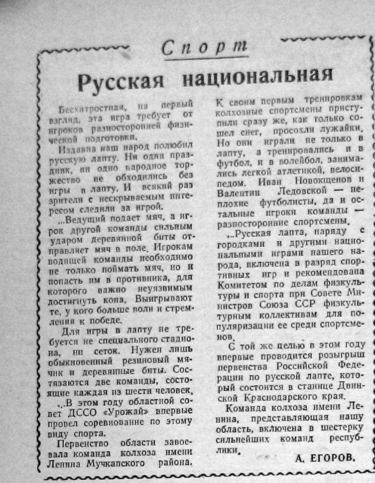
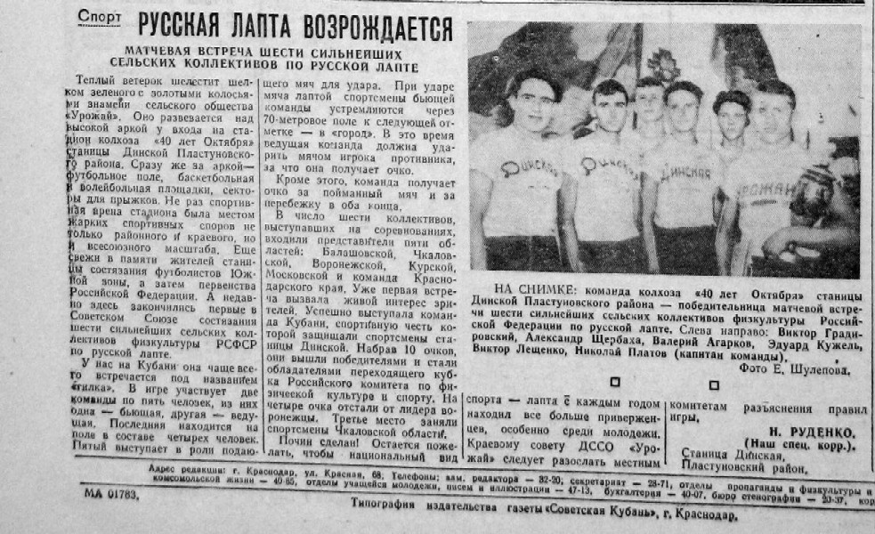
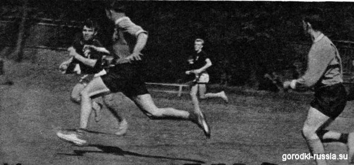
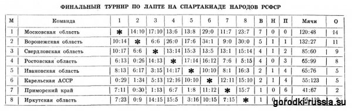

## 1957

### Соревнования по русской лапте
*03 сентября 1957 года*  
*Газета "Комсомолец Кубани"*  
*орган Краснодарского крайкома и горкома ВЛКСМ. №174 (2046)*

Сегодня на стадионе колхоза "40 лет Октября" станицы Динской Пластуновского района впервые в Советском Союзе начнутся состязания сильнейших сельских коллективов физкультуры по русской лапте. В соревнованиях принимают участие команды из Балашовской, Воронежской, Курской, Московской, Чкаловской областей, Чувашской АССР и Краснодарского края.  
Соревнования продлятся три дня.

[shapkino.ru](http://shapkino.ru/sport-i-otdykh/sorevnovaniya-turniry/6078-3565)

### Русская национальная
*04 сентября 1957 года*  
*Газета "Комсомолец"*  
*орган Балашовского обкома ВЛКСМ. №106 (237)*

Бесхитростная, на первый взгляд, эта игра требует от игроков разносторонней физической подготовки.

Издавна наш народ полюбил русскую лапту. Ни один праздник, ни одно народное торжество не обходились без игры в лапту. И всякий раз зрители с нескрываемым интересом следили за игрой.

... Ведущий подает мяч, а игрок другой команды сильным ударом деревянной биты отправляет мяч в поле. Игрокам водящей команды необходимо не только поймать мяч. но и попасть им в противника, для которого важно неуязвимым достигнуть кона. Выигрывают те, у кого больше воли и стремления к победе.

Для игры в лапту не требуется не специального стадиона ни сеток. Нужен лишь обыкновенный резиновый мячик и деревянные биты. Состязаются две команды, состоящая каждая из шести человек.

В этом году областной совет ДССО "Урожай" впервые провел соревнование по этому виду спорта.

Первенство области завоевала команда колхоза имени Ленина Мучкапского района (shapkino.ru: село Шапкино). К своим первым тренировкам колхозные спортсмены приступили сразу же, как только сошел снег, просохли лужайки. Но они играли не только в лапту, а тренировались и в футбол, и в волейбол, занимались легкой атлетикой, велосипедом. Иван Новокщенов и Валентин Ледовской - неплохие футболисты, да и остальные игроки команды - разносторонние спортсмены.

... Русская лапта, наряду с городками и другими национальными играми нашего народа, включена в разряд спортивных игр и рекомендована Комитетом по делам физкультуры и спорта при Совете Министров Союза ССР физкультурным коллективам для популяризации ее среди спортсменов.

С той же целью в этом году впервые проводится розыгрыш первенства Российской Федерации по русской лапте, который состоится в станице Двинской Краснодарского края.

Команда колхоза имени Ленина, представляющая нашу область, включена в шестерку сильнейших команд республики.

А.Егоров.

[shapkino.ru](http://shapkino.ru/sport-i-otdykh/sorevnovaniya-turniry/6078-3565)

### Русская лапта возрождается

*07 сентября 1957 года*  
*Газета "Комсомолец Кубани"*  
*орган Краснодарского крайкома и горкома ВЛКСМ. №177 (2049)*

**Матчевая встреча шести сильнейших коллективов по русской лапте.**

Теплый ветерок шелестит шелком зеленого с золотыми колосьями знамени сельского общества "Урожай". Оно развевается над высокой аркой у входа на стадион колхоза "40 лет Октября" станицы Динской Пластуновского района. Сразу же за аркой - футбольное поле, баскетбольная и волейбольная площадки, секторы для прыжков. Не раз спортивная арена стадиона была местом жарких спортивных споров не только районного и краевого, но и всесоюзного масштаба. Еще свежи в памяти жителей станицы состязания футболистов Южной зоны, а затем первенства Российской Федерации. А недавно здесь закончились первые в Советском Союзе состязания шести сильнейших сельских коллективов физкультуры РСФСР по русской лапте.

У нас на Кубани она чаще всего встречается под названием "гилка". В игре участвуют две команды по пять человек, из них одна - бьющая, другая - ведущая. Последняя находится на поле в составе четырех человек. пятый выступает в роли подающего мяч для удара. При ударе мяча лаптой спортсмены бьющей команды устремляются через 70-метровое поле к следующей отметке - в "город". В это время ведущая команда должна ударить мячом игрока противника, за что она получает очко.

Кроме этого, команда получает очко за пойманный мяч и за перебежки в оба конца.

В число шести коллективов, выступающих на соревнованиях, входили представители пяти областей: Балашовской. Чкаловской, Воронежской, Курской. Московской и команда Краснодарского края. Уже первая встреча вызвала живой интерес зрителей. Успешно выступала команда Кубани, спортивную честь которой защищали спортсмены станицы Динской. Набрав 10 очков, они вышли победителями и стали обладателями переходящего кубка Российского комитета по физической культуре и спорту. На четыре очка отстали от лидеров воронежцы. Третье место заняли спортсмены Чкаловской области.

Почин сделан! Остается пожелать, чтобы национальный вид спорта - лапта с каждым годом находил все больше приверженцев, особенно среди молодежи. Краевому совету ДССО "Урожай" следует разослать местным комитетам разъяснения правил игры.

*Н. Руденко, (Наш спец. корр.).*  
*Станица Динская,*  
*Пластуновский район.*  

На снимке: команда колхоза "40 лет Октября" станицы Динской Пластуновского района - победительница матчевой встречи шести сильнейших сельских коллективов физкультуры Российской Федерации по русской лапте.  
Слева направо: Виктор Градировский, Александр Щербаха, Валерий Агарков, Эдуард Кужель, Виктор Лещенко, Николай Платов (капитан команды).  
Фото Е.Шулепова.

[shapkino.ru](http://shapkino.ru/sport-i-otdykh/sorevnovaniya-turniry/6078-3565)

### Лапта - интересный вид спорта

*08 сентября 1957 года*  
*Газета "По Ленинскому пути"*  
*орган Пластуновского райкома КПСС и районного Совета депутатов трудящихся Краснодарского края. №108 (2935)*

С 3 по 5 сентября на стадионе к/з "40 лет Октября" проходила матчевая встреча шести сильнейших коллективов Российской Федерации. Посмотреть на состязания пришло много жителей районного центра. Кроме молодежи, на стадион пришли пожилые. Кому не известен этот увлекательный вид спорта - игра в лапту. Старинная народная игра в лапту постепенно вытеснялась волейболом, футболом и другими играми. Сейчас центральный комитет физкультуры и спорта поставил перед спортсменами задачу - возродить этот вид спорта. На зеленом поле стадиона разгорелась упорная борьба. Сразу же выделились своей игрой кубанские спортсмены. Обладая быстрым бегом, точными обманными ударами по мячу, они уверенно переигрывали своих соперников и к концу матчевой встречи завоевали 5 побед, набрав 10 очков из 10 возможных.

Победителям в соревновании - спортсменам Краснодарского края вручены переходящий кубок. вымпел и диплом II степени по игре в русскую лапту.

Второе место заняли спортсмены Воронежской области, набравшие 8 очков. Третье и четвертое место поделили Чкаловская и Балашовская области. Московские и Курские спортсмены заняли пятое и шестое места.

*А.Красиков.*

[shapkino.ru](http://shapkino.ru/sport-i-otdykh/sorevnovaniya-turniry/6078-3565)

### На первенство РСФСР по русской лапте

*13 сентября 1957 года*  
*Газета "Комсомолец"*  
*орган Балашовского обкома ВЛКСМ*

В течение трех дней в станице Двинской Краснодарского края проходили соревнования на первенство Российской Федерации по русской лапте.

Команда Балашовской области, участвовавшая в розыгрыше первенства, встретилась с представителями Воронежской, Курской, Московской, Чкаловской областей и Краснодарского края.

Встречу с командой Курской области балашовцы выиграли со счетом 13:9. Спортсмены Московской области проиграли нашей команде с общим счетом 8:5.

Первое место в розыгрыше завоевали спортсмены Краснодарского края, второе - воронежцы, третье - чкаловцы. Команда Балашовской области завоевала четвертое место.

*А.Сергеев*

[shapkino.ru](http://shapkino.ru/sport-i-otdykh/sorevnovaniya-turniry/6078-3565)

## 1958

## 1959

### И спринтеры и снайперы

**Едва закончился первый тайм, к судейскому столу с разных сторон хлынули зрители. Плотным кольцом окружили они судей и стали с пристрастием выспрашивать: «Почему не засчитали очков трем игрокам, закончившим перебежку? Разве их четвертый партнер был осален своевременно?»**

**Случись что-либо подобное на футбольном матче — как всполошились бы ревнители порядка на стадионе! Но тут для переполоха не было оснований. Спорящие стороны были, как говорится, взаимно вежливы и старались солидно аргументировать свои мнения. К тому же выяснилось, что о некоторых правилах, действующих на этих соревнованиях, зрители не знали.**

Эта сценка наблюдалась в Ленинграде на Спартакиаде народов РСФСР во время финальных соревнований по русской лапте. Она красноречиво свидетельствует о том, какой живейший интерес проявляет общественность к замечательной русской игре.

Турнир по лапте проходил на стадионе Лесотехнической академии, довольно далеко от центра города. И все же скамьи для зрителей никогда не пустовали.

Любопытно было наблюдать за трибунами. Рядом со знатоками игры сидели и новички. Сначала они с недоумением поглядывали на поле, не понимая толком, что происходит. Но вскоре с помощью искушенных соседей и судей-информаторов (особенно удачно и живо комментировал соревнования ставрополец Ю. Ждахин) самые неосведомленные зрители превращались в ярых болельщиков. Они начинали переживать острые игровые ситуации, азартно подбадривая полюбившуюся им команду.

**Лапта нравится! Теперь, когда введены единые правила, старинная русская игра вступила в период своего возрождения, представ перед зрителем в новом, более высоком и подлинно спортивном качестве.**

Лапта была одним из пятнадцати обязательных видов спорта в программе Спартакиады. За право войти в восьмерку финалистов боролись 68 команд областей, краев и автономных республик Российской Федерации. А сколько сотен команд мерились силами в местных соревнованиях! Только в Иркутской области первенство по лапте оспаривало около 400 коллективов. Зональные турниры Спартакиады в Йошкар-Оле, Липецке, Тюмени, Чите и других городах проходили при переполненных зрителями стадионах.

Словом, игра, что называется, «пошла» и с удивительной быстротой завоевала популярность. Она, без сомнения, широко распространится и в других республиках. А некоторые энтузиасты уже мечтают о международных матчах по лапте! Что ж, это не беспочвенная мечта. Ведь сумели же наши спортсмены, играющие в русский хоккей, найти «общий язык» с любителями скандинавского бенди. В ряде других стран имеются игры, похожие на лапту. Взять хотя бы финскую игру песа-палло, американский бейзбол, английский крикет — и в них непременными атрибутами являются бита-палка, мяч, перебежки, осаливание…

В прошлом году (1958), когда чемпионат РСФСР по русской лапте проводился впервые, в нем участвовали команды девяти областей. Теперь из этих команд в финал Спартакиады попали только три: прошлогодние чемпионы — воронежцы, коллективы Ивановской и Московской областей. Это трудно объяснить одним лишь турнирным счастьем.

Опыт Спартакиады показал, что наряду с тщательной подготовкой коллектива решающим для успеха был принцип комплектования команды.

**В самом деле, какими должны быть игроки в лапту?**

*«И спринтеры, и снайперы!»,— так сказал о них один из судей.*

Формула — краткая, но не полная. Спортсмен, играющий в лапту, должен обладать не только быстрым бегом и метким ударом. Ему еще нужно уметь мгновенно разбираться и действовать в круто меняющейся игровой обстановке. В свое время это тонко подметил большой знаток лапты писатель А. И. Куприн, указавший среди качеств, необходимых игроку в лапту, еще и на внимательность, находчивость, изворотливость…

Поэтому, составляя команды для участия в Спартакиаде, многие тренеры решили ориентироваться на опытных спортсменов и прежде всего на легкоатлетов и игровиков. В команде воронежцев, например, преобладали гандболисты, для которых бег, ловля и броски мяча — привычное занятие. Половину команды Свердловской области составили опытные мастера хоккея с мячом — А. Измоденов, И. Дураков, В. Шаховцев. Свердловчане, привыкшие к хоккейному мячу и клюшке, довольно уверенно справлялись с битой (лаптой) и теннисным мячиком, который временно принят на вооружение нашими игроками в лапту. А команда Московской области, завоевавшая титул чемпиона Спартакиады, была составлена в основном из легкоатлетов. В нее вошли, в частности, шестовик В. Кукушкин, чемпионы области в беге на короткие дистанции Н. Большаков и А. Тонконогов.

Такой подбор игроков в команды — естественное явление. В свое время и «шайбисты» вербовали первые свои кадры из футболистов и мастеров хоккея с мячом. В будущем и у лапты появятся свои постоянные мастера. А пока лапта — замечательное подспорье в спортивном совершенствовании и игровиков и легкоатлетов.

Чемпион мира по хоккею с мячом заслуженный мастер спорта Николай Дураков считает, что тренировка и игра в лапту дала ему, хоккеисту, много ценных навыков для предстоящих битв на ледяном поле.

— Лапта учит лучше видеть поле, — сказал он, — совершенствует рывок, развивает навыки комбинационной игры. Схожи с чисто хоккейной техникой и некоторые приемы остановки мяча. Полезны хоккеисту и удары по мячу лаптой.

С другой стороны навыки гандболистов, хоккеистов, легкоатлетов накладывают печать и на тактику игры в лапту. Если спортсмены Подмосковья больше полагались на свой стремительный бег и резкие спурты, то свердловчане, воронежцы, ростовчане часто добивались перевеса за счет чисто игровых приемов. Все эти команды применяли перебежки группами, накапливаясь на исходных рубежах «города» или «кона» и сознательно пропуская несколько раз возможности перебежки. Особенно удачно они применяли такую тактику при обратных перебежках с «кона». Один из игроков, рискуя быть осаленным, начинал хитроумными зигзагами «водить» соперников по полю, а его товарищи напрямик устремлялись в «город», чтобы принести своей команде очки.

Различные тактические хитрости применяли не только лидеры. И остальные команды, действовавшие в первые два дня финальной пульки робко и скованно, демонстрировали затем в каждой следующей игре растущую тактическую зрелость и преподносили более сильным соперникам, рассчитывавшим на легкую победу, неприятные сюрпризы.
Ростовчане, например, проиграли первую встречу воронежцам с разгромным счетом 0:26, с командой Московской области сыграли уже 6:13, а у третьего призера — свердловчан — выиграли 14:13.

Несколько встреч закончилось с «астрономическими» результатами — 34:1, 30:0, 29:0. Это, конечно, говорит о большом неравенстве сил соперников. Многие игроки не овладели еще элементарными приемами техники и тактики.

Взять, к примеру, удары лаптой. На прошлогоднем чемпионате РСФСР в Воронеже преобладали сильные размашистые удары при хватке лапты двумя руками. Сейчас такие удары применялись сравнительно редко: бьющие боятся лишний раз запустить мяч свечой в поле, так как пойманная соперниками «свеча» ведет к перемене игровых позиций (бьющая команда становится водящей). А ведь прицельная, направленная «свеча» дает игрокам большое преимущество во времени. Пока мяч в воздухе, игроки получают больше возможностей для безопасной перебежки. Вот если бы бьющие умели выполнять такие прицельные удары!

Освоить удары разной силы и направления, удары одной и двумя руками, с большим замахом, с поворотом и т. д.— вот задача №1 для всех игроков. Пока же зрители часто видят на поле вместо ударов своеобразные «тычки», при которых мяч летит на очень небольшое расстояние. Это обедняет игру, влечет за собой частые и скучные паузы.

**Как же сделать игру захватывающей на протяжении всех 60 минут и свести такие паузы к минимуму?**

К этому ведут два пути. Первый — напряженная тренировочная работа и творческие поиски игроков и тренеров в технике и тактике. С ростом мастерства интереснее станут комбинации и борьба в поле, хитроумные перебежки, более уверенными ловля мяча, осаливание и обратное осаливание.

Второй путь — совершенствование правил. Об этом много думали и совещались игроки, судьи, тренеры. Предложений было немало, и некоторые из них, подсказанные игровой практикой, заслуживают внимания.

Предлагается, например, ввести возле «города» 15-метровую «мертвую зону» и считать удар неосуществленным, если мяч попал в эту зону. Это заставит игроков смелее, сильнее и разнообразнее бить по мячу.

Ставится вопрос о том, чтобы поимка «свечи» поощрялась начислением очков, а не вела к смене игровых позиций.

Участники совещаний советовали изучить правила схожих с лаптой игр, культивируемых в Чехословакии, Румынии, Финляндии, США и других странах, чтобы почерпнуть что-либо интересное и полезное.

Очень остро стоит и вопрос о качестве судейства. Ленинградский турнир показал, что у нас уже появились судьи, хорошо понимающие сущность игры и умеющие точно оценить ситуацию на поле. Это Ю. Ждахин (Ставрополь), А. Анисимов и В. Янушевский (оба из Воронежа), В. Невдачин (Белгород), 3. Жвакина (Пермь), О. Бура (Москва). Но даже и лучшие судьи совершают ошибки, особенно когда случается несколько осаливаний подряд или самоосаливание. Не всегда четко фиксировались и результаты перебежек с «кона» в «город». Явно перегружен судья-секретарь, который, ведя протокол, должен одновременно следить за перебежками, временем и счетом.
Конечно, по мере накопления судьями опыта, повысится и их квалификация. Но для того, чтобы облегчить их работу, следует уточнить и улучшить правила.

**Что же еще требуется для дальнейшего развития лапты?**

Прежде всего, нужно сплочение общественного актива и большая организационная работа. Кое-что уже делается. В ряде городов созданы секции лапты. В ближайшее время будет учреждена Всероссийская федерация лапты.

Главное же сейчас — расширение массовости игры. В лапту могут и должны играть не только взрослые и не только мужчины, но и женщины, юноши, девушки, подростки, дети. Чем больше будет у нас детских команд, тем более массовой станет игра и тем скорее вырастут мастера лапты.

На американских стадионах матчи бейзболистов -собирают десятки тысяч зрителей. Первые шаги возрожденной лапты дают все основания утверждать, что эта народная игра завоюет в нашей стране большую популярность, чем бейзбол у американцев. И может быть не так далек день, когда сто тысяч зрителей на Центральном стадионе в Лужниках заполнят трибуны, чтобы посмотреть финальный матч на Кубок СССР по лапте.

*М. Заславский, Ленинград*
