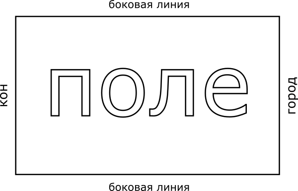

## Суть игры в лапту

Суть игры в лапту простая. Есть прямоугольное поле, которое огорожено четырьмя линиями - двумя боковыми, линией кона и линией города. Линию города еще называют линий дома. Соответственно, за линией кона находится кон, за линией города (дома) находится город (дом).

Две команды, которые по жребию в начале игры разделяются на команду нападения и команду защиты. Все игроки команды нападения собираются в городе. Игроки защиты распределяются по полю. Игроки нападения по очереди выбивают мяч битой (лаптой) в поле и должны перебежать поле до кона, и затем вернуться обратно в город. Игрок, который совершил такую перебежку получает право на новый удар, встает последним в очередь на удар, а также зарабатывает для своей команды очки. Таким образом, происходит постоянный круговорот игроков города: игрок сначала стоит в очереди на удар, затем пробивает мяч, перебегает поле, получает право на удар и опять встает в очередь на удар. Удержание города и является главной целью игры. В спортивной лапте это позволяет зарабатывать очки, в неспортивных вариантах игры выигрывает тот, кто дольше удерживал город.

Не обязательно бежать со своим ударом. Если удар не получился, то можно остаться в городе и бежать с любым следующим ударом игрока своей команды. Но откладывать перебежку бесконечно нельзя, потому что если в городе не остается игроков с правом на удар, то команда без боя отдает город соперниками и уходит водить в поле. А перебежка, как уже было сказано, дает право на удар. А право на удар очень ценно в лапте.

Не обязательно сразу возвращаться из кона в город. На кону можно остаться и дождаться удара другого игрока своей команды, который будет удобен для возвращения в город.

Игроку нападения можно бегать только в пределах поля, выбегать за боковые линии запрещается.

Игроки защиты, в свою очередь, должны помешать игрокам нападения перебегать поле, удерживать город и зарабатывать очки. Находясь в поле они должны поймать или подобрать мяч, который был выбит из города, и осалить им игроков нападения пока они находятся в поле. Осалить — значит кинуть мяч и попасть им в игрока. Осаливание дает возможность игрокам защиты занять город. Причем салить можно только игроков, находящихся в поле. Если игрок находится в городе или на кону, то такого игрока салить нельзя.

Собственно борьба за город и является основной сутью игры. Чем дольше ты владеешь городом, тем больше шансов выиграть.